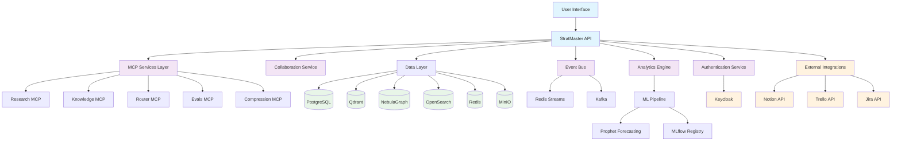
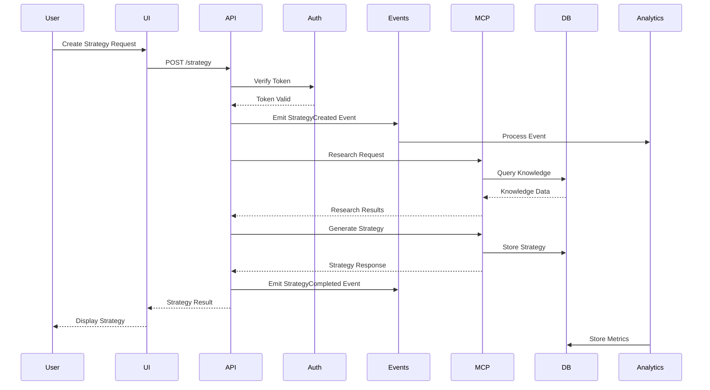
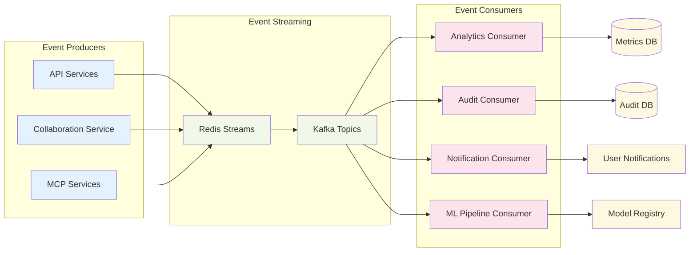
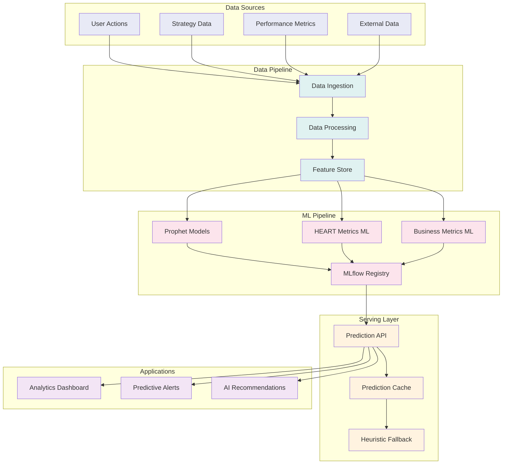
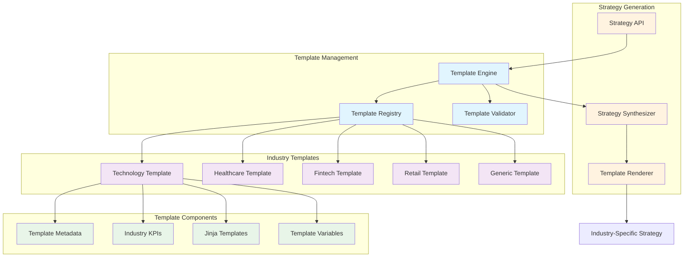
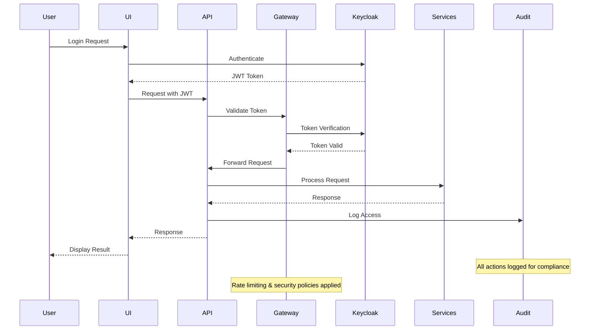
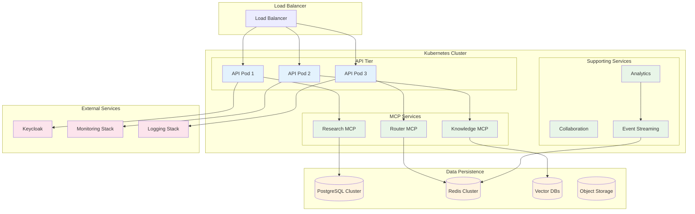
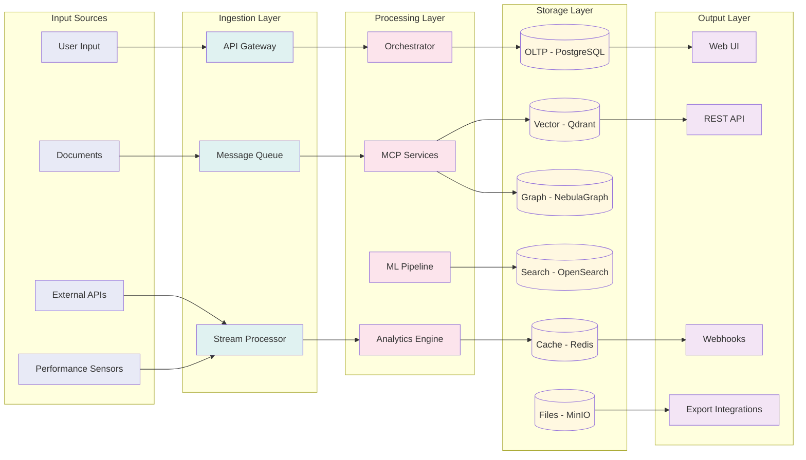

# StratMaster System Architecture

This document provides comprehensive architectural diagrams for the StratMaster platform using Mermaid notation.

## System Overview

## Request Lifecycle Flow

## Event-Driven Architecture

## Predictive Analytics Pipeline

## Industry Templates Architecture

## Security & Authentication Flow

## Deployment Architecture

## Data Flow Architecture

