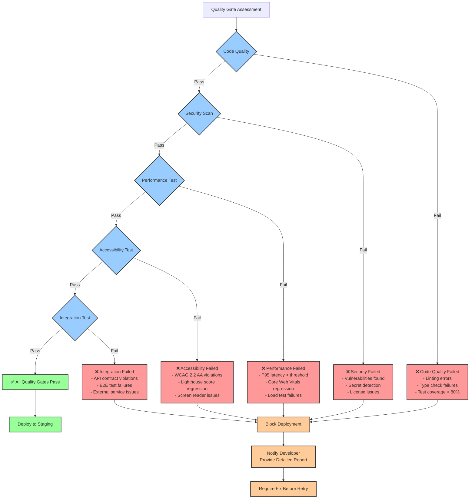
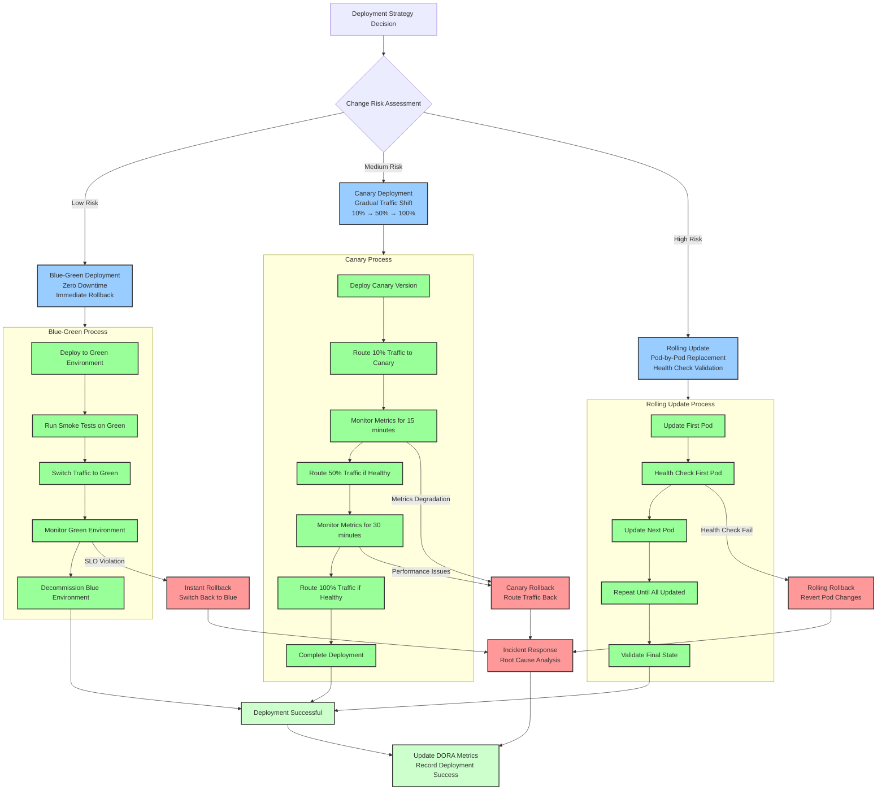

# CI/CD Pipeline Architecture

This diagram shows the complete CI/CD pipeline with quality gates, security scanning, and deployment automation.

```mermaid
graph TB
    %% Source control
    subgraph "Source Control"
        Developer[Developer<br/>Local Development]
        GitRepo[Git Repository<br/>GitHub]
        PullRequest[Pull Request<br/>Code Review]
    end
    
    %% CI Pipeline Triggers
    Developer --> GitRepo
    GitRepo --> PullRequest
    PullRequest --> CITrigger{CI Trigger}
    GitRepo -->|Push to main| CITrigger
    
    %% CI Pipeline Stages
    CITrigger --> CIPipeline
    
    subgraph CIPipeline ["CI Pipeline"]
        Checkout[Checkout Code<br/>Setup Environment]
        Dependencies[Install Dependencies<br/>Bootstrap Project]
        
        %% Quality gates
        subgraph QualityGates ["Quality Gates"]
            Lint[Code Linting<br/>Ruff, Trunk]
            TypeCheck[Type Checking<br/>mypy, Pydantic]
            UnitTests[Unit Tests<br/>pytest, Coverage]
            FlakeDetection[Flake Detection<br/>Retry & Quarantine]
            SecurityScan[Security Scanning<br/>Bandit, Safety, SBOM]
        end
        
        %% Integration tests
        subgraph IntegrationTests ["Integration Testing"]
            APITests[API Tests<br/>Contract Validation]
            E2ETests[E2E Tests<br/>Playwright/Selenium]
            PerformanceTests[Performance Tests<br/>Load Testing]
            AccessibilityTests[Accessibility Tests<br/>Lighthouse, axe]
        end
        
        %% Security and compliance
        subgraph SecurityCompliance ["Security & Compliance"]
            VulnScan[Vulnerability Scanning<br/>Container & Dependencies]
            SBOMGeneration[SBOM Generation<br/>CycloneDX + SLSA Provenance]
            ComplianceCheck[Compliance Checks<br/>ASVS L2, OWASP]
            SecretScanning[Secret Scanning<br/>GitGuardian, TruffleHog]
        end
        
        %% Build and packaging
        BuildPackage[Build & Package<br/>Docker Images, Python Wheels]
        DockerScan[Docker Image Scan<br/>Trivy, Clair]
        ArtifactSigning[Artifact Signing<br/>Cosign, GPG]
        
        %% Deployment readiness
        DORAMetrics[DORA Metrics Collection<br/>Deploy Freq, Lead Time, CFR, MTTR]
        QualityReport[Quality Report<br/>Aggregate Results]
    end
    
    %% Flow through CI stages
    Checkout --> Dependencies
    Dependencies --> QualityGates
    QualityGates --> IntegrationTests
    IntegrationTests --> SecurityCompliance
    SecurityCompliance --> BuildPackage
    BuildPackage --> DockerScan
    DockerScan --> ArtifactSigning
    ArtifactSigning --> DORAMetrics
    DORAMetrics --> QualityReport
    
    %% CD Pipeline
    QualityReport --> CDDecision{Deploy Decision}
    
    CDDecision -->|Quality Gates Pass| CDPipeline
    CDDecision -->|Quality Gates Fail| FailureNotification[Failure Notification<br/>Slack, Email]
    
    subgraph CDPipeline ["CD Pipeline"]
        %% Deployment stages
        DeployStaging[Deploy to Staging<br/>Kubernetes Cluster]
        SmokeTests[Smoke Tests<br/>Basic Functionality]
        IntegrationValidation[Integration Validation<br/>External Services]
        PerformanceValidation[Performance Validation<br/>Load Testing]
        SecurityValidation[Security Validation<br/>DAST, API Security]
        
        %% Production deployment
        ProductionApproval{Production Approval<br/>Manual Gate}
        BlueGreenDeployment[Blue-Green Deployment<br/>Zero Downtime]
        HealthChecks[Health Checks<br/>Service Validation]
        TrafficShift[Traffic Shifting<br/>Gradual Rollout]
        MonitoringValidation[Monitoring Validation<br/>SLO Compliance]
    end
    
    %% CD Flow
    DeployStaging --> SmokeTests
    SmokeTests --> IntegrationValidation
    IntegrationValidation --> PerformanceValidation
    PerformanceValidation --> SecurityValidation
    SecurityValidation --> ProductionApproval
    
    ProductionApproval -->|Approved| BlueGreenDeployment
    ProductionApproval -->|Rejected| RollbackPlan[Rollback Plan<br/>Previous Version]
    
    BlueGreenDeployment --> HealthChecks
    HealthChecks --> TrafficShift
    TrafficShift --> MonitoringValidation
    
    %% Post-deployment
    MonitoringValidation --> PostDeployment
    
    subgraph PostDeployment ["Post-Deployment"]
        DORATracking[DORA Metrics Tracking<br/>Success/Failure Recording]
        SLOMonitoring[SLO Monitoring<br/>Error Budget Tracking]
        AlertValidation[Alert Validation<br/>Monitoring System Check]
        DocumentationUpdate[Documentation Update<br/>Release Notes, CHANGELOG]
    end
    
    %% Rollback mechanism
    MonitoringValidation -->|SLO Violation| AutoRollback[Automatic Rollback<br/>Circuit Breaker Triggered]
    AutoRollback --> RollbackExecution[Rollback Execution<br/>Previous Stable Version]
    RollbackExecution --> IncidentAlert[Incident Alert<br/>On-Call Notification]
    
    %% Success path
    DORATracking --> SuccessNotification[Success Notification<br/>Deployment Complete]
    
    %% Feedback loops
    FailureNotification --> Developer
    IncidentAlert --> Developer
    SuccessNotification --> Developer
    
    %% Styling
    classDef source fill:#99ccff,stroke:#333,stroke-width:2px
    classDef quality fill:#99ff99,stroke:#333,stroke-width:2px
    classDef security fill:#ffcc99,stroke:#333,stroke-width:2px
    classDef deploy fill:#cc99ff,stroke:#333,stroke-width:2px
    classDef monitoring fill:#ff99cc,stroke:#333,stroke-width:2px
    classDef error fill:#ff9999,stroke:#333,stroke-width:2px
    
    class Developer,GitRepo,PullRequest source
    class Lint,TypeCheck,UnitTests,FlakeDetection,APITests,E2ETests,PerformanceTests,AccessibilityTests quality
    class SecurityScan,VulnScan,SBOMGeneration,ComplianceCheck,SecretScanning,SecurityValidation security
    class DeployStaging,BlueGreenDeployment,HealthChecks,TrafficShift deploy
    class SLOMonitoring,AlertValidation,DORATracking,MonitoringValidation monitoring
    class FailureNotification,AutoRollback,RollbackExecution,IncidentAlert error
```

## Quality Gate Decision Matrix

## Deployment Strategies

