# CI/CD Pipeline Overview

```mermaid
flowchart LR
    Commit[Code Commit / PR]
    Lint[Static Analysis & Lint]
    Test[Pytest Matrix]
    Security[Bandit & Pip Audit]
    HelmLint[Helm Lint]
    Build[Multi-arch Docker Build]
    Deploy[Helm Deploy to Dev]
    Smoke[Smoke Tests]
    Reports[Artifacts & Metrics]

    Commit --> Lint
    Lint --> Test
    Test --> Security
    Security --> HelmLint
    HelmLint --> Build
    Build --> Deploy
    Deploy --> Smoke
    Smoke --> Reports
```

**Notes**
- Lint and test stages mirror `.github/workflows/ci.yml` including Python 3.11/3.12 matrix and Helm validation.
- Security scans currently run in warn-only mode; plan adds SBOM + fail-fast change failure detection.
- Reports should surface DORA metrics and flake tracking once telemetry integration lands.
