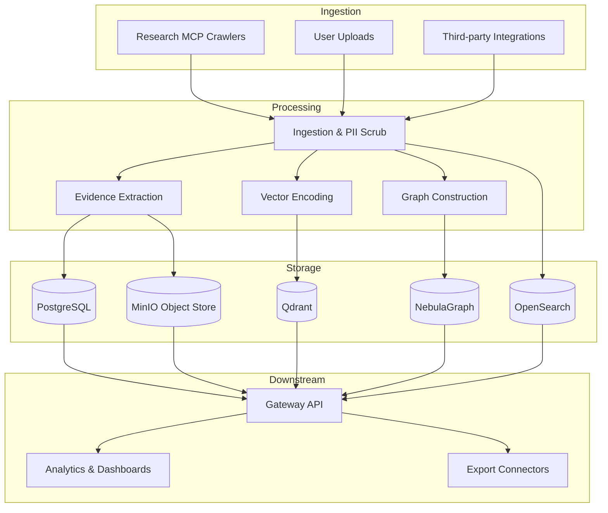

# Data Lineage & Storage Flow

**Notes**
- Ingestion applies PII scrubbing before persistence to meet compliance expectations.
- Gateway federates reads across PostgreSQL, Qdrant, OpenSearch, and NebulaGraph to assemble strategy responses.
- Export connectors consume curated artefacts from MinIO and relational sources.
