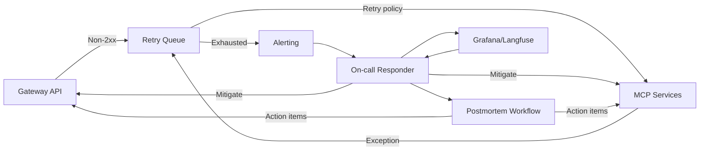

# Error Handling & Incident Loop

**Notes**
- Retries follow service-specific backoff policies before escalating to alerts.
- Alerts should be wired into PagerDuty/Slack once SLO breaches are defined.
- Postmortem action items feed backlog grooming for reliability improvements.
