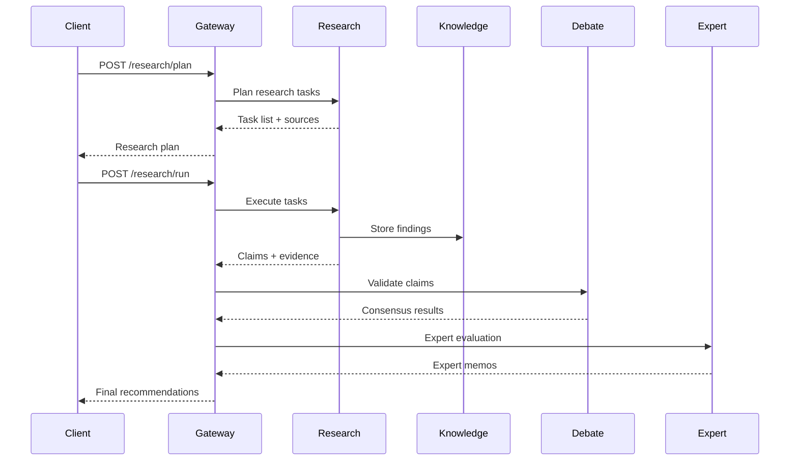

# Architecture Overview

StratMaster is designed as a modern, cloud-native AI platform that combines evidence-grounded research with multi-agent validation to deliver reliable strategic insights. This document explains the system's architecture, design principles, and key components.

## System Philosophy

StratMaster embodies several core principles:

- **Evidence-First**: Every claim must be backed by credible, traceable sources
- **Multi-Agent Validation**: No single AI system makes final decisions
- **Constitutional AI**: Built-in safety and accuracy guardrails
- **Tenant Isolation**: Secure multi-tenancy with data segregation
- **Observability**: Full tracing and monitoring of all operations
- **Composability**: Modular design enabling flexible deployment

## High-Level Architecture

```
┌─────────────────────────────────────────────────────────────────┐
│                    Client Applications                          │
│  Web UI │ Mobile App │ API Clients │ OpenAI Compatible Tools   │
├─────────────────────────────────────────────────────────────────┤
│                      API Gateway (FastAPI)                     │
│  Authentication │ Rate Limiting │ Request Validation │ Tracing │
├─────────────────────────────────────────────────────────────────┤
│                     MCP Server Layer                           │
│ Research │ Knowledge │ Router │ Evals │ Expertise │ Compression │
├─────────────────────────────────────────────────────────────────┤
│                    Processing Engines                          │
│  Multi-Agent │ Constitutional │ Graph │ Retrieval │ Analytics   │
├─────────────────────────────────────────────────────────────────┤
│                     Data & Storage Layer                       │
│ PostgreSQL │ Qdrant │ OpenSearch │ NebulaGraph │ MinIO │ Redis  │
├─────────────────────────────────────────────────────────────────┤
│                   Infrastructure Layer                         │
│  Temporal │ Keycloak │ Observability │ Message Queues │ Cache   │
└─────────────────────────────────────────────────────────────────┘
```

## Core Components

### 1. API Gateway (FastAPI)

The central orchestration point that provides:

**Key Responsibilities:**
- Request routing and validation
- Authentication and authorization
- Rate limiting and throttling
- OpenAPI documentation generation
- Request/response transformation
- Error handling and recovery

**Technical Details:**
- **Framework**: FastAPI with Pydantic v2 models
- **Authentication**: JWT via Keycloak integration
- **Validation**: Strict schema validation with detailed error responses
- **Documentation**: Auto-generated OpenAPI 3.0 specs
- **Observability**: OpenTelemetry integration with trace propagation

**Example Request Flow:**
```python
# Client Request
POST /research/plan
Headers: {
  "Authorization": "Bearer jwt-token",
  "Idempotency-Key": "unique-request-id",
  "Content-Type": "application/json"
}

# Gateway Processing
1. JWT validation via Keycloak
2. Rate limiting check (per tenant)
3. Schema validation (Pydantic)
4. Idempotency check (Redis cache)
5. Route to Research MCP
6. Response transformation
7. Trace span completion
```

### 2. MCP Server Layer

Model Context Protocol servers provide specialized capabilities:

#### Research MCP (Port 8081)
- **Purpose**: Web research and data collection
- **Capabilities**: 
  - Intelligent web crawling with rate limiting
  - Content extraction and cleaning
  - Source credibility assessment
  - PII detection and redaction
  - Provenance tracking with cryptographic fingerprints

#### Knowledge MCP (Port 8082)  
- **Purpose**: Knowledge graph and retrieval operations
- **Capabilities**:
  - Vector search via Qdrant
  - Full-text search via OpenSearch
  - Graph queries via NebulaGraph
  - Hybrid retrieval with reranking
  - Knowledge graph construction

#### Router MCP (Port 8083)
- **Purpose**: AI model routing and load balancing
- **Capabilities**:
  - Multi-provider model routing (OpenAI, Anthropic, local)
  - Model selection based on task requirements
  - Cost optimization and budget tracking
  - Fallback strategies for model failures
  - Privacy-preserving request routing

#### Evals MCP (Port 8084)
- **Purpose**: Quality evaluation and gate enforcement
- **Capabilities**:
  - Automated quality scoring (FactScore, TruthfulQA)
  - Constitutional compliance checking
  - Bias detection and mitigation
  - Performance benchmarking
  - A/B testing framework

#### Expertise MCP (Port 8085)
- **Purpose**: Domain expert simulation and evaluation
- **Capabilities**:
  - Multi-discipline expert councils
  - Domain-specific evaluation frameworks
  - Consensus mechanisms (Delphi method)
  - Expert memo generation
  - Confidence aggregation

#### Compression MCP (Port 8086)
- **Purpose**: Context compression and optimization
- **Capabilities**:
  - LLMLingua-based text compression
  - Semantic-preserving summarization
  - Context window optimization
  - Information density analysis

### 3. Processing Engines

#### Multi-Agent Debate System
Implements structured debate for claim validation:

```python
class DebateOrchestrator:
    def __init__(self):
        self.agents = {
            'strategist': StrategistAgent(),    # Proposes and defends claims
            'critic': CriticAgent(),           # Challenges and questions
            'adversary': AdversaryAgent(),     # Stress tests assumptions
            'moderator': ModeratorAgent()      # Manages process and consensus
        }
    
    async def run_debate(self, claims: List[Claim], rounds: int = 3):
        for round_num in range(rounds):
            for agent_name, agent in self.agents.items():
                response = await agent.evaluate(claims, context)
                claims = self.update_claims_with_feedback(claims, response)
        
        return self.reach_consensus(claims)
```

**Debate Process:**
1. **Proposal**: Strategist presents initial claims with evidence
2. **Challenge**: Critic raises methodological and factual concerns  
3. **Stress Test**: Adversary explores edge cases and failure modes
4. **Synthesis**: Moderator facilitates consensus and final recommendations

#### Constitutional AI Framework
Ensures safety and accuracy through built-in guardrails:

**Constitution Components:**
- **Safety Principles**: Harm prevention, privacy protection
- **Accuracy Standards**: Evidence requirements, source credibility
- **Bias Mitigation**: Perspective diversity, assumption checking
- **Transparency Rules**: Citation requirements, confidence reporting

**Implementation:**
```yaml
# prompts/constitutions/house_rules.yaml
principles:
  - id: evidence_requirement
    rule: "Every factual claim must cite at least two independent sources"
    enforcement: "block_response"
  
  - id: uncertainty_acknowledgment
    rule: "Explicitly state confidence levels and limitations"
    enforcement: "append_disclaimer"
  
  - id: bias_awareness
    rule: "Acknowledge potential biases in sources and reasoning"
    enforcement: "require_perspective_check"
```

### 4. Data & Storage Layer

#### PostgreSQL - Structured Data
- **Purpose**: Transactional data, user accounts, audit logs
- **Schema**: Multi-tenant with row-level security
- **Features**: JSON columns for flexible metadata, full-text search

#### Qdrant - Vector Database
- **Purpose**: Semantic search and similarity matching
- **Collections**: Tenant-isolated with custom metadata filtering
- **Embeddings**: Multiple model support (OpenAI, local transformers)

#### OpenSearch - Full-Text Search
- **Purpose**: Keyword search, log aggregation, analytics
- **Features**: SPLADE sparse vector support, custom analyzers
- **Security**: Tenant-based access control

#### NebulaGraph - Graph Database
- **Purpose**: Knowledge graphs, relationship modeling
- **Schema**: Flexible vertex/edge types with properties
- **Queries**: GraphRAG pattern for context-aware retrieval

#### MinIO - Object Storage
- **Purpose**: Documents, models, artifacts
- **Organization**: Tenant-based bucket isolation
- **Features**: Versioning, lifecycle policies, encryption

#### Redis - Caching & Sessions
- **Purpose**: Session management, request deduplication, caching
- **Patterns**: Distributed locks, rate limiting counters
- **Persistence**: Configurable durability for different use cases

### 5. Infrastructure Layer

#### Temporal - Workflow Orchestration
Manages complex, long-running business processes:

```python
@workflow.defn
class StrategyAnalysisWorkflow:
    @workflow.run
    async def run(self, request: AnalysisRequest) -> DecisionBrief:
        # Step 1: Research Planning
        plan = await workflow.execute_activity(
            create_research_plan,
            request.query,
            schedule_to_close_timeout=timedelta(minutes=5)
        )
        
        # Step 2: Parallel Research Execution
        research_results = await asyncio.gather(*[
            workflow.execute_activity(execute_research_task, task)
            for task in plan.tasks
        ])
        
        # Step 3: Multi-Agent Debate
        validated_claims = await workflow.execute_activity(
            run_debate_validation,
            research_results,
            schedule_to_close_timeout=timedelta(minutes=30)
        )
        
        # Step 4: Expert Evaluation
        expert_memos = await workflow.execute_activity(
            evaluate_with_experts,
            validated_claims
        )
        
        # Step 5: Synthesis & Recommendations
        return await workflow.execute_activity(
            synthesize_recommendations,
            validated_claims,
            expert_memos
        )
```

#### Keycloak - Identity & Access Management
- **Authentication**: SAML, OIDC, social login integration
- **Authorization**: Role-based and attribute-based access control
- **Multi-tenancy**: Realm-based tenant isolation
- **Integration**: JWT token validation in API gateway

#### Observability Stack
Comprehensive monitoring and debugging capabilities:

**OpenTelemetry Integration:**
```python
from opentelemetry import trace, metrics

tracer = trace.get_tracer(__name__)
meter = metrics.get_meter(__name__)

@tracer.start_as_current_span("research_analysis")
async def analyze_research(query: str):
    with tracer.start_as_current_span("web_search") as span:
        span.set_attribute("query", query)
        results = await search_web(query)
        span.set_attribute("results_count", len(results))
    
    analysis_counter.add(1, {"query_type": classify_query(query)})
    return results
```

**Monitoring Components:**
- **Prometheus**: Metrics collection and alerting
- **Grafana**: Visualization and dashboards  
- **Langfuse**: LLM observability and cost tracking
- **Jaeger**: Distributed tracing
- **Loki**: Log aggregation and search

## Data Flow Patterns

### 1. Research Analysis Flow



### 2. Multi-Tenant Data Isolation

**Row-Level Security (PostgreSQL):**
```sql
-- Enable RLS on all tables
ALTER TABLE research_sessions ENABLE ROW LEVEL SECURITY;

-- Tenant isolation policy
CREATE POLICY tenant_isolation ON research_sessions 
FOR ALL TO application_user 
USING (tenant_id = current_setting('app.tenant_id'));
```

**Namespace Isolation (Qdrant):**
```python
# Tenant-specific collections
collection_name = f"embeddings_{tenant_id}"
await qdrant_client.create_collection(
    collection_name=collection_name,
    vectors_config=VectorParams(size=1536, distance=Distance.COSINE),
)
```

**Index Prefixing (OpenSearch):**
```python
# Tenant-specific indices
index_name = f"{tenant_id}-documents-{date}"
await opensearch_client.indices.create(
    index=index_name,
    body={"settings": {"number_of_shards": 1, "number_of_replicas": 0}}
)
```

## Scalability Patterns

### Horizontal Scaling
- **Stateless Services**: All MCP servers are stateless and can scale independently
- **Database Sharding**: Tenant-based sharding for large deployments
- **Caching Layers**: Multi-level caching (Redis, CDN, application cache)
- **Async Processing**: Non-blocking I/O throughout the stack

### Performance Optimization
- **Connection Pooling**: Managed database connections with proper lifecycle
- **Batch Processing**: Bulk operations for data ingestion and analysis
- **Lazy Loading**: On-demand resource initialization
- **Circuit Breakers**: Fault tolerance for external service calls

### Resource Management
- **Memory**: Streaming data processing, garbage collection tuning
- **CPU**: Process pools for CPU-intensive tasks
- **I/O**: Async operations, connection multiplexing
- **Storage**: Tiered storage, automated cleanup policies

## Security Architecture

### Defense in Depth
1. **Network Security**: TLS everywhere, VPN access, network segmentation
2. **Application Security**: Input validation, output encoding, CSRF protection
3. **Data Security**: Encryption at rest and in transit, key rotation
4. **Identity Security**: MFA, strong passwords, session management
5. **Infrastructure Security**: Container scanning, dependency updates

### Tenant Security
- **Data Isolation**: Physical and logical separation of tenant data
- **Access Controls**: Tenant-scoped permissions and API keys
- **Audit Logging**: Complete audit trail of all tenant operations
- **Compliance**: GDPR, SOC2, HIPAA-ready architecture

### AI Safety
- **Constitutional Constraints**: Built-in safety and accuracy guardrails  
- **Output Filtering**: Content safety checks on all AI-generated content
- **Bias Mitigation**: Multi-agent validation to catch systemic biases
- **Human Oversight**: Human-in-the-loop for high-stakes decisions

## Deployment Patterns

### Local Development
```bash
# Single-machine setup
make bootstrap          # Python environment
make dev.up            # Core services  
make dev.phase2        # Full stack with monitoring
```

### Staging Environment
```yaml
# Helm values for staging
replicas:
  api: 2
  research_mcp: 1
  knowledge_mcp: 1

resources:
  api:
    requests: {cpu: 500m, memory: 1Gi}
    limits: {cpu: 1000m, memory: 2Gi}

persistence:
  postgresql: {size: 50Gi, storageClass: gp2}
  qdrant: {size: 100Gi, storageClass: gp2}
```

### Production Environment
```yaml
# High-availability production setup
replicas:
  api: 5
  research_mcp: 3
  knowledge_mcp: 3
  
autoscaling:
  enabled: true
  minReplicas: 3
  maxReplicas: 20
  targetCPUUtilizationPercentage: 70

monitoring:
  prometheus: {enabled: true}
  grafana: {enabled: true}
  alertmanager: {enabled: true}

security:
  networkPolicies: {enabled: true}
  podSecurityStandards: {enabled: true}
```

## Design Trade-offs

### Consistency vs. Performance
- **Choice**: Eventual consistency for analytics, strong consistency for transactions
- **Rationale**: Research data can tolerate slight delays, but financial/audit data cannot
- **Implementation**: Different consistency levels per data type

### Flexibility vs. Simplicity
- **Choice**: Modular MCP architecture over monolithic design
- **Rationale**: Enables independent scaling and technology choices per service
- **Trade-off**: Increased operational complexity for better flexibility

### Cost vs. Capability  
- **Choice**: Hybrid local/cloud AI model support
- **Rationale**: Balance between cost control and capability access
- **Implementation**: Intelligent routing based on task requirements and budget

### Security vs. Usability
- **Choice**: Multi-factor authentication with SSO integration
- **Rationale**: Strong security with acceptable user experience
- **Implementation**: Risk-based authentication with adaptive policies

## Evolution Strategy

StratMaster is designed to evolve through several release versions:

### v0.1.0: Core Platform ✅
- Basic research and recommendation capabilities
- Single-tenant deployment
- Local AI model support

### v0.2.0: Production Features 📋  
- Multi-tenant architecture
- Advanced monitoring and observability
- Enterprise authentication integration

### v0.3.0: AI Enhancement 📋
- Advanced multi-agent debate systems
- Sophisticated domain expert simulation
- Constitutional AI refinements

### v1.0.0: Scale & Intelligence 📋
- Global deployment capabilities
- Advanced ML training pipelines
- Predictive analytics and forecasting

## Further Reading

- [Multi-Agent Debate System](multi-agent-debate.md) - Deep dive into AI validation
- [Security Model](security-model.md) - Comprehensive security architecture
- [Performance Considerations](performance.md) - Scaling and optimization
- [MCP Protocol Integration](mcp-protocol.md) - Understanding MCP architecture

---

<div class="note">
<p><strong>🏗️ Living Architecture:</strong> This architecture is designed to evolve. The modular design enables incremental improvements and technology adoption without wholesale rewrites.</p>
</div>