# Architecture Overview

StratMaster employs a distributed microservices architecture designed for scalability, reliability, and maintainability. This document explains the system design, component interactions, and architectural decisions.

## System Architecture

### High-Level Architecture

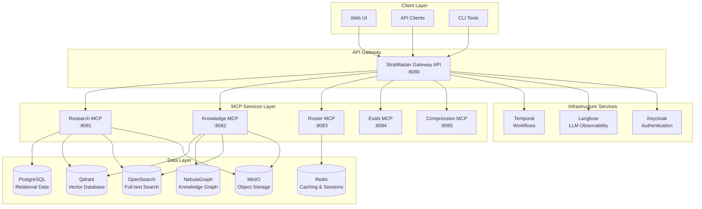

### Component Responsibilities

#### API Gateway Layer
- **StratMaster Gateway API**: Main application entry point, request orchestration, authentication
- **Responsibilities**: Request routing, authentication, rate limiting, API composition

#### MCP (Model Control Protocol) Services
- **Research MCP**: Web research, content crawling, source validation
- **Knowledge MCP**: Vector search, graph operations, knowledge synthesis  
- **Router MCP**: Intelligent request routing, load balancing, model selection
- **Evals MCP**: Quality assessment, evaluation metrics, validation
- **Compression MCP**: Content compression, summarization, optimization

#### Data Persistence Layer
- **PostgreSQL**: Transactional data, user accounts, metadata
- **Qdrant**: Vector embeddings, semantic search indices
- **OpenSearch**: Full-text search, document indexing, analytics
- **NebulaGraph**: Knowledge graph, entity relationships, graph queries
- **Redis**: Caching, session storage, temporary data
- **MinIO**: Object storage, documents, media files

#### Infrastructure Services
- **Temporal**: Workflow orchestration, long-running processes
- **Langfuse**: LLM observability, cost tracking, performance monitoring
- **Keycloak**: Authentication, authorization, user management

## Request Flow Architecture

### Research Workflow

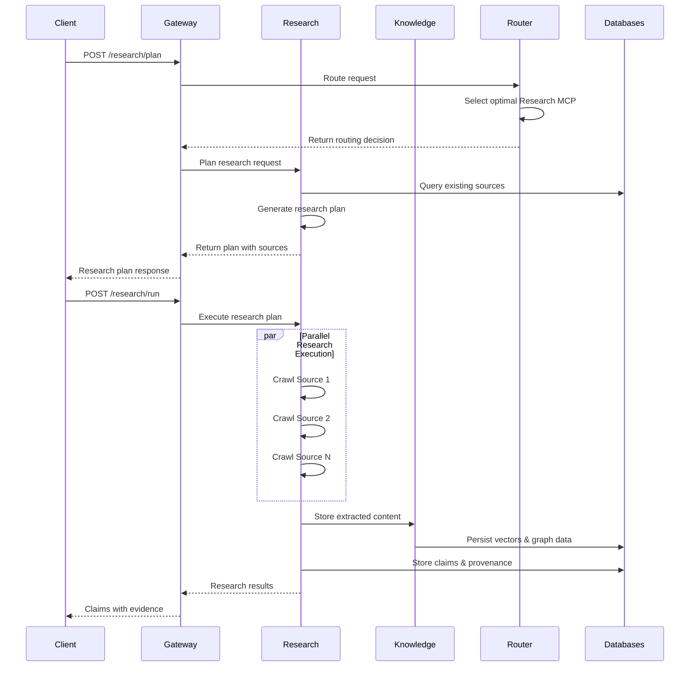

### Knowledge Query Workflow

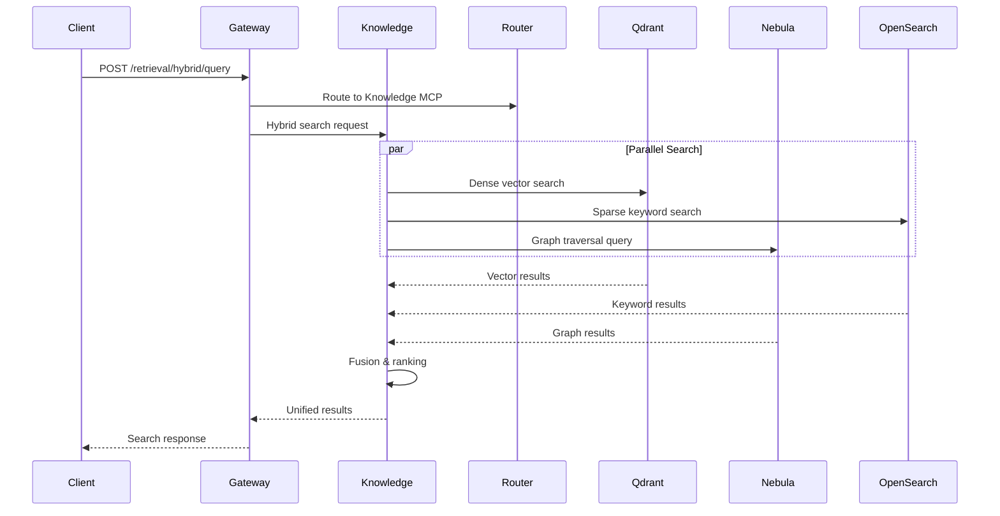

## Service Communication Patterns

### Synchronous Communication

Primary pattern for real-time API requests:

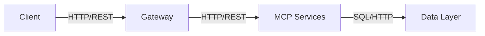

**Characteristics:**
- **Protocol**: HTTP/REST with JSON payloads
- **Timeout**: 30 seconds default, configurable per endpoint
- **Retry Logic**: Exponential backoff with circuit breakers
- **Load Balancing**: Round-robin with health checks

### Asynchronous Communication

For long-running operations and workflows:

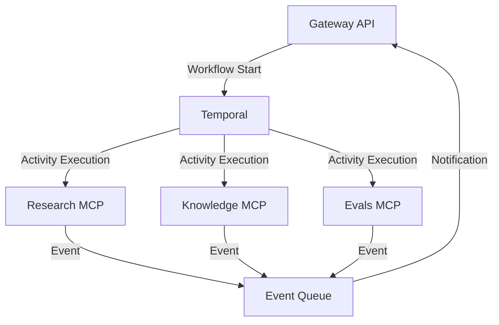

**Use Cases:**
- Multi-step research workflows
- Large-scale content processing
- Batch evaluation jobs
- Background model training

### Event-Driven Architecture

For reactive system behaviors:

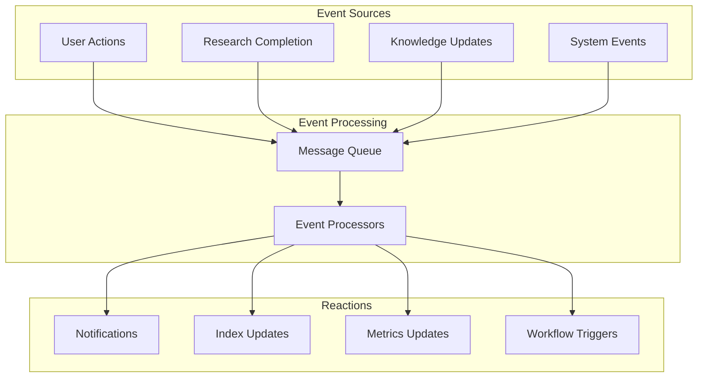

## Data Architecture

### Data Flow Patterns

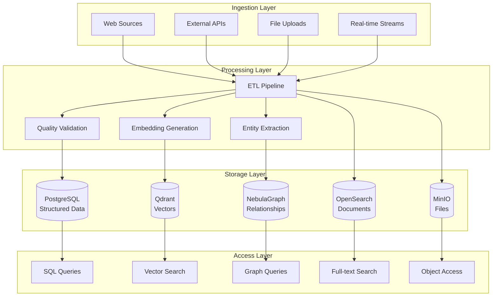

### Data Consistency Model

#### Strong Consistency
- **User accounts and authentication**: PostgreSQL with ACID transactions
- **Financial/billing data**: PostgreSQL with strict consistency
- **Configuration and system state**: PostgreSQL with immediate consistency

#### Eventual Consistency
- **Vector embeddings**: Qdrant with eventual consistency across nodes
- **Full-text indices**: OpenSearch with near real-time updates
- **Knowledge graph**: NebulaGraph with eventual consistency
- **Cache data**: Redis with TTL-based invalidation

#### Consistency Patterns

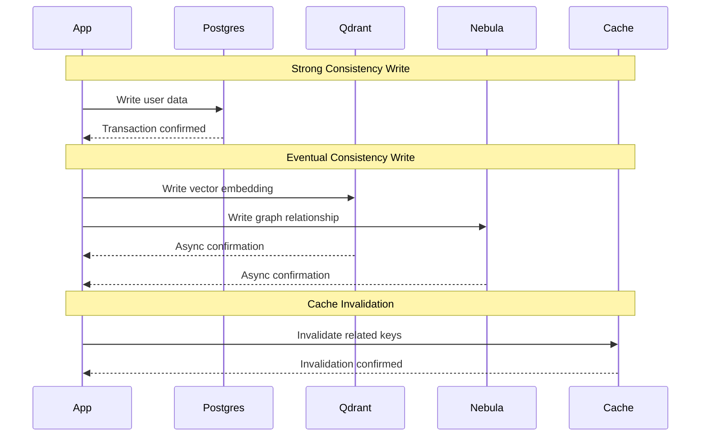

## Scalability Architecture

### Horizontal Scaling Patterns

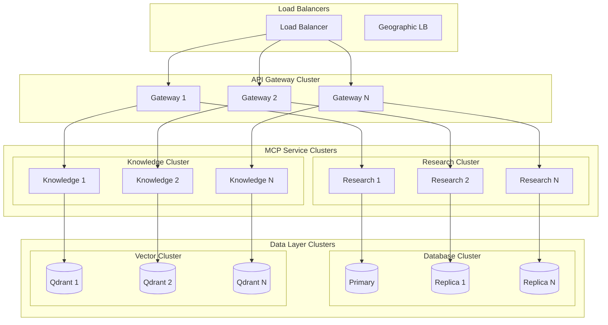

### Auto-scaling Configuration

```yaml
# Kubernetes HPA Example
apiVersion: autoscaling/v2
kind: HorizontalPodAutoscaler
metadata:
  name: stratmaster-gateway-hpa
spec:
  scaleTargetRef:
    apiVersion: apps/v1
    kind: Deployment
    name: stratmaster-gateway
  minReplicas: 3
  maxReplicas: 50
  metrics:
  - type: Resource
    resource:
      name: cpu
      target:
        type: Utilization
        averageUtilization: 70
  - type: Resource
    resource:
      name: memory
      target:
        type: Utilization
        averageUtilization: 80
  - type: Pods
    pods:
      metric:
        name: requests_per_second
      target:
        type: AverageValue
        averageValue: "100"
```

## Security Architecture

### Authentication and Authorization Flow

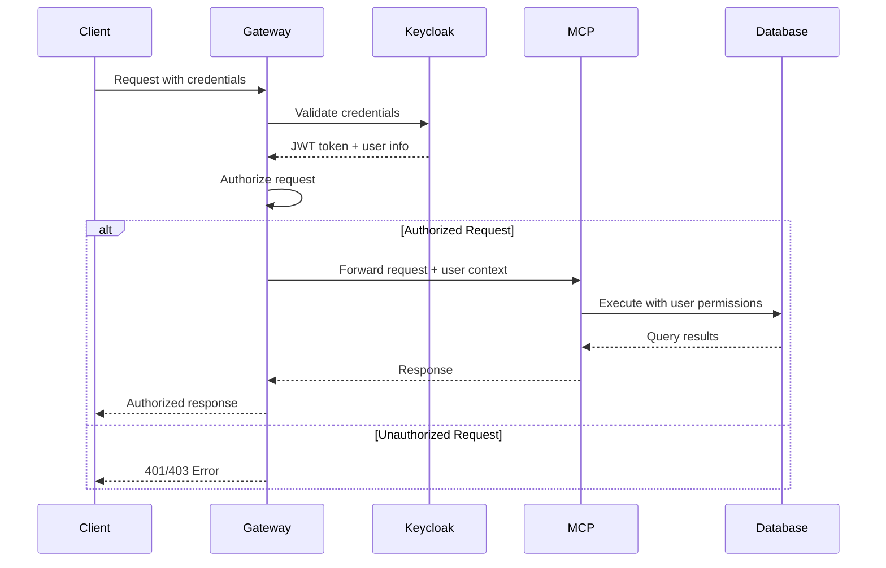

### Network Security Architecture

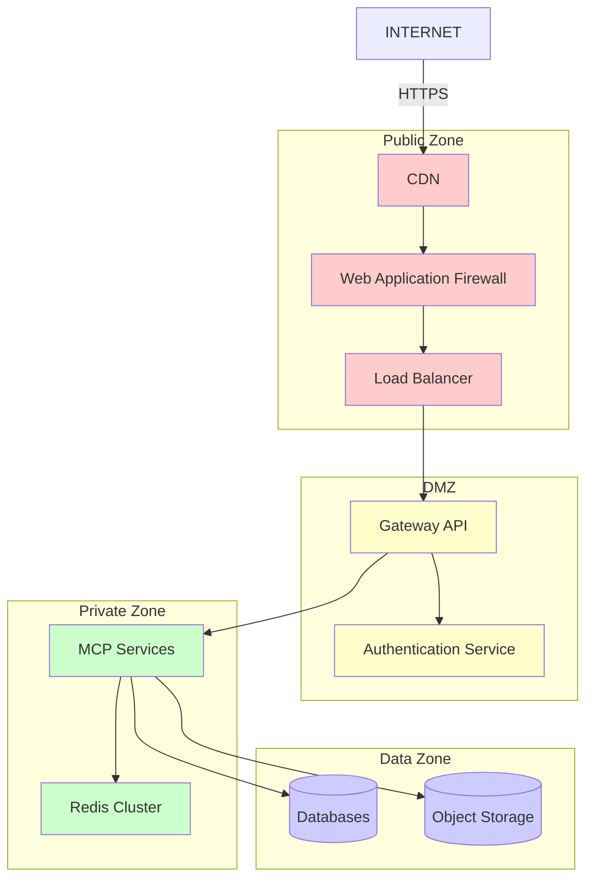

## Observability Architecture

### Monitoring and Tracing Stack

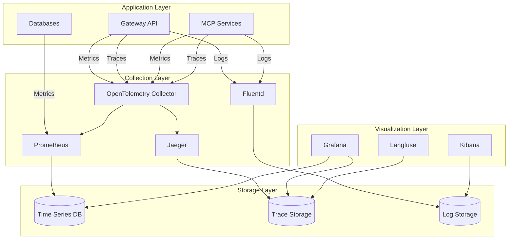

### Key Metrics Tracked

#### Application Metrics
- **Request Rate**: Requests per second across all services
- **Response Time**: P50, P95, P99 latency percentiles
- **Error Rate**: 4xx and 5xx error percentages
- **Throughput**: Business transactions per minute

#### Infrastructure Metrics
- **CPU Usage**: Per service and aggregate
- **Memory Usage**: Heap, off-heap, and system memory
- **Network I/O**: Bytes sent/received, connection counts
- **Disk I/O**: Read/write operations, queue depth

#### Business Metrics
- **Research Requests**: Successful research completions
- **Query Performance**: Search result quality and speed
- **User Engagement**: Active users, session duration
- **Cost Metrics**: API calls, compute usage, storage costs

## Deployment Architecture

### Multi-Environment Strategy

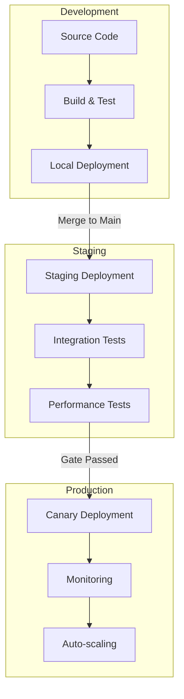

### Container and Orchestration

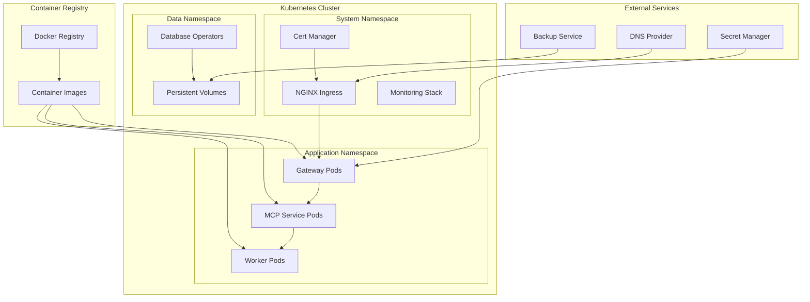

## Performance Characteristics

### Expected Performance Metrics

| Component | Throughput | Latency | Scalability |
|-----------|------------|---------|-------------|
| Gateway API | 10,000 req/sec | P95 < 100ms | Linear scaling |
| Research MCP | 100 concurrent crawls | 5-30s per source | CPU bound |
| Knowledge MCP | 1,000 queries/sec | P95 < 50ms | Memory bound |
| Vector Search | 500 queries/sec | P95 < 20ms | Index size dependent |
| Graph Queries | 200 queries/sec | P95 < 100ms | Complexity dependent |

### Bottleneck Analysis

#### Common Bottlenecks
1. **Database Connections**: Limited connection pool size
2. **Vector Index Size**: Memory constraints for large indices
3. **Network Bandwidth**: Large response payloads
4. **CPU Usage**: Embedding generation and inference
5. **I/O Operations**: File system and network operations

#### Mitigation Strategies
- **Connection Pooling**: Shared connections across services
- **Index Partitioning**: Distribute vectors across nodes
- **Response Compression**: Reduce payload sizes
- **Async Processing**: Non-blocking I/O operations
- **Caching**: Multi-layer caching strategy

## Disaster Recovery Architecture

### Backup and Recovery Strategy

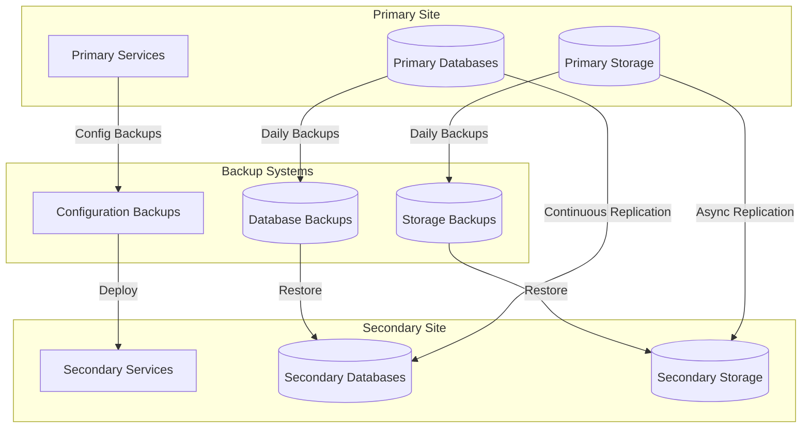

### Recovery Procedures

#### Recovery Time Objectives (RTO)
- **Database Failover**: < 5 minutes
- **Application Restart**: < 10 minutes  
- **Full System Recovery**: < 1 hour
- **Point-in-time Recovery**: < 4 hours

#### Recovery Point Objectives (RPO)
- **Critical Data**: < 1 minute (continuous replication)
- **Vector Indices**: < 15 minutes (incremental backups)
- **Configuration**: < 1 hour (scheduled backups)
- **Log Data**: < 5 minutes (near real-time streaming)

## Future Architecture Evolution

### Planned Enhancements

1. **Multi-Region Deployment**: Geographic distribution for lower latency
2. **Event Sourcing**: Complete audit trail and replay capability
3. **Serverless Components**: Function-as-a-Service for peak efficiency
4. **AI/ML Pipeline**: Integrated model training and deployment
5. **Advanced Caching**: Intelligent caching with ML-driven eviction

### Technology Roadmap

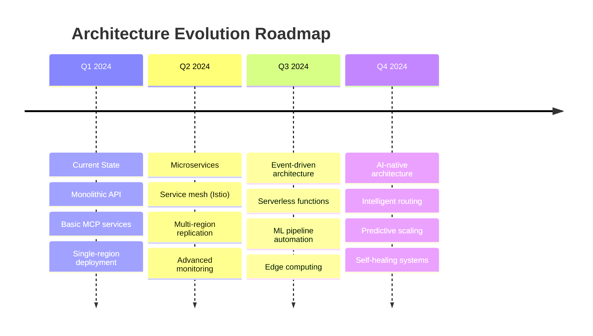

## See Also

- [Multi-Agent Debate](multi-agent-debate.md) - AI collaboration architecture
- [Security Model](security.md) - Detailed security architecture  
- [Design Decisions](design-decisions.md) - Architecture decision records
- [Deployment Guide](../how-to/deployment.md) - Production deployment
- [API Reference](../reference/api/) - Detailed API specifications