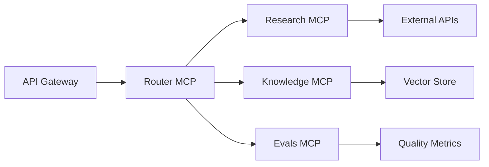

# Design Decisions

This document captures the key architectural and technology decisions made during StratMaster's development, along with the rationale, trade-offs, and alternatives considered. Understanding these decisions helps developers and architects work effectively with the system.

## Architectural Decisions

### 1. Microservices Architecture with MCP Protocol

**Decision**: Adopt a microservices architecture using the Model Context Protocol (MCP) for service communication.

**Rationale**:
- **Scalability**: Independent scaling of different AI capabilities
- **Isolation**: Failures in one service don't cascade to others  
- **Technology Diversity**: Different services can use optimal tech stacks
- **Team Autonomy**: Independent development and deployment cycles

**Alternatives Considered**:
- **Monolithic Architecture**: Simpler deployment but poor scalability
- **Traditional REST Microservices**: Standard but lacks AI-specific optimizations
- **Event-Driven Architecture**: Good decoupling but complex debugging

**Trade-offs**:
- ✅ Better scalability and maintainability
- ✅ Clear service boundaries and responsibilities
- ❌ Increased operational complexity
- ❌ Network latency between services



### 2. FastAPI for API Layer

**Decision**: Use FastAPI as the primary web framework for API services.

**Rationale**:
- **Performance**: Among the fastest Python web frameworks
- **Type Safety**: Built-in Pydantic integration for request/response validation
- **Documentation**: Automatic OpenAPI/Swagger documentation generation
- **Async Support**: Native asyncio support for high-concurrency workloads

**Alternatives Considered**:
- **Django REST Framework**: More mature but heavier and slower
- **Flask**: Lightweight but lacks built-in validation and documentation
- **Node.js/Express**: Good performance but Python ecosystem preferred for AI

**Implementation**:
```python
# Example of FastAPI design pattern used throughout
from fastapi import FastAPI, Depends, HTTPException
from pydantic import BaseModel
from typing import List

class StrategyRequest(BaseModel):
    topic: str
    constraints: List[str] = []
    
class StrategyResponse(BaseModel):
    insights: List[str]
    confidence: float
    evidence_count: int

app = FastAPI(
    title="StratMaster API",
    description="AI-powered brand strategy analysis",
    version="0.1.0"
)

@app.post("/strategies", response_model=StrategyResponse)
async def create_strategy(
    request: StrategyRequest,
    current_user: User = Depends(get_current_user)
) -> StrategyResponse:
    # Implementation here
    pass
```

### 3. Temporal for Workflow Orchestration

**Decision**: Use Temporal for orchestrating complex multi-agent workflows.

**Rationale**:
- **Reliability**: Guaranteed execution with automatic retries and error handling
- **Observability**: Built-in workflow tracking and debugging capabilities
- **Scalability**: Horizontal scaling with distributed execution
- **Durability**: Workflow state persisted across failures and restarts

**Alternatives Considered**:
- **Celery**: Simpler but lacks workflow orchestration features
- **Apache Airflow**: Good for ETL but heavyweight for real-time workflows  
- **Custom Queue System**: Full control but significant development overhead

**Implementation Pattern**:
```python
from temporalio import workflow, activity
from datetime import timedelta

@workflow.defn
class StrategyAnalysisWorkflow:
    @workflow.run
    async def run(self, topic: str) -> AnalysisResult:
        # Step 1: Research (parallel execution)
        research_tasks = [
            workflow.execute_activity(
                research_activity, 
                topic, 
                schedule_to_close_timeout=timedelta(minutes=5)
            )
            for _ in range(3)  # Multiple sources
        ]
        research_results = await asyncio.gather(*research_tasks)
        
        # Step 2: Analysis (sequential with dependencies)
        analysis = await workflow.execute_activity(
            analysis_activity, 
            research_results,
            schedule_to_close_timeout=timedelta(minutes=10)
        )
        
        # Step 3: Quality evaluation
        quality_score = await workflow.execute_activity(
            quality_evaluation_activity,
            analysis,
            schedule_to_close_timeout=timedelta(minutes=2)
        )
        
        if quality_score < 0.8:
            # Retry with additional research
            return await workflow.execute_child_workflow(
                StrategyAnalysisWorkflow.run,
                topic,
                id=f"retry-{workflow.info().workflow_id}"
            )
        
        return analysis
```

### 4. Multi-Database Strategy

**Decision**: Use specialized databases for different data types and access patterns.

**Database Selection**:
- **PostgreSQL**: Primary transactional data, user accounts, audit logs
- **Qdrant**: Vector embeddings for semantic search
- **OpenSearch**: Full-text search and analytics
- **NebulaGraph**: Relationship modeling and graph traversal

**Rationale**:
- **Performance Optimization**: Each database optimized for specific workloads
- **Scalability**: Independent scaling based on usage patterns
- **Technology Fit**: Right tool for the right job

**Trade-offs**:
- ✅ Optimal performance for each data type
- ✅ Independent scaling capabilities
- ❌ Increased operational complexity
- ❌ Data consistency challenges across systems

```yaml
# Database configuration pattern
databases:
  primary:
    type: "postgresql"
    usage: ["user_data", "transactions", "audit_logs"]
    consistency: "ACID"
    
  vector:
    type: "qdrant" 
    usage: ["embeddings", "semantic_search"]
    consistency: "eventual"
    
  search:
    type: "opensearch"
    usage: ["full_text_search", "analytics"]
    consistency: "eventual"
    
  graph:
    type: "nebula_graph"
    usage: ["relationships", "graph_traversal"]
    consistency: "eventual"
```

## Technology Decisions

### 5. Python 3.13+ as Primary Language

**Decision**: Standardize on Python 3.13+ for all backend services.

**Rationale**:
- **AI/ML Ecosystem**: Richest ecosystem for AI and machine learning
- **Performance**: Significant improvements in Python 3.13 (nogil, JIT compilation)
- **Developer Productivity**: Extensive libraries and tooling
- **Type Safety**: Strong typing with mypy and Pydantic

**Alternatives Considered**:
- **Rust**: Better performance but smaller AI ecosystem
- **Node.js**: Good for web APIs but weak for AI workloads
- **Go**: Excellent for microservices but limited AI libraries

### 6. Pydantic v2 for Data Validation

**Decision**: Use Pydantic v2 for all data modeling and validation.

**Rationale**:
- **Performance**: 5-50x faster than v1 due to Rust core
- **Type Safety**: Excellent integration with Python typing
- **Serialization**: Built-in JSON/dict conversion with validation
- **Documentation**: Automatic schema generation for OpenAPI

**Migration Strategy**:
```python
# Pydantic v2 pattern used throughout
from pydantic import BaseModel, Field, validator
from typing import Optional, List
from datetime import datetime

class StrategyInsight(BaseModel):
    """Core data model for strategy insights."""
    
    id: str = Field(..., description="Unique insight identifier")
    content: str = Field(..., min_length=10, max_length=10000)
    confidence: float = Field(..., ge=0.0, le=1.0)
    evidence_sources: List[str] = Field(default_factory=list)
    created_at: datetime = Field(default_factory=datetime.utcnow)
    
    @validator('confidence')
    def validate_confidence(cls, v):
        if v < 0.5:
            raise ValueError('Confidence must be at least 0.5')
        return v
    
    class Config:
        # v2 configuration
        json_encoders = {
            datetime: lambda v: v.isoformat()
        }
        schema_extra = {
            "example": {
                "id": "insight-123",
                "content": "Market analysis shows strong growth potential",
                "confidence": 0.85,
                "evidence_sources": ["source1.pdf", "source2.html"]
            }
        }
```

### 7. Container-First Deployment

**Decision**: Design for container-first deployment with Kubernetes orchestration.

**Rationale**:
- **Consistency**: Same runtime environment across dev/staging/production
- **Scalability**: Automatic scaling based on demand
- **Resource Efficiency**: Better resource utilization and isolation
- **Cloud Portability**: Runs on any Kubernetes-compatible platform

**Container Strategy**:
```dockerfile
# Multi-stage build for smaller, secure images
FROM python:3.13-slim-bookworm AS builder
WORKDIR /build
COPY requirements.txt .
RUN pip install --user --no-cache-dir -r requirements.txt

FROM python:3.13-slim-bookworm AS runtime
RUN groupadd -r mcp && useradd -r -g mcp mcp
COPY --from=builder --chown=mcp:mcp /root/.local /home/mcp/.local
COPY --chown=mcp:mcp . /app
WORKDIR /app
USER mcp
ENV PATH="/home/mcp/.local/bin:$PATH"
HEALTHCHECK --interval=30s --timeout=3s --retries=3 \
    CMD curl -f http://localhost:8080/healthz || exit 1
EXPOSE 8080
CMD ["python", "-m", "stratmaster_api"]
```

## Quality and Testing Decisions

### 8. Comprehensive Testing Strategy

**Decision**: Implement testing at multiple levels with specific coverage targets.

**Testing Pyramid**:
- **Unit Tests (70%)**: Fast, isolated tests for business logic
- **Integration Tests (20%)**: Service-to-service interaction tests  
- **End-to-End Tests (10%)**: Full workflow validation

**Tools and Frameworks**:
- **pytest**: Primary testing framework with excellent fixtures
- **httpx**: Async HTTP client for API testing
- **testcontainers**: Integration testing with real databases
- **hypothesis**: Property-based testing for edge cases

```python
# Example of testing pattern
import pytest
import httpx
from testcontainers.postgres import PostgresContainer
from stratmaster_api.app import create_app

@pytest.fixture(scope="session")
def postgres_container():
    with PostgresContainer("postgres:15") as container:
        yield container

@pytest.fixture
async def test_client(postgres_container):
    app = create_app(database_url=postgres_container.get_connection_url())
    async with httpx.AsyncClient(app=app, base_url="http://test") as client:
        yield client

@pytest.mark.asyncio
async def test_create_strategy(test_client):
    response = await test_client.post("/strategies", json={
        "topic": "AI market analysis",
        "constraints": ["B2B focus", "North America"]
    })
    
    assert response.status_code == 201
    data = response.json()
    assert "insights" in data
    assert data["confidence"] > 0.5
```

### 9. Code Quality Standards

**Decision**: Enforce strict code quality standards through automation.

**Tools Selected**:
- **Ruff**: Fast linting and formatting (replaces flake8, black, isort)
- **mypy**: Static type checking
- **bandit**: Security vulnerability scanning
- **pre-commit**: Automated quality checks on commit

**Configuration Example**:
```toml
# pyproject.toml
[tool.ruff]
target-version = "py313"
line-length = 88
select = ["E", "F", "W", "I", "N", "UP", "B", "C", "S"]
ignore = ["E501"]  # Line length handled by formatter

[tool.mypy]
python_version = "3.13"
strict = true
warn_return_any = true
warn_unused_configs = true
disallow_untyped_defs = true

[tool.bandit]
exclude_dirs = ["tests"]
skips = ["B101", "B601"]  # Skip assert_used and shell usage in tests
```

## Infrastructure Decisions

### 10. Observability-First Design

**Decision**: Build comprehensive observability into the system from the beginning.

**Pillars of Observability**:
- **Metrics**: Prometheus for system and business metrics
- **Logging**: Structured JSON logging with correlation IDs
- **Tracing**: OpenTelemetry for distributed tracing
- **Alerting**: Alert on SLI violations and error rates

**Implementation**:
```python
# Observability integration pattern
from opentelemetry import trace, metrics
from opentelemetry.exporter.prometheus import PrometheusMetricReader
import structlog

# Structured logging
logger = structlog.get_logger(__name__)

# Tracing
tracer = trace.get_tracer(__name__)

# Metrics
meter = metrics.get_meter(__name__)
request_counter = meter.create_counter(
    name="http_requests_total",
    description="Total HTTP requests"
)

async def strategy_endpoint(request: StrategyRequest):
    with tracer.start_as_current_span("create_strategy") as span:
        span.set_attributes({
            "strategy.topic": request.topic,
            "strategy.constraints_count": len(request.constraints)
        })
        
        logger.info(
            "Creating strategy",
            topic=request.topic,
            constraints=len(request.constraints),
            correlation_id=get_correlation_id()
        )
        
        try:
            result = await create_strategy_logic(request)
            request_counter.add(1, {"status": "success"})
            return result
        except Exception as e:
            request_counter.add(1, {"status": "error"})
            logger.error("Strategy creation failed", error=str(e))
            raise
```

### 11. Configuration Management

**Decision**: Use hierarchical configuration with environment-specific overrides.

**Configuration Strategy**:
- **Base Configuration**: Default values in code
- **YAML Files**: Environment-specific overrides
- **Environment Variables**: Runtime configuration and secrets
- **Remote Configuration**: Feature flags and dynamic settings

```python
# Configuration management pattern
from pydantic import BaseSettings
from typing import Optional, List
import yaml

class Settings(BaseSettings):
    """Application configuration with environment override support."""
    
    # Database settings
    database_url: str = "postgresql://localhost/stratmaster"
    database_pool_size: int = 10
    
    # API settings
    api_host: str = "0.0.0.0"
    api_port: int = 8080
    api_workers: int = 4
    
    # Feature flags
    enable_debug_mode: bool = False
    enable_experimental_features: bool = False
    
    # AI model settings
    openai_api_key: Optional[str] = None
    model_temperature: float = 0.7
    max_tokens: int = 4096
    
    @classmethod
    def load_from_yaml(cls, config_file: str) -> "Settings":
        """Load configuration from YAML file with environment overrides."""
        with open(config_file) as f:
            yaml_config = yaml.safe_load(f)
        
        # Environment variables override YAML
        return cls(**yaml_config)
    
    class Config:
        env_prefix = "STRATMASTER_"
        case_sensitive = False
```

## Security Design Decisions

### 12. Zero-Trust Security Model

**Decision**: Implement zero-trust principles throughout the architecture.

**Key Components**:
- **Identity Verification**: Every request authenticated and authorized
- **Network Segmentation**: Micro-segmentation with network policies
- **Encryption Everywhere**: Data encrypted at rest, in transit, and in processing
- **Continuous Monitoring**: Real-time threat detection and response

### 13. Multi-Tenant Architecture

**Decision**: Build native multi-tenancy with strong isolation guarantees.

**Isolation Strategy**:
- **Database**: Schema per tenant with row-level security
- **Search**: Dedicated indices per tenant
- **Storage**: Separate buckets with tenant-specific encryption keys
- **Compute**: Resource quotas and limits per tenant

```python
# Multi-tenant middleware pattern
from fastapi import Request, HTTPException
from typing import Optional

class TenantMiddleware:
    async def __call__(self, request: Request, call_next):
        tenant_id = self.extract_tenant_id(request)
        if not tenant_id:
            raise HTTPException(status_code=400, detail="Tenant ID required")
        
        # Validate tenant exists and user has access
        if not await self.validate_tenant_access(tenant_id, request.user):
            raise HTTPException(status_code=403, detail="Tenant access denied")
        
        # Add tenant context to request
        request.state.tenant_id = tenant_id
        
        response = await call_next(request)
        return response
```

## Performance Decisions

### 14. Caching Strategy

**Decision**: Implement multi-level caching for performance optimization.

**Caching Layers**:
- **Application Cache**: Redis for frequently accessed data
- **CDN**: CloudFlare for static assets and API responses
- **Database Cache**: Query result caching in PostgreSQL
- **Vector Cache**: Embedding caches in Qdrant

### 15. Asynchronous Processing

**Decision**: Use async/await throughout the application for better concurrency.

**Benefits**:
- **Higher Throughput**: Handle more concurrent requests
- **Resource Efficiency**: Better CPU and memory utilization  
- **Responsiveness**: Non-blocking I/O operations
- **Scalability**: Better scaling characteristics

---

These design decisions form the foundation of StratMaster's architecture. They represent careful consideration of trade-offs between performance, maintainability, scalability, and security. As the system evolves, these decisions will be revisited and updated based on new requirements and lessons learned.