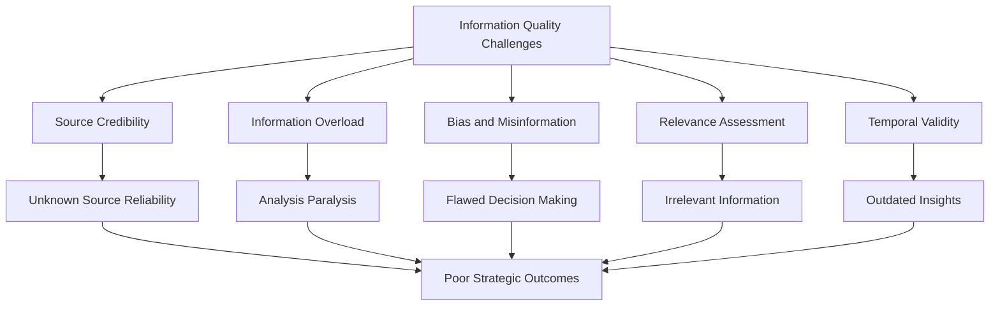
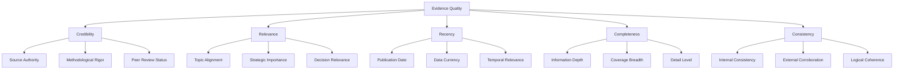

# Evidence Grading System

StratMaster employs a sophisticated evidence grading system that automatically evaluates the quality, credibility, and relevance of information gathered during strategic research. This system ensures that strategic insights are built upon a foundation of high-quality, trustworthy evidence.

## Conceptual Foundation

### The Evidence Quality Problem

Strategic decision-making depends critically on information quality, but organizations face several challenges:



### Evidence Grading Objectives

StratMaster's evidence grading system addresses these challenges by:

1. **Automated Quality Assessment**: Systematic evaluation of evidence quality
2. **Multi-Dimensional Scoring**: Comprehensive assessment across multiple quality dimensions
3. **Transparent Reasoning**: Clear explanation of quality scores and reasoning
4. **Dynamic Updating**: Continuous refinement based on new information
5. **Context-Aware Evaluation**: Quality assessment tailored to specific strategic contexts

## Evidence Quality Dimensions

### Primary Quality Dimensions



### 1. Credibility Assessment

Credibility measures the trustworthiness and reliability of the evidence source.

#### Source Credibility Factors

```python
@dataclass
class SourceCredibilityFactors:
    """Factors contributing to source credibility assessment"""
    
    # Author expertise and authority
    author_expertise: float      # 0.0 - 1.0
    institutional_affiliation: float  # 0.0 - 1.0
    publication_reputation: float     # 0.0 - 1.0
    
    # Content validation
    peer_review_status: float    # 0.0 - 1.0
    citation_count: float        # 0.0 - 1.0
    editorial_oversight: float   # 0.0 - 1.0
    
    # Methodological rigor
    methodology_transparency: float  # 0.0 - 1.0
    data_quality: float             # 0.0 - 1.0
    analytical_rigor: float         # 0.0 - 1.0
    
    # Independence and bias
    funding_independence: float     # 0.0 - 1.0
    conflict_of_interest: float    # 0.0 - 1.0 (lower = more conflicts)
    objectivity_indicators: float  # 0.0 - 1.0

class CredibilityEvaluator:
    """Evaluates source credibility using multiple indicators"""
    
    def __init__(self):
        self.domain_expertise_db = DomainExpertiseDatabase()
        self.publication_rankings = PublicationRankings()
        self.citation_index = CitationIndex()
    
    def evaluate_credibility(self, source: EvidenceSource) -> CredibilityAssessment:
        """Comprehensive credibility evaluation"""
        
        factors = SourceCredibilityFactors()
        
        # Evaluate author expertise
        factors.author_expertise = self._evaluate_author_expertise(source.author)
        
        # Assess institutional credibility
        factors.institutional_affiliation = self._evaluate_institution(
            source.institution
        )
        
        # Publication reputation
        factors.publication_reputation = self._evaluate_publication(
            source.publication
        )
        
        # Peer review and validation
        factors.peer_review_status = self._assess_peer_review(source)
        factors.citation_count = self._normalize_citation_count(source.citations)
        
        # Methodological assessment
        factors.methodology_transparency = self._assess_methodology(source)
        factors.data_quality = self._assess_data_quality(source)
        
        # Bias and independence
        factors.funding_independence = self._assess_funding_independence(source)
        factors.conflict_of_interest = self._assess_conflicts(source)
        
        # Calculate weighted credibility score
        credibility_score = self._calculate_weighted_credibility(factors)
        
        return CredibilityAssessment(
            score=credibility_score,
            factors=factors,
            confidence=self._calculate_assessment_confidence(factors),
            explanation=self._generate_credibility_explanation(factors)
        )
```

#### Credibility Scoring Rubric

| Score Range | Category | Description | Examples |
|-------------|----------|-------------|----------|
| 0.9 - 1.0 | Exceptional | Highly authoritative sources | Peer-reviewed academic papers, major consulting firms |
| 0.8 - 0.89 | High | Very credible sources | Reputable news organizations, industry reports |
| 0.7 - 0.79 | Good | Generally credible sources | Trade publications, company reports |
| 0.6 - 0.69 | Moderate | Moderately credible sources | Blog posts by experts, press releases |
| 0.5 - 0.59 | Limited | Limited credibility | Social media posts, unverified sources |
| 0.0 - 0.49 | Poor | Low credibility sources | Anonymous sources, known unreliable sites |

### 2. Relevance Assessment

Relevance measures how well the evidence addresses the specific strategic question.

```python
class RelevanceEvaluator:
    """Evaluates evidence relevance to strategic questions"""
    
    def __init__(self):
        self.semantic_analyzer = SemanticAnalyzer()
        self.topic_modeler = TopicModeler()
        self.strategic_context_analyzer = StrategicContextAnalyzer()
    
    def evaluate_relevance(
        self, 
        evidence: Evidence, 
        question: StrategicQuestion,
        context: StrategicContext
    ) -> RelevanceAssessment:
        """Multi-faceted relevance evaluation"""
        
        # Topic alignment
        topic_alignment = self._assess_topic_alignment(evidence, question)
        
        # Semantic similarity
        semantic_similarity = self._calculate_semantic_similarity(
            evidence.content, 
            question.text
        )
        
        # Strategic importance
        strategic_importance = self._assess_strategic_importance(
            evidence, 
            context
        )
        
        # Decision relevance
        decision_relevance = self._assess_decision_relevance(
            evidence, 
            question.decision_context
        )
        
        # Geographic relevance
        geographic_relevance = self._assess_geographic_relevance(
            evidence.geographic_scope,
            context.geographic_focus
        )
        
        # Temporal relevance
        temporal_relevance = self._assess_temporal_relevance(
            evidence.time_period,
            question.time_horizon
        )
        
        # Calculate composite relevance score
        relevance_score = self._calculate_composite_relevance(
            topic_alignment=topic_alignment,
            semantic_similarity=semantic_similarity,
            strategic_importance=strategic_importance,
            decision_relevance=decision_relevance,
            geographic_relevance=geographic_relevance,
            temporal_relevance=temporal_relevance
        )
        
        return RelevanceAssessment(
            score=relevance_score,
            topic_alignment=topic_alignment,
            semantic_similarity=semantic_similarity,
            strategic_importance=strategic_importance,
            explanation=self._generate_relevance_explanation(
                topic_alignment, semantic_similarity, strategic_importance
            )
        )
```

### 3. Recency Assessment

Recency evaluates how current and up-to-date the information is.

```python
class RecencyEvaluator:
    """Evaluates information recency and temporal validity"""
    
    def evaluate_recency(
        self, 
        evidence: Evidence,
        context: StrategicContext
    ) -> RecencyAssessment:
        """Context-aware recency evaluation"""
        
        # Calculate age-based score
        age_score = self._calculate_age_score(
            evidence.publication_date,
            evidence.data_collection_date
        )
        
        # Assess temporal decay based on domain
        domain_decay = self._assess_domain_temporal_decay(evidence.domain)
        
        # Factor in information stability
        stability_factor = self._assess_information_stability(evidence.topic)
        
        # Consider update frequency
        update_frequency = self._assess_source_update_frequency(evidence.source)
        
        # Calculate context-adjusted recency
        recency_score = self._calculate_context_adjusted_recency(
            age_score=age_score,
            domain_decay=domain_decay,
            stability_factor=stability_factor,
            update_frequency=update_frequency,
            context=context
        )
        
        return RecencyAssessment(
            score=recency_score,
            publication_age_days=(datetime.now() - evidence.publication_date).days,
            data_age_days=(datetime.now() - evidence.data_collection_date).days,
            domain_half_life=domain_decay.half_life_days,
            explanation=self._generate_recency_explanation(
                age_score, domain_decay, stability_factor
            )
        )
    
    def _assess_domain_temporal_decay(self, domain: str) -> DomainDecayProfile:
        """Different domains have different information decay rates"""
        
        decay_profiles = {
            'technology': DomainDecayProfile(half_life_days=90, decay_rate=0.8),
            'financial_markets': DomainDecayProfile(half_life_days=30, decay_rate=0.9),
            'regulatory': DomainDecayProfile(half_life_days=365, decay_rate=0.3),
            'demographic': DomainDecayProfile(half_life_days=1095, decay_rate=0.1),
            'competitive_intelligence': DomainDecayProfile(half_life_days=180, decay_rate=0.6),
            'market_research': DomainDecayProfile(half_life_days=365, decay_rate=0.4)
        }
        
        return decay_profiles.get(domain, DomainDecayProfile(half_life_days=365, decay_rate=0.5))
```

### 4. Completeness Assessment

Completeness measures how comprehensive and thorough the information is.

```python
class CompletenessEvaluator:
    """Evaluates information completeness and comprehensiveness"""
    
    def evaluate_completeness(
        self, 
        evidence: Evidence,
        question: StrategicQuestion
    ) -> CompletenessAssessment:
        """Multi-dimensional completeness evaluation"""
        
        # Information depth
        depth_score = self._assess_information_depth(evidence)
        
        # Coverage breadth
        breadth_score = self._assess_coverage_breadth(evidence, question)
        
        # Detail level
        detail_score = self._assess_detail_level(evidence)
        
        # Missing information identification
        missing_info = self._identify_missing_information(evidence, question)
        
        # Calculate completeness score
        completeness_score = self._calculate_completeness_score(
            depth_score, breadth_score, detail_score, missing_info
        )
        
        return CompletenessAssessment(
            score=completeness_score,
            depth_score=depth_score,
            breadth_score=breadth_score,
            detail_score=detail_score,
            missing_information=missing_info,
            explanation=self._generate_completeness_explanation(
                depth_score, breadth_score, missing_info
            )
        )
    
    def _assess_information_depth(self, evidence: Evidence) -> float:
        """Assess how deeply the information explores the topic"""
        
        depth_indicators = {
            'methodology_detail': self._check_methodology_detail(evidence),
            'data_granularity': self._assess_data_granularity(evidence),
            'analysis_sophistication': self._assess_analysis_sophistication(evidence),
            'context_explanation': self._assess_context_explanation(evidence),
            'limitation_discussion': self._check_limitation_discussion(evidence)
        }
        
        return sum(depth_indicators.values()) / len(depth_indicators)
```

### 5. Consistency Assessment

Consistency evaluates internal logical coherence and external corroboration.

```python
class ConsistencyEvaluator:
    """Evaluates information consistency and coherence"""
    
    def evaluate_consistency(
        self, 
        evidence: Evidence,
        related_evidence: List[Evidence]
    ) -> ConsistencyAssessment:
        """Comprehensive consistency evaluation"""
        
        # Internal consistency
        internal_consistency = self._assess_internal_consistency(evidence)
        
        # External corroboration
        external_corroboration = self._assess_external_corroboration(
            evidence, related_evidence
        )
        
        # Logical coherence
        logical_coherence = self._assess_logical_coherence(evidence)
        
        # Contradiction detection
        contradictions = self._detect_contradictions(evidence, related_evidence)
        
        # Calculate consistency score
        consistency_score = self._calculate_consistency_score(
            internal_consistency,
            external_corroboration,
            logical_coherence,
            contradictions
        )
        
        return ConsistencyAssessment(
            score=consistency_score,
            internal_consistency=internal_consistency,
            external_corroboration=external_corroboration,
            logical_coherence=logical_coherence,
            contradictions=contradictions,
            explanation=self._generate_consistency_explanation(
                internal_consistency, external_corroboration, contradictions
            )
        )
```

## Composite Quality Scoring

### Weighted Quality Score Calculation

```python
class CompositeQualityScorer:
    """Calculates composite quality scores with configurable weights"""
    
    def __init__(self, scoring_config: ScoringConfiguration = None):
        self.config = scoring_config or self._default_scoring_config()
    
    def calculate_composite_score(
        self, 
        quality_assessments: QualityAssessments
    ) -> CompositeQualityScore:
        """Calculate weighted composite quality score"""
        
        # Base quality scores
        base_scores = {
            'credibility': quality_assessments.credibility.score,
            'relevance': quality_assessments.relevance.score,
            'recency': quality_assessments.recency.score,
            'completeness': quality_assessments.completeness.score,
            'consistency': quality_assessments.consistency.score
        }
        
        # Apply context-specific weights
        weighted_scores = {
            dimension: score * self.config.weights[dimension]
            for dimension, score in base_scores.items()
        }
        
        # Calculate composite score
        composite_score = sum(weighted_scores.values())
        
        # Apply quality thresholds and penalties
        adjusted_score = self._apply_quality_adjustments(
            composite_score, quality_assessments
        )
        
        return CompositeQualityScore(
            overall_score=adjusted_score,
            dimension_scores=base_scores,
            weighted_scores=weighted_scores,
            quality_tier=self._determine_quality_tier(adjusted_score),
            confidence=self._calculate_score_confidence(quality_assessments)
        )
    
    def _default_scoring_config(self) -> ScoringConfiguration:
        """Default scoring configuration"""
        return ScoringConfiguration(
            weights={
                'credibility': 0.35,    # Most important for strategic decisions
                'relevance': 0.25,      # Critical for addressing the question
                'recency': 0.20,        # Important for current validity
                'completeness': 0.15,   # Important for thorough analysis
                'consistency': 0.05     # Consistency check, lower weight
            },
            quality_thresholds={
                'credibility_minimum': 0.6,  # Minimum credibility threshold
                'relevance_minimum': 0.7,    # Minimum relevance threshold
            },
            penalties={
                'low_credibility_penalty': 0.3,  # Penalty for low credibility
                'inconsistency_penalty': 0.2     # Penalty for inconsistencies
            }
        )
```

### Context-Adaptive Scoring

```python
class ContextAdaptiveScorer:
    """Adapts quality scoring based on strategic context"""
    
    def adapt_scoring_weights(
        self, 
        base_config: ScoringConfiguration,
        context: StrategicContext
    ) -> ScoringConfiguration:
        """Adapt scoring weights based on context"""
        
        adapted_config = base_config.copy()
        
        # Adjust weights based on decision type
        if context.decision_type == DecisionType.INVESTMENT:
            # Emphasize credibility and completeness for investment decisions
            adapted_config.weights['credibility'] = 0.45
            adapted_config.weights['completeness'] = 0.20
            adapted_config.weights['recency'] = 0.15
        
        elif context.decision_type == DecisionType.MARKET_ENTRY:
            # Emphasize recency and relevance for market entry
            adapted_config.weights['recency'] = 0.30
            adapted_config.weights['relevance'] = 0.30
            adapted_config.weights['credibility'] = 0.25
        
        elif context.decision_type == DecisionType.COMPETITIVE_RESPONSE:
            # Emphasize recency and consistency for competitive responses
            adapted_config.weights['recency'] = 0.35
            adapted_config.weights['consistency'] = 0.15
            adapted_config.weights['credibility'] = 0.30
        
        # Adjust based on risk tolerance
        if context.risk_tolerance == RiskTolerance.LOW:
            # Increase credibility weight for low risk tolerance
            adapted_config.weights['credibility'] += 0.10
            adapted_config.weights['consistency'] += 0.05
            # Decrease other weights proportionally
            self._normalize_weights(adapted_config.weights)
        
        # Adjust based on time pressure
        if context.time_pressure == TimePressure.HIGH:
            # Reduce completeness requirements under time pressure
            adapted_config.weights['completeness'] *= 0.7
            adapted_config.weights['recency'] += 0.05
            self._normalize_weights(adapted_config.weights)
        
        return adapted_config
```

## Quality Grading Tiers

### Grading Scale

```python
class QualityGradingScale:
    """Defines quality grading tiers and their characteristics"""
    
    GRADES = {
        'A+': QualityGrade(
            score_range=(0.95, 1.0),
            label="Exceptional",
            description="Exceptionally high-quality evidence from authoritative sources",
            usage_guidance="Suitable for high-stakes strategic decisions",
            color_code="#006400"  # Dark green
        ),
        'A': QualityGrade(
            score_range=(0.85, 0.94),
            label="High Quality",
            description="High-quality evidence with strong credibility and relevance",
            usage_guidance="Reliable for strategic analysis and decision-making",
            color_code="#228B22"  # Forest green
        ),
        'B+': QualityGrade(
            score_range=(0.75, 0.84),
            label="Good Quality",
            description="Good quality evidence with minor limitations",
            usage_guidance="Suitable for strategic analysis with corroboration",
            color_code="#9ACD32"  # Yellow green
        ),
        'B': QualityGrade(
            score_range=(0.65, 0.74),
            label="Acceptable",
            description="Acceptable quality evidence with some limitations",
            usage_guidance="Use with caution and seek additional validation",
            color_code="#FFD700"  # Gold
        ),
        'C': QualityGrade(
            score_range=(0.50, 0.64),
            label="Limited Quality",
            description="Limited quality evidence with significant limitations",
            usage_guidance="Useful for initial insights but requires validation",
            color_code="#FFA500"  # Orange
        ),
        'D': QualityGrade(
            score_range=(0.35, 0.49),
            label="Poor Quality",
            description="Poor quality evidence with major limitations",
            usage_guidance="Not recommended for strategic decision-making",
            color_code="#FF6347"  # Tomato
        ),
        'F': QualityGrade(
            score_range=(0.0, 0.34),
            label="Unacceptable",
            description="Unacceptable quality evidence",
            usage_guidance="Should not be used for strategic analysis",
            color_code="#DC143C"  # Crimson
        )
    }
    
    @classmethod
    def get_grade(cls, score: float) -> QualityGrade:
        """Get quality grade for a given score"""
        for grade_key, grade in cls.GRADES.items():
            if grade.score_range[0] <= score <= grade.score_range[1]:
                return grade
        return cls.GRADES['F']  # Default to lowest grade
```

### Visual Quality Indicators

```python
class QualityVisualization:
    """Generate visual quality indicators and reports"""
    
    def generate_quality_badge(
        self, 
        quality_score: CompositeQualityScore
    ) -> QualityBadge:
        """Generate visual quality badge"""
        
        grade = QualityGradingScale.get_grade(quality_score.overall_score)
        
        return QualityBadge(
            grade=grade.label,
            score=quality_score.overall_score,
            color=grade.color_code,
            confidence=quality_score.confidence,
            breakdown=quality_score.dimension_scores
        )
    
    def generate_quality_dashboard(
        self, 
        evidence_collection: List[Evidence]
    ) -> QualityDashboard:
        """Generate quality dashboard for evidence collection"""
        
        # Calculate quality distribution
        quality_distribution = self._calculate_quality_distribution(evidence_collection)
        
        # Identify quality trends
        quality_trends = self._identify_quality_trends(evidence_collection)
        
        # Generate improvement recommendations
        improvements = self._generate_improvement_recommendations(evidence_collection)
        
        return QualityDashboard(
            total_evidence=len(evidence_collection),
            quality_distribution=quality_distribution,
            average_quality=sum(e.quality_score.overall_score for e in evidence_collection) / len(evidence_collection),
            quality_trends=quality_trends,
            improvement_recommendations=improvements
        )
```

## Evidence Ranking and Prioritization

### Multi-Criteria Ranking

```python
class EvidenceRanker:
    """Ranks evidence based on multiple criteria"""
    
    def rank_evidence(
        self, 
        evidence_collection: List[Evidence],
        ranking_criteria: RankingCriteria
    ) -> RankedEvidenceList:
        """Rank evidence using multi-criteria approach"""
        
        ranked_evidence = []
        
        for evidence in evidence_collection:
            # Calculate ranking score
            ranking_score = self._calculate_ranking_score(evidence, ranking_criteria)
            
            # Create ranked evidence item
            ranked_item = RankedEvidenceItem(
                evidence=evidence,
                ranking_score=ranking_score,
                quality_tier=evidence.quality_score.quality_tier,
                strategic_value=self._assess_strategic_value(evidence, ranking_criteria)
            )
            
            ranked_evidence.append(ranked_item)
        
        # Sort by ranking score
        ranked_evidence.sort(key=lambda x: x.ranking_score, reverse=True)
        
        return RankedEvidenceList(
            items=ranked_evidence,
            ranking_criteria=ranking_criteria,
            total_items=len(ranked_evidence)
        )
    
    def _calculate_ranking_score(
        self, 
        evidence: Evidence, 
        criteria: RankingCriteria
    ) -> float:
        """Calculate multi-criteria ranking score"""
        
        scores = {
            'quality': evidence.quality_score.overall_score * criteria.quality_weight,
            'relevance': evidence.relevance_score * criteria.relevance_weight,
            'uniqueness': self._assess_uniqueness(evidence) * criteria.uniqueness_weight,
            'strategic_impact': self._assess_strategic_impact(evidence) * criteria.impact_weight
        }
        
        return sum(scores.values())
```

### Evidence Filtering

```python
class EvidenceFilter:
    """Filters evidence based on quality and other criteria"""
    
    def filter_by_quality_threshold(
        self, 
        evidence_collection: List[Evidence],
        minimum_quality: float = 0.6
    ) -> List[Evidence]:
        """Filter evidence by minimum quality threshold"""
        
        return [
            evidence for evidence in evidence_collection
            if evidence.quality_score.overall_score >= minimum_quality
        ]
    
    def filter_by_quality_tier(
        self, 
        evidence_collection: List[Evidence],
        minimum_tier: str = 'B'
    ) -> List[Evidence]:
        """Filter evidence by minimum quality tier"""
        
        tier_hierarchy = ['F', 'D', 'C', 'B', 'B+', 'A', 'A+']
        minimum_index = tier_hierarchy.index(minimum_tier)
        
        return [
            evidence for evidence in evidence_collection
            if tier_hierarchy.index(evidence.quality_score.quality_tier) >= minimum_index
        ]
    
    def filter_by_credibility(
        self, 
        evidence_collection: List[Evidence],
        minimum_credibility: float = 0.7
    ) -> List[Evidence]:
        """Filter evidence by minimum credibility score"""
        
        return [
            evidence for evidence in evidence_collection
            if evidence.credibility_assessment.score >= minimum_credibility
        ]
```

## Quality Assurance and Validation

### Quality Control Process

```python
class QualityControlProcess:
    """Implements quality control checks and validation"""
    
    def validate_quality_assessment(
        self, 
        evidence: Evidence,
        quality_assessment: QualityAssessments
    ) -> QualityValidationResult:
        """Validate quality assessment results"""
        
        validation_result = QualityValidationResult()
        
        # Check for scoring anomalies
        anomalies = self._detect_scoring_anomalies(quality_assessment)
        validation_result.anomalies = anomalies
        
        # Validate assessment consistency
        consistency_check = self._validate_assessment_consistency(quality_assessment)
        validation_result.consistency_valid = consistency_check.is_valid
        
        # Check threshold violations
        threshold_violations = self._check_threshold_violations(quality_assessment)
        validation_result.threshold_violations = threshold_violations
        
        # Overall validation status
        validation_result.is_valid = (
            len(anomalies) == 0 and
            consistency_check.is_valid and
            len(threshold_violations) == 0
        )
        
        return validation_result
    
    def _detect_scoring_anomalies(
        self, 
        quality_assessment: QualityAssessments
    ) -> List[ScoringAnomaly]:
        """Detect potential anomalies in quality scoring"""
        
        anomalies = []
        
        # Check for score-explanation mismatches
        if quality_assessment.credibility.score > 0.9 and "low credibility" in quality_assessment.credibility.explanation.lower():
            anomalies.append(
                ScoringAnomaly(
                    type="score_explanation_mismatch",
                    dimension="credibility",
                    description="High credibility score but explanation suggests low credibility"
                )
            )
        
        # Check for extreme score combinations
        if (quality_assessment.credibility.score < 0.3 and 
            quality_assessment.overall_score > 0.7):
            anomalies.append(
                ScoringAnomaly(
                    type="extreme_score_combination",
                    dimension="overall",
                    description="High overall score despite very low credibility"
                )
            )
        
        return anomalies
```

### Human-in-the-Loop Validation

```python
class HumanValidationInterface:
    """Interface for human validation of quality assessments"""
    
    def request_human_validation(
        self, 
        evidence: Evidence,
        quality_assessment: QualityAssessments,
        validation_reason: ValidationReason
    ) -> HumanValidationRequest:
        """Request human validation for quality assessment"""
        
        request = HumanValidationRequest(
            evidence_id=evidence.id,
            quality_assessment=quality_assessment,
            validation_reason=validation_reason,
            priority=self._determine_validation_priority(validation_reason),
            suggested_reviewers=self._suggest_reviewers(evidence, validation_reason),
            validation_questions=self._generate_validation_questions(
                evidence, quality_assessment, validation_reason
            )
        )
        
        return request
    
    def process_human_feedback(
        self, 
        validation_request: HumanValidationRequest,
        human_feedback: HumanValidationFeedback
    ) -> QualityAssessmentUpdate:
        """Process human feedback and update quality assessment"""
        
        # Analyze feedback
        feedback_analysis = self._analyze_human_feedback(human_feedback)
        
        # Generate assessment updates
        updates = self._generate_assessment_updates(
            validation_request.quality_assessment,
            feedback_analysis
        )
        
        # Update model parameters based on feedback
        self._update_model_parameters(feedback_analysis)
        
        return updates
```

## Continuous Improvement

### Learning from Feedback

```python
class QualityAssessmentLearningSystem:
    """System for continuous improvement of quality assessment"""
    
    def __init__(self):
        self.feedback_database = FeedbackDatabase()
        self.model_registry = ModelRegistry()
        self.performance_tracker = PerformanceTracker()
    
    def learn_from_human_feedback(
        self, 
        feedback: HumanValidationFeedback
    ):
        """Learn from human validation feedback"""
        
        # Store feedback
        self.feedback_database.store_feedback(feedback)
        
        # Analyze feedback patterns
        patterns = self._analyze_feedback_patterns(feedback)
        
        # Update assessment models
        for pattern in patterns:
            if pattern.confidence > 0.8:  # High confidence patterns
                self._update_assessment_model(pattern)
    
    def evaluate_assessment_accuracy(
        self, 
        evidence_collection: List[Evidence],
        ground_truth_assessments: List[QualityAssessments]
    ) -> AccuracyEvaluation:
        """Evaluate accuracy of quality assessments"""
        
        accuracy_metrics = AccuracyEvaluation()
        
        for evidence, ground_truth in zip(evidence_collection, ground_truth_assessments):
            predicted_assessment = self.assess_quality(evidence)
            
            # Calculate dimension-wise accuracy
            for dimension in ['credibility', 'relevance', 'recency', 'completeness', 'consistency']:
                predicted_score = getattr(predicted_assessment, dimension).score
                true_score = getattr(ground_truth, dimension).score
                
                accuracy_metrics.add_dimension_accuracy(
                    dimension, 
                    abs(predicted_score - true_score)
                )
        
        return accuracy_metrics
```

### Model Refinement

```python
class QualityModelRefinement:
    """Refines quality assessment models based on performance data"""
    
    def refine_credibility_model(
        self, 
        performance_data: PerformanceData
    ):
        """Refine credibility assessment model"""
        
        # Identify underperforming features
        underperforming_features = self._identify_underperforming_features(
            performance_data, 'credibility'
        )
        
        # Adjust feature weights
        for feature in underperforming_features:
            self._adjust_feature_weight(feature, performance_data)
        
        # Add new features if needed
        potential_features = self._identify_potential_new_features(performance_data)
        for feature in potential_features:
            if feature.expected_improvement > 0.05:  # 5% improvement threshold
                self._add_new_feature(feature)
    
    def optimize_scoring_weights(
        self, 
        validation_data: ValidationData
    ) -> OptimizedWeights:
        """Optimize scoring weights using validation data"""
        
        # Use genetic algorithm for weight optimization
        optimizer = GeneticAlgorithmOptimizer(
            objective_function=self._scoring_objective_function,
            constraints=self._get_weight_constraints(),
            validation_data=validation_data
        )
        
        optimized_weights = optimizer.optimize()
        
        return optimized_weights
```

## Implementation Integration

### StratMaster Integration

```python
class EvidenceGradingService:
    """Main service class for evidence grading in StratMaster"""
    
    def __init__(self):
        self.credibility_evaluator = CredibilityEvaluator()
        self.relevance_evaluator = RelevanceEvaluator()
        self.recency_evaluator = RecencyEvaluator()
        self.completeness_evaluator = CompletenessEvaluator()
        self.consistency_evaluator = ConsistencyEvaluator()
        self.composite_scorer = CompositeQualityScorer()
        self.quality_validator = QualityControlProcess()
    
    async def grade_evidence(
        self, 
        evidence: Evidence,
        strategic_question: StrategicQuestion,
        strategic_context: StrategicContext,
        related_evidence: List[Evidence] = None
    ) -> EvidenceGradingResult:
        """Complete evidence grading process"""
        
        # Evaluate each quality dimension
        credibility_assessment = await self.credibility_evaluator.evaluate_credibility(
            evidence.source
        )
        
        relevance_assessment = await self.relevance_evaluator.evaluate_relevance(
            evidence, strategic_question, strategic_context
        )
        
        recency_assessment = await self.recency_evaluator.evaluate_recency(
            evidence, strategic_context
        )
        
        completeness_assessment = await self.completeness_evaluator.evaluate_completeness(
            evidence, strategic_question
        )
        
        consistency_assessment = await self.consistency_evaluator.evaluate_consistency(
            evidence, related_evidence or []
        )
        
        # Compile quality assessments
        quality_assessments = QualityAssessments(
            credibility=credibility_assessment,
            relevance=relevance_assessment,
            recency=recency_assessment,
            completeness=completeness_assessment,
            consistency=consistency_assessment
        )
        
        # Calculate composite quality score
        composite_score = self.composite_scorer.calculate_composite_score(
            quality_assessments
        )
        
        # Validate quality assessment
        validation_result = self.quality_validator.validate_quality_assessment(
            evidence, quality_assessments
        )
        
        # Generate grading result
        grading_result = EvidenceGradingResult(
            evidence_id=evidence.id,
            quality_assessments=quality_assessments,
            composite_score=composite_score,
            quality_grade=QualityGradingScale.get_grade(composite_score.overall_score),
            validation_result=validation_result,
            grading_timestamp=datetime.utcnow(),
            grading_version=self._get_grading_version()
        )
        
        return grading_result
```

### API Integration

```python
# FastAPI endpoint for evidence grading
@app.post("/evidence/grade")
async def grade_evidence_endpoint(
    request: EvidenceGradingRequest,
    grading_service: EvidenceGradingService = Depends(get_grading_service)
) -> EvidenceGradingResponse:
    """Grade evidence quality"""
    
    try:
        # Get evidence from database
        evidence = await get_evidence(request.evidence_id)
        
        # Get strategic context
        strategic_question = await get_strategic_question(request.question_id)
        strategic_context = await get_strategic_context(request.context_id)
        
        # Get related evidence if requested
        related_evidence = []
        if request.include_related_evidence:
            related_evidence = await get_related_evidence(
                request.evidence_id, 
                limit=request.related_evidence_limit
            )
        
        # Grade evidence
        grading_result = await grading_service.grade_evidence(
            evidence=evidence,
            strategic_question=strategic_question,
            strategic_context=strategic_context,
            related_evidence=related_evidence
        )
        
        # Store grading result
        await store_grading_result(grading_result)
        
        return EvidenceGradingResponse(
            evidence_id=request.evidence_id,
            overall_grade=grading_result.quality_grade.label,
            overall_score=grading_result.composite_score.overall_score,
            dimension_scores=grading_result.composite_score.dimension_scores,
            quality_badge=generate_quality_badge(grading_result),
            assessment_confidence=grading_result.composite_score.confidence,
            validation_status=grading_result.validation_result.is_valid
        )
        
    except Exception as e:
        logger.error(f"Evidence grading failed: {e}")
        raise HTTPException(status_code=500, detail="Evidence grading failed")
```

## Best Practices and Guidelines

### Quality Assessment Guidelines

1. **Multi-Dimensional Evaluation**: Always assess all quality dimensions
2. **Context Awareness**: Adapt assessment criteria to strategic context
3. **Transparency**: Provide clear explanations for quality scores
4. **Continuous Validation**: Regularly validate assessment accuracy
5. **Human Oversight**: Include human validation for critical decisions

### Implementation Recommendations

1. **Incremental Deployment**: Deploy grading system incrementally
2. **A/B Testing**: Test different scoring configurations
3. **Performance Monitoring**: Monitor grading performance continuously
4. **User Feedback**: Collect and incorporate user feedback
5. **Model Updates**: Regularly update assessment models

### Quality Thresholds

| Use Case | Minimum Quality Score | Recommended Tier |
|----------|----------------------|------------------|
| Strategic Decision Making | 0.75 | B+ or higher |
| Investment Analysis | 0.80 | A- or higher |
| Competitive Intelligence | 0.70 | B or higher |
| Market Research | 0.65 | B- or higher |
| Preliminary Analysis | 0.50 | C or higher |

## Conclusion

StratMaster's Evidence Grading System provides a comprehensive, automated approach to evaluating information quality for strategic decision-making. By systematically assessing credibility, relevance, recency, completeness, and consistency, the system ensures that strategic insights are built on a foundation of high-quality, trustworthy evidence.

The system's multi-dimensional approach, context-aware adaptation, and continuous learning capabilities make it a powerful tool for improving the quality and reliability of strategic analysis in complex, dynamic environments.

## Related Documentation

- [Strategic Modeling Framework](strategic-modeling.md) - Overall strategic analysis approach
- [Multi-Agent Debate Tutorial](../tutorials/multi-agent-setup.md) - Validation through debate
- [Research MCP API](../reference/api/research-mcp.md) - Evidence gathering services
- [Knowledge MCP API](../reference/api/knowledge-mcp.md) - Knowledge management services