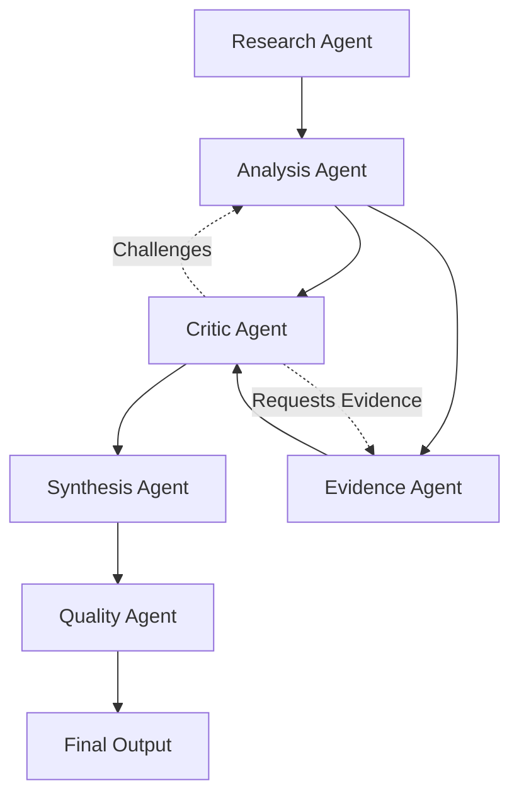

# Multi-Agent Debate

StratMaster employs a sophisticated multi-agent debate system where AI agents collaborate, challenge, and refine strategic insights through structured argumentation. This approach ensures higher quality, evidence-based outcomes through distributed reasoning.

## Core Principles

### Constitutional AI Framework
All agents operate under constitutional principles that guide their behavior:

- **Evidence-First**: All claims must be backed by verifiable sources
- **Balanced Perspective**: Actively seek contrarian viewpoints
- **Transparent Reasoning**: Make reasoning processes visible and auditable
- **Quality Gates**: Apply rigorous validation at each stage

### Collaborative Intelligence
Multiple specialized agents work together:



## Agent Roles and Responsibilities

### Research Agent
**Purpose**: Gather comprehensive information from multiple sources
**Capabilities**:
- Multi-source search and retrieval
- Source credibility assessment
- Information synthesis and summarization
- Bias detection and flagging

### Analysis Agent
**Purpose**: Process information into strategic insights
**Capabilities**:
- Pattern recognition across data sources
- Trend analysis and forecasting
- Competitive landscape mapping
- SWOT analysis and strategic framework application

### Critic Agent  
**Purpose**: Challenge assumptions and identify weaknesses
**Capabilities**:
- Devil's advocate reasoning
- Assumption questioning
- Alternative scenario generation
- Logical fallacy detection

### Evidence Agent
**Purpose**: Validate claims with supporting evidence
**Capabilities**:
- Fact-checking and verification
- Source quality assessment
- Evidence grading (using GRADE framework)
- Citation and provenance tracking

### Synthesis Agent
**Purpose**: Integrate insights into coherent strategy
**Capabilities**:
- Multi-perspective integration
- Conflict resolution between viewpoints
- Strategic narrative construction
- Action plan formulation

### Quality Agent
**Purpose**: Ensure output meets quality standards
**Capabilities**:
- Completeness checking
- Consistency validation
- Clarity assessment
- Actionability evaluation

## Debate Process Flow

### Stage 1: Information Gathering
1. **Research Agent** conducts comprehensive search
2. **Evidence Agent** validates source credibility
3. Initial information corpus is established

### Stage 2: Initial Analysis
1. **Analysis Agent** processes information into insights
2. **Critic Agent** identifies potential issues
3. **Evidence Agent** validates key claims

### Stage 3: Debate and Refinement
1. **Critic Agent** presents challenges and alternatives
2. **Analysis Agent** responds with counter-arguments
3. **Evidence Agent** provides supporting/refuting evidence
4. Iterative refinement continues until convergence

### Stage 4: Synthesis
1. **Synthesis Agent** integrates validated insights
2. **Quality Agent** performs final validation
3. Consensus recommendations are formulated

## Quality Assurance Mechanisms

### Evidence Grading
Using GRADE (Grading of Recommendations Assessment, Development and Evaluation):
- **High**: Multiple high-quality sources, consistent findings
- **Moderate**: Some limitations but generally reliable
- **Low**: Significant limitations, uncertain reliability  
- **Very Low**: Major concerns about reliability

### Validation Metrics
- **Factual Accuracy**: Percentage of claims supported by evidence
- **Source Diversity**: Number and variety of information sources
- **Perspective Balance**: Representation of different viewpoints
- **Logical Consistency**: Absence of contradictions and fallacies

### Consensus Mechanisms
- **Weighted Scoring**: Agent confidence levels influence final decisions
- **Evidence Thresholds**: Minimum evidence requirements for claims
- **Dissent Recording**: Minority opinions are preserved and noted
- **Uncertainty Quantification**: Confidence intervals for recommendations

## Implementation Architecture

### MCP Server Integration
Each agent type is implemented as a specialized MCP server:

```yaml
# configs/agents/debate-config.yaml
agents:
  research:
    server: "research-mcp"
    capabilities: ["search", "retrieval", "summarization"]
    constraints: ["evidence_required", "source_diversity_min=3"]
  
  analysis:
    server: "knowledge-mcp" 
    capabilities: ["reasoning", "pattern_recognition", "synthesis"]
    constraints: ["logic_validation", "bias_detection"]
    
  critic:
    server: "evals-mcp"
    capabilities: ["challenge_generation", "alternative_scenarios"]
    constraints: ["constructive_criticism", "evidence_based_challenges"]
```

### Workflow Orchestration
Temporal workflows coordinate the debate process:

```python
@workflow.defn
class MultiAgentDebateWorkflow:
    @workflow.run
    async def run(self, topic: str) -> StrategicInsight:
        # Stage 1: Research
        research_results = await workflow.execute_activity(
            research_activity, topic, schedule_to_close_timeout=timedelta(minutes=10)
        )
        
        # Stage 2: Analysis and Criticism
        analysis_task = workflow.execute_activity(analysis_activity, research_results)
        criticism_task = workflow.execute_activity(criticism_activity, research_results)
        
        # Stage 3: Debate iterations
        debate_rounds = 0
        while debate_rounds < 3 and not await self.consensus_reached():
            refined_analysis = await workflow.execute_activity(
                refine_analysis, analysis_results, criticism_results
            )
            debate_rounds += 1
        
        # Stage 4: Synthesis
        return await workflow.execute_activity(synthesis_activity, refined_analysis)
```

## Configuration and Tuning

### Debate Parameters
```yaml
# configs/debate/parameters.yaml
debate:
  max_rounds: 3
  consensus_threshold: 0.8
  evidence_requirements:
    minimum_sources: 3
    credibility_threshold: 0.7
  quality_gates:
    factual_accuracy_min: 0.85
    logical_consistency_min: 0.9
```

### Agent Personalities
Each agent can be configured with specific characteristics:

```yaml
# configs/agents/personalities.yaml  
personalities:
  critic_agent:
    skepticism_level: 0.8
    challenge_frequency: 0.6
    constructiveness: 0.9
  
  analysis_agent:
    creativity: 0.7
    risk_tolerance: 0.5
    detail_orientation: 0.8
```

## Monitoring and Observability  

### Debate Metrics
- **Convergence Time**: How quickly agents reach consensus
- **Evidence Quality**: Average GRADE scores across debates
- **Challenge Success Rate**: Percentage of critic challenges that improve outcomes
- **Agent Participation**: Balance of contributions across agent types

### Quality Tracking
```python
# Performance metrics tracked via OpenTelemetry
debate_metrics = {
    "convergence_time": Timer("debate.convergence.seconds"),
    "evidence_quality": Histogram("debate.evidence.grade_score"),
    "consensus_strength": Gauge("debate.consensus.strength"),
    "challenge_acceptance_rate": Counter("debate.challenges.accepted")
}
```

## Benefits and Outcomes

### Improved Decision Quality
- **Higher Evidence Standards**: Multi-agent validation improves fact-checking
- **Reduced Bias**: Multiple perspectives counter individual agent limitations
- **Better Risk Assessment**: Critic agent ensures thorough challenge of assumptions

### Transparency and Auditability
- **Decision Trails**: Complete record of debate process and reasoning
- **Evidence Provenance**: Full citation and source tracking
- **Confidence Metrics**: Quantified uncertainty for all recommendations

### Scalable Intelligence
- **Parallel Processing**: Multiple agents can work simultaneously
- **Specialized Expertise**: Each agent optimized for specific cognitive tasks
- **Continuous Learning**: System improves through feedback and iteration

## Future Enhancements

### Advanced Debate Mechanisms
- **Formal Logic Integration**: Structured argument validation
- **Adversarial Training**: Agents specifically trained to find flaws
- **Meta-Debate**: Agents that evaluate the debate process itself

### Human-AI Collaboration
- **Expert Integration**: Human experts can participate as additional agents
- **Stakeholder Input**: External perspectives can be incorporated systematically
- **Interactive Refinement**: Real-time human guidance during debate process

---

This multi-agent debate system represents a significant advancement in AI-powered strategic analysis, combining the strengths of specialized AI agents with robust quality assurance mechanisms to deliver more reliable, evidence-based strategic insights.