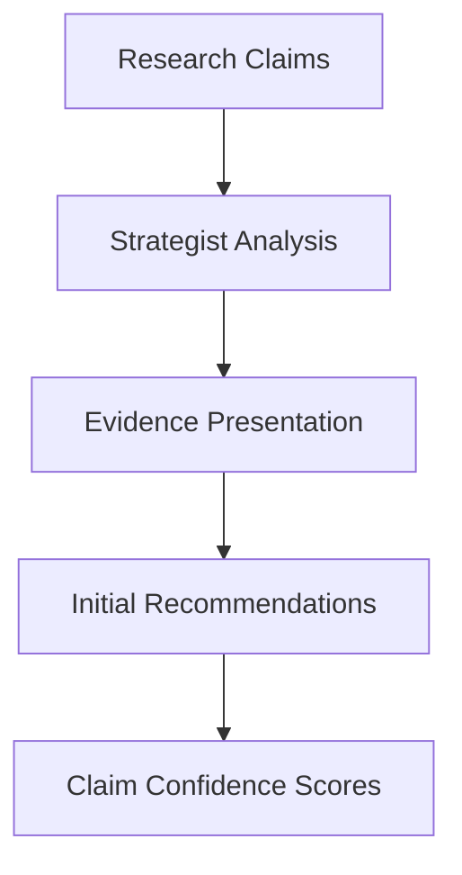
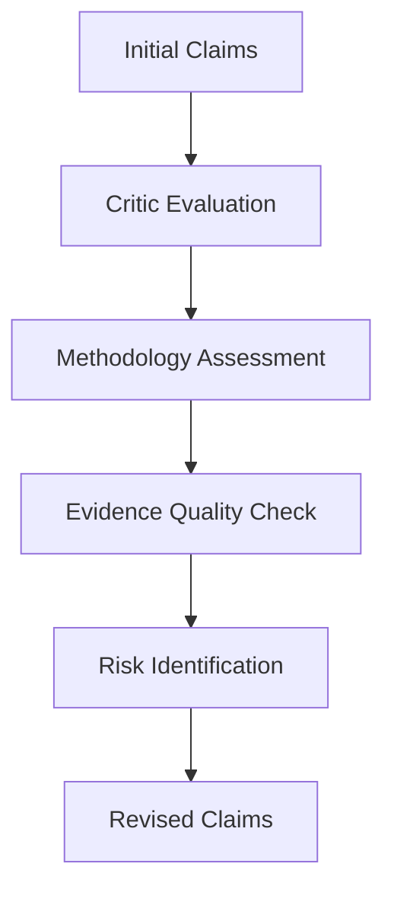
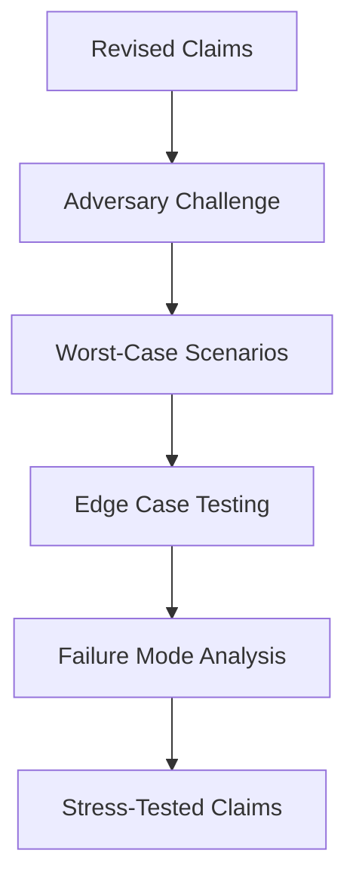
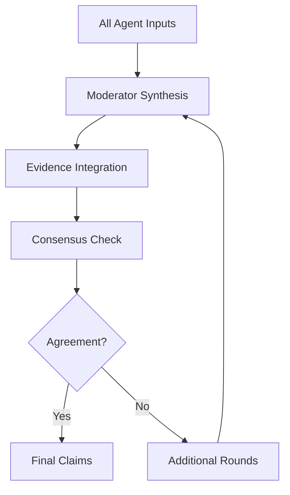

# Multi-Agent Debate System

StratMaster's multi-agent debate system is a core innovation that validates strategic claims through structured adversarial discussion. This system prevents single points of failure in AI reasoning and catches biases that individual models might miss.

## Why Multi-Agent Debate?

### The Problem with Single-Agent Analysis
Traditional AI systems rely on a single model to analyze complex strategic questions. This approach has several limitations:

- **Confirmation Bias**: Models tend to find evidence supporting initial hypotheses
- **Blind Spots**: Single perspectives miss important considerations
- **Overconfidence**: Individual models may express false certainty
- **Limited Perspectives**: No challenge to underlying assumptions

### The Multi-Agent Solution
Our debate system addresses these issues through:

- **Adversarial Validation**: Different agents actively challenge each other
- **Perspective Diversity**: Multiple viewpoints on the same evidence
- **Explicit Uncertainty**: Forced acknowledgment of limitations
- **Consensus Requirements**: Agreement across multiple agents

## Agent Architecture

### Core Agent Roles

#### 1. Strategist Agent
**Role**: Primary claim proposer and evidence presenter  
**Characteristics**:
- Solution-oriented thinking
- Evidence synthesis and presentation
- Strategic recommendation formulation
- Optimistic but grounded perspective

**Example Behavior**:
```
Strategist: "Based on three enterprise studies showing 25-40% cost reduction 
with AI customer support, I recommend proceeding with implementation. 
The Gartner 2024 study shows 32% average savings across 500 companies."
```

#### 2. Critic Agent  
**Role**: Methodological skeptic and quality enforcer  
**Characteristics**:
- Evidence quality assessment
- Methodological rigor enforcement
- Assumption challenging
- Risk identification

**Example Behavior**:
```
Critic: "The 25-40% cost reduction claim needs scrutiny. Are we accounting 
for implementation costs? The Gartner study sample may have selection bias 
toward successful deployments. We need failed implementation data."
```

#### 3. Adversary Agent
**Role**: Devil's advocate and stress tester  
**Characteristics**:
- Worst-case scenario exploration
- Edge case identification
- Contrarian perspective
- Failure mode analysis

**Example Behavior**:
```
Adversary: "What if the successful implementations had unique advantages? 
Consider the 2023 Chatbot Failures Report showing 40% abandonment rates. 
Our customer base may have different characteristics than the study samples."
```

#### 4. Moderator Agent
**Role**: Process management and consensus building  
**Characteristics**:
- Debate flow management
- Evidence integration
- Consensus facilitation
- Final synthesis

**Example Behavior**:
```
Moderator: "We have conflicting views on cost savings certainty. Let's 
establish: 1) Implementation costs must be included, 2) We need diverse 
study samples, 3) Risk mitigation plans are required. Revised claim: 
'Net cost reduction of 20-30% expected after 18 months with proper implementation.'"
```

## Debate Process Flow

### Phase 1: Initial Presentation


**Process**:
1. Strategist receives research findings
2. Synthesizes evidence into coherent claims
3. Assigns confidence scores
4. Presents initial strategic recommendations

### Phase 2: Critical Analysis


**Process**:
1. Critic examines evidence quality and methodology
2. Questions assumptions and data sources
3. Identifies potential biases and limitations
4. Proposes claim modifications or rejections

### Phase 3: Adversarial Testing


**Process**:
1. Adversary explores failure scenarios
2. Tests claims under extreme conditions
3. Identifies edge cases and exceptions
4. Challenges optimistic assumptions

### Phase 4: Consensus Building


**Process**:
1. Moderator integrates all perspectives
2. Identifies areas of agreement and disagreement
3. Facilitates consensus on key claims
4. Produces final validated recommendations

## Constitutional AI Integration

### Built-in Guardrails
Each agent operates under constitutional constraints:

```yaml
# Agent Constitution Example
agent_constraints:
  strategist:
    - "Always cite evidence for factual claims"
    - "Acknowledge uncertainty when data is limited"
    - "Consider implementation feasibility"
    
  critic:
    - "Challenge methodology, not just conclusions"
    - "Identify potential confounding variables"
    - "Require diverse evidence sources"
    
  adversary:
    - "Explore realistic failure scenarios"
    - "Question optimistic assumptions"
    - "Consider competitive responses"
```

### Safety Mechanisms
- **Harmful Content Prevention**: Block recommendations that could cause harm
- **Bias Detection**: Identify and flag potential systematic biases
- **Factual Accuracy**: Require evidence for all factual claims
- **Transparency**: Maintain clear reasoning trails

## Technical Implementation

### Agent Communication Protocol
```python
class DebateMessage:
    agent_id: str
    round_number: int
    message_type: str  # "claim", "challenge", "evidence", "synthesis"
    content: str
    confidence: float
    evidence_refs: List[str]
    challenges_raised: List[str]

class DebateRound:
    async def execute_round(self, claims: List[Claim]) -> DebateRound:
        # Strategist response
        strategist_msg = await self.strategist.evaluate(claims)
        
        # Critic challenge
        critic_msg = await self.critic.challenge(strategist_msg, claims)
        
        # Adversary stress test
        adversary_msg = await self.adversary.stress_test(
            strategist_msg, critic_msg, claims
        )
        
        # Moderator synthesis
        synthesis = await self.moderator.synthesize([
            strategist_msg, critic_msg, adversary_msg
        ])
        
        return DebateRound(
            messages=[strategist_msg, critic_msg, adversary_msg],
            synthesis=synthesis,
            updated_claims=synthesis.revised_claims
        )
```

### Consensus Mechanisms

#### Confidence Aggregation
```python
def aggregate_confidence(agent_scores: Dict[str, float]) -> float:
    """Aggregate confidence scores across agents using weighted average."""
    weights = {
        'strategist': 0.3,  # Optimistic bias correction
        'critic': 0.4,     # Higher weight for skeptical analysis
        'adversary': 0.2,  # Extreme scenarios weighted lower
        'moderator': 0.1   # Process management role
    }
    
    weighted_sum = sum(
        weights[agent] * score 
        for agent, score in agent_scores.items()
    )
    
    return min(weighted_sum, max(agent_scores.values()))  # Cap optimism
```

#### Claim Validation Rules
```python
class ClaimValidator:
    def validate_claim(self, claim: Claim, debate_history: DebateHistory) -> ValidationResult:
        rules = [
            self.check_evidence_quality(claim),
            self.check_consensus_level(claim, debate_history),
            self.check_constitutional_compliance(claim),
            self.check_uncertainty_acknowledgment(claim)
        ]
        
        return ValidationResult(
            passed=all(rule.passed for rule in rules),
            confidence=self.calculate_aggregate_confidence(rules),
            required_modifications=self.extract_modifications(rules)
        )
```

## Debate Quality Metrics

### Process Metrics
- **Rounds to Consensus**: Number of debate rounds required
- **Challenge Depth**: Number of distinct challenges raised
- **Evidence Diversity**: Variety of evidence sources considered
- **Perspective Coverage**: Breadth of viewpoints represented

### Outcome Metrics
- **Final Confidence**: Aggregate confidence in validated claims
- **Claim Survival Rate**: Percentage of initial claims surviving validation
- **Modification Frequency**: Rate of claim modifications vs. rejections
- **Constitutional Compliance**: Adherence to safety and accuracy principles

### Example Metrics Dashboard
```python
class DebateMetrics:
    def calculate_debate_quality(self, debate: CompletedDebate) -> QualityScore:
        return QualityScore(
            process_rigor=self.assess_process_rigor(debate),
            evidence_quality=self.assess_evidence_quality(debate),
            perspective_diversity=self.assess_perspective_diversity(debate),
            consensus_strength=self.assess_consensus_strength(debate),
            overall_score=self.calculate_weighted_average([
                process_rigor, evidence_quality, 
                perspective_diversity, consensus_strength
            ])
        )
```

## Real-World Example: AI Investment Decision

### Initial Claim (Strategist)
**Claim**: "Implementing AI customer support will reduce operational costs by 35% within 12 months"  
**Evidence**: Gartner study, Forrester report, vendor case studies  
**Confidence**: 0.85

### Critical Analysis (Critic)
**Challenges**:
- Implementation costs not included in ROI calculation
- Studies may have selection bias toward successful deployments
- Timeline assumptions appear optimistic given integration complexity

**Revised Claim**: "Net operational cost reduction of 25-30% expected within 18-24 months"  
**Confidence**: 0.72

### Adversarial Testing (Adversary)
**Stress Tests**:
- What if customer adoption is slower than expected?
- Consider competitive response and feature arms race
- Integration complexity may exceed estimates by 50%+

**Further Revision**: "Cost reduction of 20-25% likely within 24 months, with 18-month break-even"  
**Confidence**: 0.68

### Final Synthesis (Moderator)
**Consensus Position**:
- AI implementation recommended with phased approach
- Conservative cost savings estimates: 20-25% net reduction
- 24-month timeline with 18-month break-even target
- Risk mitigation plan required for integration challenges

**Final Confidence**: 0.70 (above decision threshold)

## Advantages of Multi-Agent Debate

### Improved Decision Quality
- **Reduced Bias**: Multiple perspectives counter individual biases
- **Better Risk Assessment**: Adversarial testing reveals hidden risks
- **Higher Accuracy**: Rigorous validation improves prediction quality
- **Explicit Uncertainty**: Clear confidence bounds on recommendations

### Organizational Benefits
- **Stakeholder Buy-in**: Transparent reasoning process builds trust
- **Risk Management**: Better understanding of potential failure modes
- **Learning Organization**: Debate transcripts capture reasoning for future reference
- **Accountability**: Clear audit trail of decision-making process

### Scalability Advantages
- **Parallel Processing**: Agents can operate concurrently
- **Specialized Expertise**: Each agent optimized for specific role
- **Consistent Quality**: Systematic process reduces human inconsistency
- **Continuous Improvement**: Agent performance can be measured and optimized

## Limitations and Considerations

### Current Limitations
- **Computational Overhead**: Multiple agent calls increase latency and cost
- **Coordination Complexity**: Managing multi-agent interactions is non-trivial
- **Model Dependence**: Quality limited by underlying language model capabilities
- **Prompt Engineering**: Requires careful design of agent personas and instructions

### Future Enhancements
- **Dynamic Agent Selection**: Choose agents based on question domain
- **Learning from Debates**: Improve agent performance based on historical outcomes
- **Human-in-the-Loop**: Allow human experts to participate in debates
- **Domain Specialization**: Develop agents with specific industry expertise

## Integration with Strategic Analysis

The multi-agent debate system integrates seamlessly with StratMaster's broader strategic analysis framework:

1. **Research Phase**: Agents receive evidence from Research MCP
2. **Debate Phase**: Multi-round validation of claims and assumptions  
3. **Expert Phase**: Domain experts evaluate debate outcomes
4. **Synthesis Phase**: Final recommendations incorporate all perspectives
5. **Evaluation Phase**: Quality gates assess overall decision quality

This creates a comprehensive validation pipeline that significantly improves strategic decision quality while maintaining transparency and auditability.

## Further Reading

- [Constitutional AI Framework](constitutional-ai.md) - Understanding AI safety constraints
- [Architecture Overview](architecture.md) - How debate fits into overall system
- [API Reference - Debate Endpoints](../reference/api/gateway.md#debate-system) - Technical implementation
- [Your First Strategy Analysis](../tutorials/first-analysis.md) - See debate in action

---

<div class="note">
<p><strong>🧠 Research Foundation:</strong> This multi-agent approach is inspired by recent research in AI alignment, constitutional AI, and adversarial training. The system combines established debate methodologies with modern language model capabilities.</p>
</div>