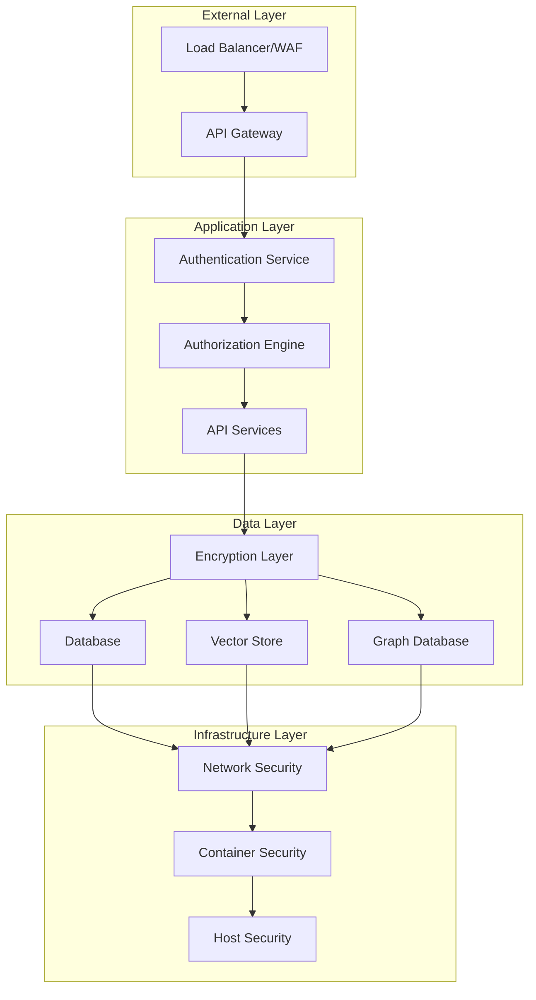

# Security Model

StratMaster implements a comprehensive security architecture designed for enterprise environments with strict requirements for data protection, access control, and regulatory compliance. The security model follows zero-trust principles and defense-in-depth strategies.

## Security Architecture Overview



## Core Security Principles

### Zero Trust Architecture
- **Never Trust, Always Verify**: All requests are authenticated and authorized
- **Least Privilege Access**: Minimum necessary permissions for each component
- **Micro-segmentation**: Network isolation between services and tenants
- **Continuous Verification**: Real-time monitoring and validation

### Defense in Depth
Multiple overlapping security layers:
1. **Perimeter Security**: WAF, DDoS protection, API rate limiting
2. **Identity and Access**: Strong authentication, fine-grained authorization
3. **Application Security**: Input validation, output encoding, secure coding practices
4. **Data Security**: Encryption at rest and in transit, key management
5. **Infrastructure Security**: Container hardening, network policies, monitoring

## Identity and Access Management

### Authentication Methods
```yaml
# configs/auth/providers.yaml
authentication:
  providers:
    - type: "oauth2"
      provider: "keycloak" 
      scopes: ["openid", "profile", "email", "roles"]
      
    - type: "api_key"
      validation: "hmac_sha256"
      rotation_period: "90d"
      
    - type: "mTLS"
      ca_bundle: "/etc/certs/ca-bundle.pem"
      client_verification: "required"
```

### Authorization Framework
Role-Based Access Control (RBAC) with Attribute-Based refinements:

```python
# Authorization policy example
class AuthorizationPolicy:
    def __init__(self):
        self.roles = {
            "tenant_admin": {
                "resources": ["*"],
                "actions": ["*"], 
                "conditions": ["same_tenant"]
            },
            "strategist": {
                "resources": ["strategies", "analyses", "reports"],
                "actions": ["create", "read", "update"],
                "conditions": ["same_tenant", "assigned_projects"]
            },
            "viewer": {
                "resources": ["strategies", "reports"],
                "actions": ["read"],
                "conditions": ["same_tenant", "public_or_assigned"]
            }
        }
```

### Multi-Tenant Isolation
Strict tenant separation across all system layers:

```yaml
# configs/multi-tenant/isolation.yaml
isolation:
  database:
    strategy: "schema_per_tenant"
    encryption_keys: "tenant_specific"
    
  search:
    strategy: "index_per_tenant"
    access_filters: "tenant_id_required"
    
  storage:
    strategy: "bucket_per_tenant"
    encryption: "customer_managed_keys"
```

## Data Protection

### Encryption Standards
- **At Rest**: AES-256-GCM with customer-managed keys (CMK)
- **In Transit**: TLS 1.3 for all communications
- **In Processing**: Homomorphic encryption for sensitive computations

### Key Management
```yaml
# configs/encryption/key-management.yaml
key_management:
  provider: "hashicorp_vault"
  rotation_policy: "30d"
  backup_strategy: "multi_region"
  access_logging: "all_operations"
  
  keys:
    database_encryption: "aes_256_gcm"
    api_tokens: "hmac_sha256"
    search_encryption: "aes_256_gcm"
```

### Data Classification and Handling
```python
class DataClassification:
    CLASSIFICATIONS = {
        "public": {
            "encryption_required": False,
            "access_logging": "minimal",
            "retention_period": "indefinite"
        },
        "internal": {
            "encryption_required": True,
            "access_logging": "standard", 
            "retention_period": "7_years"
        },
        "confidential": {
            "encryption_required": True,
            "access_logging": "detailed",
            "retention_period": "5_years",
            "access_restrictions": ["role_based", "need_to_know"]
        },
        "restricted": {
            "encryption_required": True,
            "access_logging": "complete",
            "retention_period": "3_years", 
            "access_restrictions": ["explicit_approval", "audit_trail"]
        }
    }
```

## Application Security

### Input Validation and Sanitization
```python
# Comprehensive input validation
from pydantic import BaseModel, validator, Field
from typing import List, Optional
import re

class SecureInputModel(BaseModel):
    """Base model with security validations."""
    
    @validator('*', pre=True)
    def sanitize_input(cls, v):
        if isinstance(v, str):
            # Remove potentially dangerous characters
            v = re.sub(r'[<>"\';\\]', '', v)
            # Limit length to prevent DoS
            if len(v) > 10000:
                raise ValueError("Input too long")
        return v
    
    class Config:
        # Prevent model updates that could bypass validation
        allow_mutation = False
        # Ensure all fields are validated
        validate_all = True
```

### API Security
```yaml
# configs/api/security.yaml
api_security:
  rate_limiting:
    default: "1000/hour"
    authenticated: "10000/hour" 
    premium: "50000/hour"
    
  cors:
    allowed_origins: ["https://*.stratmaster.ai"]
    allowed_methods: ["GET", "POST", "PUT", "DELETE"]
    allowed_headers: ["Authorization", "Content-Type", "X-Tenant-ID"]
    
  request_validation:
    max_size: "10MB"
    timeout: "30s"
    content_types: ["application/json", "multipart/form-data"]
```

### Content Security Policy
```http
Content-Security-Policy: 
    default-src 'self';
    script-src 'self' 'unsafe-inline' 'unsafe-eval' https://cdn.jsdelivr.net;
    style-src 'self' 'unsafe-inline' https://fonts.googleapis.com;
    font-src 'self' https://fonts.gstatic.com;
    img-src 'self' data: https:;
    connect-src 'self' wss: https:;
    frame-ancestors 'none';
    base-uri 'self';
    form-action 'self'
```

## Infrastructure Security

### Container Security
```dockerfile
# Security-hardened container example
FROM python:3.13-slim-bookworm

# Create non-root user
RUN groupadd -r mcp && useradd -r -g mcp mcp

# Install security updates only
RUN apt-get update && \
    apt-get upgrade -y && \
    apt-get clean && \
    rm -rf /var/lib/apt/lists/*

# Set secure file permissions
COPY --chown=mcp:mcp --chmod=544 . /app
WORKDIR /app

# Drop privileges
USER mcp

# Health check
HEALTHCHECK --interval=30s --timeout=3s --retries=3 \
    CMD curl -f http://localhost:8080/healthz || exit 1

# Security-focused entry point
ENTRYPOINT ["python", "-m", "stratmaster_api"]
```

### Network Security
```yaml
# Kubernetes NetworkPolicy example
apiVersion: networking.k8s.io/v1
kind: NetworkPolicy
metadata:
  name: stratmaster-network-policy
spec:
  podSelector:
    matchLabels:
      app: stratmaster
  policyTypes:
  - Ingress
  - Egress
  ingress:
  - from:
    - podSelector:
        matchLabels:
          app: api-gateway
    ports:
    - protocol: TCP
      port: 8080
  egress:
  - to:
    - podSelector:
        matchLabels:
          app: postgres
    ports:
    - protocol: TCP
      port: 5432
```

## Monitoring and Incident Response

### Security Monitoring
```python
# Security event logging
import logging
from opentelemetry import trace

security_logger = logging.getLogger("security")
tracer = trace.get_tracer(__name__)

class SecurityEventLogger:
    def log_authentication_attempt(self, user_id: str, success: bool, 
                                 ip_address: str, user_agent: str):
        with tracer.start_as_current_span("auth_attempt") as span:
            span.set_attributes({
                "user_id": user_id,
                "success": success,
                "ip_address": ip_address,
                "user_agent": user_agent
            })
            
            security_logger.info({
                "event_type": "authentication_attempt",
                "user_id": user_id,
                "success": success,
                "ip_address": ip_address,
                "timestamp": datetime.utcnow().isoformat(),
                "risk_score": self.calculate_risk_score(ip_address, user_agent)
            })
```

### Incident Response Plan
1. **Detection**: Automated monitoring and alerting
2. **Assessment**: Risk evaluation and impact analysis  
3. **Containment**: Immediate threat mitigation
4. **Investigation**: Forensic analysis and root cause identification
5. **Recovery**: Service restoration and validation
6. **Lessons Learned**: Process improvement and prevention

### Security Metrics
```yaml
# configs/monitoring/security-metrics.yaml
security_metrics:
  authentication:
    - failed_login_attempts_per_minute
    - unusual_login_locations
    - concurrent_session_anomalies
    
  authorization:
    - privilege_escalation_attempts
    - unauthorized_resource_access
    - suspicious_permission_changes
    
  data_access:
    - bulk_data_downloads
    - after_hours_access_patterns
    - cross_tenant_access_attempts
```

## Compliance and Auditing

### Regulatory Compliance
Supporting multiple compliance frameworks:

- **GDPR**: Data protection and privacy rights
- **SOC 2 Type II**: Security, availability, processing integrity
- **ISO 27001**: Information security management
- **HIPAA**: Healthcare data protection (when applicable)

### Audit Logging
```python
class AuditLogger:
    def __init__(self):
        self.logger = logging.getLogger("audit")
        
    def log_data_access(self, user_id: str, resource_type: str, 
                       resource_id: str, action: str, result: str):
        audit_entry = {
            "timestamp": datetime.utcnow().isoformat(),
            "user_id": user_id,
            "resource_type": resource_type,
            "resource_id": resource_id,
            "action": action,
            "result": result,
            "ip_address": self.get_client_ip(),
            "session_id": self.get_session_id(),
            "tenant_id": self.get_tenant_id()
        }
        
        self.logger.info(audit_entry)
        # Also send to long-term audit storage
        self.send_to_audit_store(audit_entry)
```

## Threat Modeling

### STRIDE Analysis
Systematic threat identification across all components:

- **Spoofing**: Identity verification and authentication
- **Tampering**: Data integrity and validation  
- **Repudiation**: Audit logging and non-repudiation
- **Information Disclosure**: Access controls and encryption
- **Denial of Service**: Rate limiting and resource protection
- **Elevation of Privilege**: Authorization and least privilege

### Attack Surface Management
Regular assessment of potential attack vectors:

```yaml
# configs/security/attack-surface.yaml
attack_surface:
  external_endpoints:
    - path: "/api/v1/*"
      protection: ["authentication", "authorization", "rate_limiting"]
      monitoring: ["access_patterns", "error_rates", "response_times"]
      
  internal_services:
    - service: "database"
      protection: ["network_isolation", "encryption", "access_controls"] 
      monitoring: ["query_patterns", "connection_counts", "error_logs"]
```

## Security Configuration

### Environment-Specific Settings
```yaml
# configs/security/production.yaml
production:
  tls:
    min_version: "1.3"
    cipher_suites: ["TLS_AES_256_GCM_SHA384", "TLS_CHACHA20_POLY1305_SHA256"]
    
  headers:
    strict_transport_security: "max-age=31536000; includeSubDomains"
    x_frame_options: "DENY"
    x_content_type_options: "nosniff"
    referrer_policy: "strict-origin-when-cross-origin"
    
  session:
    secure: true
    http_only: true
    same_site: "strict"
    timeout: "1h"
```

### Development Security
Even development environments maintain security standards:

```yaml
# configs/security/development.yaml
development:
  # Relaxed but still secure settings
  tls:
    enabled: true
    self_signed_certs: true
    
  authentication:
    required: true
    test_users_allowed: true
    
  monitoring:
    log_level: "debug"
    audit_enabled: true
```

## Security Best Practices

### Secure Development Lifecycle
1. **Threat Modeling**: Early identification of security requirements
2. **Secure Coding**: Following OWASP guidelines and security standards
3. **Security Testing**: SAST, DAST, and penetration testing
4. **Security Review**: Code and architecture security assessments
5. **Deployment Security**: Secure configuration and hardening

### Operational Security  
1. **Regular Updates**: Timely security patches and updates
2. **Access Reviews**: Periodic review and cleanup of access rights
3. **Security Training**: Ongoing education for development and operations teams
4. **Incident Drills**: Regular testing of incident response procedures
5. **Vulnerability Management**: Proactive identification and remediation

---

This security model provides comprehensive protection while maintaining usability and performance. It evolves continuously based on emerging threats, regulatory requirements, and industry best practices.