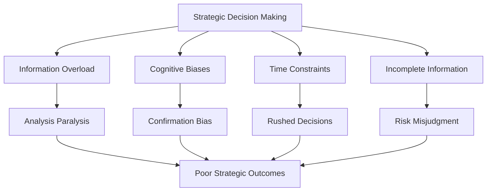
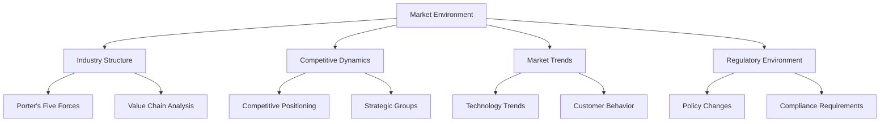
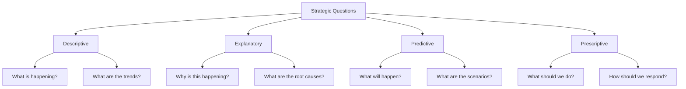
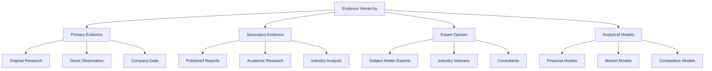
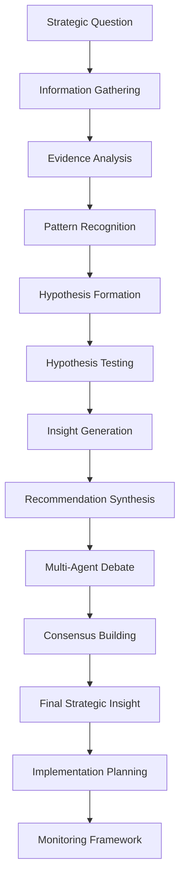
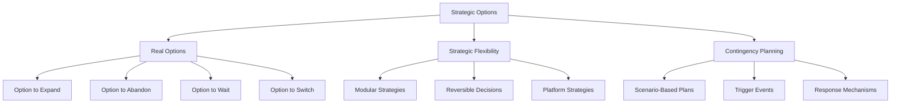
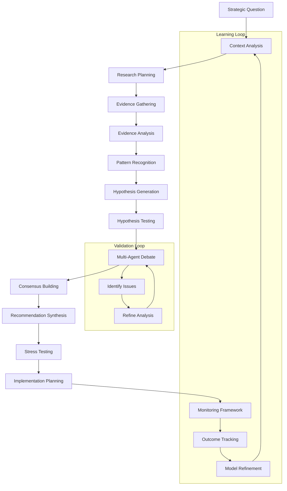

# Strategic Modeling Framework

StratMaster employs a sophisticated strategic modeling framework that combines traditional strategic analysis methodologies with modern AI-powered research and validation techniques. This document explains the conceptual foundations and practical implementation of strategic modeling within StratMaster.

## Conceptual Foundation

### The Strategic Analysis Problem

Traditional strategic analysis faces several fundamental challenges:



StratMaster addresses these challenges through:

1. **Systematic Information Gathering**: Automated research and evidence collection
2. **Bias Mitigation**: Multi-agent debate and adversarial validation
3. **Structured Analysis**: Formal modeling frameworks and methodologies
4. **Evidence-Based Reasoning**: Transparent reasoning chains with evidence citations
5. **Continuous Validation**: Ongoing monitoring and strategy adjustment

## Framework Components

### 1. Strategic Context Modeling

Strategic context provides the foundation for all analysis by establishing:

#### Market Environment Model



**Implementation in StratMaster:**
- Automated industry research and competitor analysis
- Real-time trend monitoring and analysis
- Regulatory change tracking and impact assessment
- Dynamic competitive landscape mapping

#### Organizational Context Model

```python
# Strategic context data structure
@dataclass
class StrategicContext:
    organization: OrganizationProfile
    market_environment: MarketEnvironment
    competitive_landscape: CompetitiveLandscape
    internal_capabilities: CapabilityAssessment
    stakeholder_interests: StakeholderMap
    time_horizon: TimeHorizon
    
    def validate_consistency(self) -> List[ValidationIssue]:
        """Validate internal consistency of context model"""
        pass
    
    def identify_key_uncertainties(self) -> List[Uncertainty]:
        """Identify critical uncertainties affecting strategy"""
        pass
```

### 2. Strategic Questions Framework

StratMaster structures strategic analysis around different types of strategic questions:

#### Question Taxonomy



**Question Types and Analysis Approaches:**

| Question Type | Focus | Analysis Methods | Evidence Requirements |
|---------------|-------|------------------|----------------------|
| Descriptive | Current state | Market research, competitive analysis | High-quality current data |
| Explanatory | Causal relationships | Root cause analysis, system thinking | Historical data, correlations |
| Predictive | Future scenarios | Forecasting, scenario planning | Trend data, leading indicators |
| Prescriptive | Action recommendations | Decision analysis, option evaluation | Cost-benefit analysis, risk assessment |

#### Question Decomposition Process

```python
class StrategicQuestion:
    def __init__(self, question_text: str):
        self.question_text = question_text
        self.question_type = self._classify_question()
        self.sub_questions = self._decompose_question()
        self.research_requirements = self._define_research_needs()
    
    def _classify_question(self) -> QuestionType:
        """Classify question using NLP and pattern matching"""
        patterns = {
            QuestionType.DESCRIPTIVE: [r"what is", r"current state", r"status"],
            QuestionType.EXPLANATORY: [r"why", r"how does", r"what causes"],
            QuestionType.PREDICTIVE: [r"what will", r"future", r"forecast"],
            QuestionType.PRESCRIPTIVE: [r"should we", r"recommended", r"action"]
        }
        # Implementation details...
    
    def _decompose_question(self) -> List['StrategicQuestion']:
        """Break complex questions into manageable components"""
        # Use dependency parsing and domain knowledge
        # to identify sub-questions and their relationships
        pass
```

### 3. Research and Evidence Framework

#### Evidence Types and Hierarchy



#### Evidence Quality Assessment

```python
@dataclass
class EvidenceQualityMetrics:
    credibility: float  # 0.0 - 1.0
    relevance: float    # 0.0 - 1.0
    recency: float      # 0.0 - 1.0
    completeness: float # 0.0 - 1.0
    consistency: float  # 0.0 - 1.0
    
    @property
    def overall_quality(self) -> float:
        """Weighted composite quality score"""
        weights = {
            'credibility': 0.3,
            'relevance': 0.25,
            'recency': 0.2,
            'completeness': 0.15,
            'consistency': 0.1
        }
        return sum(getattr(self, metric) * weight 
                  for metric, weight in weights.items())

class EvidenceEvaluator:
    def evaluate_source_credibility(self, source: EvidenceSource) -> float:
        """Evaluate source credibility based on multiple factors"""
        factors = {
            'author_expertise': self._assess_author_expertise(source),
            'publication_reputation': self._assess_publication_quality(source),
            'peer_review_status': self._check_peer_review(source),
            'citation_count': self._assess_citations(source),
            'institutional_affiliation': self._assess_institution(source)
        }
        return self._weighted_average(factors)
```

### 4. Strategic Reasoning Framework

#### Reasoning Chain Structure

Strategic reasoning in StratMaster follows a structured chain:



#### Reasoning Methods

**1. Structured Analytical Techniques (SATs)**

```python
class StructuredAnalysisTechniques:
    
    def devils_advocacy(self, hypothesis: Hypothesis) -> List[CounterArgument]:
        """Challenge assumptions and explore alternative explanations"""
        counter_args = []
        
        # Challenge each assumption
        for assumption in hypothesis.assumptions:
            counter_args.extend(
                self._generate_counter_arguments(assumption)
            )
        
        # Explore alternative explanations
        alternatives = self._generate_alternative_hypotheses(hypothesis)
        for alt in alternatives:
            counter_args.append(
                CounterArgument(
                    type="alternative_explanation",
                    content=alt.explanation,
                    evidence=alt.supporting_evidence
                )
            )
        
        return counter_args
    
    def scenario_analysis(self, question: StrategicQuestion) -> List[Scenario]:
        """Generate and analyze multiple future scenarios"""
        # Identify key uncertainties
        uncertainties = self._identify_key_uncertainties(question)
        
        # Generate scenario matrix
        scenarios = self._generate_scenario_combinations(uncertainties)
        
        # Develop scenario narratives
        for scenario in scenarios:
            scenario.narrative = self._develop_scenario_narrative(scenario)
            scenario.probability = self._assess_scenario_probability(scenario)
            scenario.impact = self._assess_scenario_impact(scenario)
        
        return scenarios
    
    def morphological_analysis(self, problem: StrategicProblem) -> List[Solution]:
        """Systematic exploration of solution space"""
        # Decompose problem into dimensions
        dimensions = self._identify_problem_dimensions(problem)
        
        # Identify options for each dimension
        for dimension in dimensions:
            dimension.options = self._identify_dimension_options(dimension)
        
        # Generate configuration combinations
        configurations = self._generate_configurations(dimensions)
        
        # Evaluate feasibility and attractiveness
        solutions = []
        for config in configurations:
            if self._is_feasible(config):
                solution = Solution(
                    configuration=config,
                    attractiveness=self._assess_attractiveness(config),
                    risks=self._identify_risks(config)
                )
                solutions.append(solution)
        
        return sorted(solutions, key=lambda s: s.attractiveness, reverse=True)
```

**2. Systems Thinking Approach**

```python
class SystemsThinkingFramework:
    
    def identify_system_structure(self, context: StrategicContext) -> SystemModel:
        """Map system elements, relationships, and feedback loops"""
        system = SystemModel()
        
        # Identify key system elements
        system.elements = self._identify_system_elements(context)
        
        # Map relationships between elements
        system.relationships = self._map_element_relationships(system.elements)
        
        # Identify feedback loops
        system.feedback_loops = self._identify_feedback_loops(system.relationships)
        
        # Identify leverage points
        system.leverage_points = self._identify_leverage_points(system)
        
        return system
    
    def analyze_system_behavior(self, system: SystemModel) -> SystemBehaviorAnalysis:
        """Analyze how system behavior emerges from structure"""
        analysis = SystemBehaviorAnalysis()
        
        # Identify system archetypes
        analysis.archetypes = self._identify_system_archetypes(system)
        
        # Analyze delay patterns
        analysis.delays = self._analyze_system_delays(system)
        
        # Identify unintended consequences
        analysis.unintended_consequences = self._identify_unintended_consequences(system)
        
        return analysis
```

### 5. Decision Framework

#### Multi-Criteria Decision Analysis

```python
class StrategicDecisionFramework:
    
    def structure_decision(self, problem: DecisionProblem) -> DecisionStructure:
        """Structure strategic decision for systematic analysis"""
        structure = DecisionStructure()
        
        # Define decision alternatives
        structure.alternatives = self._generate_alternatives(problem)
        
        # Identify evaluation criteria
        structure.criteria = self._identify_evaluation_criteria(problem)
        
        # Establish criteria weights
        structure.weights = self._elicit_criteria_weights(structure.criteria)
        
        # Define measurement scales
        structure.scales = self._define_measurement_scales(structure.criteria)
        
        return structure
    
    def evaluate_alternatives(
        self, 
        structure: DecisionStructure,
        evidence: List[Evidence]
    ) -> DecisionEvaluation:
        """Evaluate alternatives using multiple methods"""
        
        evaluation = DecisionEvaluation()
        
        # Score alternatives on each criterion
        scores = self._score_alternatives(structure, evidence)
        
        # Apply different evaluation methods
        evaluation.methods = {
            'weighted_sum': self._weighted_sum_method(scores, structure.weights),
            'topsis': self._topsis_method(scores, structure.weights),
            'ahp': self._ahp_method(structure, scores),
            'promethee': self._promethee_method(scores, structure.weights)
        }
        
        # Sensitivity analysis
        evaluation.sensitivity = self._sensitivity_analysis(structure, scores)
        
        # Robustness testing
        evaluation.robustness = self._robustness_analysis(evaluation.methods)
        
        return evaluation
```

#### Strategic Options Framework



### 6. Validation and Testing Framework

#### Multi-Agent Debate System

The multi-agent debate system serves as a critical validation mechanism:

```python
class StrategicValidationFramework:
    
    def design_validation_process(
        self, 
        analysis: StrategicAnalysis
    ) -> ValidationProcess:
        """Design appropriate validation process for strategic analysis"""
        
        process = ValidationProcess()
        
        # Determine validation scope
        process.scope = self._determine_validation_scope(analysis)
        
        # Select validation methods
        process.methods = self._select_validation_methods(analysis, process.scope)
        
        # Configure debate parameters
        if ValidationMethod.MULTI_AGENT_DEBATE in process.methods:
            process.debate_config = self._configure_debate(analysis)
        
        # Define success criteria
        process.success_criteria = self._define_success_criteria(analysis)
        
        return process
    
    def _configure_debate(self, analysis: StrategicAnalysis) -> DebateConfiguration:
        """Configure multi-agent debate based on analysis characteristics"""
        
        config = DebateConfiguration()
        
        # Select appropriate agent roles
        if analysis.type == AnalysisType.COMPETITIVE_ANALYSIS:
            config.agents = [
                AgentRole.MARKET_ANALYST,
                AgentRole.COMPETITIVE_INTELLIGENCE,
                AgentRole.INDUSTRY_EXPERT,
                AgentRole.STRATEGIC_CRITIC
            ]
        elif analysis.type == AnalysisType.MARKET_ENTRY:
            config.agents = [
                AgentRole.GROWTH_STRATEGIST,
                AgentRole.RISK_ANALYST,
                AgentRole.FINANCIAL_ANALYST,
                AgentRole.OPERATIONS_EXPERT
            ]
        
        # Set debate parameters based on complexity
        config.max_rounds = min(5, max(3, len(analysis.key_claims)))
        config.consensus_threshold = 0.8 if analysis.risk_level == "high" else 0.7
        
        # Configure constitutional constraints
        config.constitutional_constraints = self._get_constitutional_constraints(analysis)
        
        return config
```

#### Stress Testing Strategic Recommendations

```python
class StrategicStressTesting:
    
    def stress_test_recommendation(
        self, 
        recommendation: StrategicRecommendation
    ) -> StressTestResults:
        """Subject strategic recommendations to various stress scenarios"""
        
        results = StressTestResults()
        
        # Environmental stress tests
        results.environmental_tests = self._environmental_stress_tests(recommendation)
        
        # Assumption stress tests  
        results.assumption_tests = self._assumption_stress_tests(recommendation)
        
        # Resource constraint tests
        results.resource_tests = self._resource_constraint_tests(recommendation)
        
        # Competitive response tests
        results.competitive_tests = self._competitive_response_tests(recommendation)
        
        # Implementation challenge tests
        results.implementation_tests = self._implementation_stress_tests(recommendation)
        
        # Overall resilience assessment
        results.resilience_score = self._calculate_resilience_score(results)
        
        return results
    
    def _environmental_stress_tests(
        self, 
        recommendation: StrategicRecommendation
    ) -> List[StressTestResult]:
        """Test recommendation under various environmental conditions"""
        
        stress_scenarios = [
            EnvironmentalScenario.ECONOMIC_DOWNTURN,
            EnvironmentalScenario.REGULATORY_CHANGE,
            EnvironmentalScenario.TECHNOLOGY_DISRUPTION,
            EnvironmentalScenario.SUPPLY_CHAIN_DISRUPTION,
            EnvironmentalScenario.COMPETITIVE_DISRUPTION
        ]
        
        test_results = []
        for scenario in stress_scenarios:
            result = self._test_under_scenario(recommendation, scenario)
            test_results.append(result)
        
        return test_results
```

## Implementation Architecture

### Strategic Modeling Pipeline



### Integration with StratMaster Services

```python
class StrategicModelingOrchestrator:
    def __init__(self):
        self.research_service = ResearchMCPClient()
        self.knowledge_service = KnowledgeMCPClient()
        self.debate_service = DebateService()
        self.evaluation_service = EvaluationService()
    
    async def execute_strategic_analysis(
        self,
        question: StrategicQuestion,
        context: StrategicContext
    ) -> StrategicAnalysisResult:
        """Execute complete strategic analysis pipeline"""
        
        # Phase 1: Research and Evidence Gathering
        research_plan = self._create_research_plan(question, context)
        evidence = await self._gather_evidence(research_plan)
        
        # Phase 2: Analysis and Synthesis
        patterns = await self._identify_patterns(evidence, question)
        insights = await self._generate_insights(patterns, context)
        
        # Phase 3: Validation through Multi-Agent Debate
        claims = self._extract_claims(insights)
        debate_result = await self.debate_service.validate_claims(
            claims=claims,
            context=context,
            debate_config=self._configure_debate(question, claims)
        )
        
        # Phase 4: Recommendation Synthesis
        recommendations = self._synthesize_recommendations(
            validated_insights=debate_result.validated_claims,
            context=context
        )
        
        # Phase 5: Stress Testing and Validation
        stress_results = await self._stress_test_recommendations(recommendations)
        
        return StrategicAnalysisResult(
            question=question,
            context=context,
            evidence=evidence,
            insights=insights,
            debate_result=debate_result,
            recommendations=recommendations,
            stress_test_results=stress_results,
            confidence_score=self._calculate_confidence(debate_result, stress_results)
        )
```

## Strategic Modeling Patterns

### Pattern 1: Competitive Analysis

```python
class CompetitiveAnalysisPattern(StrategicModelingPattern):
    """Specialized pattern for competitive analysis"""
    
    def configure_research(self, question: StrategicQuestion) -> ResearchConfiguration:
        return ResearchConfiguration(
            focus_areas=[
                "competitor_capabilities",
                "market_positioning", 
                "competitive_moves",
                "financial_performance",
                "strategic_direction"
            ],
            information_sources=[
                "company_websites",
                "annual_reports",
                "industry_reports",
                "news_articles",
                "patent_filings",
                "job_postings"
            ],
            analysis_frameworks=[
                "porters_five_forces",
                "strategic_group_mapping",
                "competitive_positioning",
                "swot_analysis"
            ]
        )
    
    def configure_debate(self, claims: List[Claim]) -> DebateConfiguration:
        return DebateConfiguration(
            agents=[
                AgentRole.COMPETITIVE_INTELLIGENCE,
                AgentRole.MARKET_ANALYST,
                AgentRole.INDUSTRY_EXPERT,
                AgentRole.STRATEGIC_CRITIC
            ],
            focus_areas=[
                "data_quality",
                "competitive_response_likelihood",
                "strategic_implications",
                "risk_assessment"
            ],
            validation_criteria=[
                "evidence_credibility",
                "logical_consistency",
                "completeness",
                "actionability"
            ]
        )
```

### Pattern 2: Market Entry Analysis

```python
class MarketEntryAnalysisPattern(StrategicModelingPattern):
    """Specialized pattern for market entry decisions"""
    
    def configure_research(self, question: StrategicQuestion) -> ResearchConfiguration:
        return ResearchConfiguration(
            focus_areas=[
                "market_size_growth",
                "customer_segments",
                "distribution_channels",
                "regulatory_requirements",
                "competitive_landscape",
                "entry_barriers"
            ],
            analysis_frameworks=[
                "market_attractiveness",
                "competitive_intensity",
                "entry_mode_analysis",
                "risk_assessment",
                "financial_projections"
            ]
        )
    
    def configure_debate(self, claims: List[Claim]) -> DebateConfiguration:
        return DebateConfiguration(
            agents=[
                AgentRole.GROWTH_STRATEGIST,
                AgentRole.MARKET_RESEARCHER,
                AgentRole.RISK_ANALYST,
                AgentRole.FINANCIAL_ANALYST,
                AgentRole.OPERATIONS_EXPERT
            ],
            focus_areas=[
                "market_opportunity_validation",
                "entry_strategy_feasibility", 
                "resource_requirements",
                "risk_mitigation",
                "success_probability"
            ]
        )
```

## Quality Assurance Framework

### Strategic Analysis Quality Metrics

```python
class StrategicAnalysisQualityAssessment:
    
    def assess_analysis_quality(
        self, 
        analysis: StrategicAnalysisResult
    ) -> QualityAssessment:
        """Comprehensive quality assessment of strategic analysis"""
        
        assessment = QualityAssessment()
        
        # Evidence quality assessment
        assessment.evidence_quality = self._assess_evidence_quality(analysis.evidence)
        
        # Reasoning quality assessment
        assessment.reasoning_quality = self._assess_reasoning_quality(analysis)
        
        # Validation thoroughness
        assessment.validation_quality = self._assess_validation_quality(
            analysis.debate_result
        )
        
        # Recommendation quality
        assessment.recommendation_quality = self._assess_recommendation_quality(
            analysis.recommendations
        )
        
        # Overall coherence
        assessment.coherence_score = self._assess_overall_coherence(analysis)
        
        return assessment
    
    def _assess_evidence_quality(self, evidence: List[Evidence]) -> EvidenceQualityScore:
        """Assess quality of evidence base"""
        
        scores = EvidenceQualityScore()
        
        # Source diversity
        sources = {e.source for e in evidence}
        scores.source_diversity = min(1.0, len(sources) / 10)  # Target: 10+ sources
        
        # Recency distribution
        recent_evidence = [e for e in evidence if e.is_recent()]
        scores.recency = len(recent_evidence) / len(evidence)
        
        # Credibility distribution
        high_credibility = [e for e in evidence if e.credibility_score >= 0.8]
        scores.credibility = len(high_credibility) / len(evidence)
        
        # Evidence convergence
        scores.convergence = self._assess_evidence_convergence(evidence)
        
        return scores
```

## Best Practices and Guidelines

### Strategic Question Formulation

1. **Clarity and Specificity**: Questions should be clear, specific, and actionable
2. **Appropriate Scope**: Neither too broad nor too narrow for available resources
3. **Strategic Relevance**: Directly related to important strategic decisions
4. **Answerable**: Can be addressed with available information and analysis methods

### Evidence Standards

1. **Source Credibility**: Prioritize authoritative and expert sources
2. **Information Recency**: Emphasize recent information for dynamic situations
3. **Source Diversity**: Include multiple perspectives and viewpoint types
4. **Evidence Triangulation**: Corroborate key findings through multiple sources

### Analysis Rigor

1. **Systematic Approach**: Follow structured analytical processes
2. **Assumption Transparency**: Make assumptions explicit and test them
3. **Alternative Consideration**: Explore alternative explanations and scenarios
4. **Limitation Recognition**: Acknowledge analysis limitations and uncertainties

### Validation Thoroughness

1. **Multi-Perspective Review**: Include diverse viewpoints in validation
2. **Challenge Assumptions**: Actively challenge key assumptions and conclusions
3. **Stress Testing**: Test recommendations under adverse conditions
4. **Peer Review**: Involve independent experts in critical reviews

## Future Evolution

### Adaptive Learning Framework

```python
class StrategicModelingLearningSystem:
    """System for continuous improvement of strategic modeling capabilities"""
    
    def track_prediction_accuracy(
        self,
        prediction: StrategicPrediction,
        actual_outcome: Outcome
    ):
        """Track accuracy of strategic predictions for model improvement"""
        
        accuracy_record = AccuracyRecord(
            prediction=prediction,
            outcome=actual_outcome,
            accuracy_score=self._calculate_accuracy(prediction, actual_outcome),
            context_factors=self._extract_context_factors(prediction)
        )
        
        self.accuracy_database.store(accuracy_record)
        
        # Update prediction models
        self._update_prediction_models(accuracy_record)
    
    def refine_analysis_patterns(self):
        """Refine analysis patterns based on historical performance"""
        
        for pattern in self.analysis_patterns:
            performance_data = self.accuracy_database.get_pattern_performance(pattern)
            
            if performance_data.accuracy < 0.7:  # Threshold for refinement
                refinements = self._identify_pattern_refinements(
                    pattern, 
                    performance_data
                )
                
                self._apply_pattern_refinements(pattern, refinements)
```

### Integration with Emerging Technologies

Future enhancements to the strategic modeling framework include:

1. **Advanced AI Integration**: More sophisticated language models for analysis
2. **Real-Time Data Integration**: Continuous monitoring and analysis updating
3. **Predictive Analytics**: Enhanced forecasting and scenario modeling
4. **Collaborative Intelligence**: Human-AI collaboration optimization
5. **Automated Insight Generation**: Self-improving insight discovery systems

## Conclusion

StratMaster's Strategic Modeling Framework provides a comprehensive approach to strategic analysis that combines:

- **Systematic Methodology**: Structured approaches to complex strategic questions
- **Evidence-Based Analysis**: Rigorous information gathering and evaluation
- **Multi-Agent Validation**: Adversarial testing of insights and recommendations
- **Quality Assurance**: Comprehensive validation and stress testing
- **Continuous Learning**: Adaptive improvement based on outcomes

This framework enables organizations to make better strategic decisions by providing transparent, well-reasoned, and thoroughly validated strategic insights.

## Related Documentation

- [Multi-Agent Debate Setup Tutorial](../tutorials/multi-agent-setup.md) - Practical debate configuration
- [Evidence Grading System](evidence-grading.md) - Evidence evaluation details
- [API Gateway Reference](../reference/api/gateway.md) - Implementation interfaces
- [Performance Tuning Guide](../how-to/performance-tuning.md) - Optimization strategies