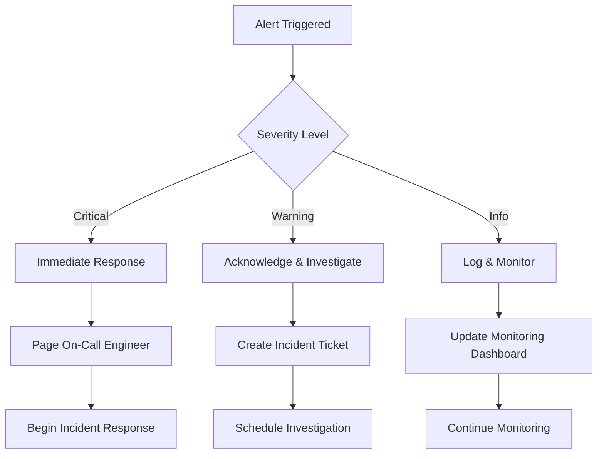
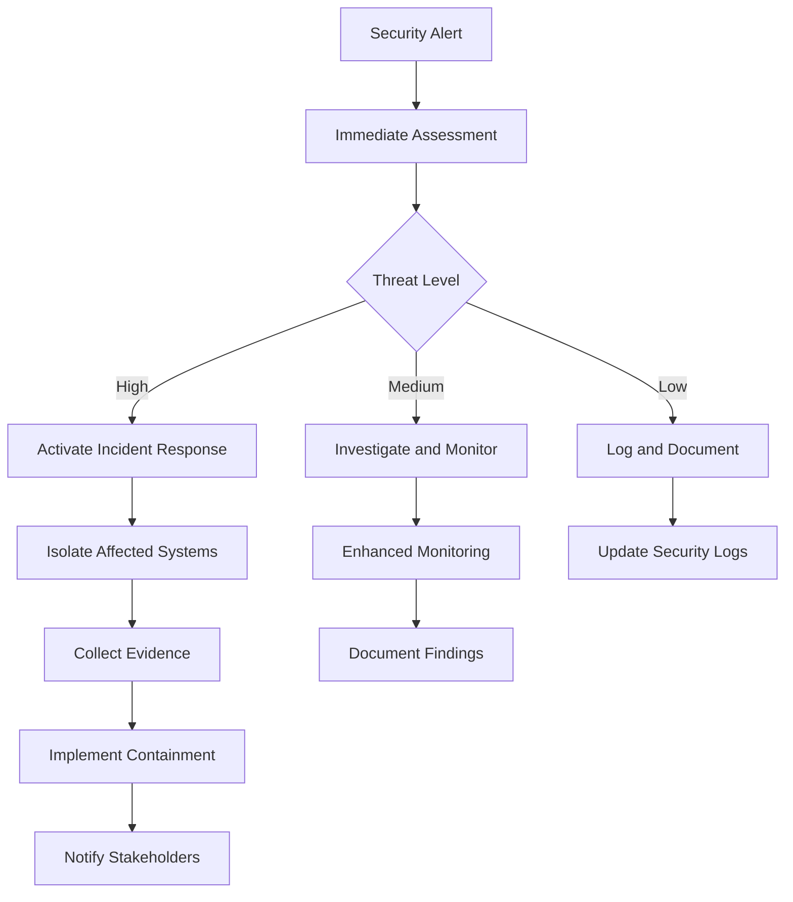

# Operations Guide

This guide covers day-to-day operations for StratMaster, including monitoring, maintenance, scaling, and troubleshooting procedures. Use this as your operational playbook for keeping the system running smoothly.

## Daily Operations

### Morning Health Checks

Start each day with a systematic health check:

```bash
#!/bin/bash
# scripts/daily-health-check.sh

echo "🔍 Daily StratMaster Health Check - $(date)"
echo "================================================"

# 1. API Health
echo "📡 API Health:"
curl -s -f http://api.stratmaster.ai/healthz && echo "✅ API: Healthy" || echo "❌ API: Unhealthy"
curl -s -f http://api.stratmaster.ai/health/database && echo "✅ Database: Connected" || echo "❌ Database: Issues"

# 2. Service Status
echo -e "\n🔧 Service Status:"
kubectl get pods -n stratmaster-production --field-selector=status.phase!=Running && echo "❌ Pods not running" || echo "✅ All pods running"

# 3. Resource Usage
echo -e "\n📊 Resource Usage:"
kubectl top nodes | head -5
kubectl top pods -n stratmaster-production | head -10

# 4. Recent Errors
echo -e "\n🚨 Recent Errors (last hour):"
kubectl logs -n stratmaster-production --since=1h --selector=app=stratmaster-api | grep -i "error" | tail -5

# 5. Performance Metrics
echo -e "\n⚡ Performance Metrics:"
curl -s "http://prometheus:9090/api/v1/query?query=rate(http_requests_total[5m])" | jq -r '.data.result[0].value[1]' | xargs printf "Request Rate: %.2f req/s\n"

echo -e "\n✅ Health check complete!"
```

### System Monitoring

#### Key Metrics Dashboard

Monitor these critical metrics throughout the day:

**Application Metrics**:
- Request rate and latency (p50, p95, p99)
- Error rates by endpoint
- Active user sessions
- Strategy generation success rate

**Infrastructure Metrics**:
- CPU and memory utilization
- Database connections and query performance
- Vector search latency and accuracy
- Storage usage and I/O patterns

```bash
# Quick metrics check
make ops.metrics.check

# Detailed performance report
make ops.performance.report
```

#### Alerting Response

When alerts fire, follow this escalation procedure:



### Backup and Recovery

#### Daily Backup Verification
```bash
#!/bin/bash
# scripts/verify-backups.sh

echo "🔒 Verifying Daily Backups"

# Check RDS automated backups
aws rds describe-db-snapshots \
  --db-instance-identifier stratmaster-prod \
  --snapshot-type automated \
  --query 'DBSnapshots[0].{Date:SnapshotCreateTime,Status:Status}' \
  --output table

# Verify vector database snapshots
kubectl exec -n stratmaster-production qdrant-0 -- \
  ls -la /qdrant/storage/snapshots/ | tail -5

# Check configuration backups
ls -la backups/k8s-config-$(date +%Y%m%d)*.yaml

echo "✅ Backup verification complete"
```

#### Weekly Full Backup
```bash
#!/bin/bash
# scripts/weekly-full-backup.sh

BACKUP_DATE=$(date +%Y%m%d)

# 1. Database full backup
echo "📊 Creating database backup..."
aws rds create-db-snapshot \
  --db-instance-identifier stratmaster-prod \
  --db-snapshot-identifier "stratmaster-weekly-${BACKUP_DATE}"

# 2. Vector database backup
echo "🔍 Backing up vector database..."
kubectl exec -n stratmaster-production qdrant-0 -- \
  tar -czf "/tmp/qdrant-backup-${BACKUP_DATE}.tar.gz" /qdrant/storage

kubectl cp stratmaster-production/qdrant-0:/tmp/qdrant-backup-${BACKUP_DATE}.tar.gz \
  "backups/qdrant-backup-${BACKUP_DATE}.tar.gz"

# 3. Configuration backup
echo "⚙️ Backing up configurations..."
kubectl get all,configmaps,secrets -n stratmaster-production -o yaml > \
  "backups/k8s-full-backup-${BACKUP_DATE}.yaml"

# 4. Upload to long-term storage
aws s3 cp backups/ s3://stratmaster-backups/weekly/ --recursive

echo "✅ Weekly backup complete"
```

## Scaling Operations

### Horizontal Pod Autoscaling (HPA)

Monitor and adjust HPA settings:

```bash
# Check current HPA status
kubectl get hpa -n stratmaster-production

# View HPA metrics
kubectl describe hpa stratmaster-api -n stratmaster-production

# Manually scale (emergency)
kubectl scale deployment stratmaster-api --replicas=10 -n stratmaster-production
```

### Database Scaling

#### Read Replicas
```bash
# Create read replica for read-heavy workloads
aws rds create-db-instance-from-db-instance \
  --source-db-instance-identifier stratmaster-prod \
  --db-instance-identifier stratmaster-prod-read-replica \
  --db-instance-class db.r5.large
```

#### Connection Pool Tuning
```yaml
# configs/database/connection-pool.yaml
database:
  connection_pool:
    size: 20
    max_overflow: 30
    pool_timeout: 30
    pool_recycle: 3600
    pool_pre_ping: true
```

### Vector Database Scaling

```bash
# Add vector database nodes
kubectl scale statefulset qdrant --replicas=5 -n stratmaster-production

# Verify cluster formation
kubectl exec -n stratmaster-production qdrant-0 -- \
  curl http://localhost:6333/cluster
```

## Maintenance Procedures

### Rolling Updates

Deploy updates with zero downtime:

```bash
#!/bin/bash
# scripts/rolling-update.sh

VERSION=$1
if [[ -z "$VERSION" ]]; then
  echo "Usage: $0 <version>"
  exit 1
fi

echo "🚀 Starting rolling update to version ${VERSION}"

# 1. Update staging first
helm upgrade stratmaster-staging ./helm/stratmaster-api \
  --namespace stratmaster-staging \
  --set api.image.tag=${VERSION} \
  --wait --timeout=10m

# 2. Run smoke tests on staging
make test.smoke.staging

# 3. Deploy to production
echo "📦 Deploying to production..."
helm upgrade stratmaster-prod ./helm/stratmaster-api \
  --namespace stratmaster-production \
  --set api.image.tag=${VERSION} \
  --wait --timeout=15m

# 4. Verify deployment
kubectl rollout status deployment/stratmaster-api -n stratmaster-production

# 5. Run production smoke tests
make test.smoke.production

echo "✅ Rolling update complete!"
```

### Database Maintenance

#### Weekly Maintenance Window
```sql
-- Weekly database maintenance (run during low traffic)

-- Analyze table statistics
ANALYZE;

-- Update table statistics
UPDATE pg_stat_user_tables SET n_tup_ins = 0, n_tup_upd = 0, n_tup_del = 0;

-- Vacuum large tables
VACUUM (ANALYZE, VERBOSE) strategies;
VACUUM (ANALYZE, VERBOSE) analyses;
VACUUM (ANALYZE, VERBOSE) audit_logs;

-- Check for bloated tables
SELECT 
    schemaname,
    tablename,
    pg_size_pretty(pg_total_relation_size(schemaname||'.'||tablename)) as size,
    pg_size_pretty(pg_total_relation_size(schemaname||'.'||tablename) - pg_relation_size(schemaname||'.'||tablename)) as external_size
FROM pg_tables 
WHERE schemaname = 'public'
ORDER BY pg_total_relation_size(schemaname||'.'||tablename) DESC;
```

#### Index Maintenance
```sql
-- Monitor index usage
SELECT 
    indexrelname as index_name,
    relname as table_name,
    idx_scan as times_used,
    pg_size_pretty(pg_relation_size(indexrelname::regclass)) as size
FROM pg_stat_user_indexes 
ORDER BY idx_scan ASC;

-- Rebuild fragmented indexes
REINDEX INDEX CONCURRENTLY idx_strategies_created_at;
REINDEX INDEX CONCURRENTLY idx_analyses_tenant_id;
```

### Certificate Management

#### SSL Certificate Renewal
```bash
#!/bin/bash
# scripts/renew-certificates.sh

echo "🔐 Checking SSL certificates..."

# Check expiration dates
kubectl get certificates -n stratmaster-production -o custom-columns=NAME:.metadata.name,READY:.status.conditions[0].status,AGE:.metadata.creationTimestamp

# Renew certificates that expire in 30 days
cert-manager renew --namespace stratmaster-production

# Verify certificate chain
openssl s_client -connect api.stratmaster.ai:443 -servername api.stratmaster.ai < /dev/null 2>/dev/null | openssl x509 -noout -dates

echo "✅ Certificate renewal complete"
```

## Performance Optimization

### Query Performance Tuning

Monitor and optimize slow queries:

```sql
-- Find slow queries
SELECT 
    query,
    calls,
    total_time,
    mean_time,
    rows
FROM pg_stat_statements 
ORDER BY total_time DESC 
LIMIT 10;

-- Index recommendations
SELECT 
    schemaname,
    tablename,
    attname,
    n_distinct,
    correlation
FROM pg_stats 
WHERE schemaname = 'public' 
ORDER BY n_distinct DESC;
```

### Vector Search Optimization

```python
# scripts/optimize_vector_search.py
import asyncio
import httpx
from qdrant_client import QdrantClient

async def optimize_vector_search():
    """Optimize vector search performance."""
    client = QdrantClient("http://localhost:6333")
    
    # Optimize collection parameters
    await client.update_collection(
        collection_name="strategies",
        optimizer_config={
            "deleted_threshold": 0.2,
            "vacuum_min_vector_number": 1000,
            "default_segment_number": 2,
        }
    )
    
    # Create optimized indices
    await client.create_payload_index(
        collection_name="strategies",
        field_name="tenant_id",
        field_schema="keyword"
    )
    
    print("✅ Vector search optimization complete")

if __name__ == "__main__":
    asyncio.run(optimize_vector_search())
```

### Cache Optimization

```bash
# Redis cache optimization
redis-cli INFO memory
redis-cli CONFIG SET maxmemory-policy allkeys-lru
redis-cli CONFIG SET maxmemory 4gb

# Monitor cache hit rates
redis-cli INFO stats | grep keyspace_hits
```

## Security Operations

### Security Monitoring

Daily security checks:

```bash
#!/bin/bash
# scripts/security-check.sh

echo "🛡️ Daily Security Check - $(date)"

# 1. Failed login attempts
echo "🔒 Failed Login Attempts (last 24h):"
kubectl logs -n stratmaster-production --since=24h --selector=app=stratmaster-api | \
  grep "authentication_failed" | wc -l

# 2. Suspicious IP addresses
echo "🌐 Suspicious IPs:"
kubectl logs -n stratmaster-production --since=24h --selector=app=stratmaster-api | \
  grep -E "(brute_force|sql_injection|xss_attempt)" | \
  awk '{print $1}' | sort | uniq -c | sort -nr | head -5

# 3. Certificate status
echo "🔐 Certificate Status:"
kubectl get certificates -n stratmaster-production

# 4. Security scan
echo "🔍 Running security scan:"
trivy image stratmaster/api:latest --severity HIGH,CRITICAL

echo "✅ Security check complete"
```

### Incident Response

When security incidents occur:



#### Incident Response Playbook
```bash
#!/bin/bash
# scripts/security-incident-response.sh

INCIDENT_ID=$1
SEVERITY=$2

echo "🚨 Security Incident Response: ${INCIDENT_ID}"
echo "Severity: ${SEVERITY}"

# 1. Immediate containment
if [[ "$SEVERITY" == "HIGH" ]]; then
    # Block suspicious IPs
    kubectl apply -f security/emergency-network-policy.yaml
    
    # Scale down affected services
    kubectl scale deployment suspicious-service --replicas=0
fi

# 2. Evidence collection
kubectl logs --all-containers --since=1h > "incidents/${INCIDENT_ID}-logs.txt"
kubectl get events --sort-by=.metadata.creationTimestamp > "incidents/${INCIDENT_ID}-events.txt"

# 3. Notification
curl -X POST "$SLACK_WEBHOOK" -d "{\"text\": \"Security incident ${INCIDENT_ID} - ${SEVERITY} severity\"}"

# 4. Create incident report
cat > "incidents/${INCIDENT_ID}-report.md" << EOF
# Security Incident Report: ${INCIDENT_ID}

**Date:** $(date)
**Severity:** ${SEVERITY}
**Status:** INVESTIGATING

## Timeline
- $(date): Incident detected and response initiated

## Actions Taken
- Containment measures implemented
- Evidence collection started
- Stakeholders notified

## Next Steps
- Continue investigation
- Implement additional security measures
- Update incident response procedures
EOF

echo "✅ Initial incident response complete"
```

## Capacity Planning

### Resource Forecasting

Monthly capacity assessment:

```bash
#!/bin/bash
# scripts/capacity-planning.sh

echo "📈 Monthly Capacity Planning Report"
echo "=================================="

# CPU utilization trend
kubectl top nodes --sort-by=cpu | head -10

# Memory usage patterns
kubectl top pods --all-namespaces --sort-by=memory | head -20

# Storage growth
df -h | grep -E "(postgres|qdrant|opensearch)"

# Database size trends
psql -c "
SELECT 
    pg_size_pretty(pg_database_size('stratmaster_prod')) as database_size,
    pg_size_pretty(pg_total_relation_size('strategies')) as strategies_size,
    pg_size_pretty(pg_total_relation_size('analyses')) as analyses_size;
"

# Forecast next month's requirements
echo "📊 Capacity Recommendations:"
echo "- Add 2 additional worker nodes if CPU > 70%"
echo "- Scale database storage if usage > 80%"
echo "- Consider read replicas if read QPS > 1000"

echo "✅ Capacity planning complete"
```

### Auto-Scaling Configuration

```yaml
# HPA configuration for different workloads
apiVersion: autoscaling/v2
kind: HorizontalPodAutoscaler
metadata:
  name: stratmaster-api-hpa
spec:
  scaleTargetRef:
    apiVersion: apps/v1
    kind: Deployment
    name: stratmaster-api
  minReplicas: 3
  maxReplicas: 50
  metrics:
  - type: Resource
    resource:
      name: cpu
      target:
        type: Utilization
        averageUtilization: 70
  - type: Resource
    resource:
      name: memory
      target:
        type: Utilization
        averageUtilization: 80
  behavior:
    scaleUp:
      stabilizationWindowSeconds: 60
      policies:
      - type: Percent
        value: 100
        periodSeconds: 60
    scaleDown:
      stabilizationWindowSeconds: 300
      policies:
      - type: Percent
        value: 10
        periodSeconds: 60
```

## Operational Procedures

### Emergency Procedures

#### Service Outage Response
```bash
#!/bin/bash
# scripts/emergency-response.sh

echo "🚨 Emergency Response Procedure"

# 1. Immediate triage
kubectl get pods -n stratmaster-production --field-selector=status.phase!=Running
kubectl get services -n stratmaster-production

# 2. Quick health check
curl -f http://api.stratmaster.ai/healthz || echo "❌ API is down"

# 3. Check dependencies
kubectl exec -n stratmaster-production deployment/stratmaster-api -- \
  curl -f http://postgres:5432 || echo "❌ Database unreachable"

# 4. Emergency scaling
kubectl scale deployment stratmaster-api --replicas=10 -n stratmaster-production

# 5. Failover to backup systems
# Activate read replicas, redirect traffic to backup region

echo "✅ Emergency response initiated"
```

#### Rollback Procedure
```bash
#!/bin/bash
# scripts/emergency-rollback.sh

echo "⏪ Emergency Rollback"

# Get previous deployment
PREVIOUS_REVISION=$(kubectl rollout history deployment/stratmaster-api -n stratmaster-production | tail -2 | head -1 | awk '{print $1}')

# Rollback
kubectl rollout undo deployment/stratmaster-api --to-revision=$PREVIOUS_REVISION -n stratmaster-production

# Wait for rollback completion
kubectl rollout status deployment/stratmaster-api -n stratmaster-production --timeout=300s

# Verify health
make test.smoke.production

echo "✅ Emergency rollback complete"
```

### Maintenance Windows

#### Planned Maintenance Checklist
```bash
#!/bin/bash
# scripts/planned-maintenance.sh

echo "🔧 Planned Maintenance Window"

# Pre-maintenance checks
make ops.pre-maintenance.check

# 1. Notify users
curl -X POST "$SLACK_WEBHOOK" -d '{"text": "🔧 Maintenance window starting"}'

# 2. Scale down non-essential services
kubectl scale deployment analytics-service --replicas=0 -n stratmaster-production

# 3. Perform maintenance tasks
# Database maintenance
psql -f scripts/maintenance.sql

# Update certificates
kubectl apply -f k8s/certificates/

# Security updates
kubectl set image deployment/stratmaster-api api=stratmaster/api:security-patch-v0.1.1

# 4. Post-maintenance verification
make ops.post-maintenance.check

# 5. Scale services back up
kubectl scale deployment analytics-service --replicas=3 -n stratmaster-production

# 6. Notify completion
curl -X POST "$SLACK_WEBHOOK" -d '{"text": "✅ Maintenance window completed"}'

echo "✅ Planned maintenance complete"
```

## Operations Calendar

### Daily Tasks (Automated)
- [ ] Health checks and monitoring
- [ ] Backup verification
- [ ] Security scanning
- [ ] Performance monitoring
- [ ] Log analysis

### Weekly Tasks
- [ ] Database maintenance
- [ ] Certificate renewal check
- [ ] Capacity planning review
- [ ] Security audit
- [ ] Performance tuning

### Monthly Tasks  
- [ ] Full system backup test
- [ ] Disaster recovery drill
- [ ] Security penetration testing
- [ ] Dependency updates
- [ ] Infrastructure cost review

### Quarterly Tasks
- [ ] Architecture review
- [ ] Performance benchmarking
- [ ] Security assessment
- [ ] Business continuity testing
- [ ] Technology stack evaluation

---

This operations guide provides a comprehensive framework for maintaining StratMaster in production. Regular execution of these procedures ensures system reliability, security, and optimal performance.