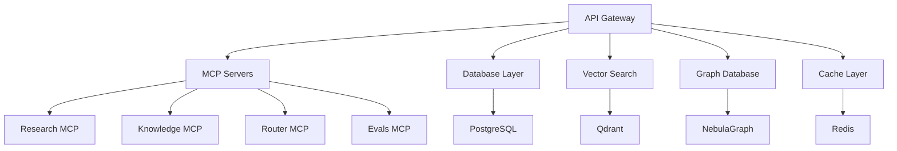

# Performance Tuning Guide

This guide helps you optimize StratMaster performance for production workloads. You'll learn how to tune each component, monitor performance metrics, and scale your deployment effectively.

## Performance Overview

StratMaster's performance depends on several key components:



## Key Performance Metrics

### API Performance Targets

| Metric | Target | Acceptable | Poor |
|--------|--------|------------|------|
| Response Time (p95) | < 200ms | < 500ms | > 1s |
| Throughput | > 1000 req/s | > 500 req/s | < 100 req/s |
| Error Rate | < 0.1% | < 1% | > 5% |
| Availability | > 99.9% | > 99% | < 95% |

### Research Pipeline Targets

| Operation | Target | Acceptable | Poor |
|-----------|--------|------------|------|
| Simple Query | < 2s | < 5s | > 10s |
| Complex Analysis | < 30s | < 60s | > 120s |
| Multi-Agent Debate | < 45s | < 90s | > 180s |
| Vector Search | < 100ms | < 300ms | > 1s |

## 1. API Gateway Optimization

### FastAPI Configuration

```python
# packages/api/src/stratmaster_api/app.py
from fastapi import FastAPI
import uvicorn

def create_app() -> FastAPI:
    app = FastAPI(
        title="StratMaster API",
        # Optimize for production
        docs_url=None if os.getenv("STRATMASTER_ENV") == "production" else "/docs",
        redoc_url=None if os.getenv("STRATMASTER_ENV") == "production" else "/redoc",
        # Performance settings
        debug=False,
        # Reduce overhead
        include_in_schema=False if os.getenv("STRATMASTER_ENV") == "production" else True
    )
    
    # Configure CORS for performance
    app.add_middleware(
        CORSMiddleware,
        allow_origins=["https://yourdomain.com"],  # Specific origins only
        allow_credentials=True,
        allow_methods=["GET", "POST"],  # Only needed methods
        allow_headers=["*"],
        max_age=3600,  # Cache preflight responses
    )
    
    return app
```

### Uvicorn Production Settings

```python
# Production server configuration
uvicorn_config = {
    "host": "0.0.0.0",
    "port": 8080,
    "workers": os.cpu_count() * 2 + 1,  # Optimal worker count
    "worker_class": "uvicorn.workers.UvicornWorker",
    "worker_connections": 1000,
    "max_requests": 10000,
    "max_requests_jitter": 1000,
    "timeout": 30,
    "keepalive": 5,
    "access_log": False,  # Disable for better performance
    "server_header": False,
    "date_header": False,
}
```

### Connection Pooling

```python
# Database connection pooling
from sqlalchemy import create_engine
from sqlalchemy.pool import QueuePool

engine = create_engine(
    DATABASE_URL,
    poolclass=QueuePool,
    pool_size=20,           # Base pool size
    max_overflow=30,        # Additional connections when needed
    pool_pre_ping=True,     # Validate connections
    pool_recycle=3600,      # Recycle connections hourly
    echo=False,             # Disable SQL logging in production
)
```

### Response Caching

```python
# Implement response caching
from fastapi_cache import FastAPICache
from fastapi_cache.backends.redis import RedisBackend

@app.on_event("startup")
async def startup():
    redis = aioredis.from_url("redis://localhost:6379")
    FastAPICache.init(RedisBackend(redis), prefix="stratmaster-cache")

# Cache frequently accessed endpoints
@app.get("/research/templates")
@cache(expire=3600)  # Cache for 1 hour
async def get_research_templates():
    return await template_service.get_all_templates()
```

## 2. Database Optimization

### PostgreSQL Tuning

#### Memory Configuration

```sql
-- postgresql.conf optimizations
-- Memory settings (for 16GB RAM server)
shared_buffers = 4GB                    -- 25% of RAM
effective_cache_size = 12GB             -- 75% of RAM  
work_mem = 32MB                         -- Per connection work memory
maintenance_work_mem = 1GB              -- For maintenance operations
random_page_cost = 1.1                  -- SSD optimized
effective_io_concurrency = 200          -- SSD concurrent I/O

-- Connection settings
max_connections = 200
shared_preload_libraries = 'pg_stat_statements'

-- Checkpoint settings
checkpoint_timeout = 15min
checkpoint_completion_target = 0.9
wal_buffers = 64MB
```

#### Query Optimization

```sql
-- Create optimal indexes
CREATE INDEX CONCURRENTLY idx_research_session_tenant 
ON research_sessions(tenant_id, created_at DESC);

CREATE INDEX CONCURRENTLY idx_evidence_search_vector 
ON evidence USING GIN(search_vector);

CREATE INDEX CONCURRENTLY idx_claims_confidence 
ON research_claims(confidence DESC, created_at DESC);

-- Partial indexes for frequent queries
CREATE INDEX CONCURRENLY idx_active_sessions 
ON research_sessions(tenant_id, session_id) 
WHERE status = 'active';

-- Monitor query performance
SELECT query, calls, total_time, mean_time, rows
FROM pg_stat_statements 
ORDER BY total_time DESC 
LIMIT 10;
```

#### Table Partitioning

```sql
-- Partition large tables by date
CREATE TABLE research_sessions (
    session_id UUID,
    tenant_id VARCHAR(50),
    created_at TIMESTAMP DEFAULT NOW(),
    -- other columns
) PARTITION BY RANGE (created_at);

-- Create monthly partitions
CREATE TABLE research_sessions_2024_01 
PARTITION OF research_sessions
FOR VALUES FROM ('2024-01-01') TO ('2024-02-01');

-- Automated partition management
CREATE OR REPLACE FUNCTION create_monthly_partition()
RETURNS VOID AS $$
DECLARE
    start_date DATE;
    end_date DATE;
    table_name TEXT;
BEGIN
    start_date := date_trunc('month', CURRENT_DATE);
    end_date := start_date + INTERVAL '1 month';
    table_name := 'research_sessions_' || to_char(start_date, 'YYYY_MM');
    
    EXECUTE format('CREATE TABLE IF NOT EXISTS %I PARTITION OF research_sessions 
                   FOR VALUES FROM (%L) TO (%L)',
                   table_name, start_date, end_date);
END;
$$ LANGUAGE plpgsql;
```

### Connection Pool Optimization

```python
# Advanced connection pool configuration
from sqlalchemy.pool import QueuePool
import asyncpg

# Async PostgreSQL pool
async def create_db_pool():
    return await asyncpg.create_pool(
        DATABASE_URL,
        min_size=10,          # Minimum connections
        max_size=50,          # Maximum connections  
        max_queries=50000,    # Queries per connection
        max_inactive_connection_lifetime=300,  # 5 minutes
        command_timeout=30,   # Command timeout
        server_settings={
            'jit': 'off',     # Disable JIT for consistent performance
            'application_name': 'stratmaster-api'
        }
    )
```

## 3. Vector Database Optimization (Qdrant)

### Collection Configuration

```python
# Optimal collection setup
from qdrant_client import QdrantClient
from qdrant_client.models import Distance, VectorParams, OptimizersConfigDiff

client = QdrantClient(host="localhost", port=6333)

# Create optimized collection
client.create_collection(
    collection_name="research_embeddings",
    vectors_config=VectorParams(
        size=1536,  # OpenAI embedding size
        distance=Distance.COSINE,
        # Performance optimizations
        hnsw_config={
            "m": 16,                    # Connections per node
            "ef_construct": 200,        # Construction parameter
            "full_scan_threshold": 10000,  # Switch to exact search
        }
    ),
    optimizers_config=OptimizersConfigDiff(
        deleted_threshold=0.2,          # Trigger optimization threshold
        vacuum_min_vector_number=1000,  # Minimum vectors for vacuum
        default_segment_number=2,       # Number of segments
        max_segment_size=20000,         # Maximum segment size
        memmap_threshold=50000,         # Use memory mapping
        indexing_threshold=20000,       # Start indexing threshold
        flush_interval_sec=30,          # Flush interval
    )
)
```

### Batch Operations

```python
# Batch insertions for better performance
async def batch_upsert_embeddings(embeddings: List[EmbeddingData]):
    batch_size = 100
    
    for i in range(0, len(embeddings), batch_size):
        batch = embeddings[i:i + batch_size]
        
        points = [
            PointStruct(
                id=embedding.id,
                vector=embedding.vector,
                payload=embedding.metadata
            )
            for embedding in batch
        ]
        
        await client.upsert(
            collection_name="research_embeddings",
            points=points,
            wait=False  # Async operation
        )
```

### Search Optimization

```python
# Optimized search parameters
async def search_similar_content(
    query_vector: List[float],
    limit: int = 10,
    score_threshold: float = 0.7
):
    return await client.search(
        collection_name="research_embeddings",
        query_vector=query_vector,
        limit=limit,
        score_threshold=score_threshold,
        # Performance parameters
        params=SearchParams(
            hnsw_ef=128,        # Higher ef for better recall
            exact=False,        # Use approximate search
        ),
        # Return only needed fields
        with_payload=["title", "source", "timestamp"],
        with_vectors=False   # Don't return vectors unless needed
    )
```

## 4. Redis Cache Optimization

### Memory Configuration

```redis
# redis.conf optimizations
maxmemory 8gb
maxmemory-policy allkeys-lru
maxmemory-samples 10

# Persistence (adjust for performance vs durability)
save 900 1      # Save after 900 sec if at least 1 key changed
save 300 10     # Save after 300 sec if at least 10 keys changed
save 60 10000   # Save after 60 sec if at least 10000 keys changed

# Network optimizations
tcp-keepalive 300
timeout 300
tcp-backlog 511

# Memory optimizations
hash-max-ziplist-entries 512
hash-max-ziplist-value 64
list-max-ziplist-size -2
set-max-intset-entries 512
```

### Caching Strategies

```python
# Intelligent caching with TTL
import redis.asyncio as redis
from typing import Optional

class CacheService:
    def __init__(self):
        self.redis = redis.from_url("redis://localhost:6379")
    
    async def get_or_compute(
        self,
        key: str,
        compute_func: callable,
        ttl: int = 3600,
        force_refresh: bool = False
    ):
        """Get from cache or compute and cache result"""
        if not force_refresh:
            cached = await self.redis.get(key)
            if cached:
                return json.loads(cached)
        
        # Compute result
        result = await compute_func()
        
        # Cache with TTL
        await self.redis.setex(
            key, 
            ttl, 
            json.dumps(result, default=str)
        )
        
        return result
    
    async def cache_research_results(
        self,
        session_id: str,
        results: dict,
        ttl: int = 7200  # 2 hours
    ):
        """Cache research results with session-based key"""
        key = f"research:results:{session_id}"
        await self.redis.setex(key, ttl, json.dumps(results))
    
    async def invalidate_pattern(self, pattern: str):
        """Invalidate cache keys matching pattern"""
        keys = await self.redis.keys(pattern)
        if keys:
            await self.redis.delete(*keys)
```

## 5. MCP Server Optimization

### Resource Allocation

```yaml
# Kubernetes resource configuration
apiVersion: apps/v1
kind: Deployment
metadata:
  name: research-mcp
spec:
  replicas: 3
  template:
    spec:
      containers:
      - name: research-mcp
        image: stratmaster/research-mcp:0.1.0
        resources:
          requests:
            cpu: 500m
            memory: 1Gi
          limits:
            cpu: 2000m
            memory: 4Gi
        env:
        - name: UVICORN_WORKERS
          value: "4"
        - name: WORKER_CONNECTIONS
          value: "1000"
        - name: MAX_REQUESTS
          value: "10000"
```

### Connection Pooling

```python
# MCP server connection pooling
import httpx
from httpx import AsyncClient

class MCPClient:
    def __init__(self):
        # Connection pooling for external services
        self.http_client = AsyncClient(
            limits=httpx.Limits(
                max_keepalive_connections=20,
                max_connections=100,
                keepalive_expiry=30.0
            ),
            timeout=httpx.Timeout(30.0)
        )
    
    async def batch_process_requests(
        self, 
        requests: List[dict],
        batch_size: int = 10
    ):
        """Process requests in batches for better throughput"""
        results = []
        
        for i in range(0, len(requests), batch_size):
            batch = requests[i:i + batch_size]
            
            # Process batch concurrently
            tasks = [
                self.process_single_request(req)
                for req in batch
            ]
            
            batch_results = await asyncio.gather(*tasks)
            results.extend(batch_results)
        
        return results
```

## 6. Application-Level Optimizations

### Async Processing

```python
# Async optimization patterns
import asyncio
from concurrent.futures import ThreadPoolExecutor

class ResearchService:
    def __init__(self):
        self.executor = ThreadPoolExecutor(max_workers=10)
    
    async def parallel_research(
        self,
        research_queries: List[str],
        max_concurrent: int = 5
    ):
        """Process multiple research queries concurrently"""
        semaphore = asyncio.Semaphore(max_concurrent)
        
        async def process_query(query: str):
            async with semaphore:
                return await self.research_single_query(query)
        
        tasks = [process_query(query) for query in research_queries]
        return await asyncio.gather(*tasks)
    
    async def cpu_intensive_task(self, data):
        """Offload CPU-intensive work to thread pool"""
        loop = asyncio.get_event_loop()
        return await loop.run_in_executor(
            self.executor,
            self._cpu_intensive_work,
            data
        )
```

### Memory Management

```python
# Memory optimization techniques
import gc
from weakref import WeakValueDictionary

class OptimizedService:
    def __init__(self):
        # Use weak references for cache to allow GC
        self._cache = WeakValueDictionary()
        
    async def process_large_dataset(self, data: List[dict]):
        """Process large datasets efficiently"""
        # Use generators to reduce memory usage
        for chunk in self._chunk_data(data, chunk_size=1000):
            yield await self._process_chunk(chunk)
            
            # Explicit garbage collection for large datasets
            if len(chunk) > 500:
                gc.collect()
    
    def _chunk_data(self, data: List, chunk_size: int):
        """Generator to process data in chunks"""
        for i in range(0, len(data), chunk_size):
            yield data[i:i + chunk_size]
```

## 7. Monitoring and Profiling

### Performance Monitoring

```python
# Performance monitoring middleware
import time
from prometheus_client import Counter, Histogram, Gauge

# Metrics
REQUEST_COUNT = Counter('http_requests_total', 'Total HTTP requests', ['method', 'endpoint'])
REQUEST_DURATION = Histogram('http_request_duration_seconds', 'HTTP request duration')
ACTIVE_CONNECTIONS = Gauge('active_connections', 'Active database connections')

@app.middleware("http")
async def monitor_performance(request: Request, call_next):
    start_time = time.time()
    
    # Track request
    REQUEST_COUNT.labels(
        method=request.method,
        endpoint=request.url.path
    ).inc()
    
    # Process request
    response = await call_next(request)
    
    # Record duration
    duration = time.time() - start_time
    REQUEST_DURATION.observe(duration)
    
    # Add performance headers
    response.headers["X-Process-Time"] = str(duration)
    
    return response
```

### Profiling Tools

```python
# Application profiling
import cProfile
import pstats
from functools import wraps

def profile_endpoint(func):
    """Decorator to profile endpoint performance"""
    @wraps(func)
    async def wrapper(*args, **kwargs):
        if os.getenv("ENABLE_PROFILING"):
            profiler = cProfile.Profile()
            profiler.enable()
            
            result = await func(*args, **kwargs)
            
            profiler.disable()
            stats = pstats.Stats(profiler)
            stats.sort_stats('cumulative')
            
            # Log top 10 functions
            stats.print_stats(10)
            
            return result
        else:
            return await func(*args, **kwargs)
    
    return wrapper

# Memory profiling
from memory_profiler import profile

@profile
def memory_intensive_function():
    """Function to monitor memory usage"""
    large_list = [i for i in range(1000000)]
    return sum(large_list)
```

## 8. Load Testing and Benchmarking

### API Load Testing

```bash
# Using Artillery.js for load testing
npm install -g artillery

# Create load test configuration
cat > load-test.yml << EOF
config:
  target: 'http://localhost:8080'
  phases:
    - duration: 60
      arrivalRate: 10
    - duration: 120
      arrivalRate: 50
    - duration: 60
      arrivalRate: 100
  variables:
    tenant_id: "load-test-tenant"

scenarios:
  - name: "Research API"
    weight: 70
    flow:
      - post:
          url: "/research/plan"
          headers:
            Content-Type: "application/json"
          json:
            session_id: "{{ \$randomString() }}"
            tenant_id: "{{ tenant_id }}"
            research_question: "Market analysis for AI adoption"
            scope: "comprehensive"

  - name: "Health Check"
    weight: 30
    flow:
      - get:
          url: "/healthz"
EOF

# Run load test
artillery run load-test.yml
```

### Database Benchmarking

```sql
-- PostgreSQL performance testing
-- Create test data
INSERT INTO research_sessions (session_id, tenant_id, created_at)
SELECT 
    gen_random_uuid(),
    'tenant-' || (random() * 100)::int,
    NOW() - (random() * interval '365 days')
FROM generate_series(1, 1000000);

-- Benchmark queries
\timing on

-- Test index usage
EXPLAIN (ANALYZE, BUFFERS) 
SELECT * FROM research_sessions 
WHERE tenant_id = 'tenant-1' 
ORDER BY created_at DESC 
LIMIT 100;

-- Test aggregation performance
EXPLAIN (ANALYZE, BUFFERS)
SELECT tenant_id, COUNT(*), AVG(duration)
FROM research_sessions 
WHERE created_at > NOW() - interval '30 days'
GROUP BY tenant_id;
```

## 9. Scaling Strategies

### Horizontal Scaling

```yaml
# Kubernetes HPA configuration
apiVersion: autoscaling/v2
kind: HorizontalPodAutoscaler
metadata:
  name: stratmaster-api-hpa
spec:
  scaleTargetRef:
    apiVersion: apps/v1
    kind: Deployment
    name: stratmaster-api
  minReplicas: 3
  maxReplicas: 20
  metrics:
  - type: Resource
    resource:
      name: cpu
      target:
        type: Utilization
        averageUtilization: 70
  - type: Resource
    resource:
      name: memory
      target:
        type: Utilization
        averageUtilization: 80
  behavior:
    scaleUp:
      stabilizationWindowSeconds: 60
      policies:
      - type: Percent
        value: 100
        periodSeconds: 15
    scaleDown:
      stabilizationWindowSeconds: 300
      policies:
      - type: Percent
        value: 50
        periodSeconds: 60
```

### Database Scaling

```yaml
# PostgreSQL read replicas
apiVersion: postgresql.cnpg.io/v1
kind: Cluster
metadata:
  name: postgresql-cluster
spec:
  instances: 3
  primaryUpdateStrategy: unsupervised
  
  postgresql:
    parameters:
      max_connections: "200"
      shared_buffers: "256MB"
      effective_cache_size: "1GB"
      
  monitoring:
    enabled: true
    
  storage:
    size: 1Ti
    storageClass: fast-ssd
```

## 10. Performance Tuning Checklist

### Infrastructure Level
- [ ] CPU resources adequate (monitor >80% utilization)
- [ ] Memory allocation optimized (no swap usage)
- [ ] Storage I/O performance meets requirements
- [ ] Network latency between services <10ms
- [ ] Load balancer properly configured

### Database Level
- [ ] Query execution plans optimized
- [ ] Indexes created for frequent queries
- [ ] Connection pooling configured
- [ ] Database statistics up to date
- [ ] Partitioning implemented for large tables

### Application Level
- [ ] Async operations used where appropriate
- [ ] Connection pooling implemented
- [ ] Response caching enabled
- [ ] Memory leaks addressed
- [ ] CPU-intensive operations optimized

### MCP Services Level
- [ ] Resource limits set appropriately
- [ ] Batch processing implemented
- [ ] Circuit breakers configured
- [ ] Timeout values optimized
- [ ] Error handling optimized

## Common Performance Issues

### High Response Times

**Symptoms**: API responses >1 second
**Investigation**:
```bash
# Check database slow queries
SELECT query, mean_time, calls
FROM pg_stat_statements 
WHERE mean_time > 1000
ORDER BY mean_time DESC;

# Check application metrics
curl http://localhost:8080/metrics | grep http_request_duration
```

**Solutions**:
- Add database indexes
- Implement query optimization
- Add response caching
- Increase connection pool size

### Memory Leaks

**Symptoms**: Gradually increasing memory usage
**Investigation**:
```python
import tracemalloc

# Start tracing
tracemalloc.start()

# ... run application code ...

# Get memory usage
current, peak = tracemalloc.get_traced_memory()
print(f"Current memory usage: {current / 1024 / 1024:.1f} MB")
print(f"Peak memory usage: {peak / 1024 / 1024:.1f} MB")
```

**Solutions**:
- Use weak references for caches
- Implement proper cleanup in async operations
- Monitor and limit connection pools
- Regular garbage collection for large operations

### Database Deadlocks

**Symptoms**: Periodic database errors
**Investigation**:
```sql
-- Check for deadlocks
SELECT * FROM pg_stat_database_conflicts;

-- Monitor locks
SELECT * FROM pg_locks WHERE NOT granted;
```

**Solutions**:
- Consistent lock ordering
- Shorter transaction durations
- Proper indexing to reduce lock contention
- Connection pool tuning

## Conclusion

Performance tuning is an iterative process. Start with monitoring, identify bottlenecks, apply targeted optimizations, and measure results. Focus on the biggest impact areas first:

1. Database query optimization
2. Connection pooling
3. Caching strategies
4. Async processing
5. Resource allocation

Regular performance testing and monitoring ensure your StratMaster deployment maintains optimal performance as it scales.

For more information, see:
- [Security Hardening Guide](security-hardening.md)
- [Operations Guide](operations-guide.md)
- [Troubleshooting Guide](troubleshooting.md)