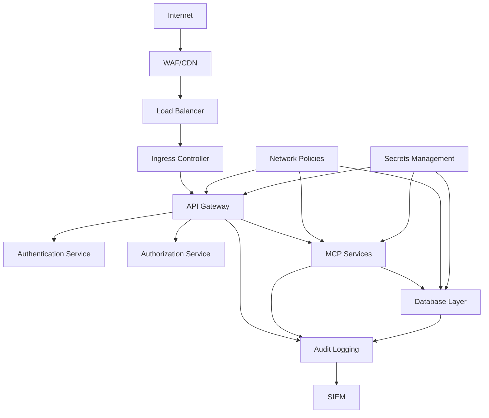

# Security Hardening Guide

This guide provides comprehensive security hardening recommendations for StratMaster production deployments. Follow these practices to protect your strategic analysis platform from security threats.

## Security Architecture Overview



## 1. Infrastructure Security

### Network Security

#### Network Policies

```yaml
# Kubernetes Network Policies
apiVersion: networking.k8s.io/v1
kind: NetworkPolicy
metadata:
  name: stratmaster-network-policy
  namespace: stratmaster-prod
spec:
  podSelector:
    matchLabels:
      app: stratmaster-api
  policyTypes:
  - Ingress
  - Egress
  ingress:
  - from:
    - namespaceSelector:
        matchLabels:
          name: ingress-nginx
    - podSelector:
        matchLabels:
          app: stratmaster-mcp
    ports:
    - protocol: TCP
      port: 8080
  egress:
  - to:
    - podSelector:
        matchLabels:
          app: postgresql
    ports:
    - protocol: TCP
      port: 5432
  - to:
    - podSelector:
        matchLabels:
          app: redis
    ports:
    - protocol: TCP
      port: 6379
  # Allow DNS
  - to: []
    ports:
    - protocol: UDP
      port: 53
```

#### Service Mesh Security

```yaml
# Istio security policies
apiVersion: security.istio.io/v1beta1
kind: PeerAuthentication
metadata:
  name: stratmaster-mtls
  namespace: stratmaster-prod
spec:
  mtls:
    mode: STRICT

---
apiVersion: security.istio.io/v1beta1
kind: AuthorizationPolicy
metadata:
  name: stratmaster-authz
  namespace: stratmaster-prod
spec:
  selector:
    matchLabels:
      app: stratmaster-api
  rules:
  - from:
    - source:
        principals: ["cluster.local/ns/ingress-nginx/sa/ingress-nginx"]
  - to:
    - operation:
        methods: ["GET", "POST"]
        paths: ["/api/*", "/healthz"]
```

### Container Security

#### Secure Container Images

```dockerfile
# Multi-stage build for minimal attack surface
FROM python:3.13-slim-bookworm AS builder

# Create non-root user
RUN groupadd -g 1000 stratmaster && \
    useradd -r -u 1000 -g stratmaster stratmaster

# Install dependencies
COPY requirements.txt .
RUN pip install --no-cache-dir --user -r requirements.txt

# Production stage
FROM python:3.13-slim-bookworm

# Security updates
RUN apt-get update && \
    apt-get upgrade -y && \
    apt-get install -y --no-install-recommends \
        curl \
        ca-certificates && \
    apt-get clean && \
    rm -rf /var/lib/apt/lists/*

# Create non-root user
RUN groupadd -g 1000 stratmaster && \
    useradd -r -u 1000 -g stratmaster stratmaster

# Copy from builder
COPY --from=builder /root/.local /home/stratmaster/.local
COPY --chown=stratmaster:stratmaster . /app

# Set secure permissions
RUN chmod -R 755 /app && \
    find /app -type f -exec chmod 644 {} \;

# Use non-root user
USER stratmaster
WORKDIR /app

# Health check
HEALTHCHECK --interval=30s --timeout=10s --start-period=5s --retries=3 \
    CMD curl -f http://localhost:8080/healthz || exit 1

EXPOSE 8080
CMD ["python", "-m", "uvicorn", "stratmaster_api.app:create_app", "--factory", "--host", "0.0.0.0", "--port", "8080"]
```

#### Pod Security Standards

```yaml
# Pod Security Context
apiVersion: v1
kind: Pod
metadata:
  name: stratmaster-api
  annotations:
    container.apparmor.security.beta.kubernetes.io/stratmaster-api: runtime/default
spec:
  securityContext:
    runAsNonRoot: true
    runAsUser: 1000
    runAsGroup: 1000
    fsGroup: 1000
    seccompProfile:
      type: RuntimeDefault
  containers:
  - name: stratmaster-api
    image: stratmaster/api:0.1.0
    securityContext:
      allowPrivilegeEscalation: false
      readOnlyRootFilesystem: true
      runAsNonRoot: true
      runAsUser: 1000
      capabilities:
        drop:
        - ALL
    resources:
      limits:
        cpu: 2000m
        memory: 4Gi
      requests:
        cpu: 500m
        memory: 1Gi
    volumeMounts:
    - name: tmp
      mountPath: /tmp
    - name: var-tmp
      mountPath: /var/tmp
  volumes:
  - name: tmp
    emptyDir: {}
  - name: var-tmp
    emptyDir: {}
```

## 2. Authentication and Authorization

### Keycloak Integration

#### OIDC Configuration

```python
# packages/api/src/stratmaster_api/auth/keycloak.py
from fastapi import HTTPException, Depends
from fastapi.security import HTTPBearer, HTTPAuthorizationCredentials
import jwt
from jwt.exceptions import InvalidTokenError
import httpx
from typing import Optional, Dict, Any

class KeycloakAuth:
    def __init__(self, server_url: str, realm: str, client_id: str):
        self.server_url = server_url
        self.realm = realm
        self.client_id = client_id
        self.jwks_client = jwt.PyJWKClient(
            f"{server_url}/realms/{realm}/protocol/openid-connect/certs",
            cache_keys=True,
            max_cached_keys=10,
            cache_jwks_for_seconds=300
        )
        
    async def verify_token(self, token: str) -> Dict[str, Any]:
        """Verify JWT token with Keycloak"""
        try:
            # Get signing key
            signing_key = self.jwks_client.get_signing_key_from_jwt(token)
            
            # Verify token
            payload = jwt.decode(
                token,
                signing_key.key,
                algorithms=["RS256"],
                audience=self.client_id,
                issuer=f"{self.server_url}/realms/{self.realm}",
                options={
                    "verify_signature": True,
                    "verify_aud": True,
                    "verify_iss": True,
                    "verify_exp": True,
                    "verify_nbf": True,
                    "verify_iat": True,
                }
            )
            
            return payload
            
        except InvalidTokenError as e:
            raise HTTPException(
                status_code=401,
                detail=f"Invalid token: {str(e)}"
            )

# Authentication dependency
security = HTTPBearer()
keycloak_auth = KeycloakAuth(
    server_url=os.getenv("KEYCLOAK_SERVER_URL"),
    realm=os.getenv("KEYCLOAK_REALM"),
    client_id=os.getenv("KEYCLOAK_CLIENT_ID")
)

async def get_current_user(
    credentials: HTTPAuthorizationCredentials = Depends(security)
) -> Dict[str, Any]:
    """Get current authenticated user"""
    return await keycloak_auth.verify_token(credentials.credentials)
```

#### Role-Based Access Control

```python
# RBAC implementation
from enum import Enum
from functools import wraps

class Role(Enum):
    ADMIN = "admin"
    ANALYST = "analyst"
    VIEWER = "viewer"
    API_CLIENT = "api_client"

class Permission(Enum):
    READ_RESEARCH = "research:read"
    WRITE_RESEARCH = "research:write"
    DELETE_RESEARCH = "research:delete"
    ADMIN_USERS = "users:admin"
    VIEW_AUDIT = "audit:view"

def require_permission(permission: Permission):
    """Decorator to require specific permission"""
    def decorator(func):
        @wraps(func)
        async def wrapper(*args, **kwargs):
            # Get user from request context
            user = kwargs.get('current_user') or args[-1]
            
            if not has_permission(user, permission):
                raise HTTPException(
                    status_code=403,
                    detail=f"Permission {permission.value} required"
                )
            
            return await func(*args, **kwargs)
        return wrapper
    return decorator

def has_permission(user: Dict[str, Any], permission: Permission) -> bool:
    """Check if user has specific permission"""
    user_roles = user.get('realm_access', {}).get('roles', [])
    user_permissions = user.get('resource_access', {}).get('stratmaster', {}).get('roles', [])
    
    # Admin has all permissions
    if Role.ADMIN.value in user_roles:
        return True
    
    # Check specific permission mappings
    permission_map = {
        Permission.READ_RESEARCH: [Role.ANALYST.value, Role.VIEWER.value, Role.API_CLIENT.value],
        Permission.WRITE_RESEARCH: [Role.ANALYST.value, Role.API_CLIENT.value],
        Permission.DELETE_RESEARCH: [Role.ANALYST.value],
        Permission.ADMIN_USERS: [Role.ADMIN.value],
        Permission.VIEW_AUDIT: [Role.ADMIN.value, Role.ANALYST.value],
    }
    
    allowed_roles = permission_map.get(permission, [])
    return any(role in user_roles or role in user_permissions for role in allowed_roles)

# Usage in endpoints
@app.post("/research/analyze")
@require_permission(Permission.WRITE_RESEARCH)
async def analyze_research(
    request: AnalysisRequest,
    current_user: Dict = Depends(get_current_user)
):
    # Implementation
    pass
```

### Multi-Tenant Security

```python
# Tenant isolation
class TenantIsolation:
    @staticmethod
    def get_tenant_id(user: Dict[str, Any]) -> str:
        """Extract tenant ID from user token"""
        return user.get('tenant_id') or user.get('custom_claims', {}).get('tenant_id')
    
    @staticmethod
    def enforce_tenant_access(user_tenant: str, resource_tenant: str):
        """Ensure user can only access their tenant's resources"""
        if user_tenant != resource_tenant:
            raise HTTPException(
                status_code=403,
                detail="Access denied: tenant isolation violation"
            )

# Database queries with tenant filtering
async def get_research_sessions(
    tenant_id: str,
    current_user: Dict = Depends(get_current_user)
) -> List[ResearchSession]:
    user_tenant = TenantIsolation.get_tenant_id(current_user)
    TenantIsolation.enforce_tenant_access(user_tenant, tenant_id)
    
    return await db.query(ResearchSession).filter(
        ResearchSession.tenant_id == tenant_id
    ).all()
```

## 3. Data Protection

### Encryption at Rest

#### Database Encryption

```sql
-- PostgreSQL transparent data encryption (TDE)
-- Enable encryption for tablespaces
CREATE TABLESPACE encrypted_data 
LOCATION '/var/lib/postgresql/encrypted' 
WITH (encryption_key_id = 'stratmaster-key-1');

-- Create encrypted database
CREATE DATABASE stratmaster_prod
WITH TABLESPACE = encrypted_data
     ENCODING = 'UTF8'
     LC_COLLATE = 'en_US.UTF-8'
     LC_CTYPE = 'en_US.UTF-8';

-- Encrypt sensitive columns
CREATE EXTENSION pgcrypto;

-- Store encrypted PII
CREATE TABLE user_profiles (
    user_id UUID PRIMARY KEY,
    email_encrypted BYTEA,
    phone_encrypted BYTEA,
    created_at TIMESTAMP DEFAULT NOW()
);

-- Functions for encryption/decryption
CREATE OR REPLACE FUNCTION encrypt_pii(data TEXT)
RETURNS BYTEA AS $$
BEGIN
    RETURN pgp_sym_encrypt(data, current_setting('app.encryption_key'));
END;
$$ LANGUAGE plpgsql SECURITY DEFINER;

CREATE OR REPLACE FUNCTION decrypt_pii(encrypted_data BYTEA)
RETURNS TEXT AS $$
BEGIN
    RETURN pgp_sym_decrypt(encrypted_data, current_setting('app.encryption_key'));
END;
$$ LANGUAGE plpgsql SECURITY DEFINER;
```

#### File System Encryption

```yaml
# Kubernetes storage encryption
apiVersion: storage.k8s.io/v1
kind: StorageClass
metadata:
  name: encrypted-ssd
provisioner: kubernetes.io/aws-ebs
parameters:
  type: gp3
  encrypted: "true"
  kmsKeyId: "arn:aws:kms:us-west-2:123456789012:key/12345678-1234-1234-1234-123456789012"
reclaimPolicy: Retain
allowVolumeExpansion: true
volumeBindingMode: WaitForFirstConsumer
```

### Encryption in Transit

#### TLS Configuration

```nginx
# Nginx TLS configuration
server {
    listen 443 ssl http2;
    server_name stratmaster.yourdomain.com;
    
    # SSL certificate
    ssl_certificate /etc/ssl/certs/stratmaster.crt;
    ssl_certificate_key /etc/ssl/private/stratmaster.key;
    
    # SSL protocols and ciphers
    ssl_protocols TLSv1.2 TLSv1.3;
    ssl_ciphers ECDHE-ECDSA-AES128-GCM-SHA256:ECDHE-RSA-AES128-GCM-SHA256:ECDHE-ECDSA-AES256-GCM-SHA384:ECDHE-RSA-AES256-GCM-SHA384;
    ssl_prefer_server_ciphers off;
    
    # SSL security headers
    ssl_session_cache shared:SSL:10m;
    ssl_session_timeout 10m;
    ssl_session_tickets off;
    ssl_stapling on;
    ssl_stapling_verify on;
    
    # HSTS
    add_header Strict-Transport-Security "max-age=31536000; includeSubDomains" always;
    
    # Security headers
    add_header X-Frame-Options DENY always;
    add_header X-Content-Type-Options nosniff always;
    add_header X-XSS-Protection "1; mode=block" always;
    add_header Referrer-Policy "strict-origin-when-cross-origin" always;
    add_header Content-Security-Policy "default-src 'self'; script-src 'self' 'unsafe-inline'; style-src 'self' 'unsafe-inline'; img-src 'self' data: https:; font-src 'self'; connect-src 'self'; frame-ancestors 'none';" always;
    
    location / {
        proxy_pass http://stratmaster-backend;
        
        # Security headers for proxied requests
        proxy_set_header Host $host;
        proxy_set_header X-Real-IP $remote_addr;
        proxy_set_header X-Forwarded-For $proxy_add_x_forwarded_for;
        proxy_set_header X-Forwarded-Proto $scheme;
        proxy_set_header X-Forwarded-Host $host;
        proxy_set_header X-Forwarded-Server $host;
        
        # Remove server headers
        proxy_hide_header X-Powered-By;
        proxy_hide_header Server;
    }
}
```

#### mTLS for Service Communication

```yaml
# Service mesh mTLS
apiVersion: security.istio.io/v1beta1
kind: PeerAuthentication
metadata:
  name: stratmaster-mtls-strict
  namespace: stratmaster-prod
spec:
  mtls:
    mode: STRICT

---
apiVersion: networking.istio.io/v1beta1
kind: DestinationRule
metadata:
  name: stratmaster-services-mtls
  namespace: stratmaster-prod
spec:
  host: "*.stratmaster-prod.svc.cluster.local"
  trafficPolicy:
    tls:
      mode: ISTIO_MUTUAL
```

## 4. Secrets Management

### Kubernetes Secrets

```yaml
# Sealed Secrets for GitOps
apiVersion: bitnami.com/v1alpha1
kind: SealedSecret
metadata:
  name: stratmaster-secrets
  namespace: stratmaster-prod
spec:
  encryptedData:
    database-password: AgBy3i4OJSWK+PiTySYZZA9rO43cGDEQAx...
    jwt-secret: AgDn2fKx8+vFj9nVmVgoPE+TxHqKtXO32...
    api-key: AgB4xN7k2mQ9Lx8wRt5vB3nM6zP1sH9...
  template:
    metadata:
      name: stratmaster-secrets
      namespace: stratmaster-prod
    type: Opaque
```

### External Secrets Management

```yaml
# External Secrets Operator
apiVersion: external-secrets.io/v1beta1
kind: SecretStore
metadata:
  name: aws-secrets-manager
  namespace: stratmaster-prod
spec:
  provider:
    aws:
      service: SecretsManager
      region: us-west-2
      auth:
        secretRef:
          accessKeyId:
            name: aws-credentials
            key: access-key-id
          secretAccessKey:
            name: aws-credentials
            key: secret-access-key

---
apiVersion: external-secrets.io/v1beta1
kind: ExternalSecret
metadata:
  name: stratmaster-db-secret
  namespace: stratmaster-prod
spec:
  secretStoreRef:
    name: aws-secrets-manager
    kind: SecretStore
  target:
    name: stratmaster-db-secret
    creationPolicy: Owner
  data:
  - secretKey: password
    remoteRef:
      key: stratmaster/database
      property: password
```

### Application Secrets Handling

```python
# Secure secrets handling in application
import os
from cryptography.fernet import Fernet
from typing import Optional

class SecretManager:
    def __init__(self):
        # Use key from environment or key management service
        self.key = os.getenv('ENCRYPTION_KEY').encode()
        self.cipher = Fernet(self.key)
    
    def encrypt_secret(self, secret: str) -> str:
        """Encrypt a secret value"""
        return self.cipher.encrypt(secret.encode()).decode()
    
    def decrypt_secret(self, encrypted_secret: str) -> str:
        """Decrypt a secret value"""
        return self.cipher.decrypt(encrypted_secret.encode()).decode()
    
    def get_database_url(self) -> str:
        """Get database URL with decrypted password"""
        encrypted_password = os.getenv('DB_PASSWORD_ENCRYPTED')
        if encrypted_password:
            password = self.decrypt_secret(encrypted_password)
        else:
            password = os.getenv('DB_PASSWORD')  # Fallback for dev
        
        return f"postgresql://{os.getenv('DB_USER')}:{password}@{os.getenv('DB_HOST')}:{os.getenv('DB_PORT')}/{os.getenv('DB_NAME')}"

# Usage
secret_manager = SecretManager()
DATABASE_URL = secret_manager.get_database_url()
```

## 5. Input Validation and Sanitization

### API Input Validation

```python
# Comprehensive input validation
from pydantic import BaseModel, validator, Field
from typing import List, Optional
import re
from html import escape

class SecureBaseModel(BaseModel):
    """Base model with security validations"""
    
    class Config:
        # Prevent arbitrary fields
        extra = "forbid"
        # Validate assignment
        validate_assignment = True
        # Use enum values
        use_enum_values = True

class ResearchRequest(SecureBaseModel):
    session_id: str = Field(..., regex=r'^[a-zA-Z0-9-_]{8,64}$')
    tenant_id: str = Field(..., regex=r'^[a-zA-Z0-9-_]{2,50}$')
    research_question: str = Field(..., min_length=10, max_length=1000)
    scope: Optional[str] = Field(default="standard", regex=r'^(basic|standard|comprehensive)$')
    tags: Optional[List[str]] = Field(default=[], max_items=10)
    
    @validator('research_question')
    def sanitize_research_question(cls, v):
        """Sanitize HTML and validate content"""
        # Remove HTML tags
        sanitized = escape(v.strip())
        
        # Check for potential injection patterns
        dangerous_patterns = [
            r'<script',  r'javascript:',  r'vbscript:',
            r'onload=',  r'onerror=',     r'onclick=',
            r'eval\(',   r'expression\(', r'import\s'
        ]
        
        for pattern in dangerous_patterns:
            if re.search(pattern, sanitized, re.IGNORECASE):
                raise ValueError("Potentially dangerous content detected")
        
        return sanitized
    
    @validator('tags', each_item=True)
    def validate_tags(cls, v):
        """Validate individual tags"""
        if not re.match(r'^[a-zA-Z0-9-_\s]{1,30}$', v):
            raise ValueError("Invalid tag format")
        return escape(v.strip())

# SQL injection prevention
from sqlalchemy import text
from sqlalchemy.exc import SQLAlchemyError

class SecureQuery:
    @staticmethod
    async def safe_query(query: str, params: dict):
        """Execute parameterized query safely"""
        try:
            # Use parameterized queries only
            result = await db.execute(text(query), params)
            return result.fetchall()
        except SQLAlchemyError as e:
            # Log security event
            security_logger.warning(f"SQL query failed: {e}")
            raise HTTPException(status_code=400, detail="Invalid query")
```

### Content Security Policy

```python
# CSP implementation
from fastapi.middleware.trustedhost import TrustedHostMiddleware
from fastapi.middleware.cors import CORSMiddleware

def add_security_middleware(app: FastAPI):
    """Add security middleware to FastAPI app"""
    
    # Trusted hosts
    app.add_middleware(
        TrustedHostMiddleware,
        allowed_hosts=["stratmaster.yourdomain.com", "*.yourdomain.com"]
    )
    
    # CORS with strict settings
    app.add_middleware(
        CORSMiddleware,
        allow_origins=["https://stratmaster.yourdomain.com"],
        allow_credentials=True,
        allow_methods=["GET", "POST", "PUT", "DELETE"],
        allow_headers=["Authorization", "Content-Type"],
        max_age=3600
    )
    
    # Custom security headers
    @app.middleware("http")
    async def add_security_headers(request: Request, call_next):
        response = await call_next(request)
        
        # Security headers
        response.headers["X-Content-Type-Options"] = "nosniff"
        response.headers["X-Frame-Options"] = "DENY"
        response.headers["X-XSS-Protection"] = "1; mode=block"
        response.headers["Strict-Transport-Security"] = "max-age=31536000; includeSubDomains"
        response.headers["Referrer-Policy"] = "strict-origin-when-cross-origin"
        response.headers["Content-Security-Policy"] = (
            "default-src 'self'; "
            "script-src 'self' 'unsafe-inline'; "
            "style-src 'self' 'unsafe-inline'; "
            "img-src 'self' data: https:; "
            "connect-src 'self'; "
            "frame-ancestors 'none';"
        )
        
        # Remove server identification
        response.headers.pop("server", None)
        
        return response
```

## 6. Audit Logging and Monitoring

### Security Event Logging

```python
# Comprehensive audit logging
import logging
import json
from datetime import datetime
from typing import Dict, Any, Optional
from fastapi import Request

class SecurityAuditLogger:
    def __init__(self):
        self.logger = logging.getLogger("security_audit")
        self.logger.setLevel(logging.INFO)
        
        # JSON formatter for structured logging
        handler = logging.StreamHandler()
        formatter = logging.Formatter(
            '{"timestamp": "%(asctime)s", "level": "%(levelname)s", "message": %(message)s}'
        )
        handler.setFormatter(formatter)
        self.logger.addHandler(handler)
    
    def log_authentication(
        self,
        user_id: str,
        action: str,
        success: bool,
        ip_address: str,
        user_agent: str,
        additional_data: Optional[Dict] = None
    ):
        """Log authentication events"""
        event = {
            "event_type": "authentication",
            "user_id": user_id,
            "action": action,
            "success": success,
            "ip_address": ip_address,
            "user_agent": user_agent,
            "timestamp": datetime.utcnow().isoformat(),
            **(additional_data or {})
        }
        
        self.logger.info(json.dumps(event))
    
    def log_authorization(
        self,
        user_id: str,
        resource: str,
        action: str,
        granted: bool,
        reason: Optional[str] = None
    ):
        """Log authorization events"""
        event = {
            "event_type": "authorization",
            "user_id": user_id,
            "resource": resource,
            "action": action,
            "granted": granted,
            "reason": reason,
            "timestamp": datetime.utcnow().isoformat()
        }
        
        self.logger.info(json.dumps(event))
    
    def log_data_access(
        self,
        user_id: str,
        tenant_id: str,
        resource_type: str,
        resource_id: str,
        action: str,
        sensitive_data: bool = False
    ):
        """Log data access events"""
        event = {
            "event_type": "data_access",
            "user_id": user_id,
            "tenant_id": tenant_id,
            "resource_type": resource_type,
            "resource_id": resource_id,
            "action": action,
            "sensitive_data": sensitive_data,
            "timestamp": datetime.utcnow().isoformat()
        }
        
        self.logger.info(json.dumps(event))
    
    def log_security_event(
        self,
        event_type: str,
        severity: str,  # low, medium, high, critical
        description: str,
        user_id: Optional[str] = None,
        ip_address: Optional[str] = None,
        additional_data: Optional[Dict] = None
    ):
        """Log security events"""
        event = {
            "event_type": f"security_{event_type}",
            "severity": severity,
            "description": description,
            "user_id": user_id,
            "ip_address": ip_address,
            "timestamp": datetime.utcnow().isoformat(),
            **(additional_data or {})
        }
        
        if severity in ["high", "critical"]:
            self.logger.error(json.dumps(event))
        else:
            self.logger.warning(json.dumps(event))

# Audit middleware
audit_logger = SecurityAuditLogger()

@app.middleware("http")
async def audit_middleware(request: Request, call_next):
    start_time = datetime.utcnow()
    
    # Extract request information
    ip_address = request.client.host
    user_agent = request.headers.get("user-agent", "")
    method = request.method
    path = request.url.path
    
    # Process request
    response = await call_next(request)
    
    # Log high-risk operations
    if method in ["POST", "PUT", "DELETE"] and response.status_code < 400:
        user_id = getattr(request.state, 'user_id', 'anonymous')
        
        audit_logger.log_data_access(
            user_id=user_id,
            tenant_id=getattr(request.state, 'tenant_id', 'unknown'),
            resource_type=path.split('/')[1] if '/' in path else 'unknown',
            resource_id='unknown',
            action=method
        )
    
    # Log failed authentication attempts
    if response.status_code == 401:
        audit_logger.log_security_event(
            event_type="authentication_failure",
            severity="medium",
            description=f"Authentication failed for {method} {path}",
            ip_address=ip_address,
            additional_data={"user_agent": user_agent}
        )
    
    return response
```

### Security Monitoring

```python
# Security monitoring and alerting
from collections import defaultdict, deque
from datetime import datetime, timedelta
import asyncio

class SecurityMonitor:
    def __init__(self):
        self.failed_attempts = defaultdict(deque)
        self.suspicious_activities = deque(maxlen=1000)
        
    async def check_brute_force(self, ip_address: str, user_id: str):
        """Check for brute force attacks"""
        now = datetime.utcnow()
        window = timedelta(minutes=15)
        
        # Clean old attempts
        key = f"{ip_address}:{user_id}"
        while (self.failed_attempts[key] and 
               self.failed_attempts[key][0] < now - window):
            self.failed_attempts[key].popleft()
        
        # Add current attempt
        self.failed_attempts[key].append(now)
        
        # Check threshold
        if len(self.failed_attempts[key]) >= 5:
            await self.alert_brute_force(ip_address, user_id)
            return True
        
        return False
    
    async def alert_brute_force(self, ip_address: str, user_id: str):
        """Alert on brute force attack"""
        audit_logger.log_security_event(
            event_type="brute_force_detected",
            severity="high",
            description=f"Brute force attack detected from {ip_address} for user {user_id}",
            ip_address=ip_address,
            user_id=user_id
        )
        
        # Additional alerting (email, Slack, etc.)
        # await send_security_alert(...)
    
    async def check_anomalous_access(
        self,
        user_id: str,
        ip_address: str,
        location: Optional[str] = None
    ):
        """Check for anomalous access patterns"""
        # Implement geolocation checking
        # Implement time-based access patterns
        # Check for concurrent sessions from different locations
        pass

security_monitor = SecurityMonitor()
```

## 7. Vulnerability Management

### Dependency Scanning

```yaml
# GitHub Actions security scanning
name: Security Scan
on:
  push:
    branches: [main]
  pull_request:
    branches: [main]

jobs:
  security-scan:
    runs-on: ubuntu-latest
    steps:
    - uses: actions/checkout@v4
    
    - name: Run Trivy vulnerability scanner
      uses: aquasecurity/trivy-action@master
      with:
        scan-type: 'fs'
        scan-ref: '.'
        format: 'sarif'
        output: 'trivy-results.sarif'
    
    - name: Upload Trivy scan results to GitHub Security tab
      uses: github/codeql-action/upload-sarif@v2
      with:
        sarif_file: 'trivy-results.sarif'
    
    - name: Run Bandit security scanner
      run: |
        pip install bandit
        bandit -r packages/ -f json -o bandit-results.json
    
    - name: Run Safety check
      run: |
        pip install safety
        safety check --json --output safety-results.json
```

### Container Security Scanning

```dockerfile
# Security scanning in Dockerfile
FROM python:3.13-slim-bookworm

# Install security scanner
RUN apt-get update && \
    apt-get install -y --no-install-recommends \
        curl && \
    curl -sfL https://raw.githubusercontent.com/aquasecurity/trivy/main/contrib/install.sh | sh -s -- -b /usr/local/bin && \
    apt-get clean && \
    rm -rf /var/lib/apt/lists/*

# Scan during build
COPY . /app
WORKDIR /app
RUN trivy fs --exit-code 1 --severity HIGH,CRITICAL .
```

## 8. Incident Response

### Security Incident Playbook

```python
# Incident response automation
from enum import Enum
import asyncio
from typing import List

class IncidentSeverity(Enum):
    LOW = "low"
    MEDIUM = "medium"
    HIGH = "high"
    CRITICAL = "critical"

class SecurityIncident:
    def __init__(
        self,
        incident_type: str,
        severity: IncidentSeverity,
        description: str,
        affected_systems: List[str],
        user_id: Optional[str] = None,
        ip_address: Optional[str] = None
    ):
        self.incident_type = incident_type
        self.severity = severity
        self.description = description
        self.affected_systems = affected_systems
        self.user_id = user_id
        self.ip_address = ip_address
        self.timestamp = datetime.utcnow()
        self.id = f"INC-{self.timestamp.strftime('%Y%m%d%H%M%S')}"

class IncidentResponse:
    async def handle_incident(self, incident: SecurityIncident):
        """Handle security incident based on severity"""
        
        # Log incident
        audit_logger.log_security_event(
            event_type="security_incident",
            severity=incident.severity.value,
            description=f"[{incident.id}] {incident.description}",
            user_id=incident.user_id,
            ip_address=incident.ip_address,
            additional_data={
                "incident_type": incident.incident_type,
                "affected_systems": incident.affected_systems
            }
        )
        
        # Execute response based on severity
        if incident.severity == IncidentSeverity.CRITICAL:
            await self._handle_critical_incident(incident)
        elif incident.severity == IncidentSeverity.HIGH:
            await self._handle_high_incident(incident)
        else:
            await self._handle_standard_incident(incident)
    
    async def _handle_critical_incident(self, incident: SecurityIncident):
        """Handle critical security incidents"""
        # Immediate response actions
        tasks = [
            self._notify_security_team(incident),
            self._block_suspicious_ips(incident),
            self._disable_compromised_accounts(incident),
            self._initiate_forensics(incident)
        ]
        
        await asyncio.gather(*tasks)
    
    async def _block_suspicious_ips(self, incident: SecurityIncident):
        """Block suspicious IP addresses"""
        if incident.ip_address:
            # Add to firewall block list
            # Update WAF rules
            # Notify network team
            pass
    
    async def _disable_compromised_accounts(self, incident: SecurityIncident):
        """Disable potentially compromised accounts"""
        if incident.user_id:
            # Disable user account
            # Revoke active sessions
            # Notify user security team
            pass

incident_response = IncidentResponse()
```

## 9. Compliance and Governance

### Data Retention Policies

```python
# Data retention implementation
from datetime import datetime, timedelta
import asyncio

class DataRetentionPolicy:
    def __init__(self):
        self.retention_periods = {
            'audit_logs': timedelta(days=2557),     # 7 years
            'research_data': timedelta(days=1095),  # 3 years
            'user_sessions': timedelta(days=90),    # 90 days
            'temp_data': timedelta(days=1),         # 1 day
        }
    
    async def cleanup_expired_data(self):
        """Clean up expired data according to retention policies"""
        for data_type, retention_period in self.retention_periods.items():
            cutoff_date = datetime.utcnow() - retention_period
            
            if data_type == 'audit_logs':
                await self._archive_audit_logs(cutoff_date)
            elif data_type == 'research_data':
                await self._cleanup_research_data(cutoff_date)
            elif data_type == 'user_sessions':
                await self._cleanup_user_sessions(cutoff_date)
            elif data_type == 'temp_data':
                await self._cleanup_temp_data(cutoff_date)
    
    async def _archive_audit_logs(self, cutoff_date: datetime):
        """Archive old audit logs to cold storage"""
        # Move to cold storage instead of deletion for compliance
        old_logs = await db.query(AuditLog).filter(
            AuditLog.created_at < cutoff_date
        ).all()
        
        for log in old_logs:
            # Export to cold storage
            await self._export_to_cold_storage(log)
            
        # Remove from active database
        await db.query(AuditLog).filter(
            AuditLog.created_at < cutoff_date
        ).delete()
```

### Privacy Controls

```python
# GDPR/Privacy compliance
class PrivacyControls:
    async def handle_data_subject_request(
        self,
        request_type: str,  # access, portability, erasure, rectification
        user_id: str,
        tenant_id: str
    ):
        """Handle GDPR data subject requests"""
        
        if request_type == "access":
            return await self._export_user_data(user_id, tenant_id)
        elif request_type == "erasure":
            return await self._delete_user_data(user_id, tenant_id)
        elif request_type == "portability":
            return await self._export_portable_data(user_id, tenant_id)
        elif request_type == "rectification":
            return await self._prepare_rectification(user_id, tenant_id)
    
    async def _export_user_data(self, user_id: str, tenant_id: str):
        """Export all user data for GDPR access request"""
        data = {
            "user_profile": await self._get_user_profile(user_id),
            "research_sessions": await self._get_user_research_sessions(user_id, tenant_id),
            "audit_logs": await self._get_user_audit_logs(user_id),
            "generated_at": datetime.utcnow().isoformat()
        }
        
        # Anonymize sensitive fields
        return self._anonymize_export_data(data)
    
    async def _delete_user_data(self, user_id: str, tenant_id: str):
        """Safely delete user data while preserving audit trail"""
        # Mark for deletion instead of immediate deletion
        await self._mark_user_for_deletion(user_id, tenant_id)
        
        # Anonymize personal data
        await self._anonymize_user_data(user_id, tenant_id)
        
        # Schedule complete removal after retention period
        await self._schedule_data_removal(user_id, tenant_id)

privacy_controls = PrivacyControls()
```

## 10. Security Testing

### Automated Security Testing

```python
# Security testing suite
import pytest
import httpx
from typing import Dict, Any

class SecurityTestSuite:
    def __init__(self, base_url: str):
        self.base_url = base_url
        self.client = httpx.AsyncClient(base_url=base_url)
    
    async def test_authentication_bypass(self):
        """Test for authentication bypass vulnerabilities"""
        # Test unauthenticated access to protected endpoints
        protected_endpoints = [
            "/research/analyze",
            "/admin/users",
            "/research/sessions"
        ]
        
        for endpoint in protected_endpoints:
            response = await self.client.get(endpoint)
            assert response.status_code in [401, 403], f"Endpoint {endpoint} should require authentication"
    
    async def test_authorization_bypass(self):
        """Test for authorization bypass vulnerabilities"""
        # Test with different user roles
        user_token = await self._get_user_token("user")
        admin_token = await self._get_user_token("admin")
        
        # Test admin-only endpoint with user token
        response = await self.client.get(
            "/admin/users",
            headers={"Authorization": f"Bearer {user_token}"}
        )
        assert response.status_code == 403, "User should not access admin endpoints"
    
    async def test_input_validation(self):
        """Test input validation and sanitization"""
        # Test SQL injection
        malicious_inputs = [
            "'; DROP TABLE users; --",
            "1 OR 1=1",
            "<script>alert('xss')</script>",
            "javascript:alert('xss')"
        ]
        
        for malicious_input in malicious_inputs:
            response = await self.client.post(
                "/research/analyze",
                json={
                    "research_question": malicious_input,
                    "session_id": "test-session",
                    "tenant_id": "test-tenant"
                },
                headers={"Authorization": f"Bearer {await self._get_user_token('user')}"}
            )
            
            # Should either reject the input or sanitize it
            assert response.status_code in [400, 422], f"Malicious input should be rejected: {malicious_input}"
    
    async def test_rate_limiting(self):
        """Test rate limiting implementation"""
        # Make rapid requests
        tasks = []
        for i in range(100):
            task = self.client.get("/healthz")
            tasks.append(task)
        
        responses = await asyncio.gather(*tasks)
        
        # Should see some rate limiting responses
        rate_limited = sum(1 for r in responses if r.status_code == 429)
        assert rate_limited > 0, "Rate limiting should be enforced"
    
    async def _get_user_token(self, role: str) -> str:
        """Get JWT token for testing user"""
        # Implementation depends on your auth system
        pass

# Integration with pytest
@pytest.mark.asyncio
async def test_security_suite():
    suite = SecurityTestSuite("http://localhost:8080")
    
    await suite.test_authentication_bypass()
    await suite.test_authorization_bypass()
    await suite.test_input_validation()
    await suite.test_rate_limiting()
```

## Security Checklist

### Infrastructure Security ✅
- [ ] Network policies implemented
- [ ] Service mesh with mTLS configured
- [ ] Container images scanned for vulnerabilities
- [ ] Pod security contexts enforced
- [ ] Secrets encrypted at rest and in transit

### Authentication & Authorization ✅
- [ ] OIDC/OAuth2 properly configured
- [ ] Role-based access control implemented
- [ ] Multi-tenant isolation enforced
- [ ] Session management secure
- [ ] JWT tokens properly validated

### Data Protection ✅
- [ ] Encryption at rest enabled
- [ ] TLS 1.2+ enforced for all communications
- [ ] Database connections encrypted
- [ ] Sensitive data identified and protected
- [ ] Backup encryption configured

### Application Security ✅
- [ ] Input validation implemented
- [ ] Output encoding/escaping used
- [ ] SQL injection prevention measures
- [ ] XSS protection enabled
- [ ] CSRF protection implemented

### Monitoring & Compliance ✅
- [ ] Comprehensive audit logging
- [ ] Security monitoring alerts
- [ ] Incident response procedures
- [ ] Data retention policies
- [ ] Privacy controls implemented

## Conclusion

Security hardening is an ongoing process that requires continuous attention and updates. Regularly review and update your security measures as new threats emerge and your system evolves.

Key principles to remember:
- Defense in depth
- Zero trust architecture
- Principle of least privilege
- Regular security assessments
- Continuous monitoring and alerting

For additional information, see:
- [Performance Tuning Guide](performance-tuning.md)
- [Operations Guide](operations-guide.md)
- [Troubleshooting Guide](troubleshooting.md)