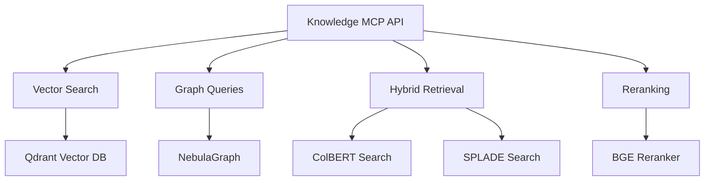

# Knowledge MCP API Reference

The Knowledge MCP server provides advanced knowledge retrieval capabilities including vector search, graph database queries, hybrid retrieval, and content reranking. This service enables sophisticated information discovery and relationship analysis.

## Base Information

**Base URL**: `http://localhost:8082`  
**Version**: 0.1.0  
**OpenAPI Spec**: `/docs`

## Service Architecture



## Authentication

All requests require tenant context for multi-tenant isolation:

```bash
curl -X POST http://localhost:8082/tools/vector_search \
  -H "Content-Type: application/json" \
  -d '{"tenant_id": "your-tenant-id", "query": "strategic planning"}'
```

## Service Information

### GET /info

Get service capabilities and status.

**Response:**
```json
{
  "name": "knowledge-mcp",
  "version": "0.1.0",
  "capabilities": [
    "vector.search",
    "keyword.search",
    "graph.community_summaries",
    "graphrag.run",
    "colbert.search",
    "splade.search",
    "rerank.bge"
  ],
  "service": {
    "collections": ["stratmaster_knowledge"],
    "dense_index": "stratmaster_knowledge",
    "sparse_index": "stratmaster_sparse",
    "graph_space": "stratmaster_graph",
    "connectors": {
      "vector_db": "connected",
      "graph_db": "connected",
      "colbert": "ready",
      "splade": "ready",
      "reranker": "ready"
    }
  }
}
```

### GET /healthz

Health check endpoint.

**Response:**
```json
{
  "status": "ok"
}
```

## Vector Search

### POST /tools/vector_search

Perform semantic vector search using dense embeddings.

**Request Body:**
```json
{
  "tenant_id": "string",
  "query": "string",
  "limit": "integer (1-100, default: 10)",
  "score_threshold": "number (0.0-1.0, optional)",
  "filter": {
    "category": "string (optional)",
    "date_range": {
      "start": "ISO 8601 date (optional)",
      "end": "ISO 8601 date (optional)"
    },
    "source_types": ["string (optional)"]
  }
}
```

**Response:**
```json
{
  "query": "strategic planning methodologies",
  "results": [
    {
      "id": "doc_123",
      "content": "Strategic planning is a systematic process for envisioning...",
      "metadata": {
        "title": "Strategic Planning Best Practices",
        "source": "Harvard Business Review",
        "category": "strategy",
        "published_date": "2024-01-10T00:00:00Z",
        "word_count": 2500
      },
      "score": 0.892,
      "embedding_model": "text-embedding-ada-002"
    }
  ],
  "total_results": 45,
  "search_time_ms": 125
}
```

**Example:**
```bash
curl -X POST http://localhost:8082/tools/vector_search \
  -H "Content-Type: application/json" \
  -d '{
    "tenant_id": "tenant-abc",
    "query": "competitive analysis frameworks",
    "limit": 15,
    "score_threshold": 0.75,
    "filter": {
      "category": "competitive_intelligence",
      "date_range": {
        "start": "2023-01-01T00:00:00Z"
      }
    }
  }'
```

## Graph Queries

### POST /tools/graph_query

Execute graph database queries for relationship analysis.

**Request Body:**
```json
{
  "tenant_id": "string",
  "query_type": "entity_relationships | community_detection | path_finding",
  "parameters": {
    "entity_id": "string (for entity_relationships)",
    "entity_type": "string (optional)",
    "max_depth": "integer (1-5, default: 2)",
    "relationship_types": ["string (optional)"],
    "min_confidence": "number (0.0-1.0, optional)"
  }
}
```

**Response:**
```json
{
  "query_type": "entity_relationships",
  "entity_id": "company_tesla",
  "relationships": [
    {
      "source": {
        "id": "company_tesla",
        "type": "company",
        "name": "Tesla Inc.",
        "properties": {
          "industry": "automotive",
          "founded": "2003",
          "market_cap": "800B"
        }
      },
      "relationship": {
        "type": "COMPETES_WITH",
        "confidence": 0.89,
        "strength": "high",
        "evidence_count": 15
      },
      "target": {
        "id": "company_rivian",
        "type": "company",
        "name": "Rivian Automotive",
        "properties": {
          "industry": "automotive",
          "founded": "2009",
          "focus": "electric_vehicles"
        }
      }
    }
  ],
  "community_info": {
    "community_id": "auto_ev_cluster",
    "size": 12,
    "centrality_score": 0.78
  }
}
```

### POST /tools/community_summaries

Get community summaries from graph analysis.

**Request Body:**
```json
{
  "tenant_id": "string",
  "community_level": "integer (0-3, default: 1)",
  "summary_length": "short | medium | long (default: medium)",
  "include_entities": "boolean (default: true)"
}
```

**Response:**
```json
{
  "communities": [
    {
      "id": "community_001",
      "level": 1,
      "size": 25,
      "summary": "This community represents the electric vehicle ecosystem, centered around Tesla, Rivian, and Ford's electric division. Key themes include battery technology, charging infrastructure, and regulatory compliance.",
      "key_entities": [
        {
          "id": "company_tesla",
          "name": "Tesla Inc.",
          "centrality": 0.92,
          "entity_type": "company"
        },
        {
          "id": "technology_battery",
          "name": "Lithium Battery Technology",
          "centrality": 0.85,
          "entity_type": "technology"
        }
      ],
      "dominant_themes": [
        "electric_vehicles",
        "sustainable_transport",
        "battery_innovation"
      ]
    }
  ]
}
```

## Hybrid Retrieval

### POST /tools/hybrid_search

Combine vector and keyword search for comprehensive retrieval.

**Request Body:**
```json
{
  "tenant_id": "string",
  "query": "string",
  "vector_weight": "number (0.0-1.0, default: 0.7)",
  "keyword_weight": "number (0.0-1.0, default: 0.3)",
  "limit": "integer (1-100, default: 10)",
  "rerank": "boolean (default: true)",
  "diversify": "boolean (default: false)"
}
```

**Response:**
```json
{
  "query": "AI adoption in healthcare",
  "results": [
    {
      "id": "doc_456",
      "content": "Healthcare organizations are increasingly adopting AI solutions...",
      "metadata": {
        "title": "AI in Healthcare: 2024 Adoption Trends",
        "source": "McKinsey Health Institute",
        "category": "healthcare_technology"
      },
      "scores": {
        "vector_score": 0.88,
        "keyword_score": 0.92,
        "hybrid_score": 0.896,
        "rerank_score": 0.934
      },
      "retrieval_method": "hybrid",
      "rank": 1
    }
  ],
  "retrieval_stats": {
    "vector_results": 50,
    "keyword_results": 35,
    "combined_results": 65,
    "reranked": true,
    "search_time_ms": 180
  }
}
```

## Advanced Search Methods

### POST /tools/colbert_search

High-precision retrieval using ColBERT late interaction.

**Request Body:**
```json
{
  "tenant_id": "string",
  "query": "string",
  "limit": "integer (1-50, default: 10)",
  "passage_length": "integer (64-512, default: 256)",
  "similarity_metric": "cosine | dot_product (default: cosine)"
}
```

### POST /tools/splade_search

Sparse retrieval using SPLADE learned sparse representations.

**Request Body:**
```json
{
  "tenant_id": "string",
  "query": "string",
  "limit": "integer (1-50, default: 10)",
  "sparsity_threshold": "number (0.01-1.0, default: 0.1)",
  "expansion_terms": "integer (0-50, default: 20)"
}
```

## Content Reranking

### POST /tools/rerank

Rerank search results using advanced neural reranking models.

**Request Body:**
```json
{
  "tenant_id": "string",
  "query": "string",
  "documents": [
    {
      "id": "string",
      "content": "string",
      "metadata": "object (optional)"
    }
  ],
  "model": "bge-reranker-large | bge-reranker-base (default: bge-reranker-large)",
  "top_k": "integer (1-100, optional)"
}
```

**Response:**
```json
{
  "query": "strategic planning frameworks",
  "reranked_results": [
    {
      "id": "doc_789",
      "content": "The Balanced Scorecard framework provides...",
      "metadata": {
        "title": "Strategic Planning Frameworks Comparison"
      },
      "original_rank": 3,
      "rerank_score": 0.943,
      "new_rank": 1,
      "score_improvement": 0.127
    }
  ],
  "reranking_stats": {
    "model_used": "bge-reranker-large",
    "documents_processed": 20,
    "reranking_time_ms": 89,
    "avg_score_improvement": 0.073
  }
}
```

## Configuration

### Environment Variables

| Variable | Description | Default |
|----------|-------------|---------|
| `KNOWLEDGE_MCP_HOST` | Server bind host | `127.0.0.1` |
| `KNOWLEDGE_MCP_PORT` | Server port | `8082` |
| `KNOWLEDGE_MCP_LOG_LEVEL` | Log level | `INFO` |
| `QDRANT_URL` | Qdrant vector DB URL | `http://localhost:6333` |
| `QDRANT_API_KEY` | Qdrant API key | `""` |
| `NEBULA_HOSTS` | NebulaGraph hosts | `localhost:9669` |
| `NEBULA_USERNAME` | NebulaGraph username | `root` |
| `NEBULA_PASSWORD` | NebulaGraph password | `nebula` |
| `COLBERT_MODEL_PATH` | ColBERT model path | `./models/colbert` |
| `SPLADE_MODEL_PATH` | SPLADE model path | `./models/splade` |
| `BGE_RERANKER_MODEL` | BGE reranker model | `bge-reranker-large` |

### Collection Configuration

```yaml
# config/knowledge-mcp.yaml
vector:
  collection: "stratmaster_knowledge"
  dimension: 1536
  distance_metric: "cosine"
  hnsw_config:
    m: 16
    ef_construct: 200

graph:
  space: "stratmaster_graph"
  partition_num: 10
  replica_factor: 1

retrieval:
  models:
    colbert:
      checkpoint: "colbert-ir/colbertv2.0"
      max_tokens: 512
    splade:
      model: "naver/splade-cocondenser-ensembledistil"
      sparsity: 0.1
    reranker:
      model: "BAAI/bge-reranker-large"
      batch_size: 32
```

## SDK Examples

### Python Client

```python
import httpx
from typing import Dict, List, Any, Optional

class KnowledgeMCPClient:
    def __init__(self, base_url: str = "http://localhost:8082"):
        self.base_url = base_url
        self.client = httpx.AsyncClient(base_url=base_url)
    
    async def vector_search(
        self,
        tenant_id: str,
        query: str,
        limit: int = 10,
        score_threshold: Optional[float] = None,
        filters: Optional[Dict] = None
    ) -> Dict[str, Any]:
        """Perform vector search"""
        payload = {
            "tenant_id": tenant_id,
            "query": query,
            "limit": limit
        }
        
        if score_threshold:
            payload["score_threshold"] = score_threshold
        if filters:
            payload["filter"] = filters
            
        response = await self.client.post("/tools/vector_search", json=payload)
        response.raise_for_status()
        return response.json()
    
    async def hybrid_search(
        self,
        tenant_id: str,
        query: str,
        vector_weight: float = 0.7,
        keyword_weight: float = 0.3,
        limit: int = 10,
        rerank: bool = True
    ) -> Dict[str, Any]:
        """Perform hybrid search"""
        response = await self.client.post(
            "/tools/hybrid_search",
            json={
                "tenant_id": tenant_id,
                "query": query,
                "vector_weight": vector_weight,
                "keyword_weight": keyword_weight,
                "limit": limit,
                "rerank": rerank
            }
        )
        response.raise_for_status()
        return response.json()
    
    async def graph_query(
        self,
        tenant_id: str,
        query_type: str,
        parameters: Dict[str, Any]
    ) -> Dict[str, Any]:
        """Execute graph query"""
        response = await self.client.post(
            "/tools/graph_query",
            json={
                "tenant_id": tenant_id,
                "query_type": query_type,
                "parameters": parameters
            }
        )
        response.raise_for_status()
        return response.json()
    
    async def rerank(
        self,
        tenant_id: str,
        query: str,
        documents: List[Dict],
        model: str = "bge-reranker-large",
        top_k: Optional[int] = None
    ) -> Dict[str, Any]:
        """Rerank documents"""
        payload = {
            "tenant_id": tenant_id,
            "query": query,
            "documents": documents,
            "model": model
        }
        
        if top_k:
            payload["top_k"] = top_k
            
        response = await self.client.post("/tools/rerank", json=payload)
        response.raise_for_status()
        return response.json()

# Usage example
async def main():
    client = KnowledgeMCPClient()
    
    # Vector search
    vector_results = await client.vector_search(
        tenant_id="my-tenant",
        query="competitive analysis methodologies",
        limit=20,
        score_threshold=0.8
    )
    
    # Hybrid search with reranking
    hybrid_results = await client.hybrid_search(
        tenant_id="my-tenant",
        query="market entry strategies",
        vector_weight=0.6,
        keyword_weight=0.4,
        rerank=True
    )
    
    # Graph relationship query
    relationships = await client.graph_query(
        tenant_id="my-tenant",
        query_type="entity_relationships",
        parameters={
            "entity_id": "company_apple",
            "max_depth": 2,
            "relationship_types": ["COMPETES_WITH", "PARTNERS_WITH"]
        }
    )
    
    # Rerank search results
    documents = [
        {
            "id": "doc1",
            "content": "Strategic planning involves systematic analysis...",
            "metadata": {"source": "McKinsey"}
        },
        {
            "id": "doc2", 
            "content": "Competitive intelligence gathering requires...",
            "metadata": {"source": "BCG"}
        }
    ]
    
    reranked = await client.rerank(
        tenant_id="my-tenant",
        query="strategic planning process",
        documents=documents,
        top_k=5
    )
```

## Advanced Integration Patterns

### Multi-Modal Knowledge Retrieval

```python
class AdvancedKnowledgeRetrieval:
    def __init__(self):
        self.knowledge_client = KnowledgeMCPClient()
    
    async def comprehensive_search(
        self,
        tenant_id: str,
        query: str,
        include_relationships: bool = True
    ) -> Dict[str, Any]:
        """Perform comprehensive multi-modal search"""
        
        # Step 1: Hybrid search for primary results
        primary_results = await self.knowledge_client.hybrid_search(
            tenant_id=tenant_id,
            query=query,
            limit=30,
            rerank=True
        )
        
        # Step 2: Extract entities for relationship analysis
        if include_relationships:
            entities = self._extract_entities(primary_results["results"])
            
            relationships = []
            for entity in entities[:5]:  # Top 5 entities
                entity_rels = await self.knowledge_client.graph_query(
                    tenant_id=tenant_id,
                    query_type="entity_relationships",
                    parameters={
                        "entity_id": entity["id"],
                        "max_depth": 2
                    }
                )
                relationships.extend(entity_rels.get("relationships", []))
        
        # Step 3: Get community context
        communities = await self.knowledge_client.community_summaries(
            tenant_id=tenant_id,
            community_level=1,
            summary_length="medium"
        )
        
        return {
            "primary_results": primary_results["results"][:10],
            "relationships": relationships if include_relationships else [],
            "community_context": communities.get("communities", [])[:3],
            "search_strategy": "multi_modal_comprehensive"
        }
    
    def _extract_entities(self, results: List[Dict]) -> List[Dict]:
        """Extract entities from search results"""
        # Implementation would use NER or entity linking
        entities = []
        for result in results:
            # Extract entities from content and metadata
            # This is a simplified example
            if "metadata" in result and "entities" in result["metadata"]:
                entities.extend(result["metadata"]["entities"])
        return entities
```

### Intelligent Query Expansion

```python
class QueryExpansion:
    def __init__(self):
        self.knowledge_client = KnowledgeMCPClient()
    
    async def expand_query(
        self,
        tenant_id: str,
        original_query: str,
        expansion_methods: List[str] = ["semantic", "entity", "community"]
    ) -> Dict[str, Any]:
        """Expand query using multiple methods"""
        
        expanded_queries = {"original": original_query}
        
        if "semantic" in expansion_methods:
            # Use vector similarity to find related concepts
            semantic_results = await self.knowledge_client.vector_search(
                tenant_id=tenant_id,
                query=original_query,
                limit=5,
                score_threshold=0.8
            )
            
            # Extract key terms for expansion
            expanded_queries["semantic"] = self._extract_key_terms(
                semantic_results["results"]
            )
        
        if "entity" in expansion_methods:
            # Find related entities through graph traversal
            entities = self._extract_entities_from_query(original_query)
            if entities:
                entity_expansion = await self.knowledge_client.graph_query(
                    tenant_id=tenant_id,
                    query_type="entity_relationships",
                    parameters={
                        "entity_id": entities[0]["id"],
                        "max_depth": 1
                    }
                )
                expanded_queries["entity"] = self._build_entity_query(
                    entity_expansion
                )
        
        if "community" in expansion_methods:
            # Use community summaries for context expansion
            communities = await self.knowledge_client.community_summaries(
                tenant_id=tenant_id,
                community_level=1
            )
            expanded_queries["community"] = self._extract_community_terms(
                communities
            )
        
        return expanded_queries
```

## Performance Optimization

### Caching Strategy

```python
import asyncio
from typing import Dict, Any
import hashlib
import json

class KnowledgeCache:
    def __init__(self, redis_client, ttl: int = 3600):
        self.redis = redis_client
        self.ttl = ttl
        self.knowledge_client = KnowledgeMCPClient()
    
    def _generate_cache_key(self, operation: str, **kwargs) -> str:
        """Generate cache key from operation and parameters"""
        params_str = json.dumps(kwargs, sort_keys=True)
        params_hash = hashlib.md5(params_str.encode()).hexdigest()
        return f"knowledge:{operation}:{params_hash}"
    
    async def cached_vector_search(
        self,
        tenant_id: str,
        query: str,
        **kwargs
    ) -> Dict[str, Any]:
        """Vector search with caching"""
        cache_key = self._generate_cache_key(
            "vector_search", 
            tenant_id=tenant_id, 
            query=query, 
            **kwargs
        )
        
        # Try cache first
        cached = await self.redis.get(cache_key)
        if cached:
            return json.loads(cached)
        
        # Fallback to API
        results = await self.knowledge_client.vector_search(
            tenant_id, query, **kwargs
        )
        
        # Cache results
        await self.redis.setex(
            cache_key,
            self.ttl,
            json.dumps(results)
        )
        
        return results
    
    async def batch_vector_search(
        self,
        tenant_id: str,
        queries: List[str],
        **kwargs
    ) -> Dict[str, Any]:
        """Batch vector search with parallel execution"""
        tasks = [
            self.cached_vector_search(tenant_id, query, **kwargs)
            for query in queries
        ]
        
        results = await asyncio.gather(*tasks)
        
        return {
            "queries": queries,
            "results": results,
            "batch_size": len(queries)
        }
```

## Error Handling

### Common Error Responses

| Status Code | Error Type | Description |
|-------------|------------|-------------|
| 400 | `INVALID_QUERY` | Query parameters invalid |
| 404 | `COLLECTION_NOT_FOUND` | Vector collection doesn't exist |
| 422 | `VALIDATION_ERROR` | Request body validation failed |
| 500 | `VECTOR_DB_ERROR` | Vector database connection error |
| 503 | `MODEL_UNAVAILABLE` | ML model not loaded or available |

### Retry Strategy

```python
import asyncio
from typing import Optional
import random

class KnowledgeClientWithRetry:
    def __init__(self, max_retries: int = 3, base_delay: float = 1.0):
        self.client = KnowledgeMCPClient()
        self.max_retries = max_retries
        self.base_delay = base_delay
    
    async def search_with_retry(
        self,
        search_func,
        *args,
        **kwargs
    ) -> Optional[Dict[str, Any]]:
        """Execute search with exponential backoff retry"""
        
        for attempt in range(self.max_retries + 1):
            try:
                return await search_func(*args, **kwargs)
            except httpx.HTTPStatusError as e:
                if e.response.status_code == 503 and attempt < self.max_retries:
                    # Service unavailable - retry with backoff
                    delay = self.base_delay * (2 ** attempt) + random.uniform(0, 1)
                    await asyncio.sleep(delay)
                    continue
                else:
                    raise
            except httpx.ConnectError as e:
                if attempt < self.max_retries:
                    # Connection error - retry with backoff
                    delay = self.base_delay * (2 ** attempt)
                    await asyncio.sleep(delay)
                    continue
                else:
                    raise
        
        return None
```

## Best Practices

### Query Optimization

1. **Use Filters**: Apply metadata filters to reduce search space
2. **Score Thresholds**: Set appropriate similarity thresholds
3. **Batch Operations**: Group multiple queries for efficiency
4. **Caching**: Cache frequent queries and results

### Vector Search Tips

1. **Query Quality**: Use descriptive, specific queries
2. **Embedding Models**: Choose appropriate embedding models for your domain
3. **Index Configuration**: Optimize HNSW parameters for your use case
4. **Result Diversity**: Use diversification for broader coverage

### Graph Query Optimization

1. **Depth Limits**: Limit traversal depth to avoid expensive queries
2. **Relationship Filtering**: Filter by relationship types
3. **Community Analysis**: Use community detection for clustering insights
4. **Centrality Metrics**: Leverage centrality scores for entity importance

## Monitoring and Metrics

### Key Metrics

- Search latency percentiles (p50, p95, p99)
- Search result quality scores
- Cache hit rates
- Model inference times
- Graph query complexity

### Health Checks

```bash
# Service health
curl http://localhost:8082/healthz

# Service capabilities
curl http://localhost:8082/info

# Vector database connectivity
curl -X POST http://localhost:8082/tools/vector_search \
  -H "Content-Type: application/json" \
  -d '{"tenant_id": "health-check", "query": "test", "limit": 1}'
```

## Related Services

- [Research MCP](research-mcp.md) - Web search and content crawling
- [Router MCP](router-mcp.md) - Request routing and orchestration
- [Evals MCP](evals-mcp.md) - Content evaluation and quality scoring

For integration patterns, see the [API Gateway Reference](gateway.md).