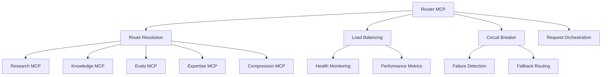

# Router MCP API Reference

The Router MCP server provides intelligent request routing, load balancing, and service orchestration across the StratMaster MCP ecosystem. It handles request distribution, failover, and workflow coordination.

## Base Information

**Base URL**: `http://localhost:8083`  
**Version**: 0.1.0  
**OpenAPI Spec**: `/docs`

## Service Architecture



## Core Concepts

### Service Discovery
The router maintains a dynamic registry of available MCP services with health status and capabilities.

### Request Routing
Intelligent routing based on request type, service availability, and load balancing algorithms.

### Circuit Breaking
Automatic failure detection and circuit breaking to prevent cascade failures.

### Orchestration
Coordination of multi-service workflows and request pipelines.

## Service Information

### GET /info

Get router configuration and registered services.

**Response:**
```json
{
  "name": "router-mcp",
  "version": "0.1.0",
  "capabilities": [
    "service_discovery",
    "load_balancing", 
    "circuit_breaking",
    "request_orchestration",
    "health_monitoring"
  ],
  "registered_services": {
    "research": {
      "instances": 3,
      "healthy_instances": 3,
      "base_url": "http://research-mcp:8081",
      "capabilities": ["metasearch", "crawl", "resources"],
      "load_balancing": "round_robin"
    },
    "knowledge": {
      "instances": 2,
      "healthy_instances": 2,
      "base_url": "http://knowledge-mcp:8082",
      "capabilities": ["vector_search", "graph_query", "rerank"],
      "load_balancing": "least_connections"
    }
  },
  "routing_rules": 15,
  "circuit_breakers": 8
}
```

### GET /healthz

Health check with service status summary.

**Response:**
```json
{
  "status": "ok",
  "service_health": {
    "research": "healthy",
    "knowledge": "healthy", 
    "evals": "degraded",
    "expertise": "healthy",
    "compression": "maintenance"
  },
  "circuit_breakers": {
    "research": "closed",
    "knowledge": "closed",
    "evals": "half_open"
  }
}
```

## Request Routing

### POST /route

Route requests to appropriate MCP services with automatic load balancing.

**Request Body:**
```json
{
  "tenant_id": "string",
  "service": "research | knowledge | evals | expertise | compression",
  "endpoint": "string",
  "payload": "object",
  "routing_preferences": {
    "prefer_healthy": "boolean (default: true)",
    "max_retries": "integer (0-5, default: 2)",
    "timeout_ms": "integer (1000-30000, default: 10000)",
    "load_balancing": "round_robin | least_connections | weighted | random"
  }
}
```

**Response:**
```json
{
  "request_id": "req_abc123",
  "routed_to": {
    "service": "research",
    "instance": "research-mcp-2",
    "endpoint": "/tools/metasearch",
    "routing_method": "round_robin"
  },
  "response": {
    "status_code": 200,
    "data": {
      "query": "AI market trends",
      "results": [...]
    }
  },
  "performance": {
    "total_time_ms": 850,
    "routing_time_ms": 15,
    "service_time_ms": 835,
    "retry_count": 0
  }
}
```

**Example:**
```bash
curl -X POST http://localhost:8083/route \
  -H "Content-Type: application/json" \
  -d '{
    "tenant_id": "tenant-abc",
    "service": "research",
    "endpoint": "/tools/metasearch",
    "payload": {
      "tenant_id": "tenant-abc",
      "query": "competitive analysis",
      "limit": 10
    },
    "routing_preferences": {
      "max_retries": 3,
      "timeout_ms": 15000
    }
  }'
```

## Service Orchestration

### POST /orchestrate

Execute multi-service workflows with dependency management.

**Request Body:**
```json
{
  "tenant_id": "string",
  "workflow": {
    "name": "comprehensive_research",
    "steps": [
      {
        "id": "search",
        "service": "research",
        "endpoint": "/tools/metasearch",
        "payload": {
          "query": "{{workflow.input.query}}",
          "limit": 20
        },
        "timeout_ms": 10000
      },
      {
        "id": "vector_search",
        "service": "knowledge", 
        "endpoint": "/tools/vector_search",
        "payload": {
          "query": "{{workflow.input.query}}",
          "limit": 15
        },
        "depends_on": [],
        "parallel": true
      },
      {
        "id": "evaluation",
        "service": "evals",
        "endpoint": "/tools/evaluate_sources",
        "payload": {
          "sources": "{{steps.search.response.results}}",
          "criteria": ["credibility", "relevance", "recency"]
        },
        "depends_on": ["search"],
        "timeout_ms": 20000
      }
    ]
  },
  "input": {
    "query": "AI adoption in healthcare 2024"
  },
  "execution_config": {
    "max_parallel": 5,
    "fail_fast": false,
    "retry_failed_steps": true
  }
}
```

**Response:**
```json
{
  "workflow_id": "wf_def456",
  "execution_id": "exec_789",
  "status": "completed",
  "results": {
    "search": {
      "status": "success",
      "execution_time_ms": 1200,
      "data": {
        "query": "AI adoption in healthcare 2024",
        "results": [...]
      }
    },
    "vector_search": {
      "status": "success", 
      "execution_time_ms": 800,
      "data": {
        "query": "AI adoption in healthcare 2024",
        "results": [...]
      }
    },
    "evaluation": {
      "status": "success",
      "execution_time_ms": 2100,
      "data": {
        "evaluated_sources": [...],
        "quality_scores": {...}
      }
    }
  },
  "execution_summary": {
    "total_time_ms": 3250,
    "steps_executed": 3,
    "steps_succeeded": 3,
    "steps_failed": 0,
    "parallel_execution": true,
    "retries_used": 0
  }
}
```

## Load Balancing

### GET /services/{service}/instances

Get available instances for a service.

**Response:**
```json
{
  "service": "research",
  "instances": [
    {
      "id": "research-mcp-1",
      "url": "http://research-mcp-1:8081",
      "status": "healthy",
      "load": {
        "cpu_percent": 45.2,
        "memory_percent": 62.1,
        "active_connections": 15,
        "requests_per_second": 23.5
      },
      "performance": {
        "avg_response_time_ms": 125,
        "success_rate": 0.996,
        "last_health_check": "2024-01-15T10:45:00Z"
      }
    }
  ],
  "load_balancing_algorithm": "round_robin",
  "health_check_interval": 30
}
```

### POST /services/{service}/rebalance

Trigger load rebalancing for a service.

**Request Body:**
```json
{
  "algorithm": "round_robin | least_connections | weighted | random",
  "force_redistribution": "boolean (default: false)",
  "drain_unhealthy": "boolean (default: true)"
}
```

## Circuit Breaker Management

### GET /circuit-breakers

Get circuit breaker status for all services.

**Response:**
```json
{
  "circuit_breakers": {
    "research": {
      "state": "closed",
      "failure_count": 2,
      "failure_threshold": 10,
      "success_count": 156,
      "last_failure": "2024-01-15T09:30:00Z",
      "next_attempt": null
    },
    "knowledge": {
      "state": "closed", 
      "failure_count": 0,
      "failure_threshold": 10,
      "success_count": 89,
      "last_failure": null,
      "next_attempt": null
    },
    "evals": {
      "state": "half_open",
      "failure_count": 12,
      "failure_threshold": 10,
      "success_count": 3,
      "last_failure": "2024-01-15T10:40:00Z",
      "next_attempt": "2024-01-15T10:50:00Z"
    }
  }
}
```

### POST /circuit-breakers/{service}/reset

Manually reset a circuit breaker.

**Response:**
```json
{
  "service": "evals",
  "previous_state": "open",
  "new_state": "closed",
  "reset_timestamp": "2024-01-15T10:45:00Z",
  "reset_reason": "manual_intervention"
}
```

## Configuration Management

### Environment Variables

| Variable | Description | Default |
|----------|-------------|---------|
| `ROUTER_MCP_HOST` | Server bind host | `127.0.0.1` |
| `ROUTER_MCP_PORT` | Server port | `8083` |
| `ROUTER_MCP_LOG_LEVEL` | Log level | `INFO` |
| `SERVICE_DISCOVERY_INTERVAL` | Service discovery interval (seconds) | `30` |
| `HEALTH_CHECK_INTERVAL` | Health check interval (seconds) | `15` |
| `CIRCUIT_BREAKER_THRESHOLD` | Failure threshold for circuit breaker | `10` |
| `CIRCUIT_BREAKER_TIMEOUT` | Circuit breaker timeout (seconds) | `60` |
| `MAX_RETRIES_DEFAULT` | Default max retries | `2` |
| `REQUEST_TIMEOUT_DEFAULT` | Default request timeout (ms) | `10000` |

### Service Configuration

```yaml
# config/router-mcp.yaml
services:
  research:
    instances:
      - url: "http://research-mcp-1:8081"
        weight: 1.0
      - url: "http://research-mcp-2:8081"
        weight: 1.0
    load_balancing: "round_robin"
    health_check:
      endpoint: "/healthz"
      interval: 15
      timeout: 5
    circuit_breaker:
      failure_threshold: 10
      recovery_timeout: 60
      half_open_max_calls: 5

  knowledge:
    instances:
      - url: "http://knowledge-mcp-1:8082"
        weight: 1.0
      - url: "http://knowledge-mcp-2:8082"
        weight: 0.8  # Lower spec instance
    load_balancing: "least_connections"
    health_check:
      endpoint: "/healthz"
      interval: 15
      timeout: 5

routing_rules:
  - pattern: "/tools/metasearch"
    service: "research"
    load_balancing: "round_robin"
  - pattern: "/tools/crawl"
    service: "research"
    load_balancing: "least_connections"
  - pattern: "/tools/vector_search"
    service: "knowledge"
    load_balancing: "least_connections"
  - pattern: "/tools/hybrid_search"
    service: "knowledge"
    load_balancing: "weighted"
```

## SDK Examples

### Python Client

```python
import httpx
from typing import Dict, List, Any, Optional
import asyncio

class RouterMCPClient:
    def __init__(self, base_url: str = "http://localhost:8083"):
        self.base_url = base_url
        self.client = httpx.AsyncClient(base_url=base_url)
    
    async def route_request(
        self,
        tenant_id: str,
        service: str,
        endpoint: str,
        payload: Dict[str, Any],
        routing_preferences: Optional[Dict] = None
    ) -> Dict[str, Any]:
        """Route request to appropriate service"""
        request_data = {
            "tenant_id": tenant_id,
            "service": service,
            "endpoint": endpoint,
            "payload": payload
        }
        
        if routing_preferences:
            request_data["routing_preferences"] = routing_preferences
            
        response = await self.client.post("/route", json=request_data)
        response.raise_for_status()
        return response.json()
    
    async def orchestrate_workflow(
        self,
        tenant_id: str,
        workflow: Dict[str, Any],
        input_data: Dict[str, Any],
        execution_config: Optional[Dict] = None
    ) -> Dict[str, Any]:
        """Execute orchestrated workflow"""
        request_data = {
            "tenant_id": tenant_id,
            "workflow": workflow,
            "input": input_data
        }
        
        if execution_config:
            request_data["execution_config"] = execution_config
            
        response = await self.client.post("/orchestrate", json=request_data)
        response.raise_for_status()
        return response.json()
    
    async def get_service_status(self) -> Dict[str, Any]:
        """Get overall service status"""
        response = await self.client.get("/healthz")
        response.raise_for_status()
        return response.json()
    
    async def get_circuit_breaker_status(self) -> Dict[str, Any]:
        """Get circuit breaker status"""
        response = await self.client.get("/circuit-breakers")
        response.raise_for_status()
        return response.json()

# High-level convenience methods
class StratMasterRouter:
    def __init__(self):
        self.router = RouterMCPClient()
    
    async def research(
        self,
        tenant_id: str,
        query: str,
        search_type: str = "metasearch",
        **kwargs
    ) -> Dict[str, Any]:
        """Convenient research routing"""
        endpoint_map = {
            "metasearch": "/tools/metasearch",
            "crawl": "/tools/crawl"
        }
        
        endpoint = endpoint_map.get(search_type, "/tools/metasearch")
        payload = {"tenant_id": tenant_id, "query": query, **kwargs}
        
        return await self.router.route_request(
            tenant_id=tenant_id,
            service="research",
            endpoint=endpoint,
            payload=payload
        )
    
    async def knowledge_search(
        self,
        tenant_id: str,
        query: str,
        search_type: str = "vector",
        **kwargs
    ) -> Dict[str, Any]:
        """Convenient knowledge search routing"""
        endpoint_map = {
            "vector": "/tools/vector_search",
            "hybrid": "/tools/hybrid_search",
            "graph": "/tools/graph_query"
        }
        
        endpoint = endpoint_map.get(search_type, "/tools/vector_search")
        payload = {"tenant_id": tenant_id, "query": query, **kwargs}
        
        return await self.router.route_request(
            tenant_id=tenant_id,
            service="knowledge",
            endpoint=endpoint,
            payload=payload
        )
    
    async def comprehensive_analysis(
        self,
        tenant_id: str,
        research_question: str
    ) -> Dict[str, Any]:
        """Run comprehensive analysis workflow"""
        workflow = {
            "name": "comprehensive_analysis",
            "steps": [
                {
                    "id": "web_search",
                    "service": "research",
                    "endpoint": "/tools/metasearch",
                    "payload": {
                        "tenant_id": tenant_id,
                        "query": research_question,
                        "limit": 20
                    }
                },
                {
                    "id": "knowledge_search",
                    "service": "knowledge",
                    "endpoint": "/tools/hybrid_search",
                    "payload": {
                        "tenant_id": tenant_id,
                        "query": research_question,
                        "limit": 15,
                        "rerank": True
                    },
                    "parallel": True
                },
                {
                    "id": "evaluate_sources",
                    "service": "evals",
                    "endpoint": "/tools/evaluate_sources",
                    "payload": {
                        "sources": "{{steps.web_search.response.results}}",
                        "criteria": ["credibility", "relevance", "recency"]
                    },
                    "depends_on": ["web_search"]
                }
            ]
        }
        
        return await self.router.orchestrate_workflow(
            tenant_id=tenant_id,
            workflow=workflow,
            input_data={"research_question": research_question}
        )

# Usage example
async def main():
    router = StratMasterRouter()
    
    # Simple research request
    research_results = await router.research(
        tenant_id="my-tenant",
        query="AI market trends 2024",
        search_type="metasearch",
        limit=15
    )
    
    # Knowledge search
    knowledge_results = await router.knowledge_search(
        tenant_id="my-tenant",
        query="competitive analysis frameworks",
        search_type="hybrid",
        limit=20
    )
    
    # Comprehensive analysis workflow
    analysis_results = await router.comprehensive_analysis(
        tenant_id="my-tenant",
        research_question="What are the key trends in AI adoption for healthcare?"
    )
    
    print("Analysis completed:", analysis_results["execution_summary"])
```

## Advanced Routing Patterns

### Intelligent Request Routing

```python
class IntelligentRouter:
    def __init__(self):
        self.router_client = RouterMCPClient()
        self.service_metrics = {}
    
    async def smart_route(
        self,
        tenant_id: str,
        request_type: str,
        payload: Dict[str, Any],
        priority: str = "normal"
    ) -> Dict[str, Any]:
        """Route based on request characteristics and service performance"""
        
        # Analyze request complexity
        complexity = self._analyze_request_complexity(request_type, payload)
        
        # Get current service performance
        await self._update_service_metrics()
        
        # Select optimal routing strategy
        routing_preferences = self._select_routing_strategy(
            complexity,
            priority,
            self.service_metrics
        )
        
        # Determine target service and endpoint
        service, endpoint = self._resolve_service_endpoint(request_type)
        
        return await self.router_client.route_request(
            tenant_id=tenant_id,
            service=service,
            endpoint=endpoint,
            payload=payload,
            routing_preferences=routing_preferences
        )
    
    def _analyze_request_complexity(
        self,
        request_type: str,
        payload: Dict[str, Any]
    ) -> str:
        """Analyze request complexity for routing decisions"""
        complexity_indicators = {
            "query_length": len(payload.get("query", "")),
            "limit": payload.get("limit", 10),
            "filters": len(payload.get("filter", {})),
            "depth": payload.get("max_depth", 1)
        }
        
        if request_type in ["hybrid_search", "graph_query"]:
            return "high"
        elif complexity_indicators["query_length"] > 200 or complexity_indicators["limit"] > 50:
            return "medium"
        else:
            return "low"
    
    async def _update_service_metrics(self):
        """Update cached service performance metrics"""
        try:
            health_status = await self.router_client.get_service_status()
            self.service_metrics = health_status.get("service_health", {})
        except Exception as e:
            print(f"Failed to update service metrics: {e}")
    
    def _select_routing_strategy(
        self,
        complexity: str,
        priority: str,
        metrics: Dict[str, str]
    ) -> Dict[str, Any]:
        """Select routing strategy based on request characteristics"""
        base_strategy = {
            "prefer_healthy": True,
            "max_retries": 2,
            "timeout_ms": 10000
        }
        
        if complexity == "high":
            base_strategy.update({
                "load_balancing": "least_connections",
                "timeout_ms": 30000,
                "max_retries": 1  # Avoid retrying expensive operations
            })
        elif priority == "urgent":
            base_strategy.update({
                "load_balancing": "weighted",  # Prefer high-performance instances
                "timeout_ms": 5000,
                "max_retries": 3
            })
        
        return base_strategy
```

### Workflow Templates

```python
class WorkflowTemplates:
    """Pre-built workflow templates for common operations"""
    
    @staticmethod
    def market_analysis_workflow(tenant_id: str, market: str, timeframe: str):
        """Comprehensive market analysis workflow"""
        return {
            "name": "market_analysis",
            "steps": [
                {
                    "id": "market_research",
                    "service": "research",
                    "endpoint": "/tools/metasearch",
                    "payload": {
                        "tenant_id": tenant_id,
                        "query": f"{market} market analysis {timeframe}",
                        "limit": 25
                    },
                    "timeout_ms": 15000
                },
                {
                    "id": "competitive_landscape",
                    "service": "knowledge",
                    "endpoint": "/tools/graph_query",
                    "payload": {
                        "tenant_id": tenant_id,
                        "query_type": "entity_relationships",
                        "parameters": {
                            "entity_id": f"market_{market}",
                            "max_depth": 2
                        }
                    },
                    "parallel": True
                },
                {
                    "id": "trend_analysis",
                    "service": "knowledge",
                    "endpoint": "/tools/vector_search", 
                    "payload": {
                        "tenant_id": tenant_id,
                        "query": f"{market} trends opportunities {timeframe}",
                        "limit": 20,
                        "filter": {
                            "date_range": {
                                "start": "2023-01-01T00:00:00Z"
                            }
                        }
                    },
                    "parallel": True
                },
                {
                    "id": "source_evaluation",
                    "service": "evals",
                    "endpoint": "/tools/evaluate_sources",
                    "payload": {
                        "sources": "{{steps.market_research.response.results}}",
                        "criteria": ["credibility", "recency", "relevance"],
                        "market_context": market
                    },
                    "depends_on": ["market_research"]
                },
                {
                    "id": "synthesis",
                    "service": "expertise",
                    "endpoint": "/tools/synthesize_insights",
                    "payload": {
                        "research_data": "{{steps.market_research.response}}",
                        "knowledge_data": "{{steps.trend_analysis.response}}",
                        "competitive_data": "{{steps.competitive_landscape.response}}",
                        "evaluation_data": "{{steps.source_evaluation.response}}",
                        "synthesis_type": "market_analysis"
                    },
                    "depends_on": ["market_research", "trend_analysis", "competitive_landscape", "source_evaluation"]
                }
            ]
        }
    
    @staticmethod
    def competitive_intelligence_workflow(tenant_id: str, company: str, competitors: List[str]):
        """Competitive intelligence gathering workflow"""
        return {
            "name": "competitive_intelligence",
            "steps": [
                {
                    "id": "company_profile",
                    "service": "research",
                    "endpoint": "/tools/metasearch",
                    "payload": {
                        "tenant_id": tenant_id,
                        "query": f"{company} company profile strategy recent developments",
                        "limit": 15
                    }
                },
                {
                    "id": "competitor_analysis",
                    "service": "research",
                    "endpoint": "/tools/metasearch",
                    "payload": {
                        "tenant_id": tenant_id,
                        "query": f"{' '.join(competitors)} competitive analysis comparison",
                        "limit": 20
                    },
                    "parallel": True
                },
                {
                    "id": "relationship_mapping",
                    "service": "knowledge",
                    "endpoint": "/tools/graph_query",
                    "payload": {
                        "tenant_id": tenant_id,
                        "query_type": "entity_relationships",
                        "parameters": {
                            "entity_id": f"company_{company.lower().replace(' ', '_')}",
                            "max_depth": 3,
                            "relationship_types": ["COMPETES_WITH", "PARTNERS_WITH", "SUPPLIES_TO"]
                        }
                    },
                    "parallel": True
                },
                {
                    "id": "market_positioning",
                    "service": "knowledge",
                    "endpoint": "/tools/vector_search",
                    "payload": {
                        "tenant_id": tenant_id,
                        "query": f"{company} market position competitive advantage differentiation",
                        "limit": 15
                    },
                    "parallel": True
                }
            ]
        }
```

## Monitoring and Debugging

### Metrics Collection

```python
# Custom metrics for router performance
from prometheus_client import Counter, Histogram, Gauge

# Request metrics
ROUTED_REQUESTS = Counter('router_requests_total', 'Total routed requests', ['service', 'endpoint', 'status'])
REQUEST_DURATION = Histogram('router_request_duration_seconds', 'Request duration', ['service'])
ACTIVE_CONNECTIONS = Gauge('router_active_connections', 'Active connections', ['service'])

# Circuit breaker metrics
CIRCUIT_BREAKER_STATE = Gauge('circuit_breaker_state', 'Circuit breaker state', ['service'])
CIRCUIT_BREAKER_FAILURES = Counter('circuit_breaker_failures_total', 'Circuit breaker failures', ['service'])

# Workflow metrics
WORKFLOW_EXECUTIONS = Counter('workflow_executions_total', 'Workflow executions', ['workflow_name', 'status'])
WORKFLOW_STEP_DURATION = Histogram('workflow_step_duration_seconds', 'Workflow step duration', ['workflow_name', 'step_id'])
```

### Health Monitoring

```bash
# Check router health
curl http://localhost:8083/healthz

# Get detailed service information
curl http://localhost:8083/info

# Monitor circuit breaker status
curl http://localhost:8083/circuit-breakers

# Check specific service instances
curl http://localhost:8083/services/research/instances
```

## Error Handling and Resilience

### Circuit Breaker States

| State | Description | Behavior |
|-------|-------------|----------|
| `CLOSED` | Normal operation | Requests pass through normally |
| `OPEN` | Service unavailable | All requests immediately fail |
| `HALF_OPEN` | Testing recovery | Limited requests allowed to test service |

### Retry Strategies

```python
class RetryStrategy:
    """Configurable retry strategies for different scenarios"""
    
    @staticmethod
    def exponential_backoff(attempt: int, base_delay: float = 1.0) -> float:
        """Exponential backoff with jitter"""
        import random
        delay = base_delay * (2 ** attempt)
        jitter = random.uniform(0, 0.1) * delay
        return delay + jitter
    
    @staticmethod
    def linear_backoff(attempt: int, base_delay: float = 1.0) -> float:
        """Linear backoff"""
        return base_delay * attempt
    
    @staticmethod
    def fixed_delay(attempt: int, delay: float = 1.0) -> float:
        """Fixed delay between retries"""
        return delay
```

## Best Practices

### Routing Strategy Selection

1. **Round Robin**: Use for stateless services with similar capacity
2. **Least Connections**: Use for stateful services or varying request complexity
3. **Weighted**: Use when instances have different capacities
4. **Random**: Use for high-throughput, low-latency scenarios

### Circuit Breaker Configuration

1. **Failure Threshold**: Set based on acceptable error rate (typically 5-10 failures)
2. **Recovery Timeout**: Allow sufficient time for service recovery (30-60 seconds)
3. **Half-Open Calls**: Limit test calls during recovery (3-5 calls)

### Workflow Design

1. **Parallel Execution**: Use for independent operations
2. **Dependency Management**: Clearly define step dependencies
3. **Error Handling**: Design for partial failures
4. **Timeout Configuration**: Set appropriate timeouts for each step

## Related Services

- [Research MCP](research-mcp.md) - Web search and content crawling
- [Knowledge MCP](knowledge-mcp.md) - Vector and graph search capabilities
- [Evals MCP](evals-mcp.md) - Content evaluation and quality scoring
- [API Gateway](gateway.md) - Main application interface

For integration patterns and examples, see the [API Gateway Reference](gateway.md).