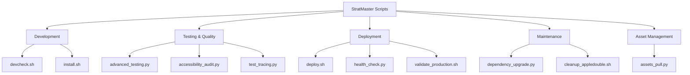

# Scripts Reference

StratMaster includes a comprehensive set of command-line scripts for development, deployment, testing, and maintenance. This reference documents all available scripts with usage examples and configuration options.

## Script Overview



## Development Scripts

### devcheck.sh

Comprehensive development environment validation and health checks.

**Location**: `scripts/devcheck.sh`  
**Purpose**: Validate development environment, run tests, and perform quality checks

```bash
# Basic usage
./scripts/devcheck.sh

# Run specific checks
./scripts/devcheck.sh --check-env
./scripts/devcheck.sh --check-tests
./scripts/devcheck.sh --check-docker

# Skip certain checks
./scripts/devcheck.sh --skip-tests
./scripts/devcheck.sh --skip-docker

# Verbose output
./scripts/devcheck.sh --verbose

# Generate report
./scripts/devcheck.sh --report=/tmp/devcheck-report.json
```

**Options:**
```
Usage: devcheck.sh [OPTIONS]

Options:
    --check-env         Check environment setup only
    --check-tests       Run test suites only
    --check-docker      Check Docker configuration only
    --check-helm        Validate Helm charts only
    --check-security    Run security baseline checks only
    --skip-tests        Skip all test execution
    --skip-docker       Skip Docker-related checks
    --skip-security     Skip security checks
    --verbose           Enable verbose output
    --quiet             Suppress non-essential output
    --report=FILE       Generate JSON report to file
    --ci                CI-friendly output format
    --timeout=SECONDS   Set timeout for individual checks (default: 300)
```

**Exit Codes:**
- `0`: All checks passed
- `1`: General error or check failure
- `2`: Environment setup issues
- `3`: Test failures
- `4`: Docker/container issues
- `5`: Security baseline failures

**Example Output:**
```
🔍 StratMaster Development Environment Check
===========================================

✅ Environment Setup
   • Python 3.13+ detected
   • Virtual environment active
   • Required packages installed

✅ Code Quality
   • Pre-commit hooks configured
   • Linting checks passed
   • Type checking passed

✅ Testing
   • API tests: 23 passed, 0 failed
   • Integration tests: 15 passed, 0 failed
   • Unit tests: 89 passed, 0 failed

✅ Docker Configuration
   • docker-compose.yml valid
   • All service images available
   • Health checks configured

✅ Helm Charts
   • stratmaster-api chart valid
   • research-mcp chart valid
   • All templates render correctly

✅ Security Baseline
   • No secrets in repository
   • Dependencies scanned
   • Container security configured

🎉 All checks passed! Development environment ready.
```

### install.sh

Automated installation and setup script for development environments.

**Location**: `scripts/install.sh`  
**Purpose**: Install dependencies, configure environment, and set up development tools

```bash
# Full installation
./scripts/install.sh

# Install specific components
./scripts/install.sh --python-only
./scripts/install.sh --docker-only
./scripts/install.sh --tools-only

# Skip certain installations
./scripts/install.sh --skip-docker
./scripts/install.sh --skip-tools

# Development vs production
./scripts/install.sh --dev
./scripts/install.sh --prod
```

**Options:**
```
Usage: install.sh [OPTIONS]

Options:
    --python-only       Install Python dependencies only
    --docker-only       Install Docker and compose only
    --tools-only        Install development tools only
    --skip-docker       Skip Docker installation
    --skip-tools        Skip development tools
    --skip-python       Skip Python environment setup
    --dev               Install development dependencies
    --prod              Install production dependencies only
    --system-deps       Install system-level dependencies
    --user-only         Install to user directory only
    --force             Force reinstallation of existing components
    --offline           Use offline/cached installations where possible
    --requirements=FILE Custom requirements file
```

**Installation Components:**

1. **System Dependencies**:
   - Python 3.13+
   - Node.js 18+
   - Docker and Docker Compose
   - Git and Git LFS
   - PostgreSQL client tools

2. **Python Environment**:
   - Virtual environment creation
   - Package installation from requirements.txt
   - Pre-commit hooks setup
   - Development tools (pytest, black, ruff)

3. **Development Tools**:
   - Helm CLI
   - kubectl
   - Trivy security scanner
   - k9s (Kubernetes dashboard)

## Testing and Quality Scripts

### advanced_testing.py

Advanced testing framework with parallel execution and reporting.

**Location**: `scripts/advanced_testing.py`  
**Purpose**: Run comprehensive test suites with advanced features

```bash
# Run all tests
python scripts/advanced_testing.py

# Run specific test categories
python scripts/advanced_testing.py --unit
python scripts/advanced_testing.py --integration
python scripts/advanced_testing.py --e2e

# Parallel execution
python scripts/advanced_testing.py --parallel --workers 4

# Generate coverage report
python scripts/advanced_testing.py --coverage --coverage-report=html

# Performance testing
python scripts/advanced_testing.py --performance --load-test

# Specific test patterns
python scripts/advanced_testing.py --pattern "test_api_*"
python scripts/advanced_testing.py --exclude "test_slow_*"
```

**Commands:**
```python
# List available test suites
python scripts/advanced_testing.py list

# Show test statistics
python scripts/advanced_testing.py stats

# Clean test artifacts
python scripts/advanced_testing.py clean

# Generate test report
python scripts/advanced_testing.py report --format json --output test-report.json
```

**Configuration Options:**
```
Usage: advanced_testing.py [COMMAND] [OPTIONS]

Commands:
    run                 Run test suites (default)
    list                List available test suites
    stats               Show test statistics
    clean               Clean test artifacts
    report              Generate test report

Options:
    --unit              Run unit tests only
    --integration       Run integration tests only
    --e2e               Run end-to-end tests only
    --api               Run API tests only
    --security          Run security tests only
    --performance       Run performance tests
    --load-test         Include load testing
    --smoke             Run smoke tests only
    --parallel          Enable parallel execution
    --workers N         Number of parallel workers (default: auto)
    --coverage          Generate coverage report
    --coverage-report   Coverage report format (html|xml|json)
    --pattern PATTERN   Run tests matching pattern
    --exclude PATTERN   Exclude tests matching pattern
    --timeout SECONDS   Test timeout (default: 300)
    --retry-failed      Retry failed tests
    --stop-on-first     Stop on first failure
    --verbose           Verbose output
    --quiet             Minimal output
    --format FORMAT     Output format (junit|json|tap)
    --output FILE       Output file for reports
```

### accessibility_audit.py

Automated accessibility testing and compliance validation.

**Location**: `scripts/accessibility_audit.py`  
**Purpose**: Audit web interfaces for accessibility compliance

```bash
# Audit all endpoints
python scripts/accessibility_audit.py

# Audit specific URLs
python scripts/accessibility_audit.py --url http://localhost:8080/docs
python scripts/accessibility_audit.py --urls-file urls.txt

# WCAG compliance levels
python scripts/accessibility_audit.py --level AA
python scripts/accessibility_audit.py --level AAA

# Generate detailed report
python scripts/accessibility_audit.py --report --format html --output accessibility-report.html
```

**Configuration:**
```
Usage: accessibility_audit.py [OPTIONS]

Options:
    --url URL           Audit specific URL
    --urls-file FILE    File containing URLs to audit
    --level LEVEL       WCAG compliance level (A|AA|AAA)
    --browser BROWSER   Browser to use (chrome|firefox|safari)
    --headless          Run in headless mode
    --mobile            Test mobile viewport
    --desktop           Test desktop viewport  
    --report            Generate detailed report
    --format FORMAT     Report format (html|json|xml)
    --output FILE       Output file for report
    --screenshots       Capture screenshots
    --fix-suggestions   Include fix suggestions
    --exclude-rules     Comma-separated rules to exclude
    --include-rules     Comma-separated rules to include only
    --timeout SECONDS   Page load timeout (default: 30)
    --parallel          Run audits in parallel
    --workers N         Number of parallel workers
```

**Sample Report:**
```json
{
  "summary": {
    "total_pages": 15,
    "violations": 23,
    "passes": 187,
    "incomplete": 5,
    "inapplicable": 45
  },
  "compliance_level": "AA",
  "pages": [
    {
      "url": "http://localhost:8080/docs",
      "title": "StratMaster API Documentation",
      "violations": [
        {
          "id": "color-contrast",
          "impact": "serious", 
          "description": "Insufficient color contrast",
          "help": "Elements must have sufficient color contrast",
          "elements": [
            {
              "target": ["#main-nav .nav-link"],
              "failure_summary": "Expected contrast ratio of 4.5:1 but got 3.2:1"
            }
          ]
        }
      ]
    }
  ]
}
```

### test_tracing.py

Distributed tracing validation and performance analysis.

**Location**: `scripts/test_tracing.py`  
**Purpose**: Test OpenTelemetry tracing setup and analyze trace data

```bash
# Test basic tracing
python scripts/test_tracing.py

# Test specific services
python scripts/test_tracing.py --service research-mcp
python scripts/test_tracing.py --service knowledge-mcp

# Load testing with tracing
python scripts/test_tracing.py --load-test --requests 1000 --concurrent 10

# Trace analysis
python scripts/test_tracing.py --analyze --trace-id abc123
python scripts/test_tracing.py --analyze --service-map

# Export traces
python scripts/test_tracing.py --export --format jaeger --output traces.json
```

## Deployment Scripts

### deploy.sh

Automated deployment script for multiple environments.

**Location**: `scripts/deploy.sh`  
**Purpose**: Deploy StratMaster to various environments with configuration management

```bash
# Deploy to development
./scripts/deploy.sh dev

# Deploy to staging
./scripts/deploy.sh staging --confirm

# Deploy to production
./scripts/deploy.sh prod --confirm --backup

# Deploy specific services
./scripts/deploy.sh dev --services api,research-mcp

# Rollback deployment
./scripts/deploy.sh rollback --environment prod --version v0.1.0
```

**Usage:**
```
Usage: deploy.sh ENVIRONMENT [OPTIONS]

Environments:
    dev                 Development environment
    staging             Staging environment
    prod                Production environment
    local               Local development

Options:
    --services LIST     Deploy specific services (comma-separated)
    --skip-tests        Skip pre-deployment tests
    --skip-backup       Skip database backup (prod only)
    --confirm           Skip confirmation prompts
    --dry-run           Show what would be deployed
    --rollback          Rollback to previous version
    --version VERSION   Deploy specific version
    --config-file FILE  Custom configuration file
    --timeout SECONDS   Deployment timeout (default: 600)
    --parallel          Deploy services in parallel
    --wait-ready        Wait for services to be ready
    --health-check      Run health checks after deployment
```

**Deployment Process:**
1. Environment validation
2. Pre-deployment tests
3. Database migrations
4. Service deployment
5. Health checks
6. Smoke tests
7. Deployment verification

### health_check.py

Comprehensive health checking for all StratMaster services.

**Location**: `scripts/health_check.py`  
**Purpose**: Monitor service health and generate status reports

```bash
# Check all services
python scripts/health_check.py

# Check specific services
python scripts/health_check.py --service api
python scripts/health_check.py --services api,research-mcp,knowledge-mcp

# Continuous monitoring
python scripts/health_check.py --monitor --interval 30

# Generate health report
python scripts/health_check.py --report --format json --output health-report.json

# Detailed diagnostics
python scripts/health_check.py --diagnostics --verbose
```

**Configuration:**
```
Usage: health_check.py [OPTIONS]

Options:
    --service SERVICE   Check specific service
    --services LIST     Check multiple services (comma-separated)
    --environment ENV   Target environment (dev|staging|prod)
    --timeout SECONDS   Health check timeout (default: 30)
    --retries N         Number of retries for failed checks (default: 3)
    --monitor           Continuous monitoring mode
    --interval SECONDS  Monitoring interval (default: 60)
    --report            Generate health report
    --format FORMAT     Report format (json|yaml|html)
    --output FILE       Output file for report
    --diagnostics       Include detailed diagnostics
    --dependencies      Check service dependencies
    --performance       Include performance metrics
    --alerts            Send alerts for failures
    --webhook URL       Webhook URL for notifications
    --quiet             Suppress non-essential output
    --verbose           Verbose output with debug info
```

**Health Check Categories:**
- **Basic Health**: Service availability and response
- **Dependencies**: Database and external service connectivity
- **Performance**: Response times and resource usage
- **Functionality**: Core feature validation
- **Security**: Certificate and authentication checks

### validate_production.sh

Production deployment validation script.

**Location**: `scripts/validate_production.sh`  
**Purpose**: Validate production features and deployment readiness

```bash
# Full production validation
./scripts/validate_production.sh

# Validate specific features
./scripts/validate_production.sh --feature multi-agent-debate
./scripts/validate_production.sh --feature knowledge-graph

# Environment-specific validation
./scripts/validate_production.sh --environment staging
./scripts/validate_production.sh --environment prod --strict
```

## Maintenance Scripts

### dependency_upgrade.py

Automated dependency analysis and upgrade management.

**Location**: `scripts/dependency_upgrade.py`  
**Purpose**: Analyze, plan, and execute dependency upgrades

```bash
# Check for available upgrades
python scripts/dependency_upgrade.py check

# Show upgrade plan
python scripts/dependency_upgrade.py plan --format table

# Execute upgrades
python scripts/dependency_upgrade.py upgrade --confirm

# Upgrade specific packages
python scripts/dependency_upgrade.py upgrade --packages fastapi,pydantic

# Security-only upgrades
python scripts/dependency_upgrade.py upgrade --security-only

# Generate upgrade report
python scripts/dependency_upgrade.py report --output upgrade-report.json
```

**Commands:**
```python
# Available commands
python scripts/dependency_upgrade.py check      # Check for updates
python scripts/dependency_upgrade.py plan       # Show upgrade plan  
python scripts/dependency_upgrade.py upgrade    # Execute upgrades
python scripts/dependency_upgrade.py rollback   # Rollback upgrades
python scripts/dependency_upgrade.py report     # Generate report
python scripts/dependency_upgrade.py audit      # Security audit
```

**Options:**
```
Usage: dependency_upgrade.py COMMAND [OPTIONS]

Global Options:
    --packages LIST     Specific packages to process
    --exclude LIST      Packages to exclude
    --requirements FILE Custom requirements file
    --dry-run           Show what would be done
    --verbose           Verbose output
    --quiet             Minimal output

Check Options:
    --security-only     Check security updates only
    --outdated          Show outdated packages
    --format FORMAT     Output format (table|json|csv)

Upgrade Options:
    --confirm           Skip confirmation prompts
    --test-after        Run tests after upgrade
    --backup           Create backup before upgrade
    --compatible-only  Only compatible upgrades
    --major-updates    Include major version updates
    --pin-versions     Pin specific versions after upgrade

Report Options:
    --format FORMAT     Report format (json|html|markdown)
    --output FILE       Output file
    --include-details   Include detailed change information
```

### cleanup_appledouble.sh

Clean up macOS AppleDouble files from the repository.

**Location**: `scripts/cleanup_appledouble.sh`  
**Purpose**: Remove ._* files and .DS_Store files created by macOS

```bash
# Clean current directory and subdirectories
./scripts/cleanup_appledouble.sh

# Dry run to see what would be removed
./scripts/cleanup_appledouble.sh --dry-run

# Clean specific directory
./scripts/cleanup_appledouble.sh --directory /path/to/clean

# Add to .gitignore
./scripts/cleanup_appledouble.sh --update-gitignore
```

**Usage:**
```
Usage: cleanup_appledouble.sh [OPTIONS]

Options:
    --dry-run           Show files that would be removed
    --directory DIR     Clean specific directory
    --recursive         Clean recursively (default)
    --update-gitignore  Add patterns to .gitignore
    --verbose           Show detailed output
    --force             Force removal without confirmation
```

## Asset Management Scripts

### assets_pull.py

Cryptographically verified asset download management.

**Location**: `scripts/assets_pull.py`  
**Purpose**: Download, verify, and manage external assets and models

```bash
# Show download plan
python scripts/assets_pull.py plan

# Download required assets only
python scripts/assets_pull.py pull --required-only

# Download all assets including optional
python scripts/assets_pull.py pull --all

# Verify existing downloads
python scripts/assets_pull.py verify

# Dry run simulation
python scripts/assets_pull.py --dry-run pull --all
```

**Commands:**
```python
# Available commands
python scripts/assets_pull.py plan       # Show download plan
python scripts/assets_pull.py pull       # Download assets
python scripts/assets_pull.py verify     # Verify existing assets
python scripts/assets_pull.py clean      # Clean invalid assets
python scripts/assets_pull.py status     # Show asset status
```

**Configuration:**
```
Usage: assets_pull.py COMMAND [OPTIONS]

Commands:
    plan                Show what would be downloaded
    pull                Download assets
    verify              Verify existing assets
    clean               Remove invalid/corrupted assets
    status              Show current asset status

Pull Options:
    --required-only     Download only required assets
    --all               Download all assets including optional
    --categories LIST   Download specific categories
    --force             Force re-download existing assets
    --parallel          Parallel downloads
    --workers N         Number of download workers

Global Options:
    --manifest FILE     Asset manifest file (default: scripts/assets_manifest.yaml)
    --assets-dir DIR    Assets directory (default: assets)
    --dry-run           Show what would be done
    --verbose           Verbose output
    --quiet             Minimal output
    --progress          Show download progress
```

**Asset Categories:**
- **Models**: ML models (embeddings, rerankers, etc.)
- **Data**: Reference datasets and knowledge bases
- **Config**: Configuration templates and examples
- **Documentation**: Additional documentation and guides
- **Tools**: Third-party tools and utilities

**Asset Manifest Example:**
```yaml
# scripts/assets_manifest.yaml
version: "1.0"
assets:
  - name: "text-embedding-ada-002"
    category: "models"
    required: true
    url: "https://example.com/models/embedding-ada-002.tar.gz"
    sha256: "abc123..."
    size_mb: 150
    description: "OpenAI text embedding model"
    
  - name: "bge-reranker-large"
    category: "models"
    required: false
    url: "https://example.com/models/bge-reranker.tar.gz"
    sha256: "def456..."
    size_mb: 500
    description: "BGE reranking model"
    
  - name: "reference-knowledge-base"
    category: "data"
    required: false
    url: "https://example.com/data/knowledge-base.json.gz"
    sha256: "ghi789..."
    size_mb: 1200
    description: "Reference knowledge base for testing"
```

## Benchmarking Scripts

### bench_vllm.sh

vLLM performance benchmarking script.

**Location**: `scripts/bench_vllm.sh`  
**Purpose**: Benchmark vLLM inference performance

```bash
# Basic benchmark
./scripts/bench_vllm.sh

# Specific model benchmark
./scripts/bench_vllm.sh --model meta-llama/Llama-2-7b-hf

# Load testing
./scripts/bench_vllm.sh --concurrent 10 --requests 1000

# GPU memory optimization
./scripts/bench_vllm.sh --tensor-parallel 2 --gpu-memory 0.8
```

## Script Configuration

### Global Configuration

Most scripts use a common configuration system. Create `scripts/config.yaml`:

```yaml
# Global script configuration
environment:
  default: "development"
  available: ["development", "staging", "production"]

timeouts:
  default: 300
  health_check: 30
  deployment: 600
  test_execution: 900

retry:
  default_attempts: 3
  default_delay: 1.0
  exponential_backoff: true

logging:
  level: "INFO"
  format: "structured"
  output: "console"

notifications:
  enabled: false
  webhook_url: ""
  slack_channel: ""

directories:
  assets: "assets"
  backups: "backups"
  logs: "logs"
  temp: "/tmp/stratmaster"

services:
  api:
    url: "http://localhost:8080"
    health_endpoint: "/healthz"
  research_mcp:
    url: "http://localhost:8081"
    health_endpoint: "/healthz"
  knowledge_mcp:
    url: "http://localhost:8082"
    health_endpoint: "/healthz"
```

### Environment-Specific Configuration

Create environment-specific overrides:

```yaml
# scripts/config.prod.yaml
environment:
  default: "production"

services:
  api:
    url: "https://api.stratmaster.com"
  research_mcp:
    url: "https://research.stratmaster.com"
  knowledge_mcp:
    url: "https://knowledge.stratmaster.com"

notifications:
  enabled: true
  webhook_url: "https://hooks.slack.com/services/..."

timeouts:
  deployment: 1200
  health_check: 60
```

## Best Practices

### Script Development Guidelines

1. **Error Handling**: All scripts should have comprehensive error handling
2. **Logging**: Use structured logging with appropriate levels
3. **Configuration**: Support both CLI arguments and configuration files
4. **Validation**: Validate inputs and environment before execution
5. **Idempotency**: Scripts should be safe to run multiple times
6. **Documentation**: Include help text and usage examples

### Security Considerations

1. **Secrets Management**: Never hardcode secrets in scripts
2. **Input Validation**: Sanitize all user inputs
3. **File Permissions**: Set appropriate permissions on created files
4. **Audit Logging**: Log security-relevant operations
5. **Privilege Principle**: Run with minimal required privileges

### Performance Optimization

1. **Parallel Execution**: Use parallel processing where appropriate
2. **Caching**: Cache expensive operations and results
3. **Resource Management**: Monitor and limit resource usage
4. **Progress Reporting**: Provide progress feedback for long operations
5. **Cleanup**: Clean up temporary files and resources

## Integration with CI/CD

### GitHub Actions Integration

```yaml
# .github/workflows/scripts.yml
name: Script Validation

on: [push, pull_request]

jobs:
  script-tests:
    runs-on: ubuntu-latest
    steps:
    - uses: actions/checkout@v4
    
    - name: Run development checks
      run: ./scripts/devcheck.sh --ci
      
    - name: Run security validation
      run: python scripts/accessibility_audit.py --ci
      
    - name: Test asset management
      run: python scripts/assets_pull.py plan --dry-run
```

### Jenkins Integration

```groovy
// Jenkinsfile pipeline integration
pipeline {
    agent any
    
    stages {
        stage('Environment Check') {
            steps {
                sh './scripts/devcheck.sh --ci'
            }
        }
        
        stage('Deploy') {
            steps {
                sh './scripts/deploy.sh ${env.ENVIRONMENT} --confirm'
            }
        }
        
        stage('Health Check') {
            steps {
                sh 'python scripts/health_check.py --report --format json'
            }
        }
    }
    
    post {
        always {
            archiveArtifacts artifacts: 'logs/*.log', fingerprint: true
            publishHTML([
                allowMissing: false,
                alwaysLinkToLastBuild: true,
                keepAll: true,
                reportDir: 'reports',
                reportFiles: 'health-report.html',
                reportName: 'Health Report'
            ])
        }
    }
}
```

## Troubleshooting

### Common Issues

1. **Permission Errors**: Ensure scripts have execute permissions
2. **Path Issues**: Use absolute paths or ensure working directory is correct
3. **Environment Variables**: Source required environment variables
4. **Dependencies**: Install required system and Python dependencies
5. **Network Issues**: Check connectivity for download/health check scripts

### Debug Mode

Most scripts support debug mode:

```bash
# Enable debug output
export STRATMASTER_DEBUG=1
./scripts/devcheck.sh

# Or use verbose flag
./scripts/devcheck.sh --verbose
```

For additional help with any script, use the `--help` flag:

```bash
./scripts/devcheck.sh --help
python scripts/advanced_testing.py --help
```

## Related Documentation

- [Make Commands Reference](make-commands.md) - Build system commands
- [Development Setup Guide](../../how-to/development-setup.md) - Environment setup
- [Deployment Tutorial](../../tutorials/production-deployment.md) - Production deployment
- [Security Hardening Guide](../../how-to/security-hardening.md) - Security practices