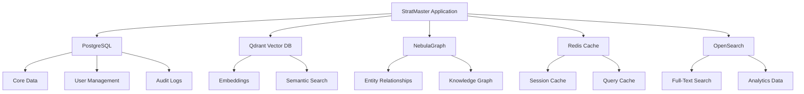

# Database Schema Reference

This document provides comprehensive documentation of StratMaster's database schemas across multiple data stores including PostgreSQL, Qdrant Vector Database, NebulaGraph, Redis, and OpenSearch.

## Architecture Overview



## PostgreSQL Schema

### Core Tables

#### tenants
Multi-tenant organization management.

```sql
CREATE TABLE tenants (
    tenant_id VARCHAR(50) PRIMARY KEY,
    name VARCHAR(255) NOT NULL,
    domain VARCHAR(255),
    status tenant_status DEFAULT 'active',
    subscription_tier subscription_tier DEFAULT 'standard',
    max_users INTEGER DEFAULT 100,
    max_sessions INTEGER DEFAULT 1000,
    data_retention_days INTEGER DEFAULT 365,
    privacy_settings JSONB DEFAULT '{}',
    created_at TIMESTAMP DEFAULT NOW(),
    updated_at TIMESTAMP DEFAULT NOW(),
    created_by UUID,
    metadata JSONB DEFAULT '{}'
);

-- Indexes
CREATE INDEX idx_tenants_status ON tenants(status);
CREATE INDEX idx_tenants_domain ON tenants(domain);
CREATE INDEX idx_tenants_created_at ON tenants(created_at);
```

#### users
User account management with role-based access control.

```sql
CREATE TABLE users (
    user_id UUID PRIMARY KEY DEFAULT gen_random_uuid(),
    tenant_id VARCHAR(50) NOT NULL REFERENCES tenants(tenant_id),
    email VARCHAR(320) UNIQUE NOT NULL,
    username VARCHAR(100),
    full_name VARCHAR(255),
    password_hash VARCHAR(255),
    role user_role DEFAULT 'analyst',
    status user_status DEFAULT 'active',
    last_login TIMESTAMP,
    login_count INTEGER DEFAULT 0,
    preferences JSONB DEFAULT '{}',
    permissions JSONB DEFAULT '{}',
    created_at TIMESTAMP DEFAULT NOW(),
    updated_at TIMESTAMP DEFAULT NOW(),
    
    CONSTRAINT fk_users_tenant FOREIGN KEY (tenant_id) REFERENCES tenants(tenant_id)
);

-- Indexes
CREATE INDEX idx_users_tenant_id ON users(tenant_id);
CREATE INDEX idx_users_email ON users(email);
CREATE INDEX idx_users_role ON users(role);
CREATE INDEX idx_users_status ON users(status);
CREATE INDEX idx_users_last_login ON users(last_login);
```

#### research_sessions
Core research session tracking.

```sql
CREATE TABLE research_sessions (
    session_id UUID PRIMARY KEY DEFAULT gen_random_uuid(),
    tenant_id VARCHAR(50) NOT NULL REFERENCES tenants(tenant_id),
    user_id UUID REFERENCES users(user_id),
    title VARCHAR(500),
    research_question TEXT NOT NULL,
    scope research_scope DEFAULT 'standard',
    status session_status DEFAULT 'active',
    priority session_priority DEFAULT 'medium',
    tags TEXT[],
    metadata JSONB DEFAULT '{}',
    started_at TIMESTAMP DEFAULT NOW(),
    completed_at TIMESTAMP,
    last_activity TIMESTAMP DEFAULT NOW(),
    total_duration_seconds INTEGER,
    
    CONSTRAINT fk_sessions_tenant FOREIGN KEY (tenant_id) REFERENCES tenants(tenant_id),
    CONSTRAINT fk_sessions_user FOREIGN KEY (user_id) REFERENCES users(user_id)
) PARTITION BY RANGE (started_at);

-- Create monthly partitions
CREATE TABLE research_sessions_2024_01 PARTITION OF research_sessions
    FOR VALUES FROM ('2024-01-01') TO ('2024-02-01');

-- Indexes
CREATE INDEX idx_sessions_tenant_id ON research_sessions(tenant_id);
CREATE INDEX idx_sessions_user_id ON research_sessions(user_id);
CREATE INDEX idx_sessions_status ON research_sessions(status);
CREATE INDEX idx_sessions_started_at ON research_sessions(started_at);
CREATE INDEX idx_sessions_tags ON research_sessions USING GIN(tags);
```

#### evidence
Evidence and source material storage.

```sql
CREATE TABLE evidence (
    evidence_id UUID PRIMARY KEY DEFAULT gen_random_uuid(),
    session_id UUID NOT NULL REFERENCES research_sessions(session_id),
    tenant_id VARCHAR(50) NOT NULL REFERENCES tenants(tenant_id),
    source_url TEXT,
    source_type evidence_source_type,
    title VARCHAR(1000),
    content TEXT,
    summary TEXT,
    author VARCHAR(255),
    publication_date TIMESTAMP,
    retrieved_at TIMESTAMP DEFAULT NOW(),
    credibility_score DECIMAL(3,2) CHECK (credibility_score >= 0 AND credibility_score <= 1),
    relevance_score DECIMAL(3,2) CHECK (relevance_score >= 0 AND relevance_score <= 1),
    recency_score DECIMAL(3,2) CHECK (recency_score >= 0 AND recency_score <= 1),
    overall_quality_score DECIMAL(3,2) CHECK (overall_quality_score >= 0 AND overall_quality_score <= 1),
    word_count INTEGER,
    language VARCHAR(10) DEFAULT 'en',
    metadata JSONB DEFAULT '{}',
    search_vector tsvector,
    
    CONSTRAINT fk_evidence_session FOREIGN KEY (session_id) REFERENCES research_sessions(session_id),
    CONSTRAINT fk_evidence_tenant FOREIGN KEY (tenant_id) REFERENCES tenants(tenant_id)
);

-- Indexes
CREATE INDEX idx_evidence_session_id ON evidence(session_id);
CREATE INDEX idx_evidence_tenant_id ON evidence(tenant_id);
CREATE INDEX idx_evidence_source_type ON evidence(source_type);
CREATE INDEX idx_evidence_credibility ON evidence(credibility_score DESC);
CREATE INDEX idx_evidence_relevance ON evidence(relevance_score DESC);
CREATE INDEX idx_evidence_quality ON evidence(overall_quality_score DESC);
CREATE INDEX idx_evidence_search_vector ON evidence USING GIN(search_vector);
CREATE INDEX idx_evidence_retrieved_at ON evidence(retrieved_at);
```

#### research_claims
Structured claims extracted from research.

```sql
CREATE TABLE research_claims (
    claim_id UUID PRIMARY KEY DEFAULT gen_random_uuid(),
    session_id UUID NOT NULL REFERENCES research_sessions(session_id),
    tenant_id VARCHAR(50) NOT NULL REFERENCES tenants(tenant_id),
    claim_text TEXT NOT NULL,
    claim_type claim_type DEFAULT 'factual',
    confidence DECIMAL(3,2) CHECK (confidence >= 0 AND confidence <= 1),
    evidence_strength evidence_strength DEFAULT 'moderate',
    source_count INTEGER DEFAULT 0,
    supporting_evidence_ids UUID[],
    contradicting_evidence_ids UUID[],
    debate_status debate_status DEFAULT 'pending',
    consensus_reached BOOLEAN DEFAULT FALSE,
    final_verdict claim_verdict,
    reasoning TEXT,
    created_at TIMESTAMP DEFAULT NOW(),
    updated_at TIMESTAMP DEFAULT NOW(),
    metadata JSONB DEFAULT '{}',
    
    CONSTRAINT fk_claims_session FOREIGN KEY (session_id) REFERENCES research_sessions(session_id),
    CONSTRAINT fk_claims_tenant FOREIGN KEY (tenant_id) REFERENCES tenants(tenant_id)
);

-- Indexes
CREATE INDEX idx_claims_session_id ON research_claims(session_id);
CREATE INDEX idx_claims_tenant_id ON research_claims(tenant_id);
CREATE INDEX idx_claims_confidence ON research_claims(confidence DESC);
CREATE INDEX idx_claims_evidence_strength ON research_claims(evidence_strength);
CREATE INDEX idx_claims_debate_status ON research_claims(debate_status);
CREATE INDEX idx_claims_consensus ON research_claims(consensus_reached);
CREATE INDEX idx_claims_created_at ON research_claims(created_at);
```

#### debate_sessions
Multi-agent debate session tracking.

```sql
CREATE TABLE debate_sessions (
    debate_id UUID PRIMARY KEY DEFAULT gen_random_uuid(),
    session_id UUID NOT NULL REFERENCES research_sessions(session_id),
    tenant_id VARCHAR(50) NOT NULL REFERENCES tenants(tenant_id),
    debate_type debate_type DEFAULT 'validation',
    agent_configuration JSONB NOT NULL,
    constitutional_constraints JSONB DEFAULT '{}',
    max_rounds INTEGER DEFAULT 3,
    consensus_threshold DECIMAL(3,2) DEFAULT 0.8,
    status debate_session_status DEFAULT 'pending',
    started_at TIMESTAMP DEFAULT NOW(),
    completed_at TIMESTAMP,
    total_rounds INTEGER DEFAULT 0,
    consensus_reached BOOLEAN DEFAULT FALSE,
    final_confidence DECIMAL(3,2),
    outcome_summary TEXT,
    metadata JSONB DEFAULT '{}',
    
    CONSTRAINT fk_debates_session FOREIGN KEY (session_id) REFERENCES research_sessions(session_id),
    CONSTRAINT fk_debates_tenant FOREIGN KEY (tenant_id) REFERENCES tenants(tenant_id)
);

-- Indexes
CREATE INDEX idx_debates_session_id ON debate_sessions(session_id);
CREATE INDEX idx_debates_tenant_id ON debate_sessions(tenant_id);
CREATE INDEX idx_debates_status ON debate_sessions(status);
CREATE INDEX idx_debates_started_at ON debate_sessions(started_at);
```

#### debate_rounds
Individual debate round content.

```sql
CREATE TABLE debate_rounds (
    round_id UUID PRIMARY KEY DEFAULT gen_random_uuid(),
    debate_id UUID NOT NULL REFERENCES debate_sessions(debate_id),
    round_number INTEGER NOT NULL,
    agent_name VARCHAR(100) NOT NULL,
    agent_role VARCHAR(100),
    position TEXT NOT NULL,
    arguments JSONB DEFAULT '[]',
    issues_raised TEXT[],
    evidence_cited UUID[],
    response_to_round UUID,
    timestamp TIMESTAMP DEFAULT NOW(),
    duration_seconds INTEGER,
    metadata JSONB DEFAULT '{}',
    
    CONSTRAINT fk_rounds_debate FOREIGN KEY (debate_id) REFERENCES debate_sessions(debate_id),
    CONSTRAINT unique_debate_round_agent UNIQUE (debate_id, round_number, agent_name)
);

-- Indexes
CREATE INDEX idx_rounds_debate_id ON debate_rounds(debate_id);
CREATE INDEX idx_rounds_round_number ON debate_rounds(round_number);
CREATE INDEX idx_rounds_agent_name ON debate_rounds(agent_name);
CREATE INDEX idx_rounds_timestamp ON debate_rounds(timestamp);
```

### Security and Audit Tables

#### audit_logs
Comprehensive audit logging for compliance.

```sql
CREATE TABLE audit_logs (
    log_id UUID PRIMARY KEY DEFAULT gen_random_uuid(),
    tenant_id VARCHAR(50) REFERENCES tenants(tenant_id),
    user_id UUID REFERENCES users(user_id),
    session_id UUID,
    event_type audit_event_type NOT NULL,
    event_category audit_category DEFAULT 'general',
    resource_type VARCHAR(100),
    resource_id VARCHAR(255),
    action VARCHAR(100) NOT NULL,
    outcome audit_outcome DEFAULT 'success',
    ip_address INET,
    user_agent TEXT,
    request_id VARCHAR(100),
    details JSONB DEFAULT '{}',
    sensitive_data_accessed BOOLEAN DEFAULT FALSE,
    privacy_impact privacy_impact DEFAULT 'none',
    timestamp TIMESTAMP DEFAULT NOW(),
    
    CONSTRAINT fk_audit_tenant FOREIGN KEY (tenant_id) REFERENCES tenants(tenant_id),
    CONSTRAINT fk_audit_user FOREIGN KEY (user_id) REFERENCES users(user_id)
) PARTITION BY RANGE (timestamp);

-- Create monthly partitions for audit logs
CREATE TABLE audit_logs_2024_01 PARTITION OF audit_logs
    FOR VALUES FROM ('2024-01-01') TO ('2024-02-01');

-- Indexes
CREATE INDEX idx_audit_tenant_id ON audit_logs(tenant_id);
CREATE INDEX idx_audit_user_id ON audit_logs(user_id);
CREATE INDEX idx_audit_event_type ON audit_logs(event_type);
CREATE INDEX idx_audit_timestamp ON audit_logs(timestamp);
CREATE INDEX idx_audit_sensitive_data ON audit_logs(sensitive_data_accessed) WHERE sensitive_data_accessed = TRUE;
```

#### user_sessions
Active user session management.

```sql
CREATE TABLE user_sessions (
    session_token VARCHAR(255) PRIMARY KEY,
    user_id UUID NOT NULL REFERENCES users(user_id),
    tenant_id VARCHAR(50) NOT NULL REFERENCES tenants(tenant_id),
    ip_address INET,
    user_agent TEXT,
    created_at TIMESTAMP DEFAULT NOW(),
    last_activity TIMESTAMP DEFAULT NOW(),
    expires_at TIMESTAMP NOT NULL,
    is_active BOOLEAN DEFAULT TRUE,
    metadata JSONB DEFAULT '{}',
    
    CONSTRAINT fk_user_sessions_user FOREIGN KEY (user_id) REFERENCES users(user_id),
    CONSTRAINT fk_user_sessions_tenant FOREIGN KEY (tenant_id) REFERENCES tenants(tenant_id)
);

-- Indexes
CREATE INDEX idx_user_sessions_user_id ON user_sessions(user_id);
CREATE INDEX idx_user_sessions_expires_at ON user_sessions(expires_at);
CREATE INDEX idx_user_sessions_last_activity ON user_sessions(last_activity);
CREATE INDEX idx_user_sessions_active ON user_sessions(is_active) WHERE is_active = TRUE;
```

### Custom Types (Enums)

```sql
-- Status and type enums
CREATE TYPE tenant_status AS ENUM ('active', 'suspended', 'inactive');
CREATE TYPE subscription_tier AS ENUM ('free', 'standard', 'premium', 'enterprise');
CREATE TYPE user_role AS ENUM ('admin', 'analyst', 'viewer', 'api_client');
CREATE TYPE user_status AS ENUM ('active', 'inactive', 'suspended', 'pending');
CREATE TYPE research_scope AS ENUM ('basic', 'standard', 'comprehensive', 'deep_dive');
CREATE TYPE session_status AS ENUM ('active', 'completed', 'paused', 'cancelled', 'error');
CREATE TYPE session_priority AS ENUM ('low', 'medium', 'high', 'urgent');
CREATE TYPE evidence_source_type AS ENUM ('web_search', 'crawled_page', 'uploaded_document', 'api_data', 'manual_entry');
CREATE TYPE claim_type AS ENUM ('factual', 'analytical', 'predictive', 'opinion', 'recommendation');
CREATE TYPE evidence_strength AS ENUM ('weak', 'moderate', 'strong', 'very_strong');
CREATE TYPE debate_status AS ENUM ('pending', 'in_progress', 'completed', 'consensus_reached', 'no_consensus');
CREATE TYPE claim_verdict AS ENUM ('approved', 'rejected', 'modified', 'needs_more_evidence');
CREATE TYPE debate_type AS ENUM ('validation', 'exploration', 'evaluation', 'synthesis');
CREATE TYPE debate_session_status AS ENUM ('pending', 'in_progress', 'completed', 'timeout', 'error');
CREATE TYPE audit_event_type AS ENUM ('authentication', 'authorization', 'data_access', 'data_modification', 'system_event', 'security_event');
CREATE TYPE audit_category AS ENUM ('security', 'data', 'system', 'user', 'research', 'debate');
CREATE TYPE audit_outcome AS ENUM ('success', 'failure', 'warning', 'error');
CREATE TYPE privacy_impact AS ENUM ('none', 'low', 'medium', 'high', 'critical');
```

### Views and Functions

#### Active Sessions View

```sql
CREATE VIEW v_active_sessions AS
SELECT 
    rs.session_id,
    rs.tenant_id,
    rs.user_id,
    u.email,
    u.full_name,
    rs.title,
    rs.research_question,
    rs.status,
    rs.started_at,
    rs.last_activity,
    COUNT(e.evidence_id) as evidence_count,
    COUNT(c.claim_id) as claims_count,
    COUNT(d.debate_id) as debates_count
FROM research_sessions rs
LEFT JOIN users u ON rs.user_id = u.user_id
LEFT JOIN evidence e ON rs.session_id = e.session_id
LEFT JOIN research_claims c ON rs.session_id = c.session_id
LEFT JOIN debate_sessions d ON rs.session_id = d.session_id
WHERE rs.status = 'active'
GROUP BY rs.session_id, rs.tenant_id, rs.user_id, u.email, u.full_name, 
         rs.title, rs.research_question, rs.status, rs.started_at, rs.last_activity;
```

#### Session Statistics Function

```sql
CREATE OR REPLACE FUNCTION get_session_statistics(
    p_tenant_id VARCHAR(50),
    p_start_date TIMESTAMP DEFAULT NOW() - INTERVAL '30 days',
    p_end_date TIMESTAMP DEFAULT NOW()
)
RETURNS TABLE (
    total_sessions INTEGER,
    completed_sessions INTEGER,
    avg_duration_hours DECIMAL(10,2),
    total_evidence INTEGER,
    total_claims INTEGER,
    avg_claims_per_session DECIMAL(10,2),
    consensus_rate DECIMAL(5,2)
) AS $$
BEGIN
    RETURN QUERY
    SELECT 
        COUNT(rs.session_id)::INTEGER as total_sessions,
        COUNT(CASE WHEN rs.status = 'completed' THEN 1 END)::INTEGER as completed_sessions,
        AVG(rs.total_duration_seconds / 3600.0)::DECIMAL(10,2) as avg_duration_hours,
        COUNT(e.evidence_id)::INTEGER as total_evidence,
        COUNT(c.claim_id)::INTEGER as total_claims,
        (COUNT(c.claim_id)::DECIMAL / NULLIF(COUNT(rs.session_id), 0))::DECIMAL(10,2) as avg_claims_per_session,
        (COUNT(CASE WHEN c.consensus_reached = TRUE THEN 1 END)::DECIMAL / 
         NULLIF(COUNT(c.claim_id), 0) * 100)::DECIMAL(5,2) as consensus_rate
    FROM research_sessions rs
    LEFT JOIN evidence e ON rs.session_id = e.session_id
    LEFT JOIN research_claims c ON rs.session_id = c.session_id
    WHERE rs.tenant_id = p_tenant_id
    AND rs.started_at BETWEEN p_start_date AND p_end_date;
END;
$$ LANGUAGE plpgsql;
```

## Qdrant Vector Database Schema

### Collections

#### stratmaster_knowledge
Main knowledge base embeddings.

```python
# Collection configuration
from qdrant_client.models import Distance, VectorParams, OptimizersConfigDiff

collection_config = {
    "collection_name": "stratmaster_knowledge",
    "vectors": VectorParams(
        size=1536,  # OpenAI text-embedding-ada-002 dimensions
        distance=Distance.COSINE,
        hnsw_config={
            "m": 16,
            "ef_construct": 200,
            "full_scan_threshold": 10000,
        }
    ),
    "optimizers_config": OptimizersConfigDiff(
        deleted_threshold=0.2,
        vacuum_min_vector_number=1000,
        default_segment_number=2,
        max_segment_size=20000,
        memmap_threshold=50000,
        indexing_threshold=20000,
        flush_interval_sec=30,
    )
}
```

#### Payload Schema

```json
{
  "tenant_id": "string",
  "document_id": "uuid",
  "session_id": "uuid",
  "content_type": "evidence | claim | synthesis | external",
  "title": "string",
  "content": "string (truncated for vector)",
  "full_content_reference": "uuid (reference to full content)",
  "source": {
    "type": "web | document | api | manual",
    "url": "string",
    "author": "string",
    "publication_date": "timestamp"
  },
  "metadata": {
    "word_count": "integer",
    "language": "string",
    "category": "string",
    "tags": ["string"],
    "quality_scores": {
      "credibility": "float",
      "relevance": "float", 
      "recency": "float"
    }
  },
  "created_at": "timestamp",
  "updated_at": "timestamp"
}
```

#### stratmaster_research_cache
Cached research query embeddings.

```python
cache_collection_config = {
    "collection_name": "stratmaster_research_cache",
    "vectors": VectorParams(
        size=1536,
        distance=Distance.COSINE,
        hnsw_config={
            "m": 8,  # Lower for cache collection
            "ef_construct": 100,
            "full_scan_threshold": 5000,
        }
    )
}
```

#### Cache Payload Schema

```json
{
  "tenant_id": "string",
  "query_hash": "string",
  "query_text": "string",
  "query_parameters": {
    "limit": "integer",
    "filters": "object",
    "score_threshold": "float"
  },
  "results": [
    {
      "document_id": "uuid",
      "score": "float",
      "snippet": "string"
    }
  ],
  "result_count": "integer",
  "cache_ttl": "integer",
  "created_at": "timestamp",
  "access_count": "integer",
  "last_accessed": "timestamp"
}
```

## NebulaGraph Schema

### Spaces and Tags

#### stratmaster_graph Space

```ngql
-- Create space
CREATE SPACE IF NOT EXISTS stratmaster_graph (
    partition_num = 10, 
    replica_factor = 1, 
    vid_type = FIXED_STRING(64)
);

USE stratmaster_graph;
```

#### Entity Tags

```ngql
-- Company entities
CREATE TAG IF NOT EXISTS Company (
    name STRING NOT NULL,
    industry STRING,
    founded_year INT,
    headquarters STRING,
    employee_count INT,
    revenue DOUBLE,
    market_cap DOUBLE,
    description STRING,
    website STRING,
    tenant_id STRING NOT NULL,
    created_at TIMESTAMP DEFAULT NOW(),
    updated_at TIMESTAMP DEFAULT NOW()
);

-- Person entities
CREATE TAG IF NOT EXISTS Person (
    name STRING NOT NULL,
    title STRING,
    company STRING,
    email STRING,
    linkedin STRING,
    expertise STRING,
    tenant_id STRING NOT NULL,
    created_at TIMESTAMP DEFAULT NOW(),
    updated_at TIMESTAMP DEFAULT NOW()
);

-- Technology entities
CREATE TAG IF NOT EXISTS Technology (
    name STRING NOT NULL,
    category STRING,
    maturity_level STRING,
    description STRING,
    use_cases STRING,
    tenant_id STRING NOT NULL,
    created_at TIMESTAMP DEFAULT NOW(),
    updated_at TIMESTAMP DEFAULT NOW()
);

-- Market entities
CREATE TAG IF NOT EXISTS Market (
    name STRING NOT NULL,
    size DOUBLE,
    growth_rate DOUBLE,
    geography STRING,
    key_players STRING,
    trends STRING,
    tenant_id STRING NOT NULL,
    created_at TIMESTAMP DEFAULT NOW(),
    updated_at TIMESTAMP DEFAULT NOW()
);

-- Topic entities
CREATE TAG IF NOT EXISTS Topic (
    name STRING NOT NULL,
    category STRING,
    description STRING,
    relevance_score DOUBLE,
    tenant_id STRING NOT NULL,
    created_at TIMESTAMP DEFAULT NOW(),
    updated_at TIMESTAMP DEFAULT NOW()
);
```

#### Relationship Edges

```ngql
-- Competition relationships
CREATE EDGE IF NOT EXISTS COMPETES_WITH (
    strength DOUBLE DEFAULT 0.5,
    market STRING,
    evidence_count INT DEFAULT 0,
    confidence DOUBLE DEFAULT 0.5,
    last_updated TIMESTAMP DEFAULT NOW(),
    tenant_id STRING NOT NULL
);

-- Partnership relationships
CREATE EDGE IF NOT EXISTS PARTNERS_WITH (
    partnership_type STRING,
    start_date DATE,
    end_date DATE,
    strength DOUBLE DEFAULT 0.5,
    evidence_count INT DEFAULT 0,
    tenant_id STRING NOT NULL
);

-- Supply chain relationships
CREATE EDGE IF NOT EXISTS SUPPLIES_TO (
    product_category STRING,
    contract_value DOUBLE,
    contract_duration INT,
    dependency_level STRING,
    tenant_id STRING NOT NULL
);

-- Investment relationships
CREATE EDGE IF NOT EXISTS INVESTS_IN (
    investment_amount DOUBLE,
    investment_date DATE,
    investment_stage STRING,
    ownership_percentage DOUBLE,
    tenant_id STRING NOT NULL
);

-- Employment relationships
CREATE EDGE IF NOT EXISTS WORKS_FOR (
    start_date DATE,
    end_date DATE,
    position STRING,
    department STRING,
    tenant_id STRING NOT NULL
);

-- Technology usage
CREATE EDGE IF NOT EXISTS USES_TECHNOLOGY (
    implementation_date DATE,
    usage_intensity STRING,
    success_level STRING,
    roi DOUBLE,
    tenant_id STRING NOT NULL
);

-- Market participation
CREATE EDGE IF NOT EXISTS OPERATES_IN (
    market_share DOUBLE,
    entry_date DATE,
    market_position STRING,
    revenue_from_market DOUBLE,
    tenant_id STRING NOT NULL
);

-- Topic relationships
CREATE EDGE IF NOT EXISTS RELATES_TO (
    relationship_type STRING,
    strength DOUBLE DEFAULT 0.5,
    context STRING,
    tenant_id STRING NOT NULL
);
```

#### Indexes

```ngql
-- Create indexes for efficient queries
CREATE TAG INDEX IF NOT EXISTS company_name_index ON Company(name(64));
CREATE TAG INDEX IF NOT EXISTS company_industry_index ON Company(industry(32));
CREATE TAG INDEX IF NOT EXISTS company_tenant_index ON Company(tenant_id(50));

CREATE TAG INDEX IF NOT EXISTS person_name_index ON Person(name(64));
CREATE TAG INDEX IF NOT EXISTS person_company_index ON Person(company(64));
CREATE TAG INDEX IF NOT EXISTS person_tenant_index ON Person(tenant_id(50));

CREATE TAG INDEX IF NOT EXISTS technology_name_index ON Technology(name(64));
CREATE TAG INDEX IF NOT EXISTS technology_category_index ON Technology(category(32));
CREATE TAG INDEX IF NOT EXISTS technology_tenant_index ON Technology(tenant_id(50));

CREATE EDGE INDEX IF NOT EXISTS competes_tenant_index ON COMPETES_WITH(tenant_id(50));
CREATE EDGE INDEX IF NOT EXISTS partners_tenant_index ON PARTNERS_WITH(tenant_id(50));
```

## Redis Schema

### Key Patterns

#### Session Cache

```
Pattern: session:{tenant_id}:{session_id}
TTL: 24 hours
Type: Hash
```

```json
{
  "session_id": "uuid",
  "user_id": "uuid", 
  "research_question": "string",
  "status": "string",
  "created_at": "timestamp",
  "last_activity": "timestamp",
  "metadata": "json_string"
}
```

#### Query Cache

```
Pattern: query_cache:{tenant_id}:{query_hash}
TTL: 1 hour
Type: Hash
```

```json
{
  "query": "string",
  "parameters": "json_string",
  "results": "json_string",
  "result_count": "integer",
  "created_at": "timestamp",
  "hit_count": "integer"
}
```

#### Rate Limiting

```
Pattern: rate_limit:{service}:{tenant_id}:{window}
TTL: Window duration
Type: String (counter)
```

#### Circuit Breaker State

```
Pattern: circuit_breaker:{service}:{instance}
TTL: No expiry
Type: Hash
```

```json
{
  "state": "closed|open|half_open",
  "failure_count": "integer",
  "success_count": "integer",
  "last_failure": "timestamp",
  "next_attempt": "timestamp"
}
```

## OpenSearch Schema

### Indexes

#### stratmaster_evidence
Full-text search for evidence content.

```json
{
  "settings": {
    "number_of_shards": 3,
    "number_of_replicas": 1,
    "analysis": {
      "analyzer": {
        "stratmaster_analyzer": {
          "type": "custom",
          "tokenizer": "standard",
          "filter": [
            "lowercase",
            "stop",
            "snowball",
            "stratmaster_synonyms"
          ]
        }
      },
      "filter": {
        "stratmaster_synonyms": {
          "type": "synonym",
          "synonyms": [
            "AI,artificial intelligence,machine learning",
            "company,corporation,business,organization",
            "analysis,analytics,examination,study"
          ]
        }
      }
    }
  },
  "mappings": {
    "properties": {
      "tenant_id": {
        "type": "keyword"
      },
      "session_id": {
        "type": "keyword"
      },
      "evidence_id": {
        "type": "keyword"
      },
      "title": {
        "type": "text",
        "analyzer": "stratmaster_analyzer",
        "fields": {
          "keyword": {
            "type": "keyword"
          }
        }
      },
      "content": {
        "type": "text",
        "analyzer": "stratmaster_analyzer"
      },
      "summary": {
        "type": "text",
        "analyzer": "stratmaster_analyzer"
      },
      "source_url": {
        "type": "keyword"
      },
      "source_type": {
        "type": "keyword"
      },
      "author": {
        "type": "text",
        "fields": {
          "keyword": {
            "type": "keyword"
          }
        }
      },
      "publication_date": {
        "type": "date"
      },
      "retrieved_at": {
        "type": "date"
      },
      "quality_scores": {
        "type": "object",
        "properties": {
          "credibility": {
            "type": "float"
          },
          "relevance": {
            "type": "float"
          },
          "recency": {
            "type": "float"
          },
          "overall": {
            "type": "float"
          }
        }
      },
      "tags": {
        "type": "keyword"
      },
      "language": {
        "type": "keyword"
      },
      "word_count": {
        "type": "integer"
      }
    }
  }
}
```

#### stratmaster_analytics
Analytics and metrics data.

```json
{
  "settings": {
    "number_of_shards": 2,
    "number_of_replicas": 1
  },
  "mappings": {
    "properties": {
      "tenant_id": {
        "type": "keyword"
      },
      "event_type": {
        "type": "keyword"
      },
      "timestamp": {
        "type": "date"
      },
      "user_id": {
        "type": "keyword"
      },
      "session_id": {
        "type": "keyword"
      },
      "metrics": {
        "type": "object",
        "dynamic": true
      },
      "dimensions": {
        "type": "object",
        "dynamic": true
      }
    }
  }
}
```

## Data Migration Scripts

### PostgreSQL Migration

```sql
-- Migration: Add debate session enhancements
-- Version: 0.2.0
-- Date: 2024-01-15

BEGIN;

-- Add new columns to debate_sessions
ALTER TABLE debate_sessions 
ADD COLUMN IF NOT EXISTS quality_score DECIMAL(3,2),
ADD COLUMN IF NOT EXISTS participant_satisfaction JSONB DEFAULT '{}',
ADD COLUMN IF NOT EXISTS improvement_suggestions TEXT[];

-- Update existing records with default values
UPDATE debate_sessions 
SET quality_score = 0.5, 
    participant_satisfaction = '{}',
    improvement_suggestions = '{}'
WHERE quality_score IS NULL;

-- Create index on new quality_score column
CREATE INDEX IF NOT EXISTS idx_debates_quality_score ON debate_sessions(quality_score DESC);

COMMIT;
```

### Vector Database Migration

```python
# Migration script for Qdrant collection updates
from qdrant_client import QdrantClient
from qdrant_client.models import PayloadSchemaType, CreatePayload

client = QdrantClient(host="localhost", port=6333)

# Add new payload fields
client.create_payload_index(
    collection_name="stratmaster_knowledge",
    field_name="metadata.quality_scores.overall",
    field_schema=PayloadSchemaType.FLOAT
)

client.create_payload_index(
    collection_name="stratmaster_knowledge", 
    field_name="content_type",
    field_schema=PayloadSchemaType.KEYWORD
)
```

## Backup and Recovery

### PostgreSQL Backup Strategy

```bash
#!/bin/bash
# Daily backup script

BACKUP_DIR="/backups/postgresql"
DATE=$(date +%Y%m%d_%H%M%S)
DB_NAME="stratmaster_prod"

# Full database backup
pg_dump -h localhost -U postgres -d $DB_NAME \
  --verbose --clean --create --if-exists \
  --format=custom \
  --file="$BACKUP_DIR/stratmaster_full_$DATE.dump"

# Compressed SQL backup
pg_dump -h localhost -U postgres -d $DB_NAME \
  --verbose --clean --create --if-exists \
  --format=plain | gzip > "$BACKUP_DIR/stratmaster_$DATE.sql.gz"

# Backup audit logs separately (for compliance)
pg_dump -h localhost -U postgres -d $DB_NAME \
  --table=audit_logs* \
  --format=custom \
  --file="$BACKUP_DIR/audit_logs_$DATE.dump"

# Clean old backups (keep 30 days)
find $BACKUP_DIR -name "*.dump" -mtime +30 -delete
find $BACKUP_DIR -name "*.sql.gz" -mtime +30 -delete
```

### Vector Database Backup

```python
# Qdrant backup script
import asyncio
from qdrant_client import QdrantClient
from datetime import datetime

async def backup_collections():
    client = QdrantClient(host="localhost", port=6333)
    timestamp = datetime.now().strftime("%Y%m%d_%H%M%S")
    
    collections = ["stratmaster_knowledge", "stratmaster_research_cache"]
    
    for collection in collections:
        # Create snapshot
        snapshot_info = client.create_snapshot(collection_name=collection)
        print(f"Created snapshot for {collection}: {snapshot_info}")
        
        # Download snapshot
        snapshot_path = f"/backups/qdrant/{collection}_{timestamp}.snapshot"
        client.download_snapshot(
            collection_name=collection,
            snapshot_name=snapshot_info.name,
            output_path=snapshot_path
        )
        print(f"Downloaded snapshot to {snapshot_path}")

if __name__ == "__main__":
    asyncio.run(backup_collections())
```

## Performance Optimization

### PostgreSQL Optimization

```sql
-- Analyze table statistics
ANALYZE research_sessions;
ANALYZE evidence;
ANALYZE research_claims;
ANALYZE audit_logs;

-- Check for unused indexes
SELECT 
    schemaname,
    tablename,
    indexname,
    idx_tup_read,
    idx_tup_fetch,
    idx_scan
FROM pg_stat_user_indexes 
WHERE idx_scan = 0
ORDER BY schemaname, tablename;

-- Partition maintenance
SELECT schemaname, tablename, n_tup_ins, n_tup_upd, n_tup_del
FROM pg_stat_user_tables
WHERE schemaname = 'public'
ORDER BY n_tup_ins + n_tup_upd + n_tup_del DESC;
```

### Vector Database Optimization

```python
# Optimize Qdrant collection
from qdrant_client import QdrantClient
from qdrant_client.models import OptimizersConfigDiff

client = QdrantClient(host="localhost", port=6333)

# Update optimizer configuration
client.update_collection(
    collection_name="stratmaster_knowledge",
    optimizer_config=OptimizersConfigDiff(
        deleted_threshold=0.1,
        vacuum_min_vector_number=10000,
        default_segment_number=4,
        max_segment_size=50000,
        memmap_threshold=100000,
        indexing_threshold=50000,
        flush_interval_sec=10,
    )
)

# Force optimization
client.update_collection(
    collection_name="stratmaster_knowledge",
    optimizers_config=OptimizersConfigDiff(
        max_optimization_threads=4
    )
)
```

## Monitoring and Metrics

### Database Health Queries

```sql
-- Active sessions and connections
SELECT 
    COUNT(*) as active_sessions,
    AVG(EXTRACT(EPOCH FROM (NOW() - started_at))/3600) as avg_session_hours
FROM research_sessions 
WHERE status = 'active';

-- Evidence quality distribution
SELECT 
    CASE 
        WHEN overall_quality_score >= 0.8 THEN 'High'
        WHEN overall_quality_score >= 0.6 THEN 'Medium'
        ELSE 'Low'
    END as quality_tier,
    COUNT(*) as evidence_count,
    AVG(overall_quality_score) as avg_score
FROM evidence
GROUP BY quality_tier
ORDER BY avg_score DESC;

-- Debate consensus rates by tenant
SELECT 
    tenant_id,
    COUNT(*) as total_debates,
    COUNT(CASE WHEN consensus_reached = TRUE THEN 1 END) as consensus_debates,
    ROUND(
        COUNT(CASE WHEN consensus_reached = TRUE THEN 1 END)::DECIMAL / 
        COUNT(*) * 100, 2
    ) as consensus_rate
FROM debate_sessions
WHERE status = 'completed'
GROUP BY tenant_id
ORDER BY consensus_rate DESC;
```

This comprehensive database schema documentation provides the foundation for understanding StratMaster's data architecture across all storage systems. Regular maintenance, monitoring, and optimization ensure optimal performance and data integrity.

## Related Documentation

- [API Gateway Reference](api/gateway.md) - Main application endpoints
- [MCP Server APIs](api/) - Microservice interfaces
- [Security Hardening Guide](../how-to/security-hardening.md) - Database security
- [Performance Tuning Guide](../how-to/performance-tuning.md) - Database optimization