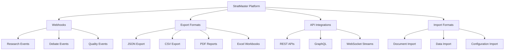

# Integration Reference

StratMaster provides comprehensive integration capabilities including webhooks, export formats, and APIs for connecting with external systems. This section documents all integration methods and specifications.

## Integration Overview



## Available Integration Methods

### Real-Time Integration
- **Webhooks** - Real-time event notifications
- **WebSocket Streams** - Live data streaming
- **Server-Sent Events** - One-way event streaming

### Data Exchange
- **Export Formats** - Data export specifications (JSON, CSV, Excel, PDF)
- **Import Formats** - Data import specifications
- **Bulk Operations** - Batch data processing

### Third-Party Integrations
- **Slack Integration** - Team collaboration
- **Microsoft Teams** - Enterprise communication
- **Tableau Integration** - Business intelligence
- **Power BI Integration** - Microsoft BI platform

### API Integration
- **REST API** - HTTP-based integration
- **GraphQL API** - Flexible query interface
- **Authentication** - OAuth 2.0 and API keys

## Webhook Events

StratMaster supports the following webhook events:

### Research Events
- `research.session.started` - New research session begins
- `research.session.completed` - Research session completes
- `research.evidence.discovered` - New evidence found
- `research.claim.generated` - New claim extracted

### Debate Events
- `debate.session.started` - Multi-agent debate begins
- `debate.round.completed` - Debate round finishes
- `debate.consensus.reached` - Consensus achieved
- `debate.timeout` - Debate times out without consensus

### Quality Events
- `evidence.quality.alert` - Quality issues detected
- `evidence.graded` - Evidence quality assessment complete
- `quality.threshold.violated` - Quality thresholds breached

### System Events
- `system.health.alert` - System health issues
- `system.maintenance.scheduled` - Maintenance notifications
- `api.rate.limit.exceeded` - Rate limiting notifications

## Export Formats

### JSON Export
Comprehensive data export in JSON format with full metadata:

```json
{
  "export_metadata": {
    "export_id": "exp_abc123",
    "export_type": "research_session",
    "timestamp": "2024-01-15T10:00:00Z",
    "version": "1.0",
    "total_records": 1
  },
  "data": {
    "session_id": "session-xyz789",
    "research_question": "AI trends in healthcare",
    "evidence": [...],
    "claims": [...],
    "debates": [...]
  }
}
```

### CSV Export
Tabular data export for spreadsheet analysis:

```csv
session_id,research_question,evidence_count,claims_count,consensus_rate,confidence_score
session-xyz789,"AI trends in healthcare",25,8,0.75,0.87
```

### Excel Export
Multi-sheet workbooks with formatted data and charts.

### PDF Reports
Formatted reports with visualizations and executive summaries.

## Quick Start Examples

### Python Integration
```python
import requests
import hmac
import hashlib

class StratMasterIntegration:
    def __init__(self, api_key: str):
        self.api_key = api_key
        self.base_url = "https://api.stratmaster.com"
        
    def setup_webhook(self, webhook_url: str, events: list):
        """Setup webhook for specified events"""
        response = requests.post(
            f"{self.base_url}/webhooks",
            headers={"Authorization": f"Bearer {self.api_key}"},
            json={
                "url": webhook_url,
                "events": events,
                "active": True
            }
        )
        return response.json()
    
    def export_research_data(self, session_id: str, format: str = "json"):
        """Export research session data"""
        response = requests.get(
            f"{self.base_url}/export/research/sessions/{session_id}",
            headers={
                "Authorization": f"Bearer {self.api_key}",
                "Accept": f"application/{format}"
            }
        )
        return response.json() if format == "json" else response.content

# Usage
integration = StratMasterIntegration("your-api-key")
webhook_config = integration.setup_webhook(
    "https://your-app.com/webhook",
    ["research.completed", "debate.consensus_reached"]
)
```

### JavaScript Integration
```javascript
class StratMasterClient {
    constructor(apiKey) {
        this.apiKey = apiKey;
        this.baseUrl = 'https://api.stratmaster.com';
    }
    
    async setupWebhook(webhookUrl, events) {
        const response = await fetch(`${this.baseUrl}/webhooks`, {
            method: 'POST',
            headers: {
                'Authorization': `Bearer ${this.apiKey}`,
                'Content-Type': 'application/json'
            },
            body: JSON.stringify({
                url: webhookUrl,
                events: events,
                active: true
            })
        });
        return await response.json();
    }
    
    async exportResearchData(sessionId, format = 'json') {
        const response = await fetch(
            `${this.baseUrl}/export/research/sessions/${sessionId}`,
            {
                headers: {
                    'Authorization': `Bearer ${this.apiKey}`,
                    'Accept': `application/${format}`
                }
            }
        );
        return format === 'json' ? await response.json() : await response.blob();
    }
}

// Usage
const client = new StratMasterClient('your-api-key');
const webhookConfig = await client.setupWebhook(
    'https://your-app.com/webhook',
    ['research.completed', 'debate.consensus_reached']
);
```

## Security

### Authentication
- **API Keys**: For server-to-server integration
- **OAuth 2.0**: For user-authorized access
- **JWT Tokens**: For stateless authentication

### Webhook Security
- **HMAC Signatures**: All webhooks are signed with HMAC-SHA256
- **Timestamp Verification**: Prevent replay attacks
- **IP Allowlisting**: Restrict webhook sources

### Data Protection
- **TLS 1.3**: All communications encrypted in transit
- **Data Minimization**: Export only requested data
- **Audit Logging**: All integration activities logged

## Getting Started

1. **Obtain API Keys**
   - Register for StratMaster developer account
   - Generate API keys in the dashboard
   - Configure authentication method

2. **Choose Integration Method**
   - Real-time: Use webhooks for immediate notifications
   - Batch: Use export APIs for bulk data transfer
   - Interactive: Use REST/GraphQL APIs for on-demand access

3. **Implement Integration**
   - Follow language-specific examples
   - Implement proper error handling
   - Add signature verification for webhooks

4. **Test Integration**
   - Use sandbox environment for testing
   - Verify webhook delivery and processing
   - Test error scenarios and recovery

5. **Deploy to Production**
   - Configure production endpoints
   - Monitor integration health
   - Set up alerting for failures

## Best Practices

### Performance
- **Pagination**: Use pagination for large datasets
- **Compression**: Enable compression for large payloads
- **Caching**: Cache frequently accessed data
- **Parallel Processing**: Process webhooks asynchronously

### Reliability
- **Idempotency**: Handle duplicate deliveries gracefully
- **Retry Logic**: Implement exponential backoff
- **Circuit Breakers**: Prevent cascade failures
- **Health Checks**: Monitor integration endpoints

### Security
- **Signature Verification**: Always verify webhook signatures
- **Rate Limiting**: Implement client-side rate limiting
- **Error Handling**: Don't expose sensitive information in errors
- **Audit Logging**: Log all integration activities

## Support and Resources

### Documentation
- **API Reference**: Complete API documentation
- **SDK Documentation**: Official SDKs and libraries
- **Integration Examples**: Sample implementations
- **Troubleshooting Guide**: Common issues and solutions

### Community
- **GitHub Repository**: Open source examples and tools
- **Developer Forum**: Community discussions and support
- **Stack Overflow**: Technical Q&A with `stratmaster` tag

### Professional Support
- **Technical Support**: support@stratmaster.com
- **Integration Consulting**: integrations@stratmaster.com
- **Enterprise Support**: Available for enterprise customers

For detailed specifications and advanced configurations, explore the individual integration documentation sections.