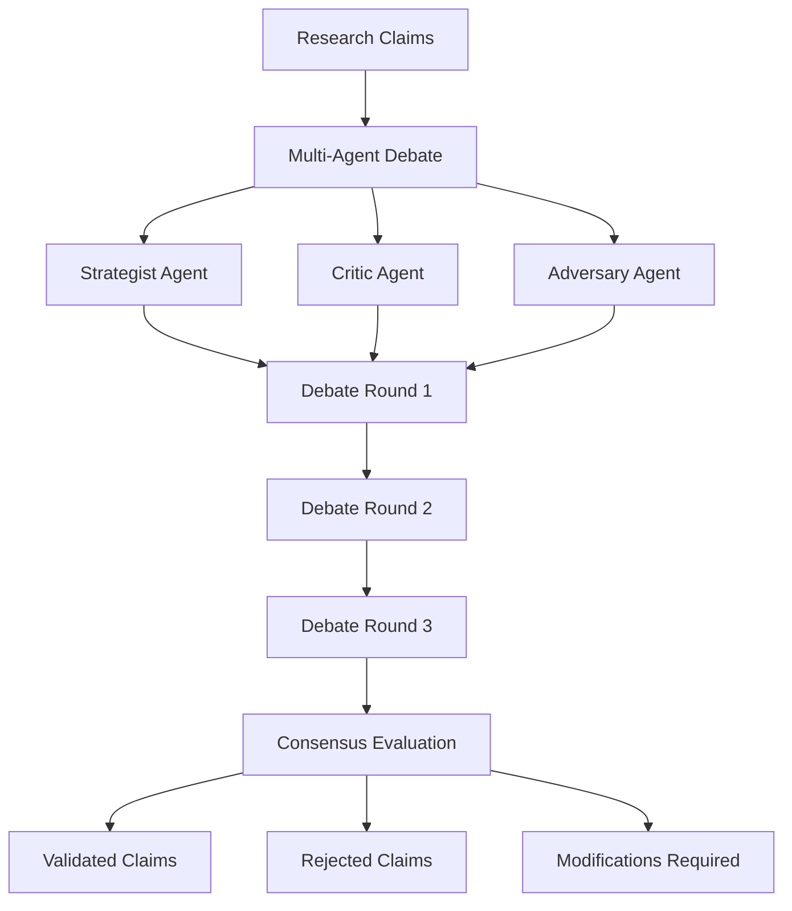
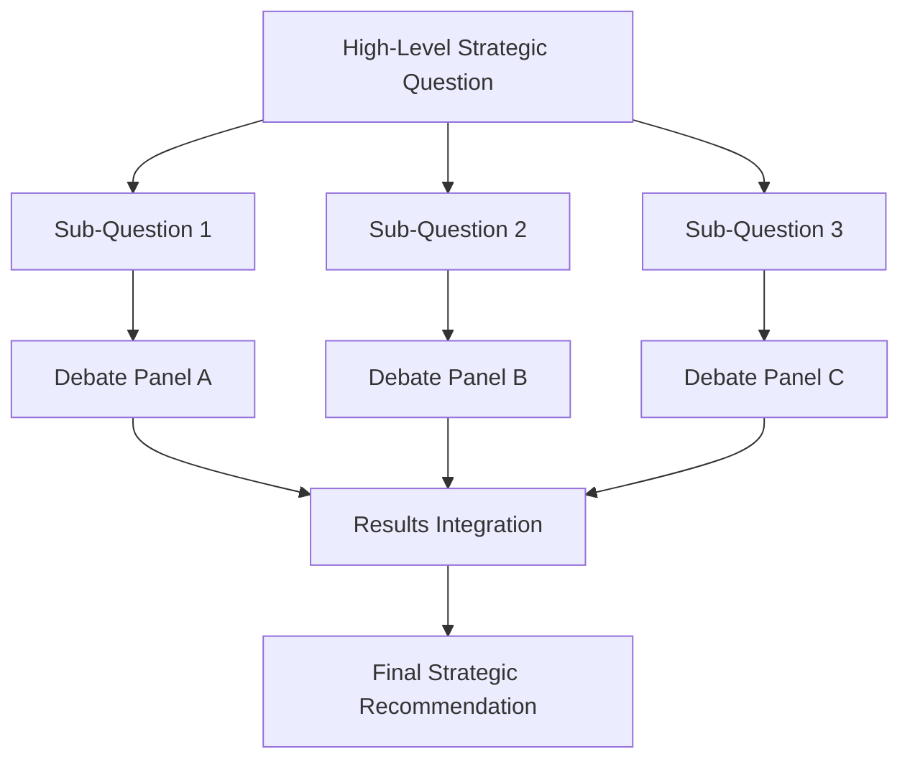

# Multi-Agent Debate Setup Tutorial

This tutorial guides you through setting up StratMaster's multi-agent debate system. You'll learn how to configure agents, customize debate parameters, and implement constitutional constraints for high-quality strategic validation.

## What You'll Learn

- How multi-agent debate improves strategic analysis quality
- Configuring debate agents with specialized roles
- Setting up constitutional AI constraints
- Customizing debate parameters for different use cases
- Monitoring and analyzing debate outcomes

## Prerequisites

- StratMaster development environment setup
- Basic understanding of strategic analysis concepts
- Familiarity with JSON configuration

## Understanding Multi-Agent Debate

### The Problem

Traditional AI analysis can suffer from:
- Single perspective bias
- Hallucination and overconfidence
- Lack of critical examination
- Missing edge cases and counterarguments

### The Solution



Multi-agent debate provides:
- **Multiple perspectives** on the same evidence
- **Critical examination** of claims and assumptions
- **Adversarial validation** to catch errors
- **Constitutional constraints** for safety and accuracy

## Step 1: Basic Agent Configuration

### Default Agent Roles

StratMaster includes three pre-configured agent roles:

```json
{
  "agents": [
    {
      "name": "strategist",
      "role": "Strategic Advocate",
      "persona": "An experienced strategy consultant who builds compelling cases from research evidence",
      "focus": ["opportunity_identification", "competitive_advantage", "market_positioning"],
      "bias_toward": "actionable_insights"
    },
    {
      "name": "critic",
      "role": "Critical Analyst", 
      "persona": "A rigorous analyst who identifies flaws, gaps, and weaknesses in strategic reasoning",
      "focus": ["data_quality", "logical_consistency", "assumption_validation"],
      "bias_toward": "skeptical_analysis"
    },
    {
      "name": "adversary",
      "role": "Devil's Advocate",
      "persona": "A contrarian thinker who challenges assumptions and explores alternative perspectives",
      "focus": ["risk_identification", "alternative_scenarios", "counterarguments"],
      "bias_toward": "alternative_viewpoints"
    }
  ]
}
```

### Creating Custom Agents

You can create specialized agents for your domain:

```json
{
  "name": "financial_analyst",
  "role": "Financial Validator",
  "persona": "A CFO-level financial expert who evaluates the financial implications of strategic claims",
  "focus": ["financial_viability", "cost_analysis", "roi_validation"],
  "bias_toward": "financial_prudence",
  "expertise_areas": ["financial_modeling", "risk_assessment", "market_analysis"],
  "constraints": [
    "Must cite specific financial data sources",
    "Must quantify financial impacts where possible",
    "Must identify financial risks and mitigation strategies"
  ]
}
```

## Step 2: Configure Debate Parameters

### Basic Debate Configuration

```json
{
  "debate_config": {
    "max_rounds": 3,
    "agents": ["strategist", "critic", "adversary"],
    "consensus_threshold": 0.8,
    "min_participation": 2,
    "time_limits": {
      "per_round": 120,
      "total_debate": 600
    }
  }
}
```

### Advanced Configuration

```json
{
  "debate_config": {
    "max_rounds": 5,
    "agents": ["strategist", "critic", "adversary", "financial_analyst"],
    "consensus_threshold": 0.85,
    "min_participation": 3,
    "round_structure": {
      "opening_statements": {
        "enabled": true,
        "time_limit": 60,
        "required_participants": "all"
      },
      "cross_examination": {
        "enabled": true,
        "time_limit": 90,
        "questions_per_agent": 3
      },
      "closing_arguments": {
        "enabled": true,
        "time_limit": 45,
        "required_participants": "all"
      }
    },
    "evidence_requirements": {
      "min_sources_per_claim": 2,
      "require_quantitative_support": true,
      "allow_anecdotal_evidence": false
    },
    "consensus_rules": {
      "require_unanimous": false,
      "allow_abstention": true,
      "weight_by_expertise": true
    }
  }
}
```

## Step 3: Implement Constitutional AI Constraints

### Safety Constraints

```json
{
  "constitutional_constraints": {
    "safety": {
      "enabled": true,
      "rules": [
        "Must not recommend strategies that could harm employees or customers",
        "Must identify and flag potential ethical concerns",
        "Must consider long-term societal impact of recommendations"
      ],
      "violation_handling": "reject_claim"
    },
    "accuracy": {
      "enabled": true,
      "rules": [
        "Must cite specific sources for factual claims",
        "Must quantify uncertainty where data is limited",
        "Must distinguish between correlation and causation"
      ],
      "violation_handling": "require_modification"
    },
    "bias_mitigation": {
      "enabled": true,
      "rules": [
        "Must consider multiple stakeholder perspectives",
        "Must identify potential cognitive biases in reasoning",
        "Must examine assumptions about market conditions"
      ],
      "violation_handling": "flag_warning"
    }
  }
}
```

### Custom Industry Constraints

```json
{
  "constitutional_constraints": {
    "healthcare_compliance": {
      "enabled": true,
      "rules": [
        "Must comply with HIPAA privacy requirements",
        "Must consider FDA regulatory implications",
        "Must address patient safety concerns explicitly"
      ]
    },
    "financial_services": {
      "enabled": true,
      "rules": [
        "Must comply with SEC disclosure requirements",
        "Must consider fiduciary duty obligations",
        "Must address systemic risk implications"
      ]
    }
  }
}
```

## Step 4: Set Up Your First Debate

### 1. Prepare Research Claims

```json
{
  "claims": [
    {
      "id": "claim-001",
      "text": "Implementing AI-powered customer service will reduce support costs by 30% within 12 months",
      "confidence": 0.75,
      "evidence_ids": ["ev-001", "ev-002", "ev-003"],
      "category": "cost_reduction",
      "priority": "high"
    },
    {
      "id": "claim-002", 
      "text": "Customer satisfaction scores will improve by 15% due to faster response times",
      "confidence": 0.65,
      "evidence_ids": ["ev-004", "ev-005"],
      "category": "customer_experience",
      "priority": "medium"
    }
  ]
}
```

### 2. Launch the Debate

```bash
# Using the API
curl -X POST http://localhost:8080/debate/run \
  -H "Content-Type: application/json" \
  -H "Idempotency-Key: debate-001" \
  -d '{
    "session_id": "session-abc123",
    "tenant_id": "tenant-a",
    "claims": [
      {
        "id": "claim-001",
        "text": "AI-powered customer service will reduce costs by 30%",
        "confidence": 0.75,
        "evidence_ids": ["ev-001", "ev-002"]
      }
    ],
    "debate_config": {
      "max_rounds": 3,
      "agents": ["strategist", "critic", "adversary"],
      "consensus_threshold": 0.8
    }
  }'
```

### 3. Monitor the Debate

```python
# Python client example
import stratmaster_client

client = stratmaster_client.StratMasterClient(base_url="http://localhost:8080")

# Start debate
debate = client.start_debate(
    session_id="session-abc123",
    tenant_id="tenant-a",
    claims=claims,
    config=debate_config
)

# Monitor progress
status = client.get_debate_status(debate.id)
print(f"Debate status: {status.status}")
print(f"Current round: {status.current_round}")
print(f"Participants: {status.active_participants}")

# Get real-time updates
for update in client.stream_debate_updates(debate.id):
    print(f"[{update.timestamp}] {update.agent}: {update.message}")
```

## Step 5: Analyze Debate Outcomes

### Understanding the Results

```json
{
  "debate_id": "debate-abc123",
  "status": "completed",
  "rounds": [
    {
      "round": 1,
      "agent": "strategist",
      "position": "The 30% cost reduction claim is well-supported by three industry studies showing similar results...",
      "issues_raised": [],
      "timestamp": "2024-01-01T10:00:00Z"
    },
    {
      "round": 1,
      "agent": "critic",
      "position": "While the studies show promise, there are significant concerns about implementation complexity...",
      "issues_raised": ["implementation_risk", "sample_size_limitations"],
      "timestamp": "2024-01-01T10:05:00Z"
    }
  ],
  "verdict": {
    "consensus_reached": true,
    "confidence": 0.85,
    "approved_claims": ["claim-001"],
    "rejected_claims": [],
    "modifications_required": [
      {
        "claim_id": "claim-002",
        "modification": "Reduce confidence from 65% to 45% and add implementation timeline caveat",
        "reason": "Insufficient evidence for customer satisfaction improvement timeline"
      }
    ]
  }
}
```

### Quality Metrics

```python
# Analyze debate quality
def analyze_debate_quality(debate_result):
    metrics = {
        "participation_rate": calculate_participation(debate_result.rounds),
        "evidence_coverage": calculate_evidence_usage(debate_result),
        "critical_depth": count_issues_raised(debate_result),
        "consensus_strength": debate_result.verdict.confidence,
        "bias_indicators": detect_bias_patterns(debate_result)
    }
    return metrics

# Generate improvement recommendations
def suggest_improvements(metrics):
    suggestions = []
    
    if metrics["participation_rate"] < 0.8:
        suggestions.append("Consider adding incentives for agent participation")
    
    if metrics["evidence_coverage"] < 0.7:
        suggestions.append("Require agents to cite more supporting evidence")
        
    if metrics["critical_depth"] < 3:
        suggestions.append("Encourage more challenging questions and counterarguments")
    
    return suggestions
```

## Step 6: Advanced Debate Patterns

### Specialized Debate Types

#### Financial Impact Assessment

```json
{
  "debate_type": "financial_impact",
  "agents": ["strategist", "financial_analyst", "risk_manager"],
  "focus_areas": ["roi_calculation", "cost_analysis", "risk_assessment"],
  "required_evidence": ["financial_projections", "market_data", "competitor_analysis"],
  "success_criteria": {
    "min_confidence": 0.8,
    "require_quantified_benefits": true,
    "require_risk_mitigation": true
  }
}
```

#### Competitive Analysis Debate

```json
{
  "debate_type": "competitive_analysis",
  "agents": ["market_analyst", "product_strategist", "competitive_intelligence"],
  "focus_areas": ["market_positioning", "competitive_response", "differentiation"],
  "evidence_requirements": {
    "competitor_data": "required",
    "market_trends": "required",
    "customer_insights": "preferred"
  }
}
```

### Hierarchical Debates



## Step 7: Integration with Research Pipeline

### Automated Debate Triggers

```python
# Configure automatic debate triggers
debate_triggers = {
    "confidence_threshold": 0.6,  # Trigger debate for claims below 60% confidence
    "evidence_count": 3,          # Require at least 3 evidence sources
    "strategic_importance": "high", # Always debate high-importance claims
    "conflicting_sources": True    # Trigger when sources disagree
}

# Set up webhook for automatic debates
@app.post("/research/complete")
async def on_research_complete(research_result: ResearchResult):
    claims_for_debate = []
    
    for claim in research_result.claims:
        if should_trigger_debate(claim, debate_triggers):
            claims_for_debate.append(claim)
    
    if claims_for_debate:
        debate = await debate_service.start_debate(
            claims=claims_for_debate,
            config=get_debate_config(research_result.context)
        )
        
        # Wait for debate completion
        result = await debate_service.wait_for_completion(debate.id)
        
        # Update research with debate outcomes
        await research_service.update_with_debate_results(
            research_result.id, 
            result
        )
```

### Quality Gates

```python
# Implement quality gates based on debate outcomes
def evaluate_strategic_readiness(debate_results):
    quality_score = 0
    
    # High consensus increases confidence
    if debate_results.verdict.consensus_reached:
        quality_score += 30
    
    # Agent participation indicates thorough review
    participation_rate = calculate_participation_rate(debate_results)
    quality_score += participation_rate * 20
    
    # Issue identification shows critical thinking
    issues_per_claim = count_issues_raised(debate_results) / len(debate_results.claims)
    quality_score += min(issues_per_claim * 10, 20)
    
    # Constitutional compliance is essential
    if debate_results.constitutional_compliance.all_passed():
        quality_score += 30
    
    return {
        "score": quality_score,
        "ready_for_executive_review": quality_score >= 80,
        "recommendations": generate_quality_recommendations(debate_results)
    }
```

## Step 8: Monitoring and Optimization

### Debate Analytics Dashboard

```python
# Key metrics to track
metrics = {
    "debate_completion_rate": track_successful_debates(),
    "average_rounds_per_debate": calculate_debate_length(),
    "consensus_rate": track_consensus_achievement(),
    "claim_modification_rate": track_claim_changes(),
    "agent_performance": evaluate_agent_contributions(),
    "constitutional_violations": track_constraint_violations()
}

# Set up alerts
alerts = {
    "low_consensus_rate": "< 70%",
    "high_modification_rate": "> 50%", 
    "constitutional_violations": "> 0",
    "debate_timeout_rate": "> 10%"
}
```

### A/B Testing Debate Configurations

```python
# Test different configurations
configurations = {
    "standard": {
        "agents": ["strategist", "critic", "adversary"],
        "max_rounds": 3,
        "consensus_threshold": 0.8
    },
    "thorough": {
        "agents": ["strategist", "critic", "adversary", "domain_expert"],
        "max_rounds": 5,
        "consensus_threshold": 0.85
    },
    "rapid": {
        "agents": ["strategist", "critic"],
        "max_rounds": 2,
        "consensus_threshold": 0.75
    }
}

# Measure effectiveness
results = compare_configurations(configurations, test_claims)
optimal_config = select_best_configuration(results)
```

## Troubleshooting Common Issues

### Low Consensus Rates

**Problem**: Debates frequently fail to reach consensus

**Solutions**:
- Lower consensus threshold temporarily
- Add more rounds to allow deeper discussion
- Ensure agents have sufficient context and evidence
- Check for adversarial agents being too aggressive

### Agent Domination

**Problem**: One agent dominates discussions

**Solutions**:
- Implement participation balancing
- Add turn limits per agent per round
- Weight contributions by expertise area
- Review agent personas for balance

### Constitutional Violations

**Problem**: Frequent constraint violations

**Solutions**:
- Review and refine constraint definitions
- Provide better training examples
- Implement graduated responses (warning vs. rejection)
- Add explanation requirements for constraint checking

## Best Practices

### Configuration Guidelines

1. **Start Simple**: Begin with 3 agents and 3 rounds
2. **Domain Expertise**: Include at least one domain expert agent
3. **Balance Perspectives**: Ensure mix of supportive and critical agents
4. **Clear Constraints**: Define constitutional rules explicitly
5. **Monitor Quality**: Track consensus rates and modification frequency

### Agent Design Principles

1. **Distinct Roles**: Each agent should have a unique perspective
2. **Clear Expertise**: Define specific knowledge areas for each agent
3. **Appropriate Bias**: Give agents realistic cognitive tendencies
4. **Constraint Awareness**: Ensure agents understand constitutional limits

### Debate Management

1. **Time Management**: Set appropriate limits to prevent endless debates
2. **Evidence Standards**: Require sufficient supporting evidence
3. **Quality Metrics**: Monitor and optimize debate outcomes
4. **Continuous Learning**: Refine configurations based on results

## Next Steps

- Experiment with domain-specific agent configurations
- Implement custom constitutional constraints for your industry
- Set up automated quality monitoring and alerting
- Integrate debate outcomes with downstream decision processes

For more advanced topics, see:
- [Strategic Modeling Framework](../explanation/strategic-modeling.md)
- [Evidence Grading System](../explanation/evidence-grading.md)
- [Performance Tuning Guide](../how-to/performance-tuning.md)