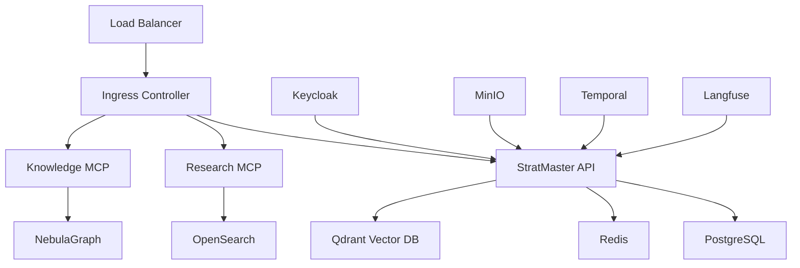

# Production Deployment Tutorial

This tutorial walks you through deploying StratMaster to a production environment using Kubernetes and Helm. You'll learn how to configure services, set up monitoring, and ensure high availability.

## Prerequisites

Before starting this tutorial, ensure you have:

- Kubernetes cluster (v1.26+) with at least 8GB RAM and 4 CPU cores
- Helm 3.12+ installed
- kubectl configured to access your cluster
- Docker registry access for storing custom images
- SSL certificates for your domain

## Architecture Overview



## Step 1: Prepare Your Environment

### Create Namespace

```bash
kubectl create namespace stratmaster-prod
kubectl label namespace stratmaster-prod name=stratmaster-prod
```

### Set Up Storage Classes

```yaml
# storage-class.yaml
apiVersion: storage.k8s.io/v1
kind: StorageClass
metadata:
  name: stratmaster-ssd
provisioner: kubernetes.io/aws-ebs
parameters:
  type: gp3
  iops: "3000"
  throughput: "125"
reclaimPolicy: Retain
allowVolumeExpansion: true
volumeBindingMode: WaitForFirstConsumer
```

```bash
kubectl apply -f storage-class.yaml
```

## Step 2: Configure Secrets and ConfigMaps

### Create Database Credentials

```bash
kubectl create secret generic stratmaster-db-secret \
  --namespace=stratmaster-prod \
  --from-literal=username=stratmaster_prod \
  --from-literal=password="$(openssl rand -base64 32)" \
  --from-literal=database=stratmaster_prod
```

### Create API Keys Secret

```bash
kubectl create secret generic stratmaster-api-keys \
  --namespace=stratmaster-prod \
  --from-literal=jwt-secret="$(openssl rand -base64 64)" \
  --from-literal=qdrant-api-key="$(openssl rand -base64 32)" \
  --from-literal=langfuse-public-key="pk-lf-prod-$(openssl rand -hex 16)" \
  --from-literal=langfuse-secret-key="sk-lf-prod-$(openssl rand -hex 32)"
```

### Configure Production Values

```yaml
# values-production.yaml
global:
  environment: production
  namespace: stratmaster-prod
  domain: stratmaster.yourdomain.com
  
api:
  replicaCount: 3
  image:
    repository: your-registry/stratmaster-api
    tag: "0.1.0"
  resources:
    requests:
      cpu: 500m
      memory: 1Gi
    limits:
      cpu: 2000m
      memory: 4Gi
  
  env:
    STRATMASTER_ENV: production
    STRATMASTER_LOG_LEVEL: INFO
    STRATMASTER_ENABLE_DEBUG_ENDPOINTS: "false"
  
  autoscaling:
    enabled: true
    minReplicas: 3
    maxReplicas: 10
    targetCPUUtilizationPercentage: 70

postgresql:
  enabled: true
  global:
    postgresql:
      auth:
        existingSecret: stratmaster-db-secret
  primary:
    persistence:
      enabled: true
      storageClass: stratmaster-ssd
      size: 100Gi
    resources:
      requests:
        cpu: 1000m
        memory: 2Gi

redis:
  enabled: true
  auth:
    enabled: true
    sentinel: false
  master:
    persistence:
      enabled: true
      storageClass: stratmaster-ssd
      size: 20Gi

qdrant:
  enabled: true
  replicaCount: 3
  persistence:
    enabled: true
    storageClass: stratmaster-ssd
    size: 50Gi
  config:
    cluster:
      enabled: true

ingress:
  enabled: true
  className: nginx
  annotations:
    cert-manager.io/cluster-issuer: letsencrypt-prod
    nginx.ingress.kubernetes.io/ssl-redirect: "true"
    nginx.ingress.kubernetes.io/force-ssl-redirect: "true"
  tls:
    - secretName: stratmaster-tls
      hosts:
        - stratmaster.yourdomain.com
        
monitoring:
  prometheus:
    enabled: true
  grafana:
    enabled: true
  alertmanager:
    enabled: true
```

## Step 3: Deploy Infrastructure Services

### Install Cert-Manager (if not already installed)

```bash
kubectl apply -f https://github.com/cert-manager/cert-manager/releases/download/v1.13.0/cert-manager.yaml
```

### Configure Let's Encrypt Issuer

```yaml
# letsencrypt-issuer.yaml
apiVersion: cert-manager.io/v1
kind: ClusterIssuer
metadata:
  name: letsencrypt-prod
spec:
  acme:
    server: https://acme-v02.api.letsencrypt.org/directory
    email: admin@yourdomain.com
    privateKeySecretRef:
      name: letsencrypt-prod
    solvers:
    - http01:
        ingress:
          class: nginx
```

```bash
kubectl apply -f letsencrypt-issuer.yaml
```

## Step 4: Deploy StratMaster

### Add Helm Repository

```bash
helm repo add stratmaster ./helm
helm repo update
```

### Install with Production Values

```bash
helm install stratmaster-prod stratmaster/stratmaster-api \
  --namespace stratmaster-prod \
  --values values-production.yaml \
  --wait \
  --timeout 15m
```

### Verify Deployment

```bash
# Check all pods are running
kubectl get pods -n stratmaster-prod

# Check services
kubectl get svc -n stratmaster-prod

# Check ingress
kubectl get ingress -n stratmaster-prod

# View logs
kubectl logs -n stratmaster-prod deployment/stratmaster-api -f
```

## Step 5: Deploy MCP Servers

### Research MCP Server

```bash
helm install research-mcp stratmaster/research-mcp \
  --namespace stratmaster-prod \
  --set replicaCount=2 \
  --set resources.requests.cpu=250m \
  --set resources.requests.memory=512Mi \
  --wait
```

### Knowledge MCP Server

```bash
helm install knowledge-mcp stratmaster/knowledge-mcp \
  --namespace stratmaster-prod \
  --set replicaCount=2 \
  --set resources.requests.cpu=250m \
  --set resources.requests.memory=512Mi \
  --wait
```

### Router MCP Server

```bash
helm install router-mcp stratmaster/router-mcp \
  --namespace stratmaster-prod \
  --set replicaCount=2 \
  --set resources.requests.cpu=250m \
  --set resources.requests.memory=512Mi \
  --wait
```

## Step 6: Configure Monitoring and Observability

### Deploy Monitoring Stack

```bash
# Install Prometheus Operator
helm repo add prometheus-community https://prometheus-community.github.io/helm-charts
helm repo update

helm install monitoring prometheus-community/kube-prometheus-stack \
  --namespace monitoring \
  --create-namespace \
  --set grafana.adminPassword="$(openssl rand -base64 32)"
```

### Configure StratMaster Dashboards

```bash
# Apply StratMaster Grafana dashboards
kubectl apply -f monitoring/grafana-dashboards.yaml -n monitoring
```

### Set Up Alerts

```yaml
# stratmaster-alerts.yaml
apiVersion: monitoring.coreos.com/v1
kind: PrometheusRule
metadata:
  name: stratmaster-alerts
  namespace: stratmaster-prod
spec:
  groups:
  - name: stratmaster.rules
    rules:
    - alert: StratMasterAPIDown
      expr: up{job="stratmaster-api"} == 0
      for: 5m
      labels:
        severity: critical
      annotations:
        summary: "StratMaster API is down"
        description: "StratMaster API has been down for more than 5 minutes."
        
    - alert: StratMasterHighErrorRate
      expr: rate(http_requests_total{job="stratmaster-api",status=~"5.."}[5m]) > 0.1
      for: 5m
      labels:
        severity: warning
      annotations:
        summary: "High error rate in StratMaster API"
        description: "Error rate is {{ $value }} errors per second."
```

```bash
kubectl apply -f stratmaster-alerts.yaml
```

## Step 7: Configure Backup and Disaster Recovery

### Database Backups

```yaml
# backup-cronjob.yaml
apiVersion: batch/v1
kind: CronJob
metadata:
  name: postgres-backup
  namespace: stratmaster-prod
spec:
  schedule: "0 2 * * *"  # Daily at 2 AM
  jobTemplate:
    spec:
      template:
        spec:
          containers:
          - name: postgres-backup
            image: postgres:15
            command:
            - /bin/bash
            - -c
            - |
              pg_dump -h postgresql -U $POSTGRES_USER -d $POSTGRES_DB > /backup/backup-$(date +\%Y\%m\%d-\%H\%M\%S).sql
              aws s3 cp /backup/ s3://your-backup-bucket/stratmaster-db/ --recursive
            env:
            - name: POSTGRES_USER
              valueFrom:
                secretKeyRef:
                  name: stratmaster-db-secret
                  key: username
            - name: POSTGRES_PASSWORD
              valueFrom:
                secretKeyRef:
                  name: stratmaster-db-secret
                  key: password
            - name: POSTGRES_DB
              valueFrom:
                secretKeyRef:
                  name: stratmaster-db-secret
                  key: database
            volumeMounts:
            - name: backup-storage
              mountPath: /backup
          volumes:
          - name: backup-storage
            emptyDir: {}
          restartPolicy: OnFailure
```

### Vector Database Backups

```bash
# Create backup script for Qdrant
kubectl create configmap qdrant-backup-script \
  --namespace stratmaster-prod \
  --from-file=backup.sh=scripts/qdrant-backup.sh
```

## Step 8: Health Checks and Validation

### Validate Deployment

```bash
# Test API health
curl -f https://stratmaster.yourdomain.com/healthz

# Test API functionality
curl -X POST https://stratmaster.yourdomain.com/research/plan \
  -H "Content-Type: application/json" \
  -H "Authorization: Bearer $API_TOKEN" \
  -d '{
    "session_id": "test-prod-001",
    "tenant_id": "production",
    "research_question": "What are the market trends in AI adoption?",
    "scope": "comprehensive"
  }'

# Check MCP server connectivity
curl -f https://stratmaster.yourdomain.com/api/v1/mcp/research/health
curl -f https://stratmaster.yourdomain.com/api/v1/mcp/knowledge/health
curl -f https://stratmaster.yourdomain.com/api/v1/mcp/router/health
```

### Performance Testing

```bash
# Run load test
kubectl run load-test --image=fortio/fortio --rm -it -- \
  fortio load -c 10 -qps 50 -t 60s https://stratmaster.yourdomain.com/healthz
```

### Security Scanning

```bash
# Scan for vulnerabilities
kubectl run security-scan --image=aquasec/trivy --rm -it -- \
  trivy image your-registry/stratmaster-api:0.1.0
```

## Step 9: Production Readiness Checklist

### Security ✅
- [ ] SSL/TLS certificates configured
- [ ] Network policies applied
- [ ] RBAC configured appropriately
- [ ] Secrets encrypted at rest
- [ ] Pod security policies enabled

### High Availability ✅
- [ ] Multiple replicas running
- [ ] Anti-affinity rules configured
- [ ] Health checks configured
- [ ] Auto-scaling enabled
- [ ] Circuit breakers implemented

### Monitoring ✅
- [ ] Metrics collection enabled
- [ ] Dashboards configured
- [ ] Alerts configured
- [ ] Log aggregation setup
- [ ] Tracing enabled

### Data Protection ✅
- [ ] Database backups automated
- [ ] Vector database backups configured
- [ ] Backup restoration tested
- [ ] Data encryption at rest
- [ ] Data retention policies configured

## Troubleshooting Common Issues

### Pod Fails to Start

```bash
# Check pod status
kubectl describe pod <pod-name> -n stratmaster-prod

# Check logs
kubectl logs <pod-name> -n stratmaster-prod

# Check events
kubectl get events -n stratmaster-prod --sort-by='.lastTimestamp'
```

### Database Connection Issues

```bash
# Test database connectivity
kubectl run psql-test --image=postgres:15 --rm -it -- \
  psql -h postgresql -U stratmaster_prod -d stratmaster_prod

# Check database status
kubectl exec -it postgresql-0 -n stratmaster-prod -- pg_isready
```

### SSL Certificate Issues

```bash
# Check certificate status
kubectl describe certificate stratmaster-tls -n stratmaster-prod

# Check cert-manager logs
kubectl logs -n cert-manager deployment/cert-manager
```

## Performance Optimization

### Database Tuning

```sql
-- Connect to database and run optimization queries
ALTER SYSTEM SET shared_buffers = '1GB';
ALTER SYSTEM SET effective_cache_size = '3GB';
ALTER SYSTEM SET random_page_cost = 1.1;
SELECT pg_reload_conf();
```

### Redis Configuration

```yaml
# Add to values-production.yaml
redis:
  master:
    configuration: |
      maxmemory-policy allkeys-lru
      timeout 300
      tcp-keepalive 300
```

### Application Scaling

```yaml
# Update HPA configuration
autoscaling:
  enabled: true
  minReplicas: 3
  maxReplicas: 20
  metrics:
  - type: Resource
    resource:
      name: cpu
      target:
        type: Utilization
        averageUtilization: 70
  - type: Resource
    resource:
      name: memory
      target:
        type: Utilization
        averageUtilization: 80
```

## Next Steps

- Configure additional environments (staging, development)
- Set up CI/CD pipelines for automated deployments
- Implement blue-green deployment strategy
- Configure advanced monitoring and alerting
- Set up disaster recovery procedures

For more advanced configuration, see:
- [Performance Tuning Guide](../how-to/performance-tuning.md)
- [Security Hardening Guide](../how-to/security-hardening.md)
- [Operations Guide](../how-to/operations-guide.md)