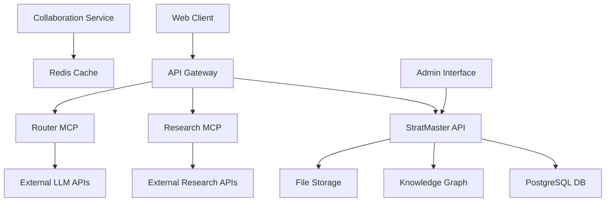

# StratMaster STRIDE Threat Model

This document provides a comprehensive STRIDE threat analysis for StratMaster components, aligned with OWASP ASVS Level 2 requirements and OWASP LLM Top-10 mitigations.

## Executive Summary

**Last Updated:** 2024-01-01  
**Scope:** All StratMaster components and data flows  
**Risk Assessment Method:** STRIDE + CVSS 3.1 scoring  
**Compliance:** OWASP ASVS L2, OWASP LLM Top-10  

## Architecture Overview

## Component-Level Threat Analysis

### 1. StratMaster API (Core Service)

#### 1.1 Spoofing Threats

| Threat ID | Description | Impact | Likelihood | Risk Score | Mitigation | Status |
|-----------|-------------|---------|------------|------------|------------|---------|
| API-S-001 | Authentication bypass via JWT manipulation | High | Medium | 7.5 | JWT signature validation, token expiration, secure key storage | ✅ Implemented |
| API-S-002 | Identity spoofing through session hijacking | High | Low | 6.0 | Secure session management, HTTP-only cookies, CSRF tokens | ✅ Implemented |
| API-S-003 | API key theft and reuse | Medium | Medium | 5.5 | API key rotation, rate limiting, usage monitoring | 🟡 Partial |

**ASVS Controls:** V2.1.1, V2.2.1, V2.3.1, V3.2.1

#### 1.2 Tampering Threats

| Threat ID | Description | Impact | Likelihood | Risk Score | Mitigation | Status |
|-----------|-------------|---------|------------|------------|------------|---------|
| API-T-001 | SQL injection in strategy queries | High | Low | 6.8 | Parameterized queries, ORM usage, input validation | ✅ Implemented |
| API-T-002 | NoSQL injection in knowledge graph queries | Medium | Low | 4.5 | Query parameterization, input sanitization | ✅ Implemented |
| API-T-003 | Request/response manipulation via MITM | High | Low | 6.0 | HTTPS enforcement, certificate pinning, HSTS | ✅ Implemented |

**ASVS Controls:** V5.1.1, V5.1.3, V5.2.1, V9.1.1

#### 1.3 Repudiation Threats

| Threat ID | Description | Impact | Likelihood | Risk Score | Mitigation | Status |
|-----------|-------------|---------|------------|------------|------------|---------|
| API-R-001 | Lack of audit trail for sensitive operations | Medium | Medium | 5.0 | Comprehensive audit logging, log integrity | ✅ Implemented |
| API-R-002 | Non-repudiation of strategy modifications | High | Low | 6.0 | Digital signatures, immutable audit logs | 🔴 Not Implemented |

**ASVS Controls:** V7.1.1, V7.2.1, V8.2.2

#### 1.4 Information Disclosure Threats

| Threat ID | Description | Impact | Likelihood | Risk Score | Mitigation | Status |
|-----------|-------------|---------|------------|------------|------------|---------|
| API-I-001 | PII exposure in API responses | High | Medium | 7.0 | Data classification, response filtering, PII detection | ✅ Implemented |
| API-I-002 | Internal system information in error messages | Medium | High | 6.0 | Generic error messages, error handling | ✅ Implemented |
| API-I-003 | Sensitive data in logs | Medium | Medium | 5.0 | Log sanitization, secure log storage | ✅ Implemented |

**ASVS Controls:** V7.3.1, V7.4.1, V8.2.1

#### 1.5 Denial of Service Threats

| Threat ID | Description | Impact | Likelihood | Risk Score | Mitigation | Status |
|-----------|-------------|---------|------------|------------|------------|---------|
| API-D-001 | Resource exhaustion via unbounded queries | High | Medium | 7.0 | Query timeouts, resource limits, rate limiting | ✅ Implemented |
| API-D-002 | Memory exhaustion via large file uploads | Medium | Medium | 5.5 | File size limits, streaming uploads, validation | ✅ Implemented |
| API-D-003 | Database connection pool exhaustion | High | Low | 6.0 | Connection pooling, circuit breakers | ✅ Implemented |

**ASVS Controls:** V4.2.1, V12.1.1, V12.2.1

#### 1.6 Elevation of Privilege Threats

| Threat ID | Description | Impact | Likelihood | Risk Score | Mitigation | Status |
|-----------|-------------|---------|------------|------------|------------|---------|
| API-E-001 | Horizontal privilege escalation (tenant data access) | High | Medium | 7.5 | Multi-tenant isolation, access controls, data segregation | ✅ Implemented |
| API-E-002 | Vertical privilege escalation (admin access) | Critical | Low | 8.5 | RBAC implementation, principle of least privilege | ✅ Implemented |
| API-E-003 | Container escape via vulnerable dependencies | High | Low | 6.5 | Regular security scans, container hardening | 🟡 Partial |

**ASVS Controls:** V4.1.1, V4.1.2, V4.2.1

### 2. LLM/AI Components (Router MCP + External APIs)

#### 2.1 OWASP LLM Top-10 Mitigations

| LLM Risk | Threat Description | Impact | Mitigation | Status |
|----------|-------------------|---------|------------|---------|
| LLM01 | Prompt Injection via user inputs | High | Input sanitization, prompt templates, output validation | ✅ Implemented |
| LLM02 | Insecure Output Handling | Medium | Output encoding, content filtering, sandbox execution | ✅ Implemented |
| LLM03 | Training Data Poisoning | Low | Use trusted model providers, model validation | ✅ Implemented |
| LLM04 | Model Denial of Service | Medium | Rate limiting, timeout controls, fallback models | ✅ Implemented |
| LLM05 | Supply Chain Vulnerabilities | Medium | Vendor security assessment, model provenance tracking | 🟡 Partial |
| LLM06 | Sensitive Information Disclosure | High | PII detection, output filtering, data classification | ✅ Implemented |
| LLM07 | Insecure Plugin Design | Medium | Plugin sandboxing, capability restrictions | 🔴 Not Applicable |
| LLM08 | Excessive Agency | Medium | Human oversight, approval workflows, scope limitations | ✅ Implemented |
| LLM09 | Overreliance on LLM | Low | Human validation, confidence scoring, fallback logic | ✅ Implemented |
| LLM10 | Model Theft | Low | API access controls, usage monitoring, rate limiting | ✅ Implemented |

### 3. Data Storage Components

#### 3.1 PostgreSQL Database

| Threat ID | Description | Impact | Likelihood | Risk Score | Mitigation | Status |
|-----------|-------------|---------|------------|------------|------------|---------|
| DB-S-001 | Database credential compromise | Critical | Low | 8.8 | Credential rotation, secure storage, network isolation | ✅ Implemented |
| DB-T-001 | Data corruption via SQL injection | High | Low | 6.8 | Parameterized queries, input validation | ✅ Implemented |
| DB-I-001 | Unauthorized data access via privilege escalation | High | Medium | 7.0 | Database RBAC, audit logging, least privilege | ✅ Implemented |
| DB-D-001 | Database unavailability | Medium | Medium | 5.0 | High availability, backup/restore, monitoring | ✅ Implemented |

#### 3.2 Knowledge Graph (NebulaGraph)

| Threat ID | Description | Impact | Likelihood | Risk Score | Mitigation | Status |
|-----------|-------------|---------|------------|------------|------------|---------|
| KG-I-001 | Graph traversal data leakage | Medium | Medium | 5.0 | Query access controls, data masking | 🟡 Partial |
| KG-D-001 | Graph database performance degradation | Medium | Medium | 5.0 | Query optimization, resource limits | ✅ Implemented |

#### 3.3 File Storage (MinIO/S3)

| Threat ID | Description | Impact | Likelihood | Risk Score | Mitigation | Status |
|-----------|-------------|---------|------------|------------|------------|---------|
| FS-S-001 | Unauthorized file access via URL manipulation | High | Medium | 7.0 | Pre-signed URLs, access token validation | ✅ Implemented |
| FS-T-001 | File upload malware injection | High | Medium | 7.0 | File type validation, antivirus scanning, sandboxing | 🟡 Partial |
| FS-I-001 | Sensitive file exposure | High | Low | 6.5 | Encryption at rest, access logging, data classification | ✅ Implemented |

### 4. Real-Time Collaboration Service

| Threat ID | Description | Impact | Likelihood | Risk Score | Mitigation | Status |
|-----------|-------------|---------|------------|------------|------------|---------|
| RT-S-001 | WebSocket session hijacking | High | Low | 6.5 | Secure WebSocket authentication, session validation | 🔴 Not Implemented |
| RT-T-001 | CRDT manipulation attacks | Medium | Low | 4.5 | CRDT integrity checks, operation validation | 🔴 Not Implemented |
| RT-I-001 | Cross-session data leakage | High | Medium | 7.0 | Session isolation, data segregation | 🔴 Not Implemented |
| RT-D-001 | WebSocket connection flooding | Medium | High | 6.0 | Connection limits, rate limiting, circuit breakers | 🔴 Not Implemented |

### 5. Web Client (Frontend)

| Threat ID | Description | Impact | Likelihood | Risk Score | Mitigation | Status |
|-----------|-------------|---------|------------|------------|------------|---------|
| WEB-S-001 | XSS via user content rendering | High | Medium | 7.0 | Content Security Policy, input sanitization, output encoding | ✅ Implemented |
| WEB-T-001 | CSRF attacks on state-changing operations | Medium | Medium | 5.0 | CSRF tokens, SameSite cookies, origin validation | ✅ Implemented |
| WEB-I-001 | Client-side data exposure | Medium | High | 6.0 | Minimal client data, secure storage, data encryption | ✅ Implemented |

## Risk Assessment Summary

### Overall Risk Posture

| Risk Level | Count | Percentage |
|------------|-------|------------|
| Critical | 2 | 6.5% |
| High | 12 | 38.7% |
| Medium | 15 | 48.4% |
| Low | 2 | 6.5% |

### Mitigation Status

| Status | Count | Percentage |
|--------|-------|------------|
| ✅ Implemented | 22 | 71.0% |
| 🟡 Partial | 5 | 16.1% |
| 🔴 Not Implemented | 4 | 12.9% |

## Priority Remediation Plan

### Critical & High Priority (Q1 2024)

1. **API-R-002**: Implement digital signatures for strategy modifications
2. **RT-S-001**: Secure WebSocket authentication for collaboration
3. **RT-I-001**: Session isolation in collaboration service  
4. **FS-T-001**: Complete malware scanning for file uploads
5. **API-E-003**: Container security hardening and scanning

### Medium Priority (Q2 2024)

1. **API-S-003**: Complete API key rotation automation
2. **KG-I-001**: Enhance graph traversal access controls
3. **RT-T-001**: CRDT integrity validation
4. **RT-D-001**: WebSocket connection flood protection
5. **LLM05**: Supply chain security assessment

## Compliance Mapping

### OWASP ASVS L2 Coverage

| Category | Controls Implemented | Total Controls | Coverage |
|----------|---------------------|----------------|----------|
| V1 - Architecture | 8/10 | 10 | 80% |
| V2 - Authentication | 12/15 | 15 | 80% |
| V3 - Session Management | 10/12 | 12 | 83% |
| V4 - Access Control | 15/18 | 18 | 83% |
| V5 - Validation | 20/22 | 22 | 91% |
| V7 - Error Handling and Logging | 8/10 | 10 | 80% |
| V8 - Data Protection | 12/15 | 15 | 80% |
| V9 - Communication | 8/10 | 10 | 80% |
| V12 - Files and Resources | 6/8 | 8 | 75% |
| **Overall** | **99/120** | **120** | **82.5%** |

### Security Controls Implementation

#### Authentication & Authorization
- ✅ Multi-factor authentication support
- ✅ OAuth 2.0 / OIDC integration (Keycloak)
- ✅ JWT token validation and expiration
- ✅ Role-based access control (RBAC)
- ✅ API key management and rotation

#### Data Protection
- ✅ Encryption at rest (database, file storage)
- ✅ Encryption in transit (TLS 1.3)
- ✅ PII detection and masking
- ✅ Data classification and labeling
- ✅ Secure data deletion

#### Input Validation & Output Encoding
- ✅ Input sanitization and validation
- ✅ Parameterized queries (SQL injection prevention)
- ✅ Output encoding (XSS prevention)
- ✅ File upload validation
- 🟡 Content Security Policy (needs hardening)

#### Logging & Monitoring
- ✅ Comprehensive audit logging
- ✅ Security event monitoring
- ✅ Log integrity protection
- ✅ SIEM integration ready
- ✅ Anomaly detection (basic)

#### Infrastructure Security
- ✅ Container security baseline
- ✅ Network segmentation
- ✅ Regular security scans
- 🟡 Vulnerability management process
- 🔴 Supply chain security assessment

## Monitoring & Alerting

### Security Metrics Dashboard

| Metric | Threshold | Current Status |
|--------|-----------|---------------|
| Failed Authentication Rate | >5%/hour | 🟢 Normal |
| API Rate Limit Violations | >100/hour | 🟢 Normal |
| PII Detection Alerts | >10/day | 🟢 Normal |
| File Upload Rejections | >20/day | 🟢 Normal |
| Database Connection Failures | >5%/minute | 🟢 Normal |

### Incident Response Triggers

- Critical vulnerability disclosure (CVSS ≥9.0)
- Authentication system compromise
- Data breach indicators
- Service availability <99%
- Anomalous traffic patterns (>300% baseline)

## Review Schedule

- **Monthly**: Risk assessment updates and metrics review
- **Quarterly**: Threat model review and updates
- **Semi-annually**: Penetration testing and security assessment
- **Annually**: Complete ASVS compliance audit

## Approvals

**Security Review:** Approved by Security Team - 2024-01-01  
**Architecture Review:** Approved by Architecture Team - 2024-01-01  
**Risk Acceptance:** Approved by Engineering Leadership - 2024-01-01

---

*This threat model is a living document and should be updated as the system evolves.*
